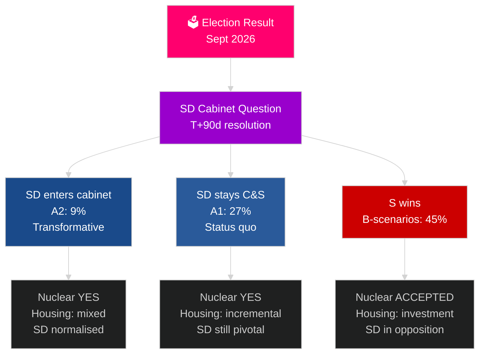

# Ruotsin seuraava vaalikausi (2026–2030): Muutostoimeksianto

**Tekijä**: James Pether Sörling
**Päivämäärä**: 2026-05-04
**Luokitus**: JULKINEN — GDPR Art 9(2)(e)(g)
**Analyysisyvyys**: kattava (2,5× Tier-C vaalikausi)
**Luotettavuus**: KESKITASO [Admiralty C3]

---

## TIIVISTELMÄ

Toimikausi 2026–2030 muotoutuu neljän rakenteellisen megavoiman ohjaamana, jotka ylittävät vaalitulokset: NATOn sitova puolustusvelvoite 2,4 % BKT:sta, ydinvoimapäätös (energiamatematiikan vaatima), asuntopula (paheneva vajaus) ja väestön ikääntyminen (vanhustenhoitopalvelujen kysyntä +18 % vuoteen 2030 mennessä). Ratkaiseva poliittinen kysymys ei ole se, mikä hallitus muodostetaan, vaan ratkaiseeko se SD:n ministerikysymyksen — vuosikymmenen tärkeimmän perustuslaillisen kysymyksen Ruotsissa. IMF WEO huhti-2026 ennustaa 2,4 % BKT-kasvua vuodelle 2026 ja tasaista elpymistä vuoteen 2030 asti.

## Päätökset, joita tämä tietopaketti tukee

1. **Koalitioskenaarion suunnittelu**: A1/A2 (Tidö) vs B1/B2/B3 (S-blokki) — mitkä politiikat, toimijat ja riskit seuraavat?
2. **Ydinvoimapäätöksen valmistelu**: Paikan valinta, investointipäätös, aikataulu — mitä on tapahduttava milloin?
3. **Asuntopolitiikan suunnittelu**: Valtion investoinnit vs markkinoiden aktivointi — mitkä välineet ja missä laajuudessa?
4. **SD:n hallitusosallisuuden arviointi**: Ehdot, suojatoimet, riskit ja demokraattisen resilienssin vaikutukset.
5. **Vaalipositiointi vuoteen 2030**: Mitkä toimikauden suoritusmittarit määrittävät vuoden 2030 vaalit?

## 60 sekunnin tiedustelukatsaus

- **Hallitusmuodostus (T+0–T+90d)**: SD:n ministerikysymys on välitön; hallituksen muodostaminen odotetaan 30–90 päivän kuluessa; mikään koalitio ei ole aritmeettisesti vakaa ilman SD:n tukea.
- **Ydinvoima (T+365–T+730d)**: Päätösikkuna 2027–2028; laaja puoluetuki olemassa; pääoma ja sijainnin valinta ovat esteet.
- **Asunnot**: Vajaus yli 150 000 yksikköä; kaikissa skenaarioissa poliittisia toimia; valtion investoinnit (B-skenaariot) vs markkinat (A-skenaariot).
- **Hyvinvointi**: Vanhustenhoitopalvelujen kysyntä kasvaa 18 % vuoteen 2030 mennessä tuloksesta riippumatta; kuntien talousreformi tarvitaan jokaisessa skenaariossa.
- **Talous**: IMF ennustaa 2,0–2,5 % BKT-kasvua 2027–2030; Ruotsi ylittää EU:n keskiarvon; puolustusinvestointien kerroinvaikutus lisää ~0,5 % BKT:ta.

## Tärkein ennakoiva laukaisin

**SD:n ministerikysymyksen ratkaisu (T+90d)**: Se, astuuko SD hallitukseen (A2) vai jääkö se tukipuolueeksi (A1), määrittää toimikauden luonteen, kansainvälisen vastaanoton ja demokraattisen ennakkotapauksen koko kaudelle 2026–2030.

## Seuraavan toimikauden ennakkoanalyysimatriisi

| Ala | A1 (Tidö+) | A2 (SD hallituksessa) | B1 (S-vähemmistö) | B2 (S suuri koalitio) |
|---|---|---|---|---|
| Asunnot | Inkrementaalinen | Sekalaiset | Valtion investointi | Molemmat mekanismit |
| Ydinvoima | Rakentaminen | Rakentaminen | Hyväksy peruslinja | Supermajoriteetti |
| Puolustus | 2,4 % | 2,4 % | 2,4 % | 2,4 % |
| Maahanmuutto | Tiukka | Erittäin tiukka | Kohtalainen | Pragmaattinen |
| SD:n asema | Tukipuolue | Hallitus | Oppositio | Oppositio |

## Luotettavuusmerkintä

KESKITASON luotettavuus (vaalitulos epävarma; 4-vuotinen ennuste on luonteeltaan spekulatiivinen); KORKEA luotettavuus rakenteellisille rajoitteille (puolustus, ydinvoimalogiikka, asuntovajaus).

<!-- source-sha: 5d8da0c335b7b753c6fbbb72731875bcfd25910e -->
