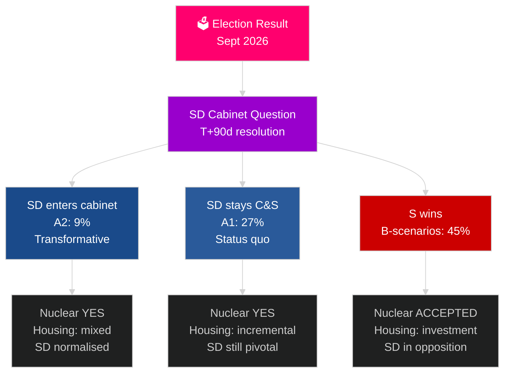

# Le prochain cycle électoral suédois (2026–2030) : Le Mandat de Transformation

**Auteur** : James Pether Sörling
**Date** : 2026-05-04
**Classification** : PUBLIC — RGPD Art. 9(2)(e)(g)
**Niveau d'analyse** : complet (2,5× Tier-C cycle électoral)
**Confiance** : MOYEN [Admiralty C3]

---

## SYNTHÈSE

Le mandat 2026–2030 sera façonné par quatre méga-forces structurelles qui transcendent les résultats électoraux : l'obligation défensive contraignante de l'OTAN à 2,4 % du PIB, la décision sur le nucléaire (exigée par la logique énergétique), la crise du logement (déficit croissant) et le vieillissement démographique (demande de soins aux personnes âgées +18 % d'ici 2030). La question politique déterminante n'est pas quelle gouvernement se formera, mais si elle résoudra la question de la présence des SD au Cabinet — la question constitutionnelle la plus importante de la décennie en Suède. Le FMI WEO avr-2026 projette une croissance du PIB de 2,4 % pour 2026 avec une reprise soutenue jusqu'en 2030.

## Décisions que ce rapport soutient

1. **Planification de scénarios de formation** : A1/A2 (Tidö) contre B1/B2/B3 (bloc S) — quelles politiques, acteurs et risques s'ensuivent ?
2. **Préparation à la décision nucléaire** : Sélection du site, décision d'investissement, calendrier — que doit-il se passer quand ?
3. **Conception de la politique du logement** : Investissements d'État contre activation du marché — quels instruments et à quelle échelle ?
4. **Évaluation de l'inclusion des SD au Cabinet** : Conditions, garde-fous, risques et implications pour la résilience démocratique.
5. **Positionnement électoral pour 2030** : Quels indicateurs de performance du mandat définiront les élections de 2030 ?

## Lecture de renseignement en 60 secondes

- **Formation du gouvernement (T+0 à T+90j)** : La question du Cabinet SD est immédiate ; la formation est attendue dans 30 à 90 jours ; aucune coalition n'est arithmétiquement stable sans le soutien du SD.
- **Nucléaire (T+365–T+730j)** : Fenêtre de décision 2027–2028 ; soutien multipartite existant ; le capital et le choix du site sont les obstacles.
- **Logement** : Déficit de 150 000+ unités ; tous les scénarios entraînent une action politique ; investissements d'État (scénarios B) contre marché (scénarios A).
- **Protection sociale** : La demande de soins aux personnes âgées augmente de 18 % d'ici 2030 quel que soit le résultat ; réforme des finances municipales nécessaire dans chaque scénario.
- **Économie** : Le FMI projette une croissance du PIB de 2,0 à 2,5 % de 2027 à 2030 ; la Suède surperforme la moyenne européenne ; l'effet multiplicateur des investissements défensifs ajoute ~0,5 % du PIB.

## Principal déclencheur prospectif

**Résolution de la question du Cabinet SD (T+90j)** : Que le SD entre au Cabinet (A2) ou demeure comme parti de soutien (A1) définira le caractère du mandat, la réception internationale et le précédent démocratique pour toute la période 2026–2030.

## Matrice de prévisualisation du prochain mandat

| Domaine | A1 (Tidö+) | A2 (SD au Cabinet) | B1 (S minorité) | B2 (S grande coalition) |
|---|---|---|---|---|
| Logement | Incrémental | Mixte | Investissement d'État | Les deux mécanismes |
| Nucléaire | Construction | Construction | Accepter la base | Supermajorité |
| Défense | 2,4 % | 2,4 % | 2,4 % | 2,4 % |
| Migration | Stricte | Très stricte | Modérée | Pragmatique |
| Position SD | Parti de soutien | Cabinet | Opposition | Opposition |

## Étiquette de confiance

Confiance MOYENNE (résultat électoral incertain ; projection sur 4 ans intrinsèquement spéculative) ; HAUTE pour les contraintes structurelles (défense, logique nucléaire, déficit de logement).

<!-- source-sha: 5d8da0c335b7b753c6fbbb72731875bcfd25910e -->
