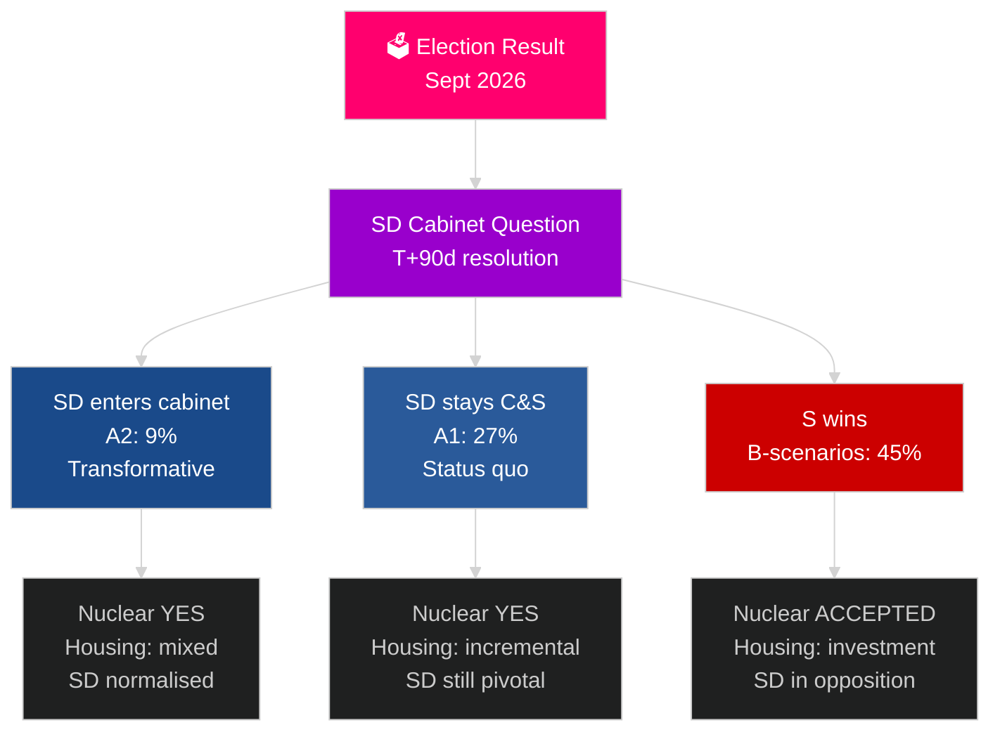

&#x200F;# המחזור הבחירותי הבא בשוודיה (2026–2030): המנדט לשינוי

**מחבר**: James Pether Sörling
**תאריך**: 2026-05-04
**סיווג**: ציבורי — GDPR סעיף 9(2)(ה)(ו)
**עומק ניתוח**: מקיף (2.5× Tier-C מחזור בחירות)
**רמת ביטחון**: בינונית [Admiralty C3]

---

## תמצית מנהלים

תקופת הכהונה 2026–2030 תעוצב על ידי ארבע כוחות מבניות ענקיות החורגות מתוצאות הבחירות: מחויבות ההגנה המחייבת של נאט"ו של 2.4% מהתמ"ג, ההחלטה על בניית כורים גרעיניים (הנדרשת מחישובי האנרגיה), משבר הדיור (גירעון מצטבר) והזדקנות דמוגרפית (ביקוש לשירותי סיעוד +18% עד 2030). השאלה הפוליטית הקריטית אינה איזו ממשלה תקום, אלא האם היא תפתור את שאלת הכניסה של SD לממשלה — השאלה החוקתית המשמעותית ביותר של העשור בשוודיה. קרן המטבע הבינלאומית (WEO אפריל 2026) צופה צמיחה של 2.4% בתמ"ג לשנת 2026 עם התאוששות מתמשכת עד 2030.

## החלטות שתדרוך זה תומך בהן

1. **תכנון תרחישי הרכבת ממשלה**: A1/A2 (Tidö) לעומת B1/B2/B3 (גוש S) — אילו מדיניות, שחקנים וסיכונים נובעים?
2. **הכנה להחלטה הגרעינית**: בחירת אתר, החלטת השקעה, לוח זמנים — מה חייב לקרות מתי?
3. **עיצוב מדיניות הדיור**: השקעות ממשלתיות לעומת הפעלת השוק — אילו כלים ובאיזה היקף?
4. **הערכת הכנסת SD לממשלה**: תנאים, מנגנוני הגנה, סיכונים ומשמעויות לחוסן הדמוקרטי.
5. **מיצוב בחירות לקראת 2030**: אילו מדדי ביצוע של הכהונה יגדירו את בחירות 2030?

## קריאת מודיעין של 60 שניות

- **הרכבת ממשלה (T+0 עד T+90 ימים)**: שאלת כניסת SD לממשלה היא מיידית; ההרכבה צפויה תוך 30–90 ימים; אין קואליציה יציבה מתמטית ללא תמיכת SD.
- **גרעין (T+365–T+730 ימים)**: חלון ההחלטה 2027–2028; קיימת תמיכה רחבה מהמפלגות; הון ובחירת אתר הם החסמים.
- **דיור**: גירעון של יותר מ-150,000 יחידות; כל התרחישים מייצרים פעולה מדינית; השקעות ממשלתיות (תרחישי B) לעומת שוק (תרחישי A).
- **רווחה**: ביקוש לשירותי סיעוד עולה ב-18% עד 2030 ללא קשר לתוצאה; רפורמה בפיננסים העירוניים נדרשת בכל תרחיש.
- **כלכלה**: קרן המטבע צופה צמיחה של 2.0–2.5% בתמ"ג בשנים 2027–2030; שוודיה עולה על ממוצע האיחוד האירופי; אפקט המכפיל של השקעות הגנה מוסיף ~0.5% תמ"ג.

## הגורם המעורר העיקרי לקראת

**פתרון שאלת כניסת SD לממשלה (T+90 ימים)**: האם SD תכנס לממשלה (A2) או תישאר כמפלגת תמיכה (A1) יגדיר את אופי תקופת הכהונה, הקבלה הבינלאומית והתקדים הדמוקרטי לכל התקופה 2026–2030.

## מטריצת תצוגה מקדימה לכהונה הבאה

| תחום | A1 (Tidö+) | A2 (SD בממשלה) | B1 (S מיעוט) | B2 (S קואליציה גדולה) |
|---|---|---|---|---|
| דיור | הדרגתי | מעורב | השקעת מדינה | שני המנגנונים |
| גרעין | בנייה | בנייה | קבל קו בסיס | רוב מיוחד |
| הגנה | 2.4% | 2.4% | 2.4% | 2.4% |
| הגירה | מחמיר | מחמיר מאוד | מתון | פרגמטי |
| עמדת SD | מפלגת תמיכה | ממשלה | אופוזיציה | אופוזיציה |

## רמת ביטחון

ביטחון בינוני (תוצאת הבחירות אינה וודאית; תחזית ל-4 שנים ספקולטיבית מטבעה); ביטחון גבוה לגבי אילוצים מבניים (הגנה, היגיון גרעיני, גירעון דיור).

<!-- source-sha: 5d8da0c335b7b753c6fbbb72731875bcfd25910e -->
