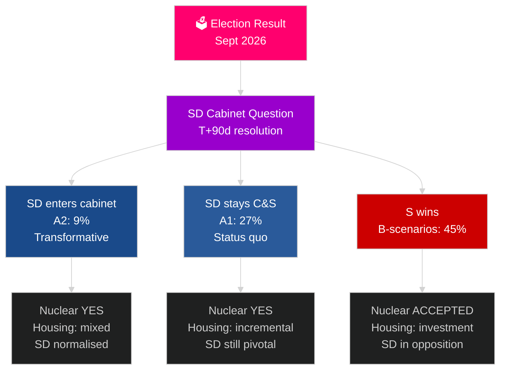

# スウェーデンの次の選挙サイクル（2026–2030）：変革の命令

**著者**: James Pether Sörling
**日付**: 2026-05-04
**分類**: 公開 — GDPR 第9条(2)(e)(g)
**分析深度**: 包括的（2.5× Tier-C 選挙サイクル）
**信頼度**: 中程度 [Admiralty C3]

---

## 要旨

2026–2030年の任期は、選挙結果を超えた4つの構造的メガフォースによって形成される：NATOの拘束力のある国防義務（GDP比2.4%）、原子力建設決定（エネルギー数学的必要性）、住宅危機（複利的赤字）、人口高齢化（2030年までに高齢者介護需要+18%）。決定的な政治的問題は、どの政府が形成されるかではなく、SD閣議問題を解決できるかどうかである——スウェーデンの10年間における最も重要な憲法上の問題。IMF WEO 2026年4月は、2026年のGDP成長率2.4%を予測し、2030年まで持続的な回復を見込む。

## この報告書が支援する意思決定

1. **連立シナリオ計画**: A1/A2（Tidö）対B1/B2/B3（Sブロック）——どの政策、アクター、リスクが続くか？
2. **原子力決定の準備**: サイト選定、投資決定、タイムライン——何をいつ行う必要があるか？
3. **住宅政策の設計**: 国家投資対市場活性化——どの手段をどの規模で？
4. **SD閣議参加の評価**: 条件、ガードレール、リスク、民主的レジリエンスへの含意。
5. **2030年に向けた選挙ポジショニング**: どの任期パフォーマンス指標が2030年選挙を定義するか？

## 60秒インテリジェンス読み

- **政府形成（T+0〜T+90日）**: SD閣議問題は即座；30〜90日以内に組閣が見込まれる；SDの支持なしに算術的に安定した連立はない。
- **原子力（T+365–T+730日）**: 意思決定ウィンドウ2027–2028；幅広い政党支持が存在；資本とサイト選定が障壁。
- **住宅**: 15万戸以上の不足；全シナリオで政策行動が発生；国家投資（Bシナリオ）対市場（Aシナリオ）。
- **福祉**: 高齢者介護需要は2030年までに18%増加（結果にかかわらず）；各シナリオで地方財政改革が必要。
- **経済**: IMFは2027–2030年にGDP成長率2.0〜2.5%を予測；スウェーデンはEU平均を上回る；防衛投資の乗数効果がGDP約0.5%を追加。

## 主要な先行シグナル

**SD閣議問題の解決（T+90日）**: SDが閣議に入るか（A2）、閣外協力にとどまるか（A1）により、2026–2030年全体の任期の性格、国際的評価、民主的先例が決まる。

## 次期任期プレビューマトリクス

| 領域 | A1（Tidö+） | A2（SD入閣） | B1（S少数） | B2（S大連立） |
|---|---|---|---|---|
| 住宅 | 漸進的 | 混合 | 国家投資 | 両メカニズム |
| 原子力 | 建設 | 建設 | ベースライン受容 | 超多数 |
| 防衛 | 2.4% | 2.4% | 2.4% | 2.4% |
| 移民 | 厳格 | 非常に厳格 | 穏健 | プラグマティック |
| SD立場 | 閣外協力 | 閣議参加 | 反対党 | 反対党 |

## 信頼度ラベル

中程度の信頼度（選挙結果は不確実；4年予測は本質的に推測的）；構造的制約（防衛、原子力の論理、住宅不足）についての信頼度は高い。

<!-- source-sha: 5d8da0c335b7b753c6fbbb72731875bcfd25910e -->
