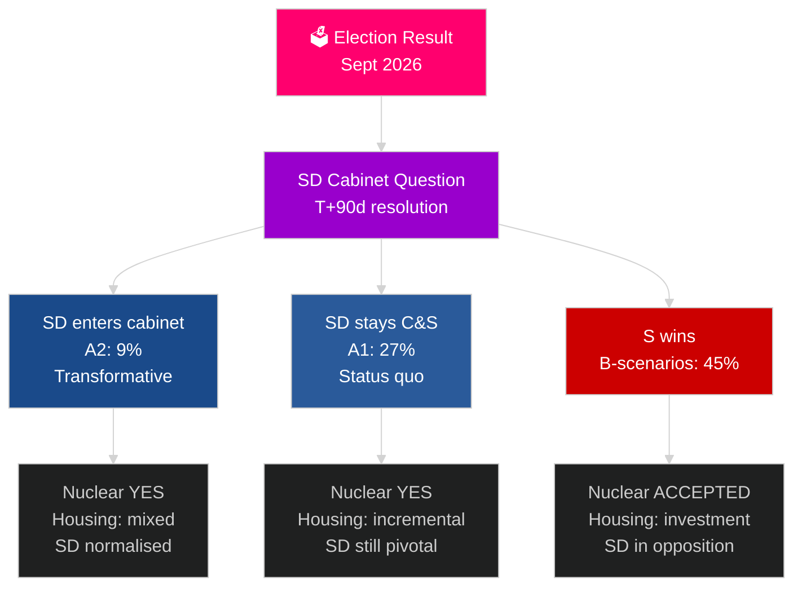

# 스웨덴의 다음 선거 주기 (2026–2030): 변혁의 위임

**저자**: James Pether Sörling
**날짜**: 2026-05-04
**분류**: 공개 — GDPR 제9조(2)(e)(g)
**분석 수준**: 포괄적 (2.5× Tier-C 선거 주기)
**신뢰도**: 중간 [Admiralty C3]

---

## 핵심 요약

2026–2030년 임기는 선거 결과를 초월한 네 가지 구조적 메가포스에 의해 형성될 것이다: NATO의 구속력 있는 GDP 2.4% 국방 의무, 원자력 건설 결정(에너지 수학상 필요), 주택 위기(복리적 적자), 인구 고령화(2030년까지 노인 돌봄 수요 +18%). 결정적인 정치적 질문은 어떤 정부가 구성되느냐가 아니라, SD 내각 문제를 해결할 수 있느냐이다 — 스웨덴의 10년간 가장 중요한 헌법적 질문. IMF WEO 2026년 4월은 2026년 GDP 성장률 2.4%를 예상하며 2030년까지 지속적인 회복을 전망한다.

## 이 보고서가 지원하는 결정

1. **연립 시나리오 계획**: A1/A2 (Tidö) 대 B1/B2/B3 (S 블록) — 어떤 정책, 행위자, 위험이 따르는가?
2. **원자력 결정 준비**: 부지 선정, 투자 결정, 타임라인 — 무엇을 언제 해야 하는가?
3. **주택 정책 설계**: 국가 투자 대 시장 활성화 — 어떤 수단을 어떤 규모로?
4. **SD 내각 포함 평가**: 조건, 안전장치, 위험, 민주적 회복력 함의.
5. **2030년 선거 포지셔닝**: 어떤 임기 성과 지표가 2030년 선거를 정의할 것인가?

## 60초 정보 요약

- **정부 구성 (T+0~T+90일)**: SD 내각 문제는 즉각적; 30–90일 이내 구성 예상; SD 지지 없이는 어떤 연립도 수학적으로 안정적이지 않음.
- **원자력 (T+365–T+730일)**: 결정 창구 2027–2028; 광범위한 정당 지지 존재; 자본과 부지 선정이 장벽.
- **주택**: 150,000+ 유닛 부족; 모든 시나리오에서 정책 조치 발생; 국가 투자(B 시나리오) 대 시장(A 시나리오).
- **복지**: 노인 돌봄 수요 2030년까지 18% 증가(결과와 무관); 각 시나리오에서 지방 재정 개혁 필요.
- **경제**: IMF는 2027–2030년 GDP 성장률 2.0–2.5% 예상; 스웨덴은 EU 평균 초과; 국방 투자 승수 효과로 GDP ~0.5% 추가.

## 주요 선행 트리거

**SD 내각 문제 해결 (T+90일)**: SD가 내각에 입각하느냐(A2) 지지 정당으로 남느냐(A1)에 따라 임기의 성격, 국제적 수용, 2026–2030년 전체 기간의 민주적 선례가 결정된다.

## 다음 임기 미리보기 매트릭스

| 영역 | A1 (Tidö+) | A2 (SD 내각) | B1 (S 소수) | B2 (S 대연립) |
|---|---|---|---|---|
| 주택 | 점진적 | 혼합 | 국가 투자 | 두 메커니즘 모두 |
| 원자력 | 건설 | 건설 | 기본선 수용 | 초다수 |
| 국방 | 2.4% | 2.4% | 2.4% | 2.4% |
| 이민 | 엄격 | 매우 엄격 | 온건 | 실용적 |
| SD 위치 | 지지 정당 | 내각 | 야당 | 야당 |

## 신뢰도 레이블

중간 신뢰도(선거 결과 불확실; 4년 전망은 본질적으로 추측적); 구조적 제약(국방, 원자력 논리, 주택 적자)에 대한 신뢰도는 높음.

<!-- source-sha: 5d8da0c335b7b753c6fbbb72731875bcfd25910e -->
