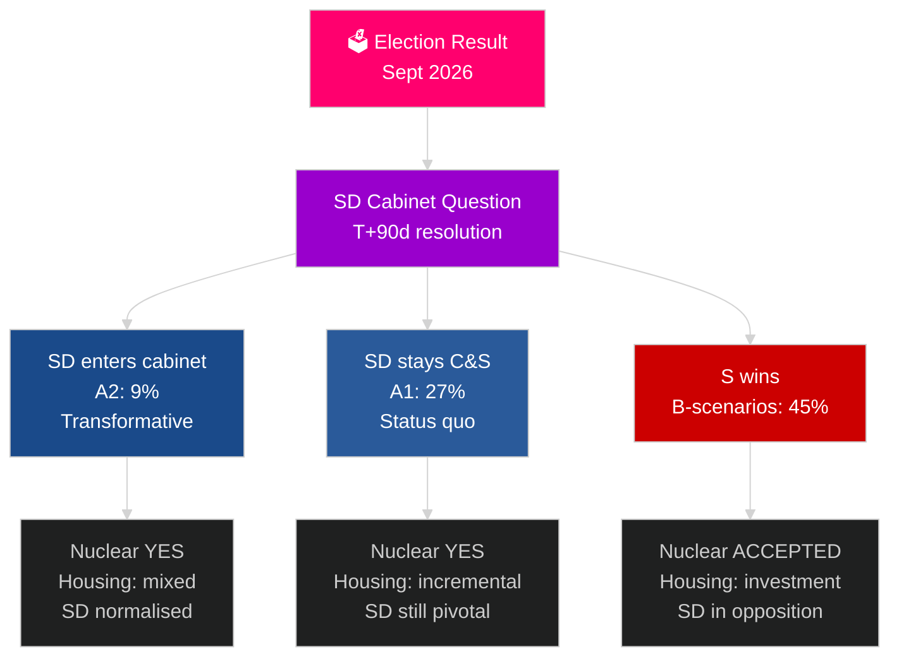

# Zweden's volgende verkiezingscyclus (2026–2030): Het Transformatiemandaat

**Auteur**: James Pether Sörling
**Datum**: 2026-05-04
**Classificatie**: OPENBAAR — AVG Art. 9(2)(e)(g)
**Analyseniveau**: uitgebreid (2,5× Tier-C verkiezingscyclus)
**Betrouwbaarheid**: GEMIDDELD [Admiralty C3]

---

## KERNBOODSCHAP

De mandaatperiode 2026–2030 zal worden gevormd door vier structurele megakrachten die electorale uitkomsten overstijgen: de bindende NAVO-defensieverplichtingen van 2,4% van het BBP, de beslissing over kernenergie (vereist door energiematematica), de woningcrisis (oplopend tekort) en demografische vergrijzing (vraag naar ouderenzorg +18% tegen 2030). De bepalende politieke vraag is niet welke regering wordt gevormd, maar of zij de SD-kabinetsvraag oplost — de meest bepalende constitutionele vraag van het decennium in Zweden. Het IMF WEO apr-2026 projecteert 2,4% bbp-groei voor 2026 met aanhoudend herstel tot 2030.

## Beslissingen die dit rapport ondersteunt

1. **Planning van coalitiesscenario's**: A1/A2 (Tidö) versus B1/B2/B3 (S-blok) — welk beleid, welke actoren en risico's volgen?
2. **Voorbereiding op de kernenergiebeslissing**: Locatiekeuze, investeringsbeslissing, tijdlijn — wat moet wanneer gebeuren?
3. **Ontwerp van woningbeleid**: Staatsinvesteringen versus marktactivering — welke instrumenten en op welke schaal?
4. **Beoordeling van SD-kabinetsbetrokkenheid**: Voorwaarden, waarborgen, risico's en gevolgen voor democratische veerkracht.
5. **Electorale positionering voor 2030**: Welke mandaatprestatie-indicatoren zullen de verkiezingen van 2030 bepalen?

## 60-seconden inlichtingenlecture

- **Kabinetsformatie (T+0 tot T+90d)**: SD-kabinetsvraag is onmiddellijk; formatie verwacht binnen 30–90 dagen; geen coalitie is rekenkundig stabiel zonder SD-steun.
- **Kernenergie (T+365–T+730d)**: Beslissingsvenster 2027–2028; brede partijsteun aanwezig; kapitaal en locatiekeuze zijn de blokkades.
- **Woningbouw**: Tekort van 150.000+ wooneenheden; alle scenario's leiden tot beleidsactie; staatsinvesteringen (B-scenario's) versus markt (A-scenario's).
- **Welzijn**: Vraag naar ouderenzorg stijgt met 18% tegen 2030 ongeacht uitkomst; gemeentelijke financiële hervorming nodig in elk scenario.
- **Economie**: IMF projecteert 2,0–2,5% bbp-groei 2027–2030; Zweden overtreft het EU-gemiddelde; multiplicatoreffect van defensie-investeringen voegt ~0,5% bbp toe.

## Belangrijkste vooruitblikkende trigger

**Oplossing van de SD-kabinetsvraag (T+90d)**: Of SD toetreedt tot het kabinet (A2) of steunpartij blijft (A1) zal het karakter van het mandaat, de internationale ontvangst en het democratisch precedent voor de gehele periode 2026–2030 bepalen.

## Vooruitblikmatrix volgend mandaat

| Domein | A1 (Tidö+) | A2 (SD in kabinet) | B1 (S minderheid) | B2 (S grote coalitie) |
|---|---|---|---|---|
| Woningbouw | Incrementeel | Gemengd | Staatsinvestering | Beide mechanismen |
| Kernenergie | Bouw | Bouw | Basislijn accepteren | Supermeerderheid |
| Defensie | 2,4% | 2,4% | 2,4% | 2,4% |
| Migratie | Streng | Zeer streng | Gematigd | Pragmatisch |
| SD-positie | Steunpartij | Kabinet | Oppositie | Oppositie |

## Betrouwbaarheidsmarkering

GEMIDDELDE betrouwbaarheid (verkiezingsuitkomst onzeker; 4-jarige projectie inherent speculatief); HOOG voor structurele beperkingen (defensie, kernenergie-logica, woningtekort).

<!-- source-sha: 5d8da0c335b7b753c6fbbb72731875bcfd25910e -->
