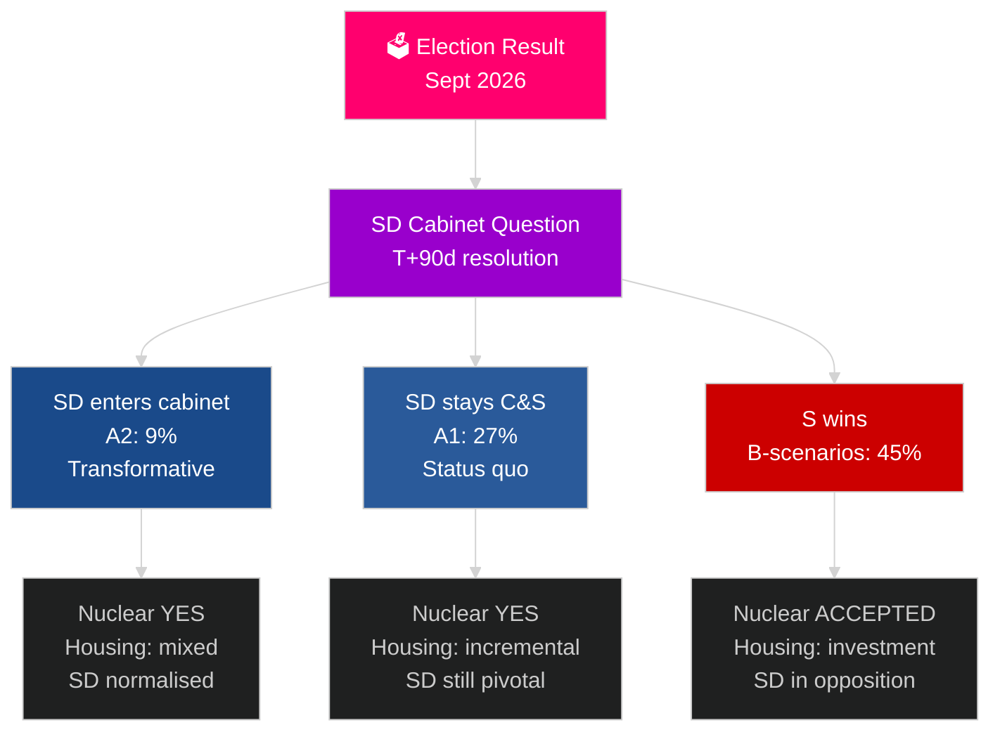

# Sveriges neste valgperiode (2026–2030): Transformasjonsmandatet

**Forfatter**: James Pether Sörling
**Dato**: 2026-05-04
**Klassifisering**: OFFENTLIG — GDPR Art 9(2)(e)(g)
**Analysedybde**: omfattende (2,5× Tier-C valgperiode)
**Konfidens**: MIDDELS [Admiralty C3]

---

## KONKLUSJON

Mandatperioden 2026–2030 vil bli formet av fire strukturelle megakrefter som overgår valgutfall: NATOs bindende forsvarsforpliktelse på 2,4 % av BNP, beslutning om kjernekraft (nødvendig ut fra energimatematikk), boligkrise (eskalerende underskudd) og demografisk aldring (etterspørsel etter eldreomsorg +18 % innen 2030). Det avgjørende politiske spørsmålet er ikke hvilken regjering som dannes, men om den løser SD-kabinettssspørsmålet — Sveriges viktigste konstitusjonelle spørsmål i tiåret. IMF WEO apr-2026 anslår 2,4 % BNP-vekst for 2026 med vedvarende gjenoppretting frem til 2030.

## Beslutninger dette underlag støtter

1. **Koalisjonsscenarioplanlegging**: A1/A2 (Tidö) mot B1/B2/B3 (S-blokken) — hvilke politikker, aktører og risikoer følger?
2. **Forberedelse av kjernekraftbeslutning**: Lokalisering, investeringsbeslutning, tidslinje — hva må skje når?
3. **Boligpolitisk utforming**: Statlige investeringer mot markedsaktivering — hvilke instrumenter og i hvilken skala?
4. **Vurdering av SD i kabinettet**: Betingelser, sikringstiltak, risikoer og konsekvenser for demokratisk motstandsdyktighet.
5. **Valgposisjonering frem mot 2030**: Hvilke mandatprestasjonsmål vil definere valget i 2030?

## 60-sekunders etterretningslesning

- **Regjeringsdannelse (T+0 til T+90d)**: SD-kabinettssspørsmålet er umiddelbart; dannelse forventes innen 30–90 dager; ingen koalisjon er aritmetisk stabil uten SD-støtte.
- **Kjernekraft (T+365–T+730d)**: Beslutningsvindu 2027–2028; bred partistøtte eksisterer; kapital og lokalisering er blokkene.
- **Boliger**: Underskudd på 150 000+ enheter; alle scenarier fører til politisk handling; statlige investeringer (B-scenarier) mot marked (A-scenarier).
- **Velferd**: Etterspørsel etter eldreomsorg øker 18 % innen 2030 uavhengig av utfall; kommunal finansreform er nødvendig i hvert scenario.
- **Økonomi**: IMF anslår 2,0–2,5 % BNP-vekst 2027–2030; Sverige overgår EU-gjennomsnittet; forsvarsinvesteringenes multiplikatoreffekt tilfører ~0,5 % BNP.

## Viktigste fremtidige utløser

**SD-kabinettssspørsmålets løsning (T+90d)**: Om SD går inn i kabinettet (A2) eller forblir som støtteparti (A1) vil definere mandatperiodens karakter, internasjonale mottakelse og demokratiske presedens for hele perioden 2026–2030.

## Neste mandatperiodes forhåndsmatrise

| Domene | A1 (Tidö+) | A2 (SD i kabinett) | B1 (S-mindretall) | B2 (S-stor koalisjon) |
|---|---|---|---|---|
| Boliger | Inkrementell | Blandet | Statlig investering | Begge mekanismer |
| Kjernekraft | Bygging | Bygging | Aksepter baseline | Supermajoritet |
| Forsvar | 2,4 % | 2,4 % | 2,4 % | 2,4 % |
| Migrasjon | Streng | Meget streng | Moderat | Pragmatisk |
| SD-posisjon | Støtteparti | Kabinett | Opposisjon | Opposisjon |

## Konfidensmarkering

MIDDELS konfidens (valgutfall usikkert; 4-årig prognose er i seg selv spekulativ); HØY konfidens for strukturelle begrensninger (forsvar, kjernekraftlogikk, boligunderskudd).

<!-- source-sha: 5d8da0c335b7b753c6fbbb72731875bcfd25910e -->
