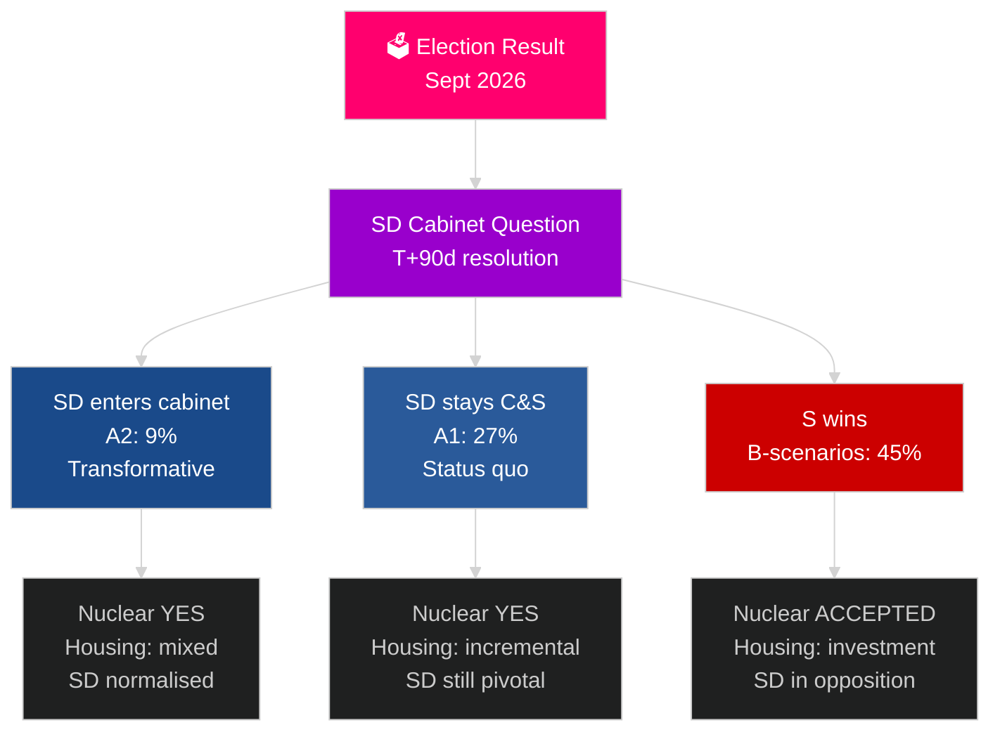

# Sveriges nästa valcykel (2026–2030): Transformationsuppdraget

**Författare**: James Pether Sörling
**Datum**: 2026-05-04
**Klassificering**: OFFENTLIG — GDPR Art 9(2)(e)(g)
**Analysnivå**: komprehensiv (2,5× Tier-C valcykel)
**Konfidens**: MEDEL [Admiralty C3]

---

## SLUTSATS I KORTHET

Mandatperioden 2026–2030 kommer att formas av fyra strukturella megakrafter som överskriver valets utgång: NATO:s bindande försvarsmål om 2,4 % av BNP, kärnkraftsbeslut (nödvändigt ur energimatematikens perspektiv), bostadskris (eskalerande underskott) och demografiskt åldrande (äldreomsorgsefterfrågan +18 % till 2030). Den avgörande politiska frågan är inte vilken regering som bildas, utan om den löser SD:s kabinettsfråga — decenniets viktigaste konstitutionella fråga i Sverige. IMF WEO apr-2026 prognostiserar 2,4 % BNP-tillväxt för 2026 med stabil återhämtning till 2030.

## Beslut som detta underlag stöder

1. **Koalitionsscenarioplanering**: A1/A2 (Tidö) kontra B1/B2/B3 (S-blocket) — vilka politikområden, aktörer och risker följer?
2. **Kärnkraftsförberedelser**: Lokalisering, investeringsbeslut, tidslinje — vad måste ske när?
3. **Bostadspolitisk utformning**: Statliga investeringar kontra marknadsaktivering — vilka instrument och i vilken skala?
4. **Bedömning av SD i regeringen**: Villkor, skyddsmekanismer, risker och konsekvenser för demokratisk motståndskraft.
5. **Valpositionering inför 2030**: Vilka mandatprestationsmått kommer att definiera valet 2030?

## 60-sekundersinformation

- **Regeringsbildning (T+0 till T+90d)**: SD:s kabinettsfråga är omedelbar; bildning väntas inom 30–90 dagar; ingen koalition är aritmetiskt stabil utan SD:s stöd.
- **Kärnkraft (T+365–T+730d)**: Beslutsfönster 2027–2028; brett partistöd finns; kapital och lokaliseringsval är blockerarna.
- **Bostäder**: Underskott på 150 000+ enheter; alla scenarier ger politisk åtgärd; statliga investeringar (B-scenarier) kontra marknad (A-scenarier).
- **Välfärd**: Äldreomsorgsefterfrågan stiger 18 % till 2030 oavsett utfall; kommunal ekonomireform krävs i varje scenario.
- **Ekonomi**: IMF prognostiserar 2,0–2,5 % BNP-tillväxt 2027–2030; Sverige överträffar EU-snittet; försvarsinvesteringarnas multiplikatoreffekt tillför ~0,5 % BNP.

## Viktigaste framåtblickande utlösare

**SD:s kabinettsfrågans lösning (T+90d)**: Om SD går in i regeringen (A2) eller stannar som stödparti (A1) kommer att definiera mandatperiodens karaktär, internationella mottagande och demokratiska prejudikat för hela perioden 2026–2030.

## Kommande mandatperiods förhandsmatris

| Domän | A1 (Tidö+) | A2 (SD i kabinett) | B1 (S-minoritet) | B2 (S-stor koalition) |
|---|---|---|---|---|
| Bostäder | Inkrementell | Blandad | Statlig investering | Båda mekanismerna |
| Kärnkraft | Byggnation | Byggnation | Acceptera baslinje | Supermajoritet |
| Försvar | 2,4 % | 2,4 % | 2,4 % | 2,4 % |
| Migration | Strikt | Mycket strikt | Måttlig | Pragmatisk |
| SD:s position | Stödparti | Kabinett | Opposition | Opposition |

## Konfidensmarkering

MEDEL konfidens (valets utgång osäker; 4-årig prognos är i sig spekulativ); HÖG konfidens gällande strukturella begränsningar (försvar, kärnkraftslogik, bostadsunderskott).

<!-- source-sha: 5d8da0c335b7b753c6fbbb72731875bcfd25910e -->
