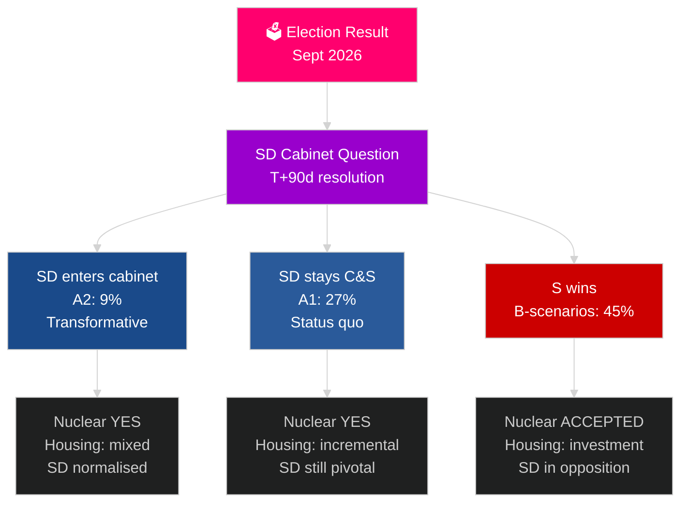

# 瑞典下一个选举周期（2026–2030）：变革授权

**作者**：James Pether Sörling
**日期**：2026-05-04
**分类**：公开 — GDPR 第9条(2)(e)(g)
**分析深度**：全面（2.5× Tier-C 选举周期）
**置信度**：中等 [Admiralty C3]

---

## 核心结论

2026–2030年任期将由四种超越选举结果的结构性巨型力量塑造：北约具有约束力的国防义务（GDP的2.4%）、核电建设决定（能源数学的必然要求）、住房危机（不断累积的赤字）和人口老龄化（2030年前老年护理需求增加18%）。决定性的政治问题不是哪个政府会组建，而是它能否解决SD入阁问题——瑞典这十年最重要的宪法问题。IMF WEO 2026年4月预测2026年GDP增长2.4%，并在2030年前保持持续复苏。

## 本报告支持的决策

1. **执政联盟情景规划**：A1/A2（Tidö）对B1/B2/B3（S阵营）——什么政策、行为者和风险随之而来？
2. **核电决策准备**：选址、投资决定、时间表——什么时候必须做什么？
3. **住房政策设计**：国家投资对市场激活——哪些工具，规模多大？
4. **SD入阁评估**：条件、护栏、风险和对民主韧性的影响。
5. **2030年选举定位**：哪些任期绩效指标将定义2030年选举？

## 60秒情报解读

- **组阁（T+0至T+90天）**：SD入阁问题迫在眉睫；预计30–90天内组阁；没有SD支持，任何联盟都无法在算术上稳定。
- **核电（T+365–T+730天）**：决策窗口2027–2028；存在广泛的跨党派支持；资本和选址是障碍。
- **住房**：缺口超过15万套；所有情景均需要政策行动；国家投资（B情景）对市场（A情景）。
- **福利**：无论结果如何，老年护理需求到2030年将增加18%；每种情景都需要地方财政改革。
- **经济**：IMF预测2027–2030年GDP增长2.0–2.5%；瑞典超过欧盟平均水平；国防投资乘数效应增加约GDP 0.5%。

## 最重要的前瞻性触发因素

**SD入阁问题解决（T+90天）**：SD是否进入内阁（A2）或仍为支持党（A1）将决定整个2026–2030年任期的性格、国际接受度和民主先例。

## 下一任期预览矩阵

| 领域 | A1（Tidö+） | A2（SD入阁） | B1（S少数） | B2（S大联合） |
|---|---|---|---|---|
| 住房 | 渐进 | 混合 | 国家投资 | 两种机制 |
| 核电 | 建设 | 建设 | 接受基线 | 绝对多数 |
| 国防 | 2.4% | 2.4% | 2.4% | 2.4% |
| 移民 | 严格 | 非常严格 | 温和 | 务实 |
| SD立场 | 支持党 | 内阁 | 反对党 | 反对党 |

## 置信度标签

中等置信度（选举结果不确定；4年预测本质上具有推测性）；对结构性制约（国防、核电逻辑、住房赤字）的置信度高。

<!-- source-sha: 5d8da0c335b7b753c6fbbb72731875bcfd25910e -->
