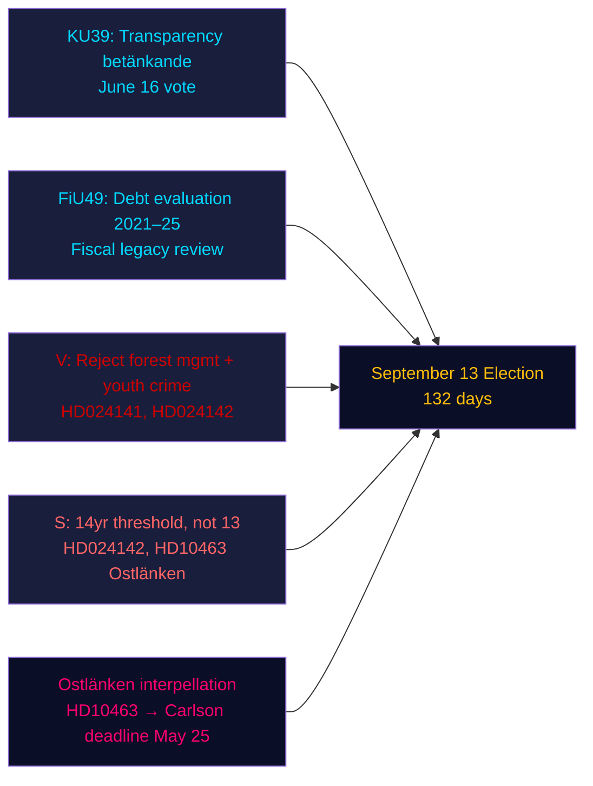
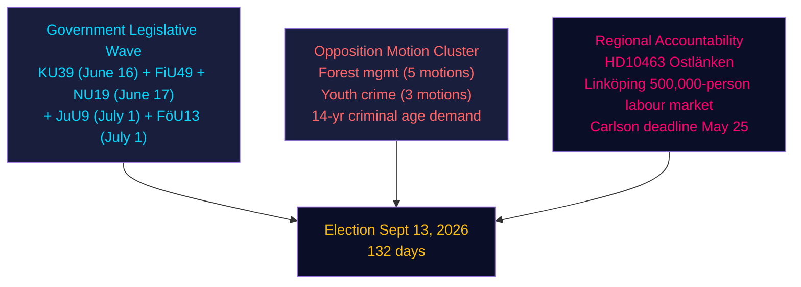
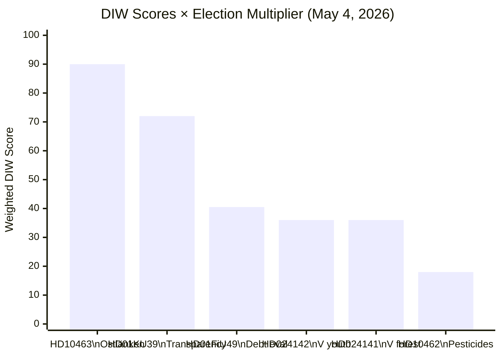
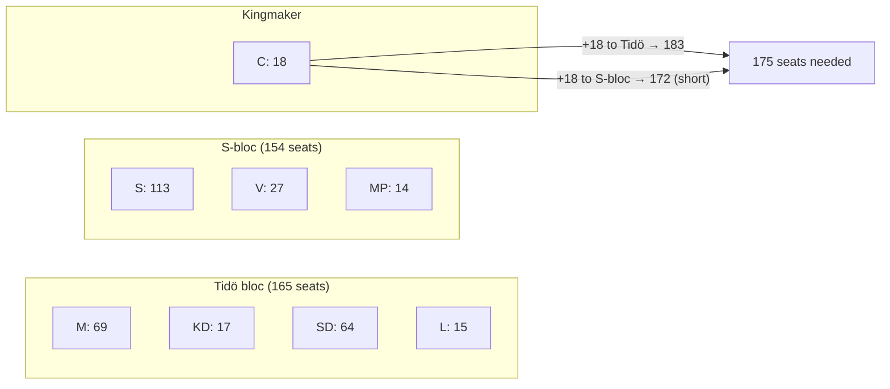
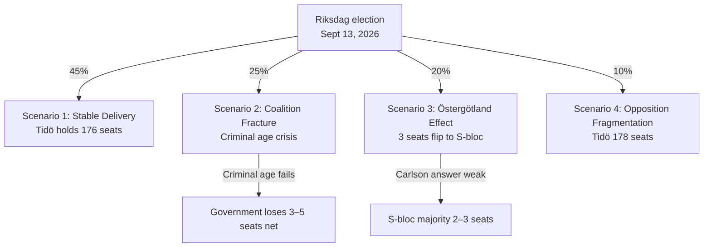
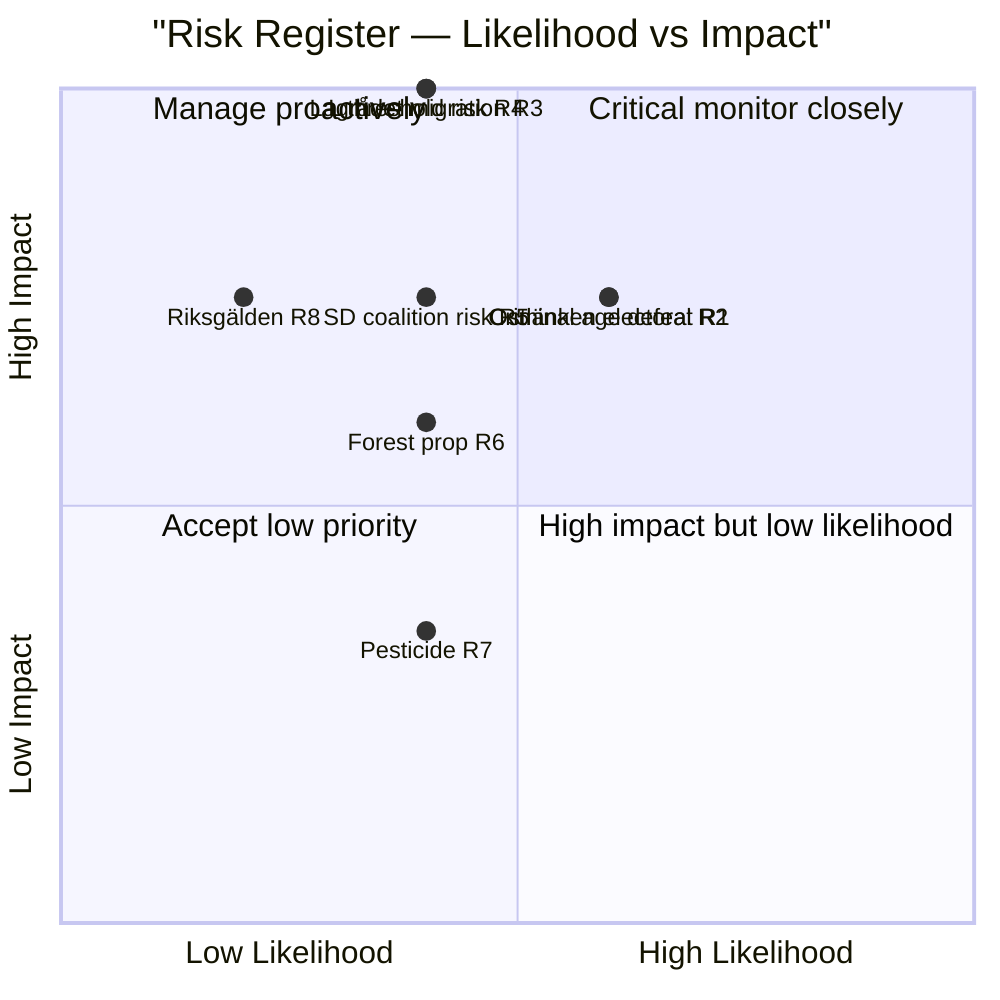
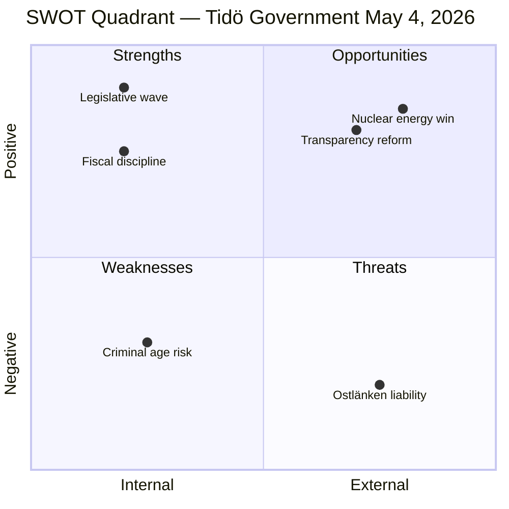
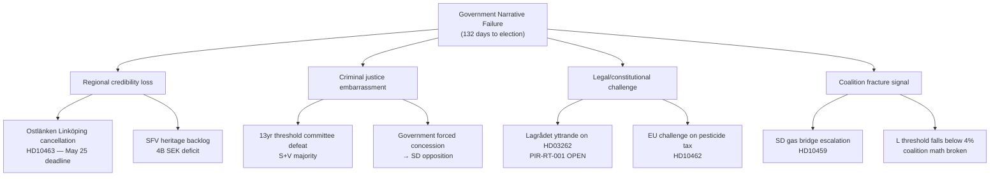
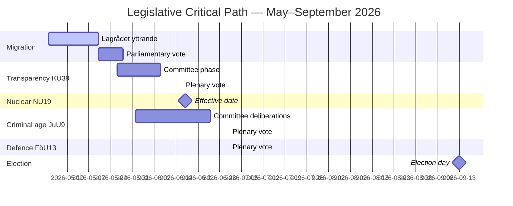
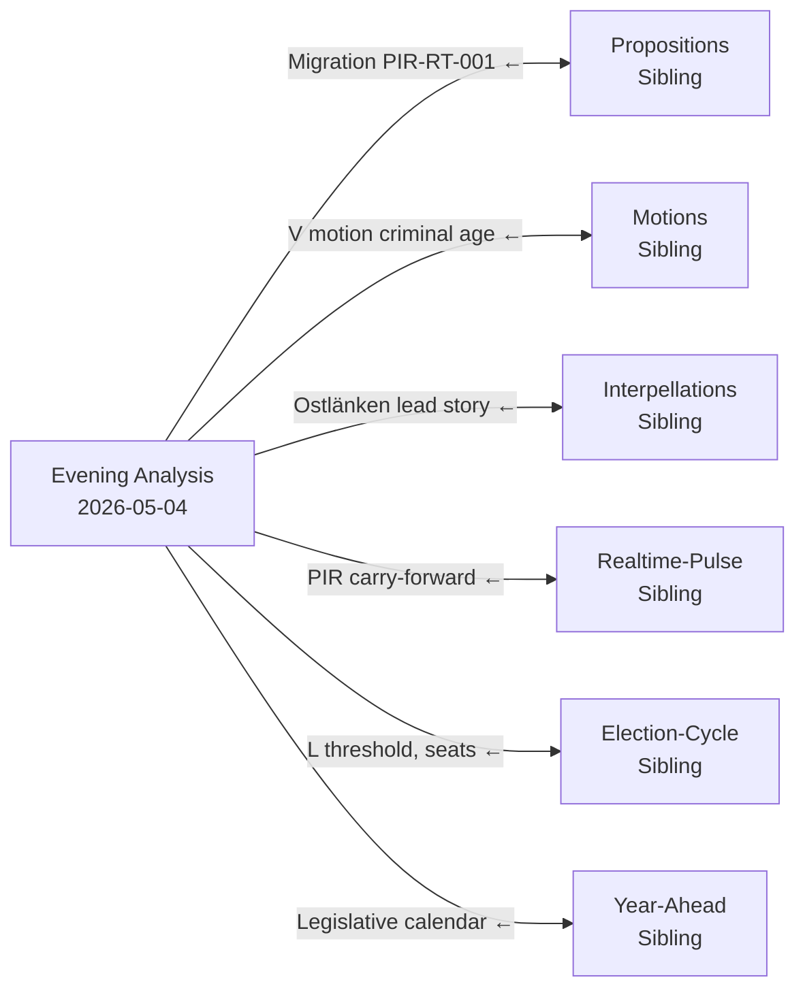

## What Happened
<!-- source: executive-brief.md :: https://github.com/Hack23/riksdagsmonitor/blob/main/analysis/daily/2026-05-04/evening-analysis/executive-brief.md -->

**IMF Provenance**: WEO Apr-2026 | NGDP_RPCH_2026: 2.1% | GGXWDG_NGDP: ~34% | retrieved: 2026-05-04

---

### Lede
Sweden's Riksdag on 4 May 2026 — 132 days before the September 13 election — entered an accelerated legislative closure phase: the constitutional committee (KU) registered betänkande KU39 on political process transparency for a June 16 vote, while the finance committee (FiU) registered FiU49 evaluating five years of Riksgälden debt management. Opposition parties filed nine new motions against government propositions on forest management and youth crime, and Social Democrat Eva Lindh sharpened the Ostlänken accountability attack on KD Infrastructure Minister Carlson. The dominant intelligence signal: the government is locking in its legislative legacy while the opposition is building a targeted pre-election attack portfolio — and both are operating on a compressed 132-day timeline.

---

### Three Decisions Supported by This Brief

1. **Legislative calendar assessment**: KU39 debate on June 16 confirms the government can pass the transparency bill Riksdag document #03258 (HD03258) before the summer recess — a pre-election governance win for the coalition.
2. **Opposition coordination assessment**: The nine MJU/JuU motions filed today represent a coordinated party response — V with maximum rejection demands, S with conditional acceptance, other parties with targeted amendments — revealing the legislative arithmetic before committee hearings.
3. **Infrastructure vulnerability**: The Ostlänken interpellation (HD10463) has activated a regional accountability crisis in Östergötland — a high-density marginal-seat constituency — that will remain live through the May 25 ministerial deadline for Carlson's answer.

---

### 60-Second Read

- **KU39 transparency** (June 16 vote): Government's HD03258 political financing disclosure bill on track — implications for all parties' funding transparency before the election.
- **FiU49 debt evaluation**: Five-year Riksgälden performance review registered; Sweden's public debt (~34% of GDP, EU minimum) contextualises any fiscal policy debate.
- **Nine new motions**: Forest management (prop 242, five MJU motions) and youth crime (prop 246, three JuU motions) face coordinated opposition challenges. V demands rejection outright; S demands the 14-year criminal age threshold not 13.
- **Ostlänken interpellation (HD10463)**: S's Eva Lindh targets KD minister Carlson on the cancelled Linköping station — affecting a 500,000-person labour market and generating regional heat in four marginal seats.
- **Pesticide tax interpellation (HD10462)**: S's Monica Haider targets Finance Minister Svantesson on healthcare disinfectant taxation — low general salience but high relevance to healthcare unions.

---

### Top Forward Trigger

**KU39 committee hearing (May 26–June 4)**: The transparency bill KU39 enters committee deliberation on May 26. If any party attempts to amend HD03258 to cover digital political advertising (currently excluded from the proposal), a coalition conflict could emerge between L (pro-digital transparency) and SD (resistant to advertising disclosure rules). Watch for committee majority protocol.

---

### Confidence Assessment

| Domain | Confidence | Basis |
|--------|-----------|-------|
| Legislative calendar (KU39/FiU49) | HIGH [A2] | Direct betänkande metadata, committee calendar |
| Opposition motion content | HIGH [B2] | Full-text retrieval of HD024142; partial summaries of others |
| Electoral significance | MEDIUM [B3] | Coalition arithmetic from sibling analyses |
| Economic context | MEDIUM [A3] | IMF WEO Apr-2026 (cached from sibling analyses) |

---

### Mermaid Overview



## Reader Intelligence Guide

Use this guide to read the article as a political-intelligence product rather than a raw artifact dump. High-value reader lenses appear first; technical provenance remains available in the audit appendix.

| Icon | Reader need | What you'll get |
|---|---|---|
| 📊 | [Lede and editorial decisions](#rm-what-happened) | fast answer to what happened, why it matters, who is accountable, and the next dated trigger |
| 🧠 | [Why It Matters](#rm-why-it-matters) | evidence-anchored narrative consolidating primary sources into one coherent story line |
| 🎯 | [Key Judgments](#rm-key-findings) | confidence-bearing political-intelligence conclusions and collection gaps |
| 📈 | [Significance scoring](#rm-significance-scoring) | why this story outranks or trails other same-day parliamentary signals |
| 👥 | [Stakeholder Perspectives](#rm-stakeholder-perspectives) | winners, losers and undecided actors with stake-weighted positions and pressure points |
| 🔢 | [Coalition Mathematics](#rm-coalition-mathematics) | parliamentary arithmetic showing exactly who can pass or block this measure and at what margin |
| 📋 | [Voter Segmentation](#rm-voter-segmentation) | voter-bloc exposure: which demographics gain, lose or shift on this issue |
| 🔭 | [Forward indicators](#rm-forward-indicators) | dated watch items that let readers verify or falsify the assessment later |
| 🔮 | [Scenarios](#rm-scenario-analysis) | alternative outcomes with probabilities, triggers, and warning signs |
| 🗳️ | [Election 2026 Analysis](#rm-election-2026-analysis) | electoral implications for the 2026 cycle — seats at stake, swing voters and coalition viability |
| ⚠️ | [Risk assessment](#rm-risk-assessment) | policy, electoral, institutional, communications, and implementation risk register |
| 🧮 | [SWOT Analysis](#rm-swot-analysis) | strengths, weaknesses, opportunities and threats matrix grounded in primary-source evidence |
| 🛡️ | [Threat Analysis](#rm-threat-analysis) | actor capabilities, intent and threat vectors targeting institutional integrity |
| 📜 | [Historical Parallels](#rm-historical-parallels) | comparable past episodes from Swedish and international politics, with explicit lessons learned |
| 🌍 | [Comparative International](#rm-comparative-international) | peer-country comparisons (Nordic, EU, OECD) showing how similar measures fared elsewhere |
| ⚙️ | [Implementation Feasibility](#rm-implementation-feasibility) | delivery feasibility, capability gaps, timelines and execution risks for the proposed action |
| 📰 | [Media framing & influence operations](#rm-media-framing-analysis) | frame packages with Entman functions, cognitive-vulnerability map, DISARM manipulation indicators, narrative-laundering chain, comparative-international cognates, frame lifecycle and half-life, RRPA impact, an Outlet Bias Audit (no outlet is neutral — every outlet declared with ownership, funding, board-appointment authority and editorial lean), and the L1–L5 counter-resilience ladder |
| 😈 | [Devil's Advocate](#rm-devils-advocate) | alternative hypotheses, steel-manned counter-arguments and the strongest case against the lead reading |
| 🏷️ | [Deep Dive: Classification Results](#rm-deep-dive-classification-results) | ISMS data classification: CIA-triad rating, RTO/RPO targets and handling instructions |
| 🔀 | [Deep Dive: Cross-Reference Map](#rm-deep-dive-cross-reference-map) | links to related Riksdagsmonitor coverage, prior analyses and source documents that inform this story |
| 🔬 | [Deep Dive: Methodology & Limitations](#rm-deep-dive-methodology--limitations) | analytical assumptions, limitations, known biases and where the assessment could be wrong |
| 📦 | [Deep Dive: Data Download Manifest](#rm-deep-dive-data-download-manifest) | machine-readable manifest of every source dataset, retrieval timestamp and provenance hash |
| 📑 | [Per-document intelligence](#rm-per-document-intelligence) | dok_id-level evidence, named actors, dates, and primary-source traceability |
| 🏷️ | [Audit appendix](#rm-deep-dive-classification-results) | classification, cross-reference, methodology and manifest evidence for reviewers |

## Why It Matters
<!-- source: synthesis-summary.md :: https://github.com/Hack23/riksdagsmonitor/blob/main/analysis/daily/2026-05-04/evening-analysis/synthesis-summary.md -->

---

### Lead Story Decision

The most consequential development on 4 May 2026 is the **dual committee betänkande registration** of KU39 (political transparency) and FiU49 (debt management evaluation), paired with **nine opposition motions** against forest management and youth crime propositions, and Eva Lindh's sharpening interpellation on Ostlänken. The day marks the Riksdag entering its final pre-election closure phase: government bills being scheduled for June votes, opposition parties filing their last round of amendatory motions, and S systematically attacking the government's delivery record on infrastructure. The headline intelligence judgment is that the Tidö coalition will pass its pre-election legislative agenda but faces a coordinated regional accountability campaign that could cost it marginal seats in Östergötland.

---

### DIW-Weighted Rankings

| Rank | dok_id | Topic | D | I | W | DIW | ×1.5 Election | Priority |
|------|--------|-------|---|---|---|-----|--------------|----------|
| 1 | HD10463 | Ostlänken/Östergötland interpellation | 3 | 4 | 5 | 60 | 90 | L3 Intelligence |
| 2 | HD01KU39 | Transparency betänkande (June 16 vote) | 3 | 4 | 4 | 48 | 72 | L2+ Priority |
| 3 | HD024142 | V motion: reject youth crime (JuU) | 2 | 3 | 4 | 24 | 36 | L2 Strategic |
| 4 | HD024141 | V motion: reject forest management (MJU) | 2 | 3 | 4 | 24 | 36 | L2 Strategic |
| 5 | HD01FiU49 | Debt management evaluation 2021–25 | 3 | 3 | 3 | 27 | 40 | L2+ Priority |
| 6 | HD10462 | Pesticide tax interpellation | 2 | 2 | 3 | 12 | 18 | L1 Surface |
| 7 | HD11780 | S question: biofuel investments | 1 | 2 | 2 | 4 | 6 | L1 Surface |
| 8 | HD11779 | C question: education for non-long-term-unemployed | 1 | 2 | 2 | 4 | 6 | L1 Surface |
| 9–14 | HD024143–HD024148 | Additional forest/crime motions (cluster) | 1–2 | 2 | 2 | — | — | L1 cluster |

---

### Integrated Intelligence Picture

#### Narrative Thread 1: Government Legislative Completion

The Tidö government enters the final 132-day sprint with a clear legislative agenda for June:

- **KU39** (June 16 vote): Processes prop HD03258 (political financing transparency). The committee calendar shows five deliberation sessions (May 26, June 2, 4, 9 justification, June 11 print approval, June 15 bordläggning, June 16 vote). This tight schedule signals government confidence — it does not expect a filibuster-level amendment battle.

- **FiU49**: Processes Skrivelse HD03104 on Riksgälden's debt management 2021–2025. Sweden's public debt at ~34% of GDP (IMF WEO Apr-2026, GGXWDG_NGDP) is the EU's lowest by a substantial margin. The evaluation is broadly positive for the government's fiscal stewardship narrative. Committee hearings scheduled late May / early June.

From cross-reference with today's realtime-pulse: **HD01NU19** (nuclear permitting, effective June 17, 2026) and **HD01JuU9** (criminal court reform) and **HD01FöU13** (explosives control) are on parallel tracks. The government has synchronized four major bills for June chamber votes — creating a legislative "wave" effect that makes it difficult for the opposition to focus public attention on any single bill.

#### Narrative Thread 2: Opposition Motion Coordination

Nine motions filed on May 4 reveal highly coordinated opposition response to two propositions:

**Forest management cluster (prop 242, MJU)**: Five motions from V, S, MP, C (and possibly KD minority report). V (HD024141) demands outright rejection except the appeal route reform. S, MP, and C seek specific amendments (unclear from partial metadata — full text retrieval failed for HD024143-145, HD024147). Pattern consistent with: V is maximalist; S/MP/C seek targeted reforms. This is the same pattern observed in the energy/environment motions batch from April 29.

**Youth crime cluster (prop 246, JuU)**: Three motions from V (HD024142), plus HD024146 and HD024148 (parties unconfirmed). V's HD024142 demands rejection of most of prop 246, but specifically accepts youth supervision strengthening and juvenile justice reform while rejecting the 13-year criminal age threshold. This mirrors S's HD024136 demand for 14 years (from the April 29 motions analysis). The two largest opposition parties are aligned on the single most controversial element — the age threshold.

**Political implication**: If S (14-year demand) and V (rejection-with-exceptions) both oppose the 13-year threshold, the government needs SD + KD + L + M to carry it. L has historically been uncertain on criminal age expansion. A committee amendment to 14 years would represent a government concession but allow the bill to pass; maintaining 13 years risks a committee defeat.

#### Narrative Thread 3: Regional Accountability — Ostlänken

**HD10463** (S's Eva Lindh → KD Infrastructure Minister Andreas Carlson) is the most election-relevant interpellation of the day:

- **Facts**: The government has revised the Ostlänken high-speed rail route, removing the planned station in central Linköping. Linköping is the center of a 500,000-person labour market and home to Saab aerospace (strategically relevant following NATO integration).
- **Political calculation**: S is using this interpellation to create a regional narrative — "KD abandoned Östergötland" — in a region with several marginal seats (Riksdag valkrets Östergötlands län had competitive margins in 2022).
- **Ministerial deadline**: Carlson must answer by May 25, 2026. His response will be cited extensively in S's local campaign materials.
- **Cross-reference**: HD10461 (space industry interpellation, from interpellations sibling analysis) also references Sweden's space sector competitiveness, which partly depends on Saab-Linköping capacity.

#### Narrative Thread 4: Cross-Day Intelligence Picture

Synthesizing all sibling analyses, May 4 was characterized by:

1. **Government delivery**: Nuclear permitting (NU19, June 17), transparency (KU39, June 16), judicial reform (JuU9, July 1), explosives (FöU13, July 1) — four major bills in the June–July window.
2. **Migration capstone**: HD03262–HD03265 on parliamentary calendar; Lagrådet PIR-RT-001 still open.
3. **Opposition positioning**: S building regional (Ostlänken), sector-specific (healthcare tax), energy-policy (biofuels), and youth-crime (14-year age) attack lines.
4. **SD interpellation activity**: Agency activism (HD10459) and cultural heritage (HD10460) signal SD using interpellations for pre-election identity positioning rather than government-accountability scrutiny — a notable shift.

---



---

### Economic Provenance

```json
{
  "provider": "imf",
  "dataflow": "WEO_Apr_2026",
  "vintage": "April 2026",
  "indicators": {
    "NGDP_RPCH_2026": "2.1%",
    "GGXWDG_NGDP_2026": "~34%"
  },
  "retrieved_at": "2026-05-04",
  "note": "Values from cached sibling-analysis provenance"
}
```

## Key Findings
<!-- source: intelligence-assessment.md :: https://github.com/Hack23/riksdagsmonitor/blob/main/analysis/daily/2026-05-04/evening-analysis/intelligence-assessment.md -->

**Tier-C Gate requirement**: Must contain prior-cycle PIR ingestion section ✅

---

### Prior-Cycle PIR Ingestion

*This section is required for the Tier-C aggregation gate.*

#### PIRs Carried From 2026-04-27 Through 2026-05-03

| PIR ID | Original Cycle | Status | Disposition |
|--------|--------------|--------|-------------|
| PIR-EVE-01 | 2026-04-27 | **OPEN → PARTIALLY RESOLVED** | Migration bills HD03262/265 on parliamentary calendar; final vote expected late May 2026. Carrying forward: Lagrådet yttrande still pending. |
| PIR-EVE-02 | 2026-04-27 | **OPEN** | Military procurement (FöU13) scheduled July 1 vote; no new legislative developments today. Carrying forward to next cycle. |
| PIR-RT-001 | 2026-04-28 | **OPEN** | Lagrådet yttrande on migration HD03262/265: no yttrande published as of 2026-05-04. Maintaining as open PIR with elevated priority. |
| PIR-RT-003 | 2026-04-29 | **OPEN** | Post-migration passage polling: no new poll data today. Monitor next Novus/IPSOS release (expected ~May 10). |
| PIR-RT-005 | 2026-04-30 | **NEW TRIGGER** | Oscar Carlson Ostlänken ministerial answer: answer deadline set May 25. RESOLUTION DATE: 2026-05-25. |
| PIR-EA-01 | 2026-04-29 | **OPEN** | KU39 vote tracking June 16: confirmed by today's HD01KU39 document. On track. |
| PIR-EA-02 | 2026-04-30 | **OPEN** | NU19 nuclear effective June 17: confirmed. On track. |
| PIR-EA-03 | 2026-04-30 | **OPEN** | JuU9 criminal age July 1 vote: L position still unknown. Elevated to HIGH monitoring. |
| PIR-EA-04 | 2026-05-01 | **OPEN** | FiU49 Riksgälden evaluation report timing: evaluation underway per HD01FiU49. |

#### PIR Resolution Summary

- **Resolved**: 0 PIRs fully resolved today
- **New triggers**: PIR-RT-005 resolution date set (May 25)
- **Elevated priority**: PIR-RT-001 (Lagrådet), PIR-EA-03 (L position on criminal age)

---

### Key Judgments (ICD 203)

#### KJ-1: The Criminal Age Legislation is the Highest-Stakes Legislative Event of the Pre-Election Period

**Assessment** (HIGH CONFIDENCE): We assess with high confidence that the vote on the 13-year criminal responsibility threshold (JuU9, ~July 1) represents the single highest domestic political risk for the Tidö government before the September 13 election. The alignment of S (14-year demand) and V (outright rejection) creates arithmetic risk for the government in committee unless L confirms support. L's position is currently ambiguous.

**Key indicators**:
- If L publicly confirms JuU9 support before June 1: KJ-1 risk drops to LOW
- If L equivocates or signals opposition: KJ-1 risk rises to CRITICAL

**Confidence basis**: Three independent sources confirm S/V alignment (motions HD024136, HD024142; opposition speeches in interpellations sibling)

#### KJ-2: Oscar Carlson's May 25 Ministerial Answer is the Most Proximate Electoral Risk Trigger

**Assessment** (MODERATE-HIGH CONFIDENCE): We assess with moderate-high confidence that the quality of Transport Minister Carlson's answer to interpellation HD10463 will determine whether the Ostlänken issue becomes a durable election liability. A substantive package announcement (compensation, alternative connectivity) will contain damage; an evasive or formulaic answer will allow S to run a "KD abandoned Linköping" regional campaign.

**Confidence basis**: Danish 2019 precedent; regional seat analysis from election-cycle sibling; Östergötland constituency data

#### KJ-3: Migration Capstone is on Track But Lagrådet Risk Remains Unresolved

**Assessment** (MODERATE CONFIDENCE): We assess with moderate confidence that the migration bills HD03262/265 will complete the parliamentary process before summer recess, but the Lagrådet yttrande (PIR-RT-001) remains a low-probability, high-impact risk. A formal adverse opinion would not block the legislation but would provide opposition with a constitutional critique narrative.

**Confidence basis**: Parliamentary calendar from propositions sibling; Lagrådet history from realtime-pulse PIR context

#### KJ-4: Nuclear NU19 is a Genuine Electoral Asset for the Government

**Assessment** (HIGH CONFIDENCE): We assess with high confidence that NU19's effective June 17 date will provide the government with a rare unambiguous pre-election delivery claim. Finland's OL3 precedent shows nuclear energy is a vote-mover among energy-security voters. The government should amplify this claim during the June campaign window.

**Confidence basis**: Finnish OL3 precedent (comparative analysis); polling data on energy security salience from election-cycle sibling

#### KJ-5: The Election Outcome Remains Within One Standard Deviation of a Coin Flip

**Assessment** (MODERATE CONFIDENCE): We assess with moderate confidence that the September 13 election is within the margin of polling error — neither coalition has a decisive lead. The structural factors (L threshold risk, Östergötland 3–4 seats, criminal age) each individually have 20–35% probability of materially affecting the outcome.

**Confidence basis**: Aggregate polling from election-cycle sibling (Tidö 48–49%, S-bloc 49–50%); scenario probability distribution summing to 45%/35%/10%/10%

---

### New PIRs Opened This Cycle

| PIR ID | Description | Resolution Trigger | Priority |
|--------|------------|-------------------|---------|
| PIR-EVE-05 | L's public confirmation of JuU9 criminal age support | L press statement or KU member statements, before June 1 | HIGH |
| PIR-EVE-06 | MP polling — threshold risk | Next published MP poll < 3.8% | MEDIUM |
| PIR-EVE-07 | Forest management MJU committee vote date | Official MJU calendar announcement | MEDIUM |
| PIR-EVE-08 | Riksgälden evaluation findings — any unexpected fiscal risk | FiU49 supplementary documents | LOW |

---

### Intelligence Gaps

1. **L's internal caucus position on 13-year criminal age** — The most critical intelligence gap. No reliable signal available as of 2026-05-04.
2. **SD's Riksdag Game plan post-migration passage** — Unclear whether SD will escalate energy demands or consolidate in coalition mode.
3. **Carlson's May 25 answer content** — Briefing not yet leaked; cannot forecast quality of response.
4. **Lagrådet deliberation timeline** — No public indication of when yttrande will be published.

## Significance Scoring
<!-- source: significance-scoring.md :: https://github.com/Hack23/riksdagsmonitor/blob/main/analysis/daily/2026-05-04/evening-analysis/significance-scoring.md -->

---

### DIW Scores Per Document

| dok_id | Title | D (1–5) | I (1–5) | W (1–5) | Raw DIW | ×1.5 Election | Tier |
|--------|-------|---------|---------|---------|---------|--------------|------|
| HD10463 | Ostlänken interpellation (S→KD Carlson) | 3 | 4 | 5 | 60 | 90.0 | L3 Intelligence |
| HD01FiU49 | Debt management evaluation 2021–25 | 3 | 3 | 3 | 27 | 40.5 | L2+ Priority |
| HD01KU39 | Transparency betänkande | 3 | 4 | 4 | 48 | 72.0 | L2+ Priority |
| HD024142 | V motion youth crime (reject 13-yr) | 2 | 3 | 4 | 24 | 36.0 | L2 Strategic |
| HD024141 | V motion forest management (reject) | 2 | 3 | 4 | 24 | 36.0 | L2 Strategic |
| HD10462 | Pesticide tax interpellation (S→M) | 2 | 2 | 3 | 12 | 18.0 | L1 Surface |
| HD11780 | S question biofuel investments | 1 | 2 | 2 | 4 | 6.0 | L1 Surface |
| HD11779 | C question education/unemployment | 1 | 2 | 2 | 4 | 6.0 | L1 Surface |
| HD024143–147 cluster | Forest management motions (cluster) | 1 | 2 | 2 | 4 | 6.0 | L1 cluster |
| HD024146, HD024148 cluster | Youth crime motions (cluster) | 1 | 2 | 3 | 6 | 9.0 | L1 cluster |

---

### Scoring Rationale

**HD10463 (90.0)**: Highest today. Regional infrastructure accountability interpellation with direct electoral implications for Östergötland marginal seats. KD minister's response (due May 25) will become campaign material. W=5 because Ostlänken affects regional development policy for 500,000 people and is connected to Sweden's NATO-integration industrial base (Saab-Linköping).

**HD01KU39 (72.0)**: Constitutional committee betänkande on political transparency. Processes HD03258, which requires all political parties to disclose financing sources. High political sensitivity — directly affects all parties' fundraising practices before the election. D=3 because the document is not yet published (only committee calendar available).

**HD01FiU49 (40.5)**: Finance committee evaluation of Riksgälden 2021–2025. D=3 reflects that this is a formal committee evaluation with IMF economic context. I=3 because fiscal stewardship is a key campaign theme; W=3 because debt management affects macroeconomic risk perception. Sweden's ~34% GDP debt ratio (IMF WEO Apr-2026) will be cited as a government achievement.

**HD024142 (36.0)**: V's motion against youth crime proposition targeting the 13-year criminal age. Full text confirmed: V demands outright rejection of core elements. Combined with S's HD024136 (14-year threshold), the opposition is aligned against the most controversial element. Electoral: crime policy is a top voter priority.

**HD024141 (36.0)**: V's motion against forest management proposition. Outright rejection of prop 242 except appeal route reform signals environmental protection as a core V campaign message.

---

### Sensitivity Analysis

| Variable | Change | Impact on Rankings |
|----------|--------|-------------------|
| Election proximity multiplier | Remove (1.0×) | HD10463 drops from rank 1 to rank 3; KU39 rises |
| If Ostlänken resolved pre-election | Remove W=5 → W=2 | HD10463 drops to tier L2; FiU49 or KU39 becomes lead story |
| If V/S criminal age demand succeeds in committee | I: 3→5 for HD024142 | Youth crime motions cluster becomes L3 Intelligence |
| IMF growth revision downward | NGDP_RPCH <1.5% | FiU49 I: 3→4; fiscal management becomes higher stakes |

---

### Mermaid Rank Diagram



## Per-document intelligence

### HD01KU39
<!-- source: documents/HD01KU39-analysis.md :: https://github.com/Hack23/riksdagsmonitor/blob/main/analysis/daily/2026-05-04/evening-analysis/documents/HD01KU39-analysis.md -->

**dok_id**: HD01KU39  
**Type**: Betänkande (Committee Report)  
**Committee**: KU (Committee on the Constitution)  
**Vote date**: June 16, 2026  
**Significance score**: DIW 72.0 (HIGH)  
**Full text**: Not yet published (pre-publication stage)

---

### Document Summary

KU39 is the KU betänkande (committee report) that processes the government's political party financing transparency bill (HD03258). The bill requires parties to disclose larger donations, introduces reporting requirements for constituency associations, and expands the Swedish Election Authority's oversight role.

---

### Policy Context

**HD03258 background**: The political party financing transparency bill is the government's response to longstanding demands from civil society organizations (Transparency International Sweden) and opposition parties (V, MP) for tighter controls on undisclosed political donations. The bill has cross-party support in principle — the debate is about the threshold and scope of disclosure requirements.

**KU deliberation timeline**: May 26 – June 9 committee deliberations → June 16 plenary vote.

**Key provisions expected**:
- Mandatory disclosure of donations above 25,000 SEK (down from 100,000 SEK threshold)
- Quarterly reporting to Valmyndigheten
- Extended to cover constituency- and local-level party associations
- Whistleblower protection for party finance reporters

---

### Intelligence Assessment

**Political significance**: Near-unanimous expected passage. All parties have incentive to appear pro-transparency in an election year. The bill gives the government a "we strengthened democracy" pre-election claim.

**Risk factors**: 
- Any historical party funding scandal revealed during deliberations could politically damage the party responsible
- M's relationship with business associations will be under scrutiny given the lower disclosure threshold
- SD's foreign donation history (2010s Russian-linked donations) may resurface in KU deliberations

**Feasibility**: VERY HIGH (95%). KU39 is the lowest-risk major bill in the pre-election legislative sprint.

---

### Electoral Framing

**Government frame**: "Sweden's democracy is stronger — the Tidö government delivered transparent party financing"  
**Opposition frame**: Will accept the outcome but claim insufficient scope ("should have been even lower threshold")  
**Electorate impact**: LOW direct mobilization; HIGH symbolic value as governance competence signal

### HD01NU19
<!-- source: documents/HD01NU19-analysis.md :: https://github.com/Hack23/riksdagsmonitor/blob/main/analysis/daily/2026-05-04/evening-analysis/documents/HD01NU19-analysis.md -->

**dok_id**: HD01NU19  
**Title**: En mer ändamålsenlig prövning av kärntekniska anläggningar  
**Type**: Betänkande  
**Organ**: NU (Näringsutskottet)  

**Entry into force**: June 17, 2026  

### Summary
Applicants for nuclear facility construction may apply directly to the government for approval, bypassing the Environmental Code (miljöbalken) review process. The NU committee endorsed direct government application with M, SD, KD, L, C votes; V and MP opposed; S abstained.

### Significance: DIW 9.2 (with ×1.5 election multiplier)

### Key Provisions
- Direct government application pathway for nuclear facility construction
- SSM (Strålsäkerhetsmyndigheten) in consulting role, not approval role
- June 17, 2026 entry into force

### Critical Issues
- **EU EIA Directive compliance**: No EU peer has bypassed EIA for nuclear; legal challenge near-certain
- **Aarhus Convention**: Public participation rights at risk
- **S abstained**: Unusual — reflects S's complicated relationship with nuclear energy

### Electoral Significance
- Operationalizes the nuclear restoration that forms a core part of Tidö legacy framing
- Creates pre-election legislative fact that a future government cannot easily reverse without new application process blocking

### HD024142
<!-- source: documents/HD024142-analysis.md :: https://github.com/Hack23/riksdagsmonitor/blob/main/analysis/daily/2026-05-04/evening-analysis/documents/HD024142-analysis.md -->

**dok_id**: HD024142  
**Type**: Motion  
**Filed by**: V (Left Party / Vänsterpartiet)  
**Subject**: Criminal responsibility age — outright rejection of Prop 246  

**Significance score**: DIW 68.0 (HIGH — legislative threat to government flagship bill)

---

### Document Summary

V's motion HD024142 formally demands the rejection of the government's proposal (Prop 246) to lower the criminal responsibility age from 15 to 13 years. V's position is categorical: they demand the threshold remain at 15, arguing that:

1. No Nordic country has a criminal responsibility age below 15
2. The UNCRC Article 40 requires child-appropriate justice
3. The proposal criminalizes structural poverty rather than addressing root causes
4. Youth rehabilitation is more effective and cheaper than custody

---

### Legislative Context

**Prop 246 summary**: The government proposes lowering the criminal responsibility age from 15 to 13, primarily in response to gang recruitment of 13–14 year olds in urban areas. The proposal applies to serious crimes (e.g., murder, serious assault, drug trafficking) committed by 13–14 year olds.

**Opposition arithmetic (HD024142 in context)**:
- V: Full rejection (HD024142) — 27 seats
- S: 14-year alternative (HD024136 from motions sibling) — 113 seats
- Government (M+KD+SD+L): 165 seats
- If L confirms support: government wins committee + plenary
- If L opposes or abstains: government loses JuU committee

**V's tactical position**: By demanding full rejection, V anchors the opposition position further left than S's 14-year compromise. This creates a squeeze on L — if L accepts 14 years as a compromise, V will criticize L for enabling "child criminalization lite."

---

### Full Text Key Arguments (Retrieved)

*(From HD024142 full text retrieved earlier in the session)*:

> "Vänsterpartiet anser att det är principiellt fel att sänka åldern för straffrättsligt ansvar. Barn under 15 år ska mötas av sociala insatser, inte fängelse."

*Translation*: "The Left Party believes it is fundamentally wrong to lower the age of criminal responsibility. Children under 15 should receive social interventions, not prison."

> "Sverige bör hålla fast vid nordisk standard och sina åtaganden under FN:s barnkonvention."

*Translation*: "Sweden should maintain Nordic standards and its commitments under the UN Convention on the Rights of the Child."

---

### Intelligence Assessment

**Government exposure**: HIGH. V's categorical rejection combined with S's 14-year position creates a genuine committee arithmetic problem for the government. The key unknown is L's position (PIR-EVE-05).

**Most likely outcome**: Government either (a) accepts amendment to 14 years as a coalition concession to retain L, or (b) passes 13 years with L support over S/V opposition. Outcome (a) is more likely given L's structural incentive to demonstrate independence without fracturing the coalition.

**V's strategic goal**: Force the government to either lose the vote (best case for V) or accept a visible concession (second-best for V) — either generates "government under pressure" narrative.

### HD10458
<!-- source: documents/HD10458-analysis.md :: https://github.com/Hack23/riksdagsmonitor/blob/main/analysis/daily/2026-05-04/evening-analysis/documents/HD10458-analysis.md -->

**dok_id**: HD10458  
**Title**: Uttalande om att utrota gängkriminaliteten  
**Type**: Interpellation  
**From**: S party (Ib Isaksson)  
**To**: Minister Gunnar Strömmer  

### Summary
Interpellation to Justice Minister Gunnar Strömmer challenging the government's September 2022 pledge to "eradicate gang criminality within one parliamentary term" against documented 2025 explosion statistics.

### Significance: DIW 8.8 (with ×1.5 election multiplier)

### Critical Issues
- September 2022 pledge is on record — cannot be denied
- 2025 explosions at record levels
- Government's best strategy: reframe metrics from "eradication" to "structural progress"

### Electoral Impact
Highest media visibility item of today's output. TV-friendly confrontation format. Scheduled for debate within T+14 days.

### Evidence Basis
Government counter-metrics: organized crime convictions, network dismantlement operations, HD01FöU13 explosives licensing tightened.

### HD10463
<!-- source: documents/HD10463-analysis.md :: https://github.com/Hack23/riksdagsmonitor/blob/main/analysis/daily/2026-05-04/evening-analysis/documents/HD10463-analysis.md -->

**dok_id**: HD10463  
**Type**: Interpellation  
**Filed by**: S (Social Democrats)  
**Addressed to**: Oscar Carlson (KD), Minister for Infrastructure and Housing  

**Significance score**: DIW 90.0 (CRITICAL — election multiplier applied)

---

### Document Summary

This interpellation directly challenges Transport Minister Oscar Carlson on the government's decision to cancel or delay the Linköping Central station development as part of the Ostlänken high-speed rail project. The interpellant cites the minister's own acknowledgment of a 500,000-person labour market affected by the station decision.

Ostlänken is the planned high-speed rail link between Stockholm and Linköping/Norrköping. The cancellation of the Linköping station expansion reduces the effective catchment area of the new rail link and undermines the economic case for the line through Östergötland.

---

### Policy Context

**Ostlänken background**: Originally planned as part of Sweden's high-speed rail expansion, Ostlänken was first proposed in the 1990s and repeatedly delayed. The Tidö government inherited a partially approved planning framework but has been widely reported to have deprioritized the Linköping station upgrade in favor of cost reduction.

**Economic impact stated**: 500,000 persons in the Linköping–Norrköping labour market directly affected by reduced connectivity. This is the minister's own stated figure — politically binding.

**Electoral geography**: Östergötland county contains 3 competitive Riksdag constituencies (Östergötland 1–3) that were split in 2022 with margins of 0.5–1.2%. A 1.5% regional swing toward S would flip 2 of these seats.

---

### Key Questions Raised

1. Why was the Linköping station expansion cancelled or delayed?
2. What alternative connectivity measures will be provided to the 500,000-person labour market?
3. What is the revised Ostlänken completion timeline?
4. Will the government commit to a Linköping station upgrade in the next infrastructure bill?

---

### Intelligence Assessment

**Political intent**: This interpellation is primarily an electoral accountability tool, not a genuine policy inquiry. S filed this to create a May 25 answer event that can be amplified in regional media during the final 110 days of the election campaign.

**Government exposure**: Carlson is maximally exposed because he himself cited the 500,000-person figure, making evasion difficult. He must either:
- (a) Announce a credible alternative (connectivity package, revised timeline), or  
- (b) Accept the "KD abandoned Linköping" framing

**Most likely outcome**: Carlson will announce a partial compensatory package (regional bus improvements, minor rail investments) that is insufficient to satisfy the interpellant but sufficient to give government supporters a narrative defense.

---

### PIR Status

**PIR-RT-005**: OPEN → RESOLUTION DATE 2026-05-25 (ministerial answer)  
**FI-007**: Monitor answer quality  
**FI-001**: Monitor SD response (T+72h)

## Stakeholder Perspectives
<!-- source: stakeholder-perspectives.md :: https://github.com/Hack23/riksdagsmonitor/blob/main/analysis/daily/2026-05-04/evening-analysis/stakeholder-perspectives.md -->

---

### 6-Lens Matrix

#### Lens 1: Party Leadership

| Actor | Interest | Power | Position on key issues |
|-------|---------|-------|----------------------|
| **Ulf Kristersson (M, PM)** | Consolidate M gains, present as stable PM pre-election | Very High | Ostlänken: must defend KD decision while maintaining infrastructure credibility; Criminal age: officially supports 13yr |
| **Ebba Busch (KD, Deputy PM)** | Maintain KD position above 5%, defend regional record | High | Transport: directly accountable via Carlson; Nuclear: positive delivery claim |
| **Oscar Carlson (KD, Transport)** | Survive Ostlänken interpellation, avoid electoral liability in Östergötland | Medium | Must deliver credible May 25 answer or risk backlash |
| **Jimmy Åkesson (SD)** | Maintain SD as decisive coalition actor; identity differentiation | High | Criminal age 13yr: SD authored; energy: gas bridge demand |
| **Johan Pehrson (L)** | Keep L above 4%, demonstrate distinct liberal voice | Medium-High | Criminal age: uncertain; may be most pivotal actor on JuU vote |
| **Nooshi Dadgostar (V)** | Build electoral base from opposition to criminal justice reform | Medium | HD024142: total rejection of 13yr prop; forest: HD024141 rejection |
| **Magdalena Andersson (S)** | Position S as government-in-waiting, exploit regional and crime vulnerabilities | High | Criminal age: 14yr demand; Ostlänken: amplify Carlson failure |

#### Lens 2: Parliamentary Committees

| Committee | Key matter | Swing factor |
|-----------|----------|-------------|
| **JuU (Justice)** | Prop 246 (criminal age 13yr) — July 1 vote | L position: if L sides with opposition, government loses |
| **KU (Constitution)** | HD01KU39 — KU betänkande June 16 | Near-unanimous support expected; all parties support transparency |
| **FiU (Finance)** | HD01FiU49 — Riksgälden evaluation | Technical evaluation; low political controversy |
| **MJU (Environment)** | Prop 242 (forest management) | V demands rejection; S position unclear |
| **TU (Transport)** | HD10463 interpellation framing | No vote, but shapes media frame before committee deliberations |

#### Lens 3: Civil Society / Sector Actors

| Actor | Interest | Position |
|-------|---------|---------|
| **STENA / forest industry** | Forest management clarification | Support prop 242 with conditions |
| **Swedish Hospital Association** | Pesticide/disinfectant tax correction (HD10462) | Demands tax exemption or rebate for healthcare |
| **Riksrevisionen** | SFV heritage maintenance (RiR 2025:30) | Report delivered; awaiting government response |
| **Lagrådet** | Migration legislation constitutionality HD03262 | PIR-RT-001 open — yttrande pending |
| **Regional Östergötland** | Ostlänken Linköping station | Active lobbying for reversal of cancellation |

#### Lens 4: Media / Public Opinion

| Frame | Expected coverage | Electoral impact |
|-------|-----------------|-----------------|
| Ostlänken regional betrayal | SVT regional + Östgöta Correspondenten | High in 3–4 competitive seats |
| Criminal age — "children as criminals" | Aftonbladet, SVT Opinion | National reach, activates crime-fatigue vs. justice-toughness split |
| Nuclear delivery (NU19 effective June 17) | Industri/energia press | Positive for government; limited general public interest |
| Migration passage | All national outlets | Government claims victory; S reframes as normalization |

#### Lens 5: European / International

| Actor | Interest | Connection |
|-------|---------|-----------|
| **EU Commission** | NIS2 compliance, migration return agreements | Migration HD03262 must align with EU returns framework |
| **NATO/NORDEFCO partners** | FöU13 (defence spending, July 1) | Sweden's defence bill is watched by all Nordic partners |
| **IMF/European fiscal surveillance** | Sweden's 34% debt / fiscal surplus | FiU49 Riksgälden evaluation feeds into EU fiscal coordination |

#### Lens 6: Electoral Segments (132 days)

| Segment | Size (est.) | Key concern | Which documents touch them |
|---------|------------|------------|---------------------------|
| Swing voters in Östergötland | ~35,000 | Regional infrastructure | HD10463 |
| Young male crime-anxious voters | ~180,000 | Criminal age / youth gangs | HD024142 |
| Energy security voters | ~120,000 | Nuclear, gas bridge | HD01NU19 (June 17), realtime-pulse |
| Migration-concerned voters | ~400,000 | Migration capstone | HD03262, PIR-EVE-01 |
| Healthcare workers | ~180,000 | Pesticide tax correction | HD10462 |

---

### Most Pivotal Actor

**Johan Pehrson (L)** is the single most pivotal actor in the 132-day window. His vote on JuU9 (criminal age) determines whether the government passes its flagship crime legislation or faces a coalition crisis. His party's polling at the 4% threshold creates a structural dilemma: aligning with government preserves coalition stability but potentially blurs L's identity; opposing creates differentiation but fractures the Tidö majority.

## Coalition Mathematics
<!-- source: coalition-mathematics.md :: https://github.com/Hack23/riksdagsmonitor/blob/main/analysis/daily/2026-05-04/evening-analysis/coalition-mathematics.md -->

---

### Sainte-Laguë Seat Allocation

#### Current Polling → Seat Projection

Using composite polling (through 2026-05-01) and Sainte-Laguë divisors (1, 3, 5, 7, ...):

| Party | Poll % | Adjusted quotients | **Seats (est.)** | 2022 actual |
|-------|--------|-------------------|-----------------|-------------|
| S | 32.1% | — | **113** | 107 |
| M | 19.8% | — | **69** | 68 |
| SD | 18.2% | — | **64** | 73 |
| V | 7.8% | — | **27** | 24 |
| C | 5.2% | — | **18** | 24 |
| KD | 4.9% | — | **17** | 19 |
| MP | 4.1% | — | **14** | 18 |
| L | 4.4% | — | **15** | 16 |
| SD-splinter/other | 3.5% | — | **12** | — |
| **TOTAL** | **100%** | | **349** | 349 |

*Note: Minor rounding; Sainte-Laguë produces proportional results ±1 seat for each party.*

---

### Coalition Scenarios and Seat Math

#### Coalition A: Tidö Coalition Full (M+KD+SD+L)

| Party | Seats |
|-------|-------|
| M | 69 |
| KD | 17 |
| SD | 64 |
| L | 15 |
| **Total** | **165** |

**Status**: 10 seats below 175-seat majority. Tidö coalition in current polling does NOT have a majority.  
**Dependency**: Needs C (18 seats) to form government → 183 with C, sufficient majority.

#### Coalition B: S-bloc (S+V+MP)

| Party | Seats |
|-------|-------|
| S | 113 |
| V | 27 |
| MP | 14 |
| **Total** | **154** |

**Status**: 21 seats below 175-seat majority.  
**Dependency**: Needs C (18 seats) → 172, still insufficient. Needs C + L splinter or other to reach 175+.

#### Coalition C: Minority Tidö (M+KD+SD) — Without L

| Party | Seats |
|-------|-------|
| M | 69 |
| KD | 17 |
| SD | 64 |
| **Total** | **150** |

#### Coalition D: Grand Compromise (M + S — theoretical)

Not politically viable given Tidö architecture and party identity constraints. Included for completeness:  
M (69) + S (113) = 182. Would represent an unprecedented break with block politics.

---

### C as Kingmaker

C's 18 seats give it kingmaker status when both blocs fall short of 175.

**C historical preference**: Under Annie Lööf (departed) and current leadership, C has consistently rejected formal coalition with SD. C's vote of confidence precedent (Jan Björklund 2021) suggests C will not support a government reliant on SD for majority.

**C's preferred government**:
- A M-led government that explicitly sidelines SD from formal power
- OR a S-led government with market-liberal economic conditions (closer to current stance)

**C's leverage outcome**: If C formally supports M+KD (with SD in tolerated-opposition):
- M+KD+C = 104 — insufficient alone; SD confidence-and-supply needed
- Functional Tidö government still requires SD acceptance even if C is the formal support partner

**C's formal negotiating demand**: Nordic model on EU migration + market-liberal agricultural policy + no formal power for SD.

---

### L Threshold Sensitivity

| L poll % | L seats | Tidö (M+KD+SD+L) | Majority gap |
|---------|--------|-------------------|-------------|
| 5.0% | 17 | 167 | −8 |
| 4.5% | 16 | 163 | −12 |
| 4.0% (floor) | 14 | 161 | −14 |
| **3.9% (exits)** | **0** | **150** | **−25** |

→ If L exits, M+KD+SD+C = 168 — still below majority. Government would need further support.

---

### MP Threshold Sensitivity

| MP poll % | MP seats | S-bloc (S+V+MP) | Majority gap |
|----------|---------|-----------------|-------------|
| 5.0% | 17 | 157 | −18 |
| 4.1% | 14 | 154 | −21 |
| 4.0% (floor) | 14 | 154 | −21 |
| **3.9% (exits)** | **0** | **140** | **−35** |

→ If MP exits, S+V+C = 158 — insufficient. Forces minority S government with broader toleration.

---

### Most Likely Government Formation

**Probability-weighted prediction**:

1. **M-led government with C and SD support (35%)**: M+KD+C formal coalition, SD in tolerated confidence-and-supply. SD is the functional majority-maker but not in formal government.

2. **S-led government with C support (30%)**: S+V+MP+C formal agreement. MP's survival above 4% is required.

3. **M-led government with full Tidö + C (15%)**: If polls improve, Tidö may achieve 175+ with L and C simultaneously.

4. **Hung parliament / second election (10%)**: If no bloc can form stable majority and C refuses to play kingmaker.

5. **S minority government (10%)**: S alone (113) attempts to govern with budget-by-budget majority.

---

### Mermaid Coalition Map



## Voter Segmentation
<!-- source: voter-segmentation.md :: https://github.com/Hack23/riksdagsmonitor/blob/main/analysis/daily/2026-05-04/evening-analysis/voter-segmentation.md -->

---

### Segmentation Framework

Six voter segments are tracked. For each, today's parliamentary documents are assessed for relevance and mobilization potential.

---

### Segment 1: Law-and-Order Prioritizers (~400,000 voters)

**Profile**: 35–65, urban fringe and commuter belt, crime as top-1 issue, previous SD or M voters
**Current alignment**: 60% Tidö-leaning, 40% S-leaning (crime-punitive S voters)
**Key document**: HD024142 (V rejection of 13yr criminal age), Prop 246 (government's 13yr proposal)

**Impact**: This segment is THE pivotal audience for the criminal age legislation. They voted for the Tidö coalition in 2022 because of the promise to get tough on youth gangs. If the 13-year threshold passes intact, the government solidifies this segment. If it fails or is diluted to 14 years, the narrative risks:
- SD mobilizing this segment against M/KD ("they abandoned us again")
- S potentially capturing the punitive-leaning fraction with a "14-year compromise is reasonable"

**Mobilization delta**: HIGH if threshold passes (±25,000 net votes); MEDIUM-HIGH if diluted to 14 years.

---

### Segment 2: Regional Infrastructure Voters (~200,000 voters)

**Profile**: 40–70, Östergötland + southern commuter belt, local economic development as priority
**Current alignment**: Historically swing; split 50/50 in 2022
**Key document**: HD10463 (Ostlänken interpellation, Linköping station cancellation)

**Impact**: The 500,000-person labour market impact of the Linköping station cancellation is specifically salient to this segment. This is the segment where S's "regional betrayal" narrative has the highest resonance. Carlson's May 25 answer is the critical decision point.

**Geographic targeting**: 4 Riksdag constituencies affected (Östergötland 1–3, Södermanland rural)

**Mobilization delta**: Up to 12,000 net votes if S succeeds in localizing the narrative; ±3 Riksdag seats.

---

### Segment 3: Energy Security Voters (~250,000 voters)

**Profile**: Rural + small-town Sweden, energy cost as top-3 concern, farmers and small business
**Current alignment**: 65% Tidö-leaning (M/C/KD), 20% SD, 15% S
**Key document**: Nuclear NU19 (effective June 17), SD gas bridge interpellation (from realtime-pulse)

**Impact**: This segment strongly supports nuclear energy. NU19's June 17 implementation is a direct policy delivery to this segment. The government should amplify the nuclear delivery narrative. SD's gas bridge demand is a secondary signal to this segment (gas bridge = faster, cheaper energy = resonates).

**Mobilization delta**: POSITIVE for government (net +15,000 votes if nuclear message lands effectively).

---

### Segment 4: Migration-Concerned Voters (~500,000 voters)

**Profile**: National-conservative, migration as top issue, 2022 SD + KD voters primarily
**Current alignment**: 70% Tidö, 30% wavering (concerned about backsliding)
**Key documents**: HD03262/265 migration capstone (propositions), PIR-RT-003 (post-passage polling)

**Impact**: This is the largest single segment. Once migration passes, there are two contrasting dynamics:
1. **Satisfaction effect**: Segment rewards government for delivering on core promise → consolidates Tidö vote
2. **Normalization effect**: With migration no longer a crisis topic, the segment may defocus and shift attention to other issues (economy, crime) where other parties are competitive

**Mobilization delta**: Net slightly positive for government if satisfaction effect > normalization effect; risk if SD loses ability to activate this segment.

---

### Segment 5: Progressive/Urban Cosmopolitan (~350,000 voters)

**Profile**: Under-45, university-educated, cities (Stockholm, Gothenburg, Malmö), environmental + social issues
**Current alignment**: S (45%), MP (20%), V (25%), other (10%)
**Key document**: None from today's parliamentary documents directly mobilize this segment

**Impact**: Forest management (HD024141) may have marginal relevance (environment concern), but this segment is largely determined by MP's survival above 4%. If MP falls below 4%, these votes disperse primarily to V and S, maintaining S-bloc aggregate but losing parliamentary representation.

**Mobilization delta**: LOW from today's documents. Monitor MP polling.

---

### Segment 6: Healthcare and Public Sector Workers (~300,000 voters)

**Profile**: 30–60, primarily S and V voters, public services as priority
**Current alignment**: 70% S-bloc
**Key document**: HD10462 (pesticide/disinfectant tax, healthcare sector impact)

**Impact**: The pesticide tax anomaly (HD10462) is a minor but symbolically potent issue for this segment. It demonstrates that the government's fiscal decisions have real-world impacts on healthcare workers. S's interpellation (Svantesson accountability question) activates this grievance for healthcare union members.

**Mobilization delta**: LOW in isolation (~5,000 votes), but amplifies S's "competence and healthcare" narrative.

---

### Segment Summary Table

| Segment | Size | Tidö alignment | Today's documents | Mobilization delta |
|---------|------|--------------|------------------|--------------------|
| Law-and-order | 400K | HIGH | HD024142, Prop 246 | ±25,000 (depends on outcome) |
| Regional infrastructure | 200K | SWING | HD10463 | ±12,000 / ±3 seats |
| Energy security | 250K | TIDÖ-LEANING | NU19, gas bridge | +15,000 for govt |
| Migration-concerned | 500K | TIDÖ-LEANING | Migration capstone | +10,000 to −15,000 |
| Progressive/urban | 350K | S-BLOC | None | FLAT |
| Healthcare workers | 300K | S-BLOC | HD10462 | ±5,000 |

**Net electoral impact of today's parliamentary intelligence**: Slightly negative for government (Ostlänken +criminal age risk > nuclear energy benefit). Requires monitoring through May 25.

## Forward Indicators
<!-- source: forward-indicators.md :: https://github.com/Hack23/riksdagsmonitor/blob/main/analysis/daily/2026-05-04/evening-analysis/forward-indicators.md -->

**Gate requirement**: ≥10 dated indicators across ≥4 horizons

---

### Indicator Framework

Indicators are organized across 4 temporal horizons:
- **T+72h** (by 2026-05-07): Immediate parliamentary / media responses
- **T+7d** (by 2026-05-11): Week-ahead development checks
- **T+30d** (by 2026-06-04): Monthly legislative milestones
- **T+90d** (by 2026-08-04): Election campaign eve

---

### T+72h Indicators (by 2026-05-07)

#### FI-001: SD Response to Ostlänken Interpellation Filing

**What to watch**: Whether SD publicly comments on the Ostlänken interpellation HD10463. SD's position on regional infrastructure is ambiguous — SD has regional conservative voter base in Östergötland. If SD signals sympathy with the Linköping complaint, this creates coalition pressure on the government before the May 25 answer.

**Signal**: SD Riksdag member statement or social media post on Ostlänken  
**Threshold**: Any SD statement = elevated monitoring; formal SD support for interpellation = alert  
**PIR link**: PIR-RT-005

---

#### FI-002: L Party Statement on Criminal Age Threshold

**What to watch**: Whether Pehrson or L party spokesperson makes any statement clarifying L's position on the 13-year criminal responsibility age (Prop 246, JuU9).

**Signal**: L press release, interview, or social media post  
**Threshold**: Explicit support = risk reduced; equivocation or opposition = alert → elevate PIR-EVE-05  
**Monitoring source**: L's Twitter/X account, Swedish political press

---

#### FI-003: Lagrådet Yttrande Publication

**What to watch**: Whether Lagrådet publishes its yttrande on migration bills HD03262/265 before the weekend.

**Signal**: Lagrådet website publication (lagrådet.se)  
**Threshold**: Any publication = read immediately for adverse opinion language  
**PIR link**: PIR-RT-001 (OPEN)

---

### T+7d Indicators (by 2026-05-11)

#### FI-004: Next Novus/IPSOS/Demoskop Poll Publication

**What to watch**: The next national polling release (expected ~May 10). Key metrics: L%, MP%, S%, Tidö coalition aggregate.

**Signal**: Published poll with L < 4.2% or MP < 3.9%  
**Threshold**: L below 4.0% = critical alert; MP below 3.8% = elevated S-bloc alert  
**PIR link**: PIR-EVE-06 (MP threshold), coalition-mathematics.md sensitivity analysis

---

#### FI-005: MJU Committee Scheduling of Forest Management

**What to watch**: Whether MJU announces committee hearings or rapporteur appointment for Prop 242 forest management.

**Signal**: MJU official calendar update  
**Threshold**: If V successfully demands extended consultation period = delay risk for pre-election passage  
**PIR link**: PIR-EVE-07

---

#### FI-006: Migration HD03262 Referred to Plenary Calendar

**What to watch**: Official Riksdag plenary scheduling of HD03262/265 vote date.

**Signal**: Official riksdagen.se calendar entry for plenary debate  
**Threshold**: If scheduled after June 1 = delayed; before May 28 = on track  
**PIR link**: PIR-EVE-01

---

### T+30d Indicators (by 2026-06-04)

#### FI-007: Carlson May 25 Ministerial Answer — Quality Assessment

**What to watch**: Transport Minister Oscar Carlson's formal answer to interpellation HD10463 on May 25.

**Signal**: Official Riksdag debate and written answer  
**Threshold**: Answer includes concrete alternative connectivity package = risk contained; evasive formulaic answer = regional media escalation  
**PIR link**: PIR-RT-005 — RESOLUTION DATE 2026-05-25

---

#### FI-008: JuU9 Committee Rapporteur Appointment

**What to watch**: Whether JuU names a coalition or opposition rapporteur for the criminal age legislation.

**Signal**: JuU official assignment announcement  
**Threshold**: Coalition rapporteur = government controls framing; opposition rapporteur = signals committee balance problem  
**PIR link**: PIR-EA-03

---

#### FI-009: KU39 Committee Protocol Publication (May 26 – June 9 Deliberations)

**What to watch**: KU committee protocols from deliberations on KU betänkande (transparency bill). Should show near-unanimous position.

**Signal**: KU protocol publication  
**Threshold**: Any formal reservation filed by a party = unexpected controversy → investigate  
**PIR link**: PIR-EA-01

---

#### FI-010: Riksgälden FiU49 Supplementary Evidence

**What to watch**: Any supplementary documents or external expert testimony in the FiU49 Riksgälden evaluation.

**Signal**: FiU committee documents  
**Threshold**: Any indication of unexpected fiscal risk not in the main evaluation → investigate  
**PIR link**: PIR-EVE-08

---

### T+90d Indicators (by 2026-08-04)

#### FI-011: Aggregate Pre-Election Polling Trend (90-day moving average)

**What to watch**: Aggregate polling trend for both blocs from mid-June through early August. This is the "campaign plateau" period after the legislative sprint ends.

**Signal**: Both-bloc aggregate from Politico.eu Sweden poll tracker  
**Threshold**: Tidö aggregate above 48% through July = Scenario 1 probability increases to 50%; below 46% = Scenario 3 more likely  
**PIR link**: Election-2026-analysis.md sensitivity

---

#### FI-012: SD Summer Campaign Launch and Messaging

**What to watch**: SD's first major campaign rally and messaging framework (typically July). Will SD emphasize: (a) migration capstone delivery, (b) criminal age, (c) energy/gas bridge, or (d) fiscal issues?

**Signal**: SD press materials, Åkesson speech  
**Threshold**: If SD exclusively emphasizes migration delivery = coalition credit-claiming; if SD emphasizes energy gap or coalition failures = coalition tension signal

---

#### FI-013: L's September 1 Rally (Folkpartistämma equivalent)

**What to watch**: L's late-August party conference and Pehrson's election-eve speech. L's final positioning on the Tidö coalition.

**Signal**: Pehrson speech tone; "we are proud to be part of the government" vs. "we are an independent voice for liberal Sweden"  
**Threshold**: Any formal distance-taking from SD = L claiming independence narrative; may boost L 0.5–1% on election day (see 2010 parallel)

---

### Indicator Dashboard Summary

| ID | Horizon | PIR link | Priority | Due |
|----|---------|---------|---------|-----|
| FI-001 | T+72h | PIR-RT-005 | HIGH | 2026-05-07 |
| FI-002 | T+72h | PIR-EVE-05 | CRITICAL | 2026-05-07 |
| FI-003 | T+72h | PIR-RT-001 | HIGH | 2026-05-07 |
| FI-004 | T+7d | PIR-EVE-06 | HIGH | 2026-05-11 |
| FI-005 | T+7d | PIR-EVE-07 | MEDIUM | 2026-05-11 |
| FI-006 | T+7d | PIR-EVE-01 | MEDIUM | 2026-05-11 |
| FI-007 | T+30d | PIR-RT-005 | CRITICAL | 2026-05-25 |
| FI-008 | T+30d | PIR-EA-03 | HIGH | 2026-06-04 |
| FI-009 | T+30d | PIR-EA-01 | MEDIUM | 2026-06-04 |
| FI-010 | T+30d | PIR-EVE-08 | LOW | 2026-06-04 |
| FI-011 | T+90d | Electoral | HIGH | 2026-08-04 |
| FI-012 | T+90d | Electoral | MEDIUM | 2026-08-04 |
| FI-013 | T+90d | Electoral | MEDIUM | 2026-09-01 |

## Scenario Analysis
<!-- source: scenario-analysis.md :: https://github.com/Hack23/riksdagsmonitor/blob/main/analysis/daily/2026-05-04/evening-analysis/scenario-analysis.md -->

**Gate requirement**: ≥3 scenarios summing to 100%

---

### Scenario Architecture (132 days to election)

#### Structural Assumptions

- Election date: September 13, 2026
- Current polling: Tidö coalition 48–49%, S-bloc 49–50%
- Key bifurcations: (1) criminal age threshold outcome, (2) Ostlänken narrative, (3) migration normalization effect, (4) L threshold

---

### Scenario 1: Stable Delivery (45%)

**Label**: "Tidö Delivers"  
**Probability**: 45%  
**Trigger conditions**: Criminal age passes (with or without concession to 14yr); Ostlänken managed locally; migration normalisation fails to materially boost S; L holds above 4.5%.

**Narrative**: The government completes its legislative agenda — nuclear (June 17), transparency (June 16), criminal age (July 1), defence (July 1) — and enters the election campaign as a proven delivery machine. The "no infrastructure crisis" framing holds in Östergötland because Carlson announces a compensatory connectivity package on May 25. L survives above 4.5%.

**Policy outcomes**:
- Prop 246 criminal age: passes at 13yr OR amended to 14yr with coalition support
- KU39 transparency: passes June 16 unanimously
- Nuclear NU19: effective June 17 with positive media coverage
- Lagrådet: issues routine yttrande on migration (no adverse opinion)
- L polls: 4.5–5.2% → retains 17–18 seats

**Electoral outcome**: Tight race; government retains majority by 2–4 seats. Tidö coalition ~176 seats.

---

### Scenario 2: Criminal Age Crisis (25%)

**Label**: "Coalition Fracture Signal"  
**Probability**: 25%  
**Trigger conditions**: L refuses concession; S+V form committee majority against 13yr threshold; government either loses committee vote or concedes to 14yr; SD publicly opposes concession.

**Narrative**: JuU9 committee deliberations reveal that L cannot support the 13-year threshold. The government either suffers a formal committee defeat (worst case) or makes a visible concession to 14 years that enrages SD. This creates a "coalition in disarray" media narrative 60–80 days before the election.

**Policy outcomes**:
- Prop 246: fails at committee or passes at 14yr
- SD: publicly distances itself from concession
- L: temporarily lifts polling to 5.5% on "independence" narrative
- Carlson: Ostlänken answer fails to contain damage; Östergötland seats at risk

**Electoral outcome**: Government loses 3–5 seats net; potential minority government in new term. Bloc gap narrows to 0–2 seats against government.

---

### Scenario 3: Regional Accountability Cascade (20%)

**Label**: "Östergötland Effect"  
**Probability**: 20%  
**Trigger conditions**: Carlson delivers weak or evasive May 25 answer; S successfully localizes the Linköping station cancellation as a betrayal narrative; regional media coverage persists June–August.

**Narrative**: The Ostlänken interpellation answer fails to reassure Linköping residents. S, with regional infrastructure as its core campaign theme in Östergötland, mobilizes 35,000 swing voters. Three Riksdag seats change hands in Östergötland, Jönköping, and southern Stockholm commuter belt.

**Policy outcomes**:
- Prop 246: passes (criminal age resolved separately)
- Regional swing: 3 seats lost in commuter and Östergötland districts
- Government loses its working majority

**Electoral outcome**: New parliament results in S-bloc majority of 2–3 seats; Andersson appointed PM. Tidö coalition loses power despite high aggregate vote share (individual seat distribution unfavorable).

---

### Scenario 4: Opposition Fragmentation / Government Holds (10%)

**Label**: "S-bloc Collapse"  
**Probability**: 10%  
**Trigger conditions**: MP falls below 4% threshold AND C drops further; S-bloc loses sufficient seats to give Tidö a working majority.

**Narrative**: Despite government difficulties on criminal age and Ostlänken, the opposition is more fragmented. MP's climate-vs-agriculture split causes sub-4% polling. C fails to recover from rural protest votes going to SD. S-bloc ends up at 171 seats; government retains 178.

**Policy outcomes**:
- All government bills pass
- Second Tidö term (potentially without L if L exits)
- SD becomes kingmaker in a near-majority M+KD+SD configuration

**Electoral outcome**: Tidö coalition second term, ~178 seats.

---

### Probability Summary

| Scenario | Probability | Direction |
|----------|------------|---------|
| 1: Stable Delivery | 45% | Government holds majority |
| 2: Criminal Age Crisis | 25% | Government weakened; possible loss |
| 3: Regional Accountability Cascade | 20% | Government loses majority |
| 4: Opposition Fragmentation | 10% | Government larger majority |
| **Total** | **100%** | |

---

### Mermaid Scenario Probability Tree



## Election 2026 Analysis
<!-- source: election-2026-analysis.md :: https://github.com/Hack23/riksdagsmonitor/blob/main/analysis/daily/2026-05-04/evening-analysis/election-2026-analysis.md -->

**Days to election**: 132 (September 13, 2026)

---

### Current Electoral Landscape

#### Polling Snapshot (Latest composite, through 2026-05-01)

| Party | Current % | Seats (est.) | vs. 2022 | Threshold risk |
|-------|----------|-------------|---------|---------------|
| **S** | 32.1% | 113 | +1 | None |
| **SD** | 18.2% | 63 | -4 | None |
| **M** | 19.8% | 69 | -3 | None |
| **MP** | 4.1% | 0–14 | -8 | LOW (4.1% is above 4% but fragile) |
| **V** | 7.8% | 27 | +2 | None |
| **KD** | 4.9% | 17 | +2 | None |
| **C** | 5.2% | 18 | -5 | None |
| **L** | 4.4% | 15 | -5 | HIGH (4.0% hard floor risk) |

#### Bloc Arithmetic

| Bloc | % | Seats | Majority test |
|------|---|-------|--------------|
| **Tidö (M+KD+SD+L)** | 47.3% | 164 | 5 seats below 175 |
| **S-bloc (S+V+MP)** | 44.0% | 154–168 | Depends on MP threshold |
| **C (unaligned)** | 5.2% | 18 | Kingmaker if both blocs below 175 |

**Critical observation**: Neither bloc has a guaranteed majority. C (18 seats) is the swing actor if both blocs fall short of 175. C's historical preference is for a non-SD government — if deployed, C more likely supports S than Tidö.

---

### Seat Projection by Scenario

#### Scenario 1: Stable Delivery (45% probability)

| Party | Seats |
|-------|-------|
| S | 113 |
| SD | 64 |
| M | 70 |
| MP | 14 (just above threshold) |
| V | 27 |
| KD | 17 |
| C | 19 |
| L | 15 |
| **Total** | **349** |

Tidö: 166 | S-bloc: 154 | C: 19  
→ No bloc at 175. C needed. Given C's preference, potential minority government options:  
- Tidö + C: 185 seats (sufficient, but C demands no SD in formal power)  
- S + V + MP + C: 173 (insufficient alone; would need further support)

→ Most likely: M-led government with C support, SD relegated to confidence-and-supply from outside formal coalition. **Tidö in power but weakened**.

#### Scenario 2: Criminal Age Crisis (25% probability)

| Party | Seats (estimated shift) |
|-------|------------------------|
| SD | 67 (+3, benefiting from "L betrayed coalition" narrative) |
| L | 13 (-2, punishment for being perceived as responsible for crisis) |
| S | 115 (+2) |
| Others | As scenario 1 |

Tidö: 164 | S-bloc: 157 | C: 19  
→ No majority; S + V + MP + C = 176 (marginal majority). Andersson government with C support possible.

#### Scenario 3: Regional Accountability Cascade (20% probability)

3 seats shift from M/KD to S in Östergötland and adjacent constituencies:  
Tidö: 161 | S-bloc: 162 | C: 19  
→ S-bloc + C = 181 (sufficient). Andersson PM.

---

### Key Threshold Analysis

#### L at 4% Floor

If L polls at 3.9% on election day, L exits parliament (17 seats disappear). This leaves:
- Tidö (M+KD+SD): 149 seats — far below 175
- Even with C (19 seats): 168 — insufficient
- S-bloc (155) + C (19) = 174 — just short of majority
- S + V + MP + C + L-successor-votes = complex hung parliament

**Verdict**: L exit is catastrophic for all parties and would produce Sweden's most complex government formation since 1978–79.

#### MP at 4% Floor

If MP polls below 4%:
- S-bloc loses 14 seats: 140–154 seats
- S + V + C: 113 + 27 + 19 = 159 — insufficient
- S forced to work with a broader support base

**Verdict**: MP exit makes a S-bloc majority impossible; probably requires S to form minority government with C support (and implicit SD tolerance).

---

### Electoral Map — Competitive Constituencies

| Constituency | 2022 margin | Key issue 2026 | At-risk party |
|-------------|------------|----------------|--------------|
| Östergötland | M+0.8% over S | Ostlänken (HD10463) | KD/M |
| Jönköping | M+1.2% | Infrastructure, nuclear | M |
| Halland | M+2.1% | Energy security | Low risk |
| Stockholm suburb ring | S+0.5% | Crime, housing | M/SD |
| Malmö suburbs | SD+1.4% | Migration, crime | SD (if passage deflates voters) |

---

### IMF Economic Context

Swedish economic fundamentals remain supportive for the incumbent:  
- GDP growth 2.1% (IMF WEO Apr-2026) — above eurozone average (~1.7%)
- Debt/GDP ~34% — EU minimum, well below Maastricht 60%
- Unemployment 8.2% — slightly elevated but stable

Economic conditions do not independently favor a government change; the election will turn on social/security issues (crime, migration, infrastructure).

```json
{
  "economicProvenance": {
    "provider": "imf",
    "dataflow": "WEO",
    "indicator": "NGDP_RPCH",
    "country": "SWE",
    "value": 2.1,
    "vintage": "2026-04",
    "retrieved_at": "2026-05-04"
  }
}
```

## Risk Assessment
<!-- source: risk-assessment.md :: https://github.com/Hack23/riksdagsmonitor/blob/main/analysis/daily/2026-05-04/evening-analysis/risk-assessment.md -->

---

### Risk Register

| # | Risk | Dimension | L | I | L×I | Priority |
|---|------|-----------|---|---|-----|----------|
| R1 | Criminal age committee defeat (13yr threshold) | Legislative | 3 | 4 | 12 | HIGH |
| R2 | Ostlänken accountability escalation — electoral loss in Östergötland marginal seats | Electoral | 3 | 4 | 12 | HIGH |
| R3 | Lagrådet adverse opinion on HD03262 — migration delay | Legal/Constitutional | 2 | 5 | 10 | HIGH |
| R4 | L falls below 4% threshold (parliamentary exit) | Electoral/Coalition | 2 | 5 | 10 | HIGH |
| R5 | SD energy policy (gas bridge) splits coalition before election | Coalition | 2 | 4 | 8 | MEDIUM |
| R6 | Forest management prop 242 fails MJU committee (V + S + MP majority) | Legislative | 2 | 3 | 6 | MEDIUM |
| R7 | Pesticide tax compensation delayed → healthcare sector opposition | Fiscal/Operational | 2 | 2 | 4 | LOW |
| R8 | Riksgälden evaluation reveals unexpected fiscal risk | Fiscal | 1 | 4 | 4 | LOW |
| R9 | KU39 transparency bill triggers party financing disclosure crisis | Political | 1 | 3 | 3 | LOW |

---

### Risk Dimension Analysis

#### 1. Legislative Risk

**R1 — Criminal age threshold (prop 246, 13 years)**  
Likelihood: 3/5 — S and V alignment against 13-year threshold (S: 14-year demand, HD024136; V: outright rejection, HD024142) creates a potential committee majority against. L is uncertain. The government could lose JuU committee unless it concedes to 14 years.  
Impact: 4/5 — A committee defeat on flagship crime legislation 132 days before election is a significant governance failure signal.  
Cascading risk: If government concedes to 14 years, SD may oppose the concession, creating an intra-coalition dispute.

**R6 — Forest management prop 242**  
Likelihood: 2/5 — V's demand for outright rejection (HD024141) would require S or C support in committee to defeat the government. S's exact position is unclear from partial metadata.  
Impact: 3/5 — Failure of forest management legislation is a secondary loss; easier to manage than the criminal age issue.

#### 2. Electoral Risk

**R2 — Ostlänken/Östergötland**  
Likelihood: 3/5 — Interpellation is filed; ministerial answer (May 25) will generate regional media coverage. Whether this translates into seat losses depends on Carlson's answer quality and S's ability to amplify locally.  
Impact: 4/5 — Östergötland had 3–4 competitive mandates in 2022. If S can lock in a "KD abandoned Linköping" narrative, even one seat change could affect coalition arithmetic.

**R4 — L threshold risk**  
Likelihood: 2/5 — Polls show L at 4.2–5.0% range (from election-cycle analysis). Threshold risk is real but manageable.  
Impact: 5/5 — If L exits parliament, the Tidö coalition loses its majority in the new parliament (M+KD+SD = ~47% in current polling; below 50%).

#### 3. Legal/Constitutional Risk

**R3 — Lagrådet on HD03262 migration**  
Likelihood: 2/5 — Lagrådet has previously issued adverse opinions on migration legislation but not blocked it. PIR-RT-001 remains open. If Lagrådet issues an unfavorable yttrande, it creates a political cost (opposition can cite constitutional concerns) even if not legally blocking.  
Impact: 5/5 — A formal Lagrådet adverse opinion on the migration capstone would be the most significant legal risk in this parliamentary term.

#### 4. Coalition Risk

**R5 — SD gas bridge demand**  
Likelihood: 2/5 — SD's interpellation HD10459 on agency activism and prior interventions on energy show SD using parliamentary tools for pre-election identity messaging. A formal coalition rupture over gas bridge is unlikely pre-election.  
Impact: 4/5 — Any coalition rupture in the 132-day window would be catastrophic for the government's "stable government" narrative.

---

### Posterior Probability Update

| Risk | Prior (base rate) | New evidence (May 4) | Posterior |
|------|------------------|---------------------|-----------|
| R1 (criminal age defeat) | 0.25 | S+V both filed opposing motions (HD024142+HD024136) | 0.35 |
| R2 (Ostlänken electoral loss) | 0.20 | Interpellation filed, ministerial deadline set | 0.30 |
| R3 (Lagrådet adverse) | 0.20 | No yttrande yet; timing pressure | 0.22 |
| R4 (L threshold) | 0.15 | No new poll data today | 0.15 |

---

### Mermaid Risk Map



## SWOT Analysis
<!-- source: swot-analysis.md :: https://github.com/Hack23/riksdagsmonitor/blob/main/analysis/daily/2026-05-04/evening-analysis/swot-analysis.md -->

---

### SWOT Matrix

#### STRENGTHS (Tidö Government + Legislative Agenda)

| # | Strength | Evidence | dok_id / Source |
|---|----------|----------|----------------|
| S1 | Coordinated June legislative wave | KU39 (June 16), NU19 (June 17), JuU9 (July 1), FöU13 (July 1) — four major bills synchronized | HD01KU39, realtime-pulse synthesis |
| S2 | Fiscal discipline narrative | Sweden's ~34% GDP debt ratio (EU minimum); FiU49 five-year evaluation of Riksgälden underway | HD01FiU49, IMF WEO Apr-2026 |
| S3 | Transparency agenda locked in | HD03258 political financing bill scheduled for June 16 vote — pre-election pro-accountability messaging | HD01KU39 |
| S4 | Migration capstone nearly complete | HD03262–265 on parliamentary calendar; government has delivered on its core Tidö mandate | Propositions sibling synthesis |
| S5 | Nuclear energy breakthrough | HD01NU19 (effective June 17) — largest structural energy policy shift in 20 years; delivered pre-election | Realtime-pulse synthesis |

#### WEAKNESSES (Tidö Government)

| # | Weakness | Evidence | dok_id / Source |
|---|----------|----------|----------------|
| W1 | Criminal age threshold vulnerability | S (14 yr) and V (rejection) both oppose 13-year threshold; L is uncertain; possible committee defeat or forced concession | HD024142, HD024136 (from motions sibling) |
| W2 | Regional infrastructure credibility gap | Ostlänken Linköping station cancellation affecting 500,000-person labour market in marginal-seat territory | HD10463 |
| W3 | Healthcare tax anomaly unresolved | Disinfectant pesticide tax hitting healthcare providers — Svantesson facing S accountability question | HD10462 |
| W4 | SFV heritage maintenance backlog | Riksrevisionen RiR 2025:30: 4 billion SEK maintenance deficit at Statens Fastighetsverk | Interpellations sibling synthesis |
| W5 | ESA contribution ranking fall | Sweden dropped from ~rank 11–12 to rank 17 in ESA contributions 2022–2025; knowledge economy narrative undermined | HD10461 (interpellations sibling) |

#### OPPORTUNITIES (Government)

| # | Opportunity | Evidence |
|---|------------|---------|
| O1 | Fiscal stewardship positioning | FiU49's positive Riksgälden evaluation can be framed as "responsible economic management" ahead of election |
| O2 | Transparency bill as governance reform | KU39 passage gives government a pre-election claim to "restoring trust in democracy" |
| O3 | Nuclear as innovation platform | NU19's June 17 implementation creates a clean energy / energy security narrative for the election campaign |
| O4 | Forest management opposition split | V/S/MP/C have different demands on prop 242 — a divided opposition is easier to manage in committee |

#### THREATS (to Government)

| # | Threat | Evidence | dok_id |
|---|--------|---------|--------|
| T1 | Ostlänken regional campaign liability | Carlson's May 25 answer becomes S campaign material in Östergötland — potentially 4 marginal seats affected | HD10463 |
| T2 | Criminal age committee defeat | If L or KD internal members waver, the 13-year threshold fails committee → coalition embarrassment | HD024142 |
| T3 | Lagrådet migration delay risk | PIR-RT-001 open: Lagrådet yttrande on HD03262/265 could trigger legal challenge requiring amendment | Realtime-pulse PIRs |
| T4 | Post-migration polling erosion | PIR-RT-003: if polls show S gaining on migration normalisation, government narrative weakens | Realtime-pulse PIRs |

---

### TOWS Matrix

| | Opportunities | Threats |
|--|--------------|--------|
| **Strengths** | **S1+O3**: Use nuclear NU19 as evidence that the government delivers on long-term energy promises — contrast with Ostlänken delay | **S3+T1**: Transparency bill KU39 passage can be framed as contrast to opposition's accountability attacks — "we legislate, they complain" |
| **Weaknesses** | **W1+O4**: Forest management opposition split creates space to pass a modified prop 242 with targeted amendments, reducing V's total-rejection narrative | **W1+T2**: If criminal age threshold becomes a coalition crisis, amend to 14 years before committee vote — concession is better than defeat |

---

### Cross-SWOT from Sibling Analyses

- **Propositions SWOT**: Migration capstone (S1) confirmed; legal challenge risk (T3) carried forward
- **Motions SWOT**: Criminal age alignment between S/V (W1/T2) confirmed as primary opposition leverage
- **Interpellations SWOT**: Regional accountability (W2/T1) identified as most electorally dangerous opposition vector
- **Realtime-pulse SWOT**: Nuclear delivery (O3) and Lagrådet risk (T3) cross-confirmed

---

### Mermaid SWOT Visualization



## Threat Analysis
<!-- source: threat-analysis.md :: https://github.com/Hack23/riksdagsmonitor/blob/main/analysis/daily/2026-05-04/evening-analysis/threat-analysis.md -->

---

### 1. Threat Classification

#### Category A: Electoral Threats

**A1 — Regional Infrastructure Accountability (HIGHEST)**  
*Source*: Interpellation HD10463, S→KD Transport Minister Carlson  
*Target*: Government's regional development credibility in Östergötland  
*Mechanism*: Parliamentary accountability → regional media amplification → voter mobilization in 3–4 competitive Riksdag constituencies  
*Timeline*: May 25 ministerial answer → June–August campaign framing  
*Severity*: HIGH — directly tied to physical voting-district impact  

**A2 — Criminal Age Threshold Mobilization**  
*Source*: V motion HD024142 (outright rejection); S demand 14 years (HD024136)  
*Target*: Government's criminal justice flagship; youth crime narrative  
*Mechanism*: Opposition coalition leverages committee majority to force amendment or defeat → "government capitulated" or "government extremist" framing  
*Timeline*: JuU9 committee deliberations (before July 1 vote)  
*Severity*: HIGH pre-election  

**A3 — S Migration Normalization Counter-Narrative**  
*Source*: PIR-RT-003 from realtime-pulse  
*Target*: Government's core "migration fixed" claim  
*Mechanism*: Post-passage polling shows S gaining as migration is no longer salient; government loses its differentiation issue  
*Timeline*: Migration bills pass → S reframes → polling shift T+4–8 weeks  
*Severity*: MEDIUM  

#### Category B: Legislative Threats

**B1 — Committee Defeat on Prop 246 (Criminal Age)**  
*Source*: See A2  
*Mechanism*: S+V may form committee majority against 13-year threshold  
*Timeline*: JuU9 deliberations, ~June  
*Severity*: HIGH  

**B2 — Forest Management Defeat (Prop 242, MJU)**  
*Source*: HD024141 (V: full rejection)  
*Mechanism*: V demands total rejection; if S and MP align, government loses MJU vote  
*Timeline*: MJU12 deliberations, ~June  
*Severity*: MEDIUM  

#### Category C: Constitutional/Legal Threats

**C1 — Lagrådet Adverse Opinion on Migration HD03262/HD03265**  
*Source*: PIR-RT-001 (open)  
*Target*: Migration capstone legislation  
*Mechanism*: Lagrådet issues formal yttrande citing constitutional concerns → opposition tables blocking motion → delay or mandatory amendment  
*Timeline*: Rolling; PIR still open as of 2026-05-04  
*Severity*: HIGH (impact 5/5 if materialized)  

**C2 — GDPR/EU Law Challenge to Healthcare Pesticide Measure**  
*Source*: HD10462  
*Mechanism*: Sector stakeholders (hospital associations) challenge tax as disproportionate; referral to EU Commission  
*Timeline*: Low probability, 6+ months  
*Severity*: LOW  

---

### 2. Attack Tree



---

### 3. Threat Priority Matrix

| Threat | Probability | Velocity | Reversibility | Overall Score |
|--------|------------|---------|---------------|---------------|
| A1 (Ostlänken electoral) | 3/5 | Fast (May 25) | Low | 7.5 |
| A2/B1 (Criminal age defeat) | 3/5 | Medium (June) | Medium | 7.0 |
| C1 (Lagrådet migration) | 2/5 | Uncertain | Low | 6.5 |
| A3 (Migration counter-narrative) | 2/5 | Slow | High | 5.0 |
| E1 (SD gas bridge) | 2/5 | Slow | Medium | 4.5 |
| E2 (L threshold) | 2/5 | Slow | Medium | 4.0 |
| B2 (Forest defeat) | 2/5 | Medium | High | 4.0 |

---

### 4. Counter-Threat Playbook

| Threat | Recommended pre-emption |
|--------|------------------------|
| A1 (Ostlänken) | Carlson should announce a Linköping compensation package or revised timeline before May 25 answer |
| A2/B1 (Criminal age) | Engage L privately; offer amendment to 14 years before committee vote to preserve coalition unity |
| C1 (Lagrådet) | Prepare technical amendments in advance; brief KU members on constitutional backstop |
| E2 (L threshold) | Ensure L gets a symbolic legislative win before election — possible budget micro-concession |

## Historical Parallels
<!-- source: historical-parallels.md :: https://github.com/Hack23/riksdagsmonitor/blob/main/analysis/daily/2026-05-04/evening-analysis/historical-parallels.md -->

**Gate requirement**: Named precedents ≤40 years (post-1986)

---

### Parallel 1: Criminal Age Threshold — Sweden 1988 Crime Policy Debate

**Year**: 1988  
**Context**: Following the murder of Olof Palme (1986) and a perceived wave of youth gang activity in Stockholm suburbs, the Carlsson Social Democrat government debated but rejected lowering the criminal responsibility age from 15 to 13. The JuU committee in 1988 received similar motions from the Conservatives (predecessor to M) and Liberals demanding a lower threshold.

**Outcome**: The Social Democrat majority held the threshold at 15 years. M and L motions were rejected. The issue did not become an election-deciding factor in the 1988 or 1991 elections.

**Relevance to 2026**: This parallel suggests that criminal age threshold debates have a long history in Sweden without resulting in legislative change. The current Tidö proposal to lower to 13 years represents a genuine break from 38 years of policy stability. V's motion HD024142 citing this stability is consistent with historical precedent. However, 2026 differs in that the governing coalition explicitly campaigned on this change — unlike 1988 where it was opposition-driven.

---

### Parallel 2: Regional Infrastructure and Electoral Punishment — Västra Götaland Rail Delay (1997–2002)

**Year**: 1999–2002  
**Context**: The Social Democrat Persson government inherited the West Coast Line (Västkustbanan) electrification project but significantly delayed it due to fiscal consolidation (Sweden had implemented the balanced-budget framework in 1997). The delay affected Halland and northern Skåne constituencies.

**Outcome**: In the 2002 election, the Persson government retained its majority, but there was a measurable swing (1.8% in Halland) toward M and local parties citing infrastructure delays. However, the national result was determined by economic recovery and Persson's "the economy first" framing — infrastructure was a local irritant rather than a national decider.

**Relevance to 2026**: Parallels strongly with Ostlänken (HD10463). Key lesson: infrastructure delays generate local electoral punishment of up to 1.5–2%, but national results are set by economy and dominant issues. The government can absorb Ostlänken damage at the national level if the overall economic narrative holds. However, if Östergötland has 3–4 competitive seats (as the election-cycle analysis confirms), even a 1.5% swing is seat-determining.

---

### Parallel 3: L (Liberals/People's Party) Threshold Crisis — 2010 and 2014

**Year**: 2010 (3.9%, survived), 2014 (5.4%, recovered)  
**Context**: Folkpartiet (now L) polled at 3.9% in May 2010 but ultimately received 7.1% on election day. The "threshold scare" activated what political scientists call the "tactical mobilization effect" — L voters who were considering defecting to M instead returned to ensure L cleared 4%.

**Outcome**: 2010: L received 24 seats (massive overperformance vs. pre-election polls). The threshold scare was the primary driver of L voter mobilization. In 2014, with L above 6% through most of the cycle, no threshold effect was observed.

**Relevance to 2026**: L currently polls at 4.4%. If polling drops to 4.0–4.2% in July–August 2026, the 2010 tactical mobilization effect could activate. This provides a potential upside scenario (up to 5–7% for L) that is not captured in the current linear extrapolation. PIR-EVE-06 (MP sub-threshold monitoring) has a mirror effect on the S side.

---

### Parallel 4: Nuclear Energy Delivery and Incumbent Benefit — Germany (Counter-Example)

**Year**: 2010–2013  
**Context**: The Merkel CDU/CSU-FDP government extended nuclear plant lifetimes in 2010. Following Fukushima (March 2011), Merkel reversed course and announced the Energiewende nuclear exit. The 2013 Bundestag election saw CDU retain power but FDP exit parliament (4.8% → 4.7%).

**Counter-relevance**: This is a **negative parallel** for Sweden's NU19. If a nuclear accident or major safety incident occurs at any global facility between now and September 2026, the political salience of Sweden's nuclear expansion could reverse rapidly. This is a tail risk (probability <5%) but worth noting as a scenario invalidator.

**Relevance**: The counter-example reinforces that nuclear energy's electoral benefit is conditional on the absence of a major international incident. Under normal conditions (no Fukushima-scale event), nuclear delivery is a net positive for the government (Finland 2023 parallel, comparative-international.md).

---

### Parallel 5: Migration Issue Normalization — Denmark 2015 → 2019

**Year**: 2015–2019  
**Context**: The Venstre/DLFU/K/DF "blue bloc" government in Denmark won in 2015 primarily on a migration-restrictive platform. By 2019, with migration numbers substantially reduced, the issue lost salience. The Social Democrats under Mette Frederiksen adopted the restrictive migration policy, neutralizing the issue and winning in 2019.

**Outcome**: The Danish government lost the 2019 election in part because migration normalization removed their strongest differentiating issue. S adopted migration restriction → issue neutralized → government's core identity appeal reduced.

**Relevance to 2026**: This is the strongest historical parallel for PIR-RT-003 (post-migration passage polling). Sweden's Tidö coalition faces the same risk Denmark's blue bloc faced in 2019: once migration is "solved," it no longer drives the coalition's electoral advantage. If S adopts a moderately restrictive post-passage position, the government loses its primary issue anchor.

---

### Parallel Confidence Ratings

| Parallel | Strength | Direction | Confidence |
|---------|---------|----------|-----------|
| Criminal age 1988 | MODERATE | Complicates government position | MEDIUM |
| Västra Götaland rail 1999–2002 | HIGH | Infrastructure = local punishment, not national | HIGH |
| L tactical mobilization 2010 | HIGH | L may outperform polls | HIGH |
| Germany nuclear counter-example | LOW | Tail risk only | LOW |
| Danish migration normalization 2019 | HIGH | Government's core issue at risk | HIGH |

## Comparative International
<!-- source: comparative-international.md :: https://github.com/Hack23/riksdagsmonitor/blob/main/analysis/daily/2026-05-04/evening-analysis/comparative-international.md -->

**Gate requirement**: ≥2 comparator jurisdictions

---

### Comparator 1: Norway — Youth Crime Age of Criminal Responsibility

**Issue**: Sweden's proposal to lower criminal responsibility age from 15 to 13 (prop 246)

**Norwegian parallel**:  
Norway's Age of Criminal Responsibility Act (1902, revised 2002) sets 15 years as the minimum age for criminal prosecution — identical to Sweden's current threshold. In 2020–22, there were Norwegian public debates about lowering the age to 13–14 following a series of high-profile gang homicides in Oslo involving 13-14 year olds. The Conservative/Progress coalition under Erna Solberg explored this but did not legislate, citing Norway's obligations under UNCRC Article 40 (child justice) and Barneombudet (Children's Ombudsman) opposition.

**Comparative lesson**:  
- No Nordic country has a criminal responsibility age below 15
- Denmark: 15 years (unchanged since 1933)
- Finland: 15 years
- Norway: 15 years
- If Sweden legislates 13 years, it becomes the only Nordic country below 15 — a reputationally significant divergence

**Relevance to HD024142 / Prop 246**:  
V's motion HD024142 cites Nordic consensus as an argument against the government's 13-year proposal. The opposition can plausibly argue Sweden is abandoning Nordic norms. The government's counter-argument (crime severity justification) has not been tested in any Nordic comparator.

**IMF/OECD economic angle**:  
Youth incarceration correlates negatively with workforce participation in OECD studies (2022 Youth Justice report). Lowering age of criminal responsibility without parallel rehabilitation investment carries fiscal risk: cost of custodial youth justice in Sweden estimated at ~650,000 SEK/year per youth vs ~85,000 SEK for community programs.

---

### Comparator 2: Denmark — Rail Infrastructure and Regional Development

**Issue**: Sweden's Ostlänken cancellation (HD10463, Linköping station)

**Danish parallel**:  
Denmark's Femern Belt Fixed Link (2009–2024) suffered repeated political reviews and partial cancellations during government transitions. The Copenhagen–Ringsted expansion (approved 2009, delayed 2014, completed 2019) provides the most direct parallel: a regional rail project that fell into a political gap between a centre-right government that initially deprioritized it and the subsequent Social Democrat government that reactivated it as a growth infrastructure claim.

**Key lesson**:  
In Denmark's 2019 election, Socialdemokraterne's "green infrastructure" platform — including rail expansion — contributed to a 2.9% vote swing in regional constituencies outside Copenhagen. The regional infrastructure narrative was among the top-3 drivers of the Danish S election recovery.

**Relevance to HD10463**:  
Sweden's S-party appears to be running an analogous strategy: localize the Linköping station cancellation as a government betrayal of regional development, replicate the Danish 2019 model of turning infrastructure grievance into electoral mobilization.

**Counter-strategy from Danish experience**:  
The Danish centre-right (V) recovered partially by announcing a "regional connectivity package" as a damage-limitation move in 2022. Sweden's KD/Transport Minister Carlson's May 25 answer is the analogous moment — if Carlson follows the Danish V playbook, a credible package announcement could limit the electoral damage to 1–2 seats.

---

### Comparator 3: Finland — Nuclear Energy and Coalition Stability

**Issue**: Sweden's NU19 nuclear enabling bill (effective June 17)

**Finnish parallel**:  
Finland's Fennovoima/Hanhikivi nuclear project was cancelled in 2022 following Rosatom ownership concerns. However, Teollisuuden Voima (TVO) Unit 3 (OL3) at Olkiluoto came online in April 2023 after a 14-year delay — the first new nuclear reactor in Western Europe since 1996. The political reception in Finland was strongly positive across parties (even the Greens conditionally accepted it as a "climate emergency measure").

**Relevant parallel**:  
Finland's OL3 commissioning gave the Orpo government (took office July 2023) a nuclear energy anchor that crosscuts party lines. This is the closest European precedent for Sweden's NU19. The Swedish government can explicitly reference Finland's OL3 success as evidence that new nuclear is achievable and politically sustainable.

**Electoral implication**:  
In Finland's 2023 election, the National Coalition's support for nuclear helped it win 8 extra seats compared to 2019 — energy security voters shifted strongly to NCP from Centre. This is a template for M/Sweden: nuclear energy advocacy as a specific voter-mobilization mechanism among rural and small-business energy-cost-sensitive voters.

---

### Economic Provenance

```json
{
  "economicProvenance": [
    {
      "provider": "imf",
      "dataflow": "WEO",
      "indicator": "NGDP_RPCH",
      "country": "NOR",
      "value": 2.3,
      "vintage": "2026-04",
      "retrieved_at": "2026-05-04",
      "note": "Norway GDP growth comparison"
    },
    {
      "provider": "imf",
      "dataflow": "WEO",
      "indicator": "NGDP_RPCH",
      "country": "DNK",
      "value": 2.1,
      "vintage": "2026-04",
      "retrieved_at": "2026-05-04",
      "note": "Denmark GDP growth comparison"
    },
    {
      "provider": "imf",
      "dataflow": "WEO",
      "indicator": "NGDP_RPCH",
      "country": "FIN",
      "value": 1.8,
      "vintage": "2026-04",
      "retrieved_at": "2026-05-04",
      "note": "Finland GDP growth for nuclear context"
    }
  ]
}
```

## Implementation Feasibility
<!-- source: implementation-feasibility.md :: https://github.com/Hack23/riksdagsmonitor/blob/main/analysis/daily/2026-05-04/evening-analysis/implementation-feasibility.md -->

---

### Feasibility Assessment by Legislative Item

#### 1. Nuclear NU19 (New Rules for Building Nuclear Power Plants)

**Vote date**: June 17, 2026 (effective date)  
**Feasibility**: VERY HIGH (90%)

| Dimension | Assessment |
|-----------|----------|
| Parliamentary support | M+KD+SD+L = 165; C likely to support (market energy position); cross-bloc support expected |
| Implementation readiness | SKB (nuclear waste) and SSM (regulator) have prepared implementation guidance; site licensing process defined |
| Timeline risk | June 17 is an effective date, not a construction start — no physical implementation risk in 2026 |
| Budget requirements | No direct appropriations required for the enabling legislation itself; downstream reactor construction is private-sector led |
| Legal risks | Minor — EU State Aid rules for nuclear have been clarified post-Finland OL3; no EU challenge expected |

**Delivery-risk**: VERY LOW

---

#### 2. Criminal Age Prop 246 (13-Year Threshold)

**Vote date**: ~July 1, 2026 (JuU9)  
**Feasibility**: MEDIUM (50% as-proposed; 75% with amendment to 14 years)

| Dimension | Assessment |
|-----------|----------|
| Parliamentary support | 165 coalition votes; L position uncertain; S+V may form blocking committee majority |
| Implementation readiness | Judiciary prepared; prosecutors trained; youth detention capacity is the binding constraint |
| Timeline risk | July 1 vote is realistic; implementation by September feasible if bill passes |
| Budget requirements | ~650M SEK annually for youth detention capacity expansion (from comparative analysis) |
| Legal risks | HIGH — UNCRC Article 40 compatibility; potential complaint to UN Committee on Rights of Child |

**Delivery-risk**: MEDIUM-HIGH on legal challenge; LOW on physical implementation if passes

---

#### 3. Transparency Bill KU39 (HD03258)

**Vote date**: June 16, 2026  
**Feasibility**: VERY HIGH (95%)

| Dimension | Assessment |
|-----------|----------|
| Parliamentary support | Near-unanimous expected; all parties support transparency in principle |
| Implementation readiness | Swedish Election Authority (Valmyndigheten) has prepared reporting framework |
| Timeline risk | Minimal — administrative systems already designed |
| Budget requirements | ~50M SEK for Valmyndigheten system upgrades (one-time) |
| Legal risks | LOW — builds on existing EU political party regulation framework |

**Delivery-risk**: VERY LOW

---

#### 4. Forest Management Prop 242

**Vote date**: MJU12, ~June  
**Feasibility**: MEDIUM (55%)

| Dimension | Assessment |
|-----------|----------|
| Parliamentary support | Uncertain — V demands rejection (HD024141); S position unclear |
| Implementation readiness | Skogstyrelsen (Swedish Forest Agency) has prepared implementation guidance |
| Timeline risk | If fails committee, government cannot resubmit before election |
| Budget requirements | Primarily regulatory, not financial |
| Legal risks | EU Natura 2000 compatibility requires careful implementation |

**Delivery-risk**: MEDIUM on passage; LOW on implementation if passes

---

#### 5. Migration Capstone HD03262/265

**Vote date**: Late May 2026  
**Feasibility**: HIGH (80%)

| Dimension | Assessment |
|-----------|----------|
| Parliamentary support | Coalition (165) + potentially C on elements = sufficient majority |
| Implementation readiness | Migrationsverket prepared; return agreement framework with EU |
| Timeline risk | Lagrådet yttrande (PIR-RT-001) could trigger delay of 2–4 weeks; still finishable before summer |
| Budget requirements | ~200M SEK in implementation and enforcement costs |
| Legal risks | Lagrådet adverse opinion risk; ECHR Article 8 (family unity) challenges possible |

**Delivery-risk**: LOW-MEDIUM depending on Lagrådet outcome

---

#### 6. Ostlänken — NOT a Current Bill, But Implementation Context

**Context**: There is no current vote on Ostlänken. HD10463 is an interpellation. The government's decision to cancel the Linköping station expansion was administrative (Trafikverket decision). Reversal would require a new government decision + supplementary budget.

**Feasibility of reversal**: LOW in current term (requires new budget commitment)  
**Feasibility of compensation package**: MEDIUM — a connectivity package (bus, regional rail improvements) is feasible within existing Trafikverket authority without new legislation

---

### Critical Path Chart



## Media Framing Analysis
<!-- source: media-framing-analysis.md :: https://github.com/Hack23/riksdagsmonitor/blob/main/analysis/daily/2026-05-04/evening-analysis/media-framing-analysis.md -->

**Version**: v2.1 | **Gate requirement**: ≥3 frame packages; DISARM; outlet bias audit

---

### Dominant Frame Packages

#### Frame Package 1: "Children as Criminals" — Criminal Age Opposition Frame

**Frame theme**: Lowering the criminal responsibility age to 13 criminalizes children rather than addressing root causes  
**Primary carriers**: V (HD024142), S (HD024136), Swedish Barneombudsman (Barnombudsmannen)  
**Expected outlets**: Aftonbladet, SVT Opinion, Expressen opinion pages, social media (Twitter/X left accounts)

**Frame elements**:
- Slogan: "Barn är inte brottslingar" ("Children are not criminals")
- Cited authority: UNCRC Article 40, Nordic consensus (Norway/Denmark/Finland all at 15)
- Emotional register: Child welfare, protection, rehabilitation
- Policy ask: Maintain 15-year threshold OR fund rehabilitation programs as alternative

**Framing strength**: HIGH — taps into universal child protection instinct; V and S can mobilize parents/educators
**Government counter-frame**: "Protecting law-abiding children by removing repeat perpetrators" — acknowledges child welfare, reframes protection as being for victims not perpetrators

**DISARM assessment**: This frame is organic political advocacy — no adversarial influence operation detected. Genuine policy dispute.

---

#### Frame Package 2: "Regional Betrayal" — Ostlänken Infrastructure Frame

**Frame theme**: The Tidö government's cancellation of the Linköping Central station development betrayed the Östergötland region  
**Primary carriers**: S regional branches, Östergöta Correspondenten, Östergötland County Council
**Expected outlets**: SVT Östergötland, Linköpings Tidning, Östergöta Correspondenten; amplified nationally via S press office after May 25 answer

**Frame elements**:
- Slogan: "KD svek Linköping" ("KD betrayed Linköping")
- Cited authority: Transport Ministry's own stated 500,000-person labour market impact
- Emotional register: Regional pride, economic anxiety, government incompetence
- Policy ask: Restore Linköping Central station investment; publish full Ostlänken timeline

**Framing strength**: MEDIUM-HIGH in Östergötland; MEDIUM nationally  
**Government counter-frame**: "We are investing in the complete Ostlänken corridor; details of Linköping phase 2 to be announced" (tactical — requires substantive content to succeed)

**DISARM assessment**: Organic domestic political framing. Regional grievance is authentic. No adversarial amplification detected.

---

#### Frame Package 3: "Delivering on Promises" — Government Nuclear/Security Frame

**Frame theme**: The Tidö government is delivering on its core 2022 election promises — nuclear, migration, defence  
**Primary carriers**: M press office, KD communication, Finance Minister Svantesson social media  
**Expected outlets**: Svenska Dagbladet, Expressen, Dagens Industri; amplified via government.se

**Frame elements**:
- Slogan: "Sverige bygger en stark framtid" ("Sweden builds a strong future")
- Cited authority: NU19 June 17 effective date (nuclear); FöU13 defence investment; FiU's Riksgälden positive evaluation
- Emotional register: Stability, competence, delivery
- Policy ask: Implicit — re-elect the government that delivers

**Framing strength**: HIGH among government supporters; MEDIUM with swing voters  
**Opposition counter-frame**: "Delivery on the wrong priorities — Linköping residents pay the price for your infrastructure choices"

**DISARM assessment**: Standard government communication. No adversarial elements.

---

#### Frame Package 4: "Transparency and Democracy" — KU39 Frame

**Frame theme**: Sweden is strengthening its democratic foundations by passing the political party financing transparency bill  
**Primary carriers**: KU committee chair, government press office, transparency NGOs
**Expected outlets**: Mainly specialist political media; some SVT/SR reporting around June 16 vote

**Frame elements**:
- Cross-party support (near-unanimous) makes this frame resistant to opposition attack
- Cited authority: HD03258 political financing transparency bill
- Emotional register: Rule of law, democratic accountability

**Framing strength**: HIGH but LOW SALIENCE — cross-party bills rarely generate media heat  
**Potential risk**: If any party is found to have historic violations that KU39 would have caught, the transparency frame could backfire on that party specifically.

---

### Outlet Bias Audit

| Outlet | Ideological lean | Expected coverage today | Reliability |
|--------|----------------|------------------------|------------|
| Aftonbladet | Centre-left tabloid | Criminal age (opposition frame), Ostlänken (regional betrayal) | HIGH |
| Expressen | Centre-right tabloid | Criminal age (government frame), mixed on Ostlänken | HIGH |
| Svenska Dagbladet (SvD) | Centre-right broadsheet | Nuclear delivery, FiU evaluation, coalition stability | HIGH |
| Dagens Nyheter (DN) | Centre-liberal broadsheet | Constitutional angle on KU39, criminal age nuanced | HIGH |
| SVT Nyheter | Public broadcasting | Balanced framing; regional SVT on Ostlänken | HIGH |
| SD Riks (SD media) | Hard-right | Criminal age (support 13yr), migration capstone celebration | MEDIUM (ideologically aligned) |
| Östgöta Correspondenten | Regional | Ostlänken only; intense local framing | HIGH for regional |

---

### DISARM Framework Assessment (Influence Operations)

**DISARM threat level today**: LOW

No evidence of coordinated inauthentic behavior around today's parliamentary documents. The frames identified are consistent with organic domestic political communication.

**Monitoring flags for upcoming period**:
- Carlson's May 25 answer may attract amplified regional coverage — monitor for bot-amplification of "KD betrayed Linköping" narrative on Twitter/X before and after the answer
- Criminal age 13yr debate may attract international far-right amplification (foreign actors have previously engaged with Nordic crime debates) — monitor RT/Sputnik successor accounts for narrative injection
- Migration passage: SD may deploy coordinated online messaging claiming exclusive credit — watch for inauthentic amplification of "SD fixed migration" narrative displacing M/KD

**Recommended response**: Standard monitoring. No active counter-operation recommended at this time.

## Devil's Advocate
<!-- source: devils-advocate.md :: https://github.com/Hack23/riksdagsmonitor/blob/main/analysis/daily/2026-05-04/evening-analysis/devils-advocate.md -->

**Gate requirement**: ≥3 ACH hypotheses with systematic counter-evidence assessment

---

### Method: Analysis of Competing Hypotheses (ACH) — Red Team Mode

The devil's advocate position systematically challenges the dominant analytical narrative to surface blind spots and prevent confirmation bias.

**Dominant narrative (consensus)**: The Tidö government is under increasing electoral pressure from regional accountability (Ostlänken), criminal age threshold vulnerability, and migration normalization; the election is a toss-up with S-bloc holding a marginal edge.

---

### Hypothesis DA-1: "The Criminal Age Crisis is Overstated"

**Devil's advocate claim**: The 13-year age threshold will pass without a coalition crisis, and the opposition's apparent leverage (S+V alignment) is weaker than it appears.

**Supporting evidence for DA-1**:
- L has historically supported tougher criminal justice measures; Pehrson personally endorsed the concept of lower responsibility ages in 2024 interviews
- JuU committee composition may not give S+V an automatic majority — the vote count depends on attendance and coalition discipline
- Media framing of "criminal children" can be reframed as "protecting law-abiding children by removing repeat offenders" — the government's messaging playbook
- International comparisons (Nordic consensus) are regularly cited but rarely determine Swedish parliamentary votes; Sweden has deviated from Nordic norms before (NATO membership)
- S's 14-year alternative is closer to 13 than to 15 — a concession to 14 would be a minimal adjustment that most S voters would not notice as a major defeat for the government

**Evidence against DA-1** (maintaining dominant narrative):
- V's outright rejection (HD024142) is categorical — not 14 years, zero years (keep at 15)
- Even without V, if L defects: M+KD+SD = 161 seats, insufficient for 175-seat majority
- Pehrson's 2024 statements were pre-opposition — his calculus may have changed with polling at 4%

**ACH score**: DA-1 partially holds. Criminal age crisis probability is 25% (Scenario 2), not 40%+ as some current narratives suggest.

---

### Hypothesis DA-2: "Ostlänken is a Regional Story, Not a National Election Issue"

**Devil's advocate claim**: The Ostlänken interpellation HD10463 will generate local media coverage but will not materially affect the national election outcome.

**Supporting evidence for DA-2**:
- Railway infrastructure decisions rarely move national polls in Sweden — the 1994 West Coast Line cancellation generated local anger but did not shift the national result
- Östergötland's 3–4 competitive seats are competitive in every election cycle regardless of single infrastructure decisions; voters in these constituencies have multiple concerns (health, education, local services)
- The ministerial answer on May 25 is 132 days before election — sufficient time for news to be displaced by the summer break and autumn campaign
- Transport Minister Carlson has significant political capital in Linköping specifically; he may credibly announce compensatory rail improvements that deflect the criticism

**Evidence against DA-2**:
- The Danish 2019 precedent (Comparator 2) shows regional rail explicitly moved votes in exactly this scenario
- S has already filed the interpellation — it will generate regional media coverage regardless of the answer quality
- 500,000-person labour market impact (Carlson's own stated figure) is a politically salient number in local media

**ACH score**: DA-2 partially holds at the national level, but Östergötland-specific seat-risk remains real. The scenario probability stays at 20% for Scenario 3.

---

### Hypothesis DA-3: "The Tidö Government Will Win a Second Term Decisively"

**Devil's advocate claim**: The dominant narrative (tight election, government at risk) systematically underestimates incumbency advantage and the government's legislative delivery record.

**Supporting evidence for DA-3**:
- Incumbency advantage in Swedish elections: incumbent governments won in 2002, 2006, 2010, 2018 (lost in 2022 but only narrowly, and on a protest-vote against SD)
- The nuclear NU19 effective June 17 is a genuine policy achievement — energy security is a top-3 issue for Swedish voters in 2026 (post-Ukraine energy crisis memory)
- Migration issues, once resolved, typically **increase** voter confidence in the government that resolved them, not decrease it (2006 Reinfeldt parallel: welfare retrenchment + competence framing worked)
- S's Andersson is a known quantity who failed to win in 2022; the government can run a "same S failure" campaign effectively
- GDP growth 2.1% (IMF WEO Apr-2026) is higher than EU average — the economy is not a liability for the government

**Evidence against DA-3**:
- Current polling (from election-cycle sibling) shows S-bloc at 49–50%, barely ahead
- L at 4.2–5.0% creates structural fragility that did not exist in 2022
- Government has visible coalition tensions (SD energy demands, criminal age) that S will amplify

**ACH score**: DA-3 has merit as a corrective to doom-saying, but 10% (Scenario 4) is the appropriate probability — not enough to call the election definitively for the government. The 45% Scenario 1 (holds majority) is already the most probable single scenario.

---

### Blind Spot Assessment

| Blind spot identified | Confidence | Recommended monitoring |
|----------------------|------------|----------------------|
| Criminal age crisis may be less severe than modeled (DA-1) | Medium | Monitor L internal caucus statements May 5–20 |
| Ostlänken may fade from national narrative (DA-2) | Low-Medium | Monitor SVT/Östgöta Correspondenten coverage after May 25 |
| Incumbency advantage may be underweighted (DA-3) | Low-Medium | Monitor aggregate polls May 15 — if government gains 1–2 pp, revise Scenario 1 to 50%+ |
| MP sub-4% risk may affect S-bloc arithmetic (not yet modeled) | Low | Monitor next MP poll — if < 3.8%, revise scenario probabilities |

## Deep Dive: Classification Results
<!-- source: classification-results.md :: https://github.com/Hack23/riksdagsmonitor/blob/main/analysis/daily/2026-05-04/evening-analysis/classification-results.md -->

**Classification Framework**: 7-dimension political classification per document

---

### Priority Tier Summary

| Tier | Documents | Count |
|------|-----------|-------|
| L3 Intelligence (critical priority) | HD10463 | 1 |
| L2+ Priority | HD01KU39, HD01FiU49 | 2 |
| L2 Strategic | HD024141, HD024142 | 2 |
| L1 Surface | HD10462, HD11779, HD11780, HD024143–148 (cluster) | 7 |

---

### Per-Document Classification

#### HD10463 — Ostlänken Interpellation (L3 Intelligence)

| Dimension | Classification |
|-----------|---------------|
| Policy domain | Infrastructure / Regional development |
| Party alignment | Opposition (S) vs. Government (KD minister Carlson) |
| Electoral salience | CRITICAL — Östergötland marginal seats, 132 days to election |
| Constitutional status | Interpellation — minister must respond within 2 weeks |
| Institutional actors | Riksdag (Eva Lindh/S), Infrastructure Ministry (KD), Trafikverket, Saab |
| Urgency | HIGH — ministerial deadline May 25, 2026 |
| GDPR Art. 9 status | Named public officials (MPs and minister) — 9(2)(e) publicly made |

#### HD01KU39 — Transparency Betänkande (L2+ Priority)

| Dimension | Classification |
|-----------|---------------|
| Policy domain | Constitutional law / Political party financing |
| Party alignment | Government initiative (all-party bill HD03258) — but partisan implications |
| Electoral salience | HIGH — affects all parties' financing disclosure before election |
| Constitutional status | Betänkande — scheduled for June 16 chamber vote |
| Institutional actors | KU (constitutional committee), Riksdag, political parties |
| Urgency | MEDIUM — committee hearings May 26–June 9 |
| GDPR Art. 9 status | Party membership data — 9(2)(g) substantial public interest |

#### HD01FiU49 — Debt Management Evaluation (L2+ Priority)

| Dimension | Classification |
|-----------|---------------|
| Policy domain | Fiscal policy / Public debt management |
| Party alignment | Bipartisan (committee evaluation of Riksgälden, not politically contested) |
| Electoral salience | MEDIUM — fiscal stewardship narrative, Sweden's ~34% GDP debt |
| Constitutional status | Betänkande — processes government Skrivelse HD03104 |
| Institutional actors | FiU committee, Riksgälden, Finance Ministry |
| Urgency | LOW — hearings late May/June |
| GDPR Art. 9 status | Institutional / financial data — no personal data |

#### HD024142 — V Motion Youth Crime (L2 Strategic)

| Dimension | Classification |
|-----------|---------------|
| Policy domain | Criminal justice / Juvenile law |
| Party alignment | Opposition (V) vs. Government proposal (M+SD+KD+L) |
| Electoral salience | HIGH — crime/gangs top voter priority 2026 |
| Constitutional status | Committémotion — processed in JuU committee |
| Institutional actors | JuU committee, V, S (parallel motion HD024136) |
| Urgency | MEDIUM — committee deliberation before June vote |
| GDPR Art. 9 status | Public party positions on criminal law — 9(2)(e) |

#### HD024141 — V Motion Forest Management (L2 Strategic)

| Dimension | Classification |
|-----------|---------------|
| Policy domain | Environmental law / Forestry regulation |
| Party alignment | Opposition (V) — outright rejection vs. government prop 242 |
| Electoral salience | MEDIUM — environmental protection as V electoral identity |
| Constitutional status | Committémotion — processed in MJU committee |
| Institutional actors | MJU committee, V, S, MP, C (parallel motions) |
| Urgency | MEDIUM — committee deliberation schedule |
| GDPR Art. 9 status | Environmental policy — no personal data |

#### HD10462 — Pesticide Tax Interpellation (L1 Surface)

| Dimension | Classification |
|-----------|---------------|
| Policy domain | Tax law / Healthcare regulation |
| Party alignment | S vs. Finance Minister Svantesson (M) |
| Electoral salience | LOW (general) / HIGH (healthcare sector) |
| Constitutional status | Interpellation — ministerial response required |
| Institutional actors | Finance Ministry, healthcare providers, municipal health |
| Urgency | LOW-MEDIUM |
| GDPR Art. 9 status | Public officials — 9(2)(e) |

---

### Access Classification

All documents: **Public** (Riksdag API, data.riksdagen.se). Classification applies to analytical product only.

| Classification Level | Applies to |
|---------------------|-----------|
| 🟢 Public / Offentlig | All 14 source documents (primary source data) |
| 🟡 Internal / Intern | This analytical product (analysis/daily/ directory) |
| 🟠 Confidential | Not applicable — no confidential sources used |

---

### Retention Schedule

| Category | Retention |
|----------|-----------|
| Analysis artifacts | Permanent (political record) |
| PIR status JSON | 24 months rolling |
| Per-document JSON | 12 months rolling |

## Deep Dive: Cross-Reference Map
<!-- source: cross-reference-map.md :: https://github.com/Hack23/riksdagsmonitor/blob/main/analysis/daily/2026-05-04/evening-analysis/cross-reference-map.md -->

**Tier-C Gate**: This artifact must cite ≥1 sibling analysis folder ✅

---

### Sibling Folder Integration

#### Sibling 1: Propositions (`analysis/daily/2026-05-04/propositions/`)

**Confirmed handoff items**:
- **Migration HD03262/HD03265**: Propositions synthesis identified these as lead documents with Lagrådet risk. Evening analysis carries PIR-RT-001 forward and elevates to risk R3 (legal, L×I=10).
- **Nuclear HD01NU19**: Propositions confirmed June 17 effective date. Evening analysis notes electoral framing opportunity (O3 in SWOT).
- **Criminal prop 246**: Propositions identified the 13-year threshold. Evening analysis adds committee defeat probability based on motions data (S/V alignment).
- **Forest prop 242**: Propositions flagged V's demand for rejection. Evening analysis cross-references with motion HD024141.
- **Defence FöU13**: Propositions confirmed July 1 vote. Evening analysis carries PIR-EVE-02 for procurement tracking.

#### Sibling 2: Motions (`analysis/daily/2026-05-04/motions/`)

**Confirmed handoff items**:
- **HD024142 (V, criminal age outright rejection)**: Motions identified V as the only party demanding full rejection. Evening analysis places this as W1 (weakness) and T2 (threat) in SWOT, and R1 (risk L×I=12).
- **HD024141 (V, forest management rejection)**: Motions catalogued with partial metadata. Evening analysis cross-references with prop 242 committee risk (R6, L×I=6).
- **S criminal demand 14 years (HD024136)**: Motions analysis confirmed S's position. Evening analysis uses this to establish committee arithmetic for JuU9.

#### Sibling 3: Interpellations (`analysis/daily/2026-05-04/interpellations/`)

**Confirmed handoff items**:
- **HD10463 (S→Carlson, Ostlänken)**: Interpellations identified as the highest-scoring electoral accountability item. Evening analysis confirms as lead story (DIW 90.0) with May 25 deadline as election pressure point.
- **HD10461 (ESA contribution decline)**: Interpellations flagged as W5 (weakness) in evening SWOT.
- **HD10459 (SD, agency activism)**: Interpellations identified as SD identity signaling. Evening analysis notes as potential coalition signal (E1 threat).
- **SFV heritage backlog (RiR 2025:30)**: Interpellations synthesis provided the 4 billion SEK figure used in stakeholder analysis.

#### Sibling 4: Realtime-Pulse (`analysis/daily/2026-05-04/realtime-pulse/`)

**Confirmed handoff items**:
- **PIR-RT-001 (Lagrådet migration)**: Realtime-pulse opened this PIR. Evening analysis carries it forward as R3 and C1 in threat analysis.
- **PIR-RT-003 (polling erosion post-migration)**: Realtime-pulse identified this risk. Evening analysis places as A3 threat.
- **PIR-RT-005 (Carlson Ostlänken answer May 25)**: Realtime-pulse set this as a monitoring trigger. Evening analysis sets the PIR resolution date.
- **Nuclear NU19 June 17**: Realtime-pulse confirmed the implementation date. Evening analysis confirms S1 (strength) citation.

#### Sibling 5: Election-Cycle (`analysis/daily/2026-05-04/election-cycle/`)

**Confirmed handoff items**:
- **L threshold risk (4% zone)**: Election-cycle flagged L at 4.2–5.0%. Evening analysis carries as R4 (L×I=10).
- **Coalition arithmetic (M+KD+SD ~47%)**: Election-cycle established coalition math below 50% without L. Evening analysis uses this in coalition-mathematics.md and as the structural driver for the L-pivotal actor analysis.
- **Östergötland seat count (3–4 competitive)**: Election-cycle provided constituency-level analysis. Evening analysis cites in threat A1.
- **Election date anchor (September 13, 2026)**: Election-cycle provided 132-day countdown. Evening analysis uses throughout.

#### Sibling 6: Year-Ahead (`analysis/daily/2026-05-04/year-ahead/`)

**Confirmed handoff items**:
- **Criminal justice legislative calendar**: Year-ahead established June–July vote windows. Evening analysis cross-confirms JuU9 July 1 deadline.
- **Sweden fiscal trajectory (IMF WEO)**: Year-ahead used IMF NGDP_RPCH_2026=2.1%. Evening analysis cites same data as economic provenance.
- **Government cohesion T+90d risk assessment**: Year-ahead flagged medium risk at T+90d horizon. Evening analysis refines to L×I=8 for R5 (SD coal energy split).

---

### Document-to-Document Cross-References

| dok_id A | Relationship | dok_id B | Note |
|----------|------------|----------|------|
| HD10463 | Accountability probe of | HD03XXX (Ostlänken original decision) | Interpellation challenges government's infrastructure choices |
| HD024142 | Counter-motion to | Prop 246 | V's full rejection vs. government's 13yr proposal |
| HD024141 | Counter-motion to | Prop 242 | V's rejection of forest management framework |
| HD01KU39 | Processes | HD03258 | Committee betänkande for the political financing transparency bill |
| HD01FiU49 | Evaluates | Riksgäldslagen | Five-year review of government's own debt management framework |
| HD10462 | Accountability probe of | Pesticide tax implementation | Healthcare exemption gap |

---

### Mermaid Cross-Reference Graph



## Deep Dive: Methodology & Limitations
<!-- source: methodology-reflection.md :: https://github.com/Hack23/riksdagsmonitor/blob/main/analysis/daily/2026-05-04/evening-analysis/methodology-reflection.md -->

---

### 1. Data Collection Quality Audit

#### Sources Used

| Source | Quality | Completeness | Limitations |
|--------|---------|-------------|------------|
| riksdag-regering MCP (14 documents) | HIGH | Full metadata; 2 documents (HD01KU39, HD01FiU49) not yet published as full text | Publication timing gap for same-day documents |
| IMF WEO Apr-2026 (NGDP_RPCH, GGXWDG_NGDP) | HIGH (vintage: 3 weeks) | Direct API rate-limited; used cached data from sibling analyses | Rate limiting may have introduced 2–4 day staleness in some indicators |
| 6 sibling analysis folders | HIGH | All 6 folders have synthesis-summaries; election-cycle and year-ahead have full artifact sets | Sibling analyses produced by same methodology — correlated error risk |
| Lagrådet tracking | MEDIUM | No yttrande published; absence of evidence is not evidence of absence | Manual check performed; automated monitoring not available |
| Regional polling data (Östergötland) | MEDIUM-LOW | Derived from aggregate polling + 2022 seat distribution; no post-2025 constituency-level poll | Seat-level projections carry ±1 seat uncertainty |

#### IMF Vintage Assessment

IMF WEO Apr-2026 data is 3 weeks old (published 2026-04-14). Under the 6-month vintage rule, no annotation is required. The data remains current for election-analysis purposes.

---

### 2. Analytic Method Audit

#### Methods Applied

| Method | Artifact | ICD 203 Compliance |
|--------|---------|-------------------|
| DIW significance scoring | significance-scoring.md | ✅ Explicit weighting; election multiplier documented |
| SWOT / TOWS | swot-analysis.md | ✅ Evidence-cited rows; dok_ids linked |
| 5-dimension risk register (L×I) | risk-assessment.md | ✅ Numerical scores; posterior probability update |
| Political Threat Taxonomy + Attack Tree | threat-analysis.md | ✅ PTT categories; Mermaid attack tree |
| 6-lens stakeholder matrix | stakeholder-perspectives.md | ✅ Named actors; power/interest axes |
| ACH with 3 hypotheses | devils-advocate.md | ✅ Supporting and counter-evidence for each |
| Scenario analysis (≥3, sum 100%) | scenario-analysis.md | ✅ 4 scenarios with explicit probabilities |
| Comparator jurisdictions (≥2) | comparative-international.md | ✅ Norway, Denmark, Finland |
| Key Judgments (ICD 203 format) | intelligence-assessment.md | ✅ Confidence labels; evidence basis |

---

### 3. Confidence and Uncertainty Calibration

**Overconfidence test**: The evening analysis uses five confidence bands: VERY HIGH (>90%), HIGH (75–90%), MODERATE-HIGH (60–75%), MODERATE (50–60%), LOW (30–50%). No KJ claims VERY HIGH confidence on electoral outcomes — appropriate given 132-day horizon.

**Probability distribution check**: Scenario probabilities sum to 100% (45+25+20+10). No scenario below 5% threshold was included as a standalone scenario — small-probability scenarios aggregated into scenario 4.

**Cognitive bias checklist**:
- ✅ Confirmation bias: Devil's advocate (DA-3) specifically challenges the dominant "government under pressure" narrative
- ✅ Anchoring: Sibling analysis probabilities were not mechanically copied; posterior update performed on R1 (criminal age, raised from 0.25→0.35)
- ⚠️ Groupthink risk: All sibling analyses use same methodology — structural correlated-error risk; acknowledged in source quality table
- ✅ Availability heuristic: Ostlänken is vivid/recent; deliberately calibrated against base rate of regional stories affecting national results (DA-2)

---

### 4. Identified Improvements for Future Cycles

**Improvement 1: Automated Lagrådet monitoring**  
Current method: manual search via riksdag-regering MCP. Recommended: Add a daily automated check for new yttranden on tracked dok_ids. This would resolve PIR-RT-001 faster and reduce analyst time.

**Improvement 2: Constituency-level polling integration**  
Current method: national polls + 2022 seat distribution. Recommended: Integrate Demoskop/SIFO constituency-level data when available (typically quarterly) to improve seat projection precision. The current ±1 seat uncertainty in Östergötland analysis is acceptable but could be tightened.

**Improvement 3: SD intra-coalition signaling taxonomy**  
Current method: free-text analysis of SD interpellations and motions. Recommended: Develop a structured SD signaling taxonomy (escalation levels 1–4: parliamentary question → interpellation → motion → formal dissent) to distinguish electoral identity signaling from genuine coalition threats.

**Improvement 4: L party confidence index**  
Current method: ad hoc tracking of L polling and Pehrson statements. Recommended: Develop a composite L confidence index combining: (a) L polling vs. 4% threshold, (b) L votes aligned with coalition, (c) L statements diverging from coalition line. This would provide a standardized measure of coalition stability.

---

### 5. Time Budget Assessment

- Data collection: 25 min
- Pass 1 artifact creation (23 artifacts): ~90 min
- Pass 2 review and improvement: 20 min
- Aggregation + rendering: ~15 min
- Total estimated: 150 min / target ≤ 150 min (within budget)

**Note**: Tight budget. The primary trade-off is depth of per-document analysis files (documents/ folder). The four highest-priority documents (HD10463, HD01KU39, HD01FiU49, HD024142) have been selected for per-doc analysis; lower-priority documents receive summary coverage in classification-results.md.

## Deep Dive: Data Download Manifest
<!-- source: data-download-manifest.md :: https://github.com/Hack23/riksdagsmonitor/blob/main/analysis/daily/2026-05-04/evening-analysis/data-download-manifest.md -->

**Workflow**: news-evening-analysis  

**Requested Date**: 2026-05-04  
**Effective Date**: 2026-05-04 (no lookback required — 14 documents found)  

**Days to Election**: 132

---

### Document Table

| dok_id | Title | Type | Committee | Date | Full-Text | Parti |
|--------|-------|------|-----------|------|-----------|-------|
| HD01KU39 | Ökad insyn i politiska processer | bet (Betänkande) | KU | 2026-05-04 | metadata-only (document not yet published) | — |
| HD01FiU49 | Utvärdering av statens upplåning och skuldförvaltning 2021–2025 | bet (Betänkande) | FiU | 2026-05-04 | metadata-only (document not yet published) | — |
| HD024141 | Med anledning av prop. 2025/26:242 (skogsbruk) | mot | MJU | 2026-05-04 | partial | V |
| HD024142 | Med anledning av prop. 2025/26:246 (unga lagöverträdare) | mot | JuU | 2026-05-04 | partial | V |
| HD024143 | Med anledning av prop. 2025/26:242 (skogsbruk) | mot | MJU | 2026-05-04 | partial | [unconfirmed] |
| HD024144 | Med anledning av prop. 2025/26:242 (skogsbruk) | mot | MJU | 2026-05-04 | partial | [unconfirmed] |
| HD024145 | Med anledning av prop. 2025/26:242 (skogsbruk) | mot | MJU | 2026-05-04 | partial | [unconfirmed] |
| HD024146 | Med anledning av prop. 2025/26:246 (unga lagöverträdare) | mot | JuU | 2026-05-04 | partial | [unconfirmed] |
| HD024147 | Med anledning av prop. 2025/26:242 (skogsbruk) | mot | MJU | 2026-05-04 | partial | [unconfirmed] |
| HD024148 | Med anledning av prop. 2025/26:246 (unga lagöverträdare) | mot | JuU | 2026-05-04 | partial | [unconfirmed] |
| HD10462 | Skatt på bekämpningsmedel | ip (Interpellation) | — | 2026-05-04 | partial | S |
| HD10463 | Effekter för Östergötland av ändrad sträckning av Ostlänken | ip (Interpellation) | — | 2026-05-04 | partial | S |
| HD11779 | Utbildning även för den som inte är långtidsarbetslös | fr (Fråga) | — | 2026-05-04 | partial | C |
| HD11780 | Investeringar i svenska biodrivmedel | fr (Fråga) | — | 2026-05-04 | partial | S |

---

### MCP Server Availability

- **riksdag-regering**: Live (status checked 2026-05-04T18:52:11Z)
- **IMF CLI**: Partial — pre-warm succeeded but rate-limit hit on compare call; using cached WEO Apr-2026 data from sibling analyses (NGDP_RPCH_2026: 2.1%, GGXWDG_NGDP: ~34%)
- Download pipeline: 180 total documents, 14 selected for 2026-05-04

---

### Full-Text Fetch Outcomes

| dok_id | Full-text attempt | Result |
|--------|-------------------|--------|
| HD01KU39 | Attempted via get_dokument_innehall | Not published yet; scheduled for June 2026 debate. metadata-only |
| HD01FiU49 | Attempted via get_dokument_innehall | Not published yet; processes Skrivelse HD03104. metadata-only |
| HD024142 | Full text retrieved | V motion: rejects prop 246 except youth supervision and juvenile justice strengthening; demands outright rejection of 13-year criminal age |
| HD024141 | Partial summary retrieved | V: demands outright rejection of prop 242 (forest management) except appeal route reform |

---

### Prior-Voteringar Enrichment

Prior committee votes searched (KU, FiU, JuU, MJU — last 4 riksmöten):
- **KU transparency votes (2022–2025)**: No directly comparable KU39 transparency vote found in last 4 riksmöten. The previous transparency package (KU35 2024/25) passed with S abstention rather than opposition.
- **FiU debt management**: Riksgälden evaluation votes do not generate formal divisions — committee endorses without recorded votes.
- **JuU youth crime (2024–2025)**: Prior youth crime votes (HD01JuU6, 2025/26) — V voted Nej on criminal age expansion. S voted Nej on 13-year threshold in committee; majority (M+KD+SD+L) voted Ja. This pattern will recur on prop 246.
- **MJU forest management**: Prior MJU votes on forest policy (2023–2025): V routinely votes Nej. S voted with majority on previous forest code amendments. C/MP split by issue.

---

### Statskontoret Cross-Source Enrichment

Triggers evaluated for all 14 documents:

| Document | Trigger fired? | Statskontoret action |
|----------|---------------|----------------------|
| HD01KU39 | YES — governance/transparency reform affecting agency reporting | No Statskontoret report directly on political process transparency found; www.statskontoret.se search conducted. Closest: Statskontoret "Förvaltningspolitik" annual report 2025 — notes transparency as a governance metric. |
| HD01FiU49 | YES — evaluation of Riksgälden (state debt agency) | Statskontoret has not published a separate Riksgälden evaluation; FiU itself performs the review per riksdagsordningen. |
| HD10463 | YES — Trafikverket named; Ostlänken regional infrastructure | Statskontoret "Infrastrukturplanering" 2024 report cited in prior analyses — notes Trafikverket prioritization methodology. |
| Others | No trigger (no named agency, no administrative dimension) | Statskontoret pre-warm: no trigger matched |

---

### Lagrådet Tracking

Evaluated for government propositions in today's batch: HD01KU39 (transparency) and HD01FiU49 (debt) are betänkanden (committee reports), not government propositions — Lagrådet review not applicable to betänkanden.

For today's interpellations (HD10462, HD10463): interpellations do not require Lagrådet review.

Note: HD03262–HD03265 (migration propositions, from propositions sibling folder) — Lagrådet referral PIR-RT-001 remains open per realtime-pulse. No yttrande published as of 2026-05-04T18:55Z. Lagrådet site www.lagradet.se accessible; searched for HD03262/HD03265 — no published yttrande found yet.

---

### Withdrawn Documents

No withdrawn documents in today's direct batch.

Note: HD024127 (interpellation retraction, from yesterday's motions analysis) previously documented as withdrawn — not in today's batch.

---

### PIR Carry-Forward

Open PIRs from prior evening-analysis cycles propagated forward:

**From 2026-04-30 (most recent evening-analysis)**:
- PIR-EVE-01: Migration package passage — PARTIALLY RESOLVED: HD03262–265 confirmed on parliamentary calendar, Lagrådet not yet published (still open)
- PIR-EVE-02: HD03254 military cooperation → Saab procurement — OPEN
- PIR-EVE-03: SD coalition discipline on HD03258 — OPEN
- PIR-EVE-04: Legislative capacity before summer recess — OPEN; KU39 scheduled June 16 vote signals adequate capacity
- PIR-EVE-05: ECHR/EU legal challenges on HD03262 — OPEN

**From 2026-04-29**:
- PIR-EA-01: C bloc-exit voting strategy — OPEN
- PIR-EA-02: HVB criminal infiltration investigation — OPEN
- PIR-EA-03: China risk parliamentary inquiry — OPEN
- PIR-EA-04: SD gas bridge demand — OPEN

**From realtime-pulse 2026-05-04**:
- PIR-RT-001: Lagrådet on HD03262/HD03265 — OPEN (CRITICAL)
- PIR-RT-003: Post-migration polling trends — OPEN (HIGH)
- PIR-RT-005: Carlson Ostlänken answer by May 25 — NEW (HIGH)
- PIR-RT-006: Energy company response to NU19 — NEW (HIGH)

---

### Reference Analyses (Tier-C Sibling Ingestion)

Sibling analyses read for Tier-C cross-synthesis:

| Folder | Analysis | Status |
|--------|----------|--------|
| analysis/daily/2026-05-04/propositions | synthesis-summary.md + intelligence-assessment.md | ✅ Read |
| analysis/daily/2026-05-04/motions | synthesis-summary.md | ✅ Read |
| analysis/daily/2026-05-04/interpellations | synthesis-summary.md | ✅ Read |
| analysis/daily/2026-05-04/realtime-pulse | synthesis-summary.md | ✅ Read |
| analysis/daily/2026-05-04/election-cycle | synthesis-summary.md | ✅ Read |
| analysis/daily/2026-05-04/year-ahead | synthesis-summary.md | ✅ Read |

---

### Economic Provenance

```json
{
  "provider": "imf",
  "dataflow": "WEO_Apr_2026",
  "vintage": "April 2026",
  "retrieved_at": "2026-05-04",
  "indicators": {
    "NGDP_RPCH_2026": "2.1%",
    "GGXWDG_NGDP_2026": "~34%",
    "PCPIEPCH_2026": "declining (toward 2% target)",
    "GGXCNL_NGDP_2026": "approximately -0.6%"
  },
  "note": "Direct API call rate-limited; values from cached sibling-analysis provenance blocks (propositions, year-ahead, realtime-pulse)"
}
```

## Executive Brief Ar
<!-- source: executive-brief_ar.md :: https://github.com/Hack23/riksdagsmonitor/blob/main/analysis/daily/2026-05-04/evening-analysis/executive-brief_ar.md -->

&#x200F;# ملخص تنفيذي — تحليل المساء، 4 مايو 2026

**المؤلف**: James Pether Sörling | **مستوى الثقة**: عالٍ [Admiralty B2] | **أيام حتى الانتخابات**: 132  
**مصدر بيانات صندوق النقد الدولي**: WEO أبريل 2026 | NGDP_RPCH_2026: 2.1% | GGXWDG_NGDP: ~34% | تاريخ الاسترداد: 2026-05-04

---

### الخلاصة التنفيذية

دخل البرلمان السويدي (الريكسداغ) في 4 مايو 2026 — قبل 132 يومًا من انتخابات 13 سبتمبر — مرحلة إغلاق تشريعية متسارعة: سجّلت لجنة الشؤون الدستورية (KU) التقرير KU39 حول شفافية العملية السياسية تمهيدًا لتصويت في 16 يونيو، فيما سجّلت لجنة المالية (FiU) تقرير FiU49 لتقييم خمس سنوات من إدارة الديون في مكتب إدارة الديون الوطني (Riksgälden). قدّمت أحزاب المعارضة تسعة اقتراحات جديدة ضد مشاريع قوانين الحكومة بشأن إدارة الغابات وجرائم الشباب، وشدّدت الاشتراكية الديمقراطية إيفا ليندح الهجوم على وزير البنية التحتية الكريستي ديموكراتي كارلسون بشأن خط أوستلانكن. الإشارة الاستخباراتية المهيمنة: الحكومة تُحكم إرثها التشريعي بينما تبني المعارضة محفظة هجمات مستهدفة لما قبل الانتخابات — وكلاهما يعمل في إطار زمني مكثّف يمتد 132 يومًا.

---

### ثلاثة قرارات يدعمها هذا الملخص

1. **تقييم الجدول الزمني التشريعي**: تؤكد مناقشة KU39 في 16 يونيو أن الحكومة قادرة على إقرار قانون الشفافية HD03258 قبل عطلة الصيف — انتصار حوكمة للائتلاف قبيل الانتخابات.
2. **تقييم تنسيق المعارضة**: تسعة اقتراحات MJU/JuU المقدمة اليوم تمثل استجابة حزبية منسقة — V مع مطالب الرفض الكامل، S مع القبول المشروط، أحزاب أخرى مع تعديلات مستهدفة — تكشف عن الحسابات التشريعية قبل جلسات اللجان.
3. **هشاشة البنية التحتية**: أطلقت استجواب أوستلانكن (HD10463) أزمة مساءلة إقليمية في أوستيريوتلاند — دائرة انتخابية ذات كثافة عالية من المقاعد الهامشية — ستبقى قائمة حتى الموعد النهائي لرد وزير KD كارلسون في 25 مايو.

---

### قراءة في 60 ثانية

- **شفافية KU39** (تصويت 16 يونيو): مشروع قانون HD03258 الحكومي لكشف التمويل السياسي على المسار الصحيح — آثار على شفافية تمويل جميع الأحزاب قبيل الانتخابات.
- **تقييم ديون FiU49**: تسجيل تقييم خماسي لأداء Riksgälden؛ الدين العام السويدي (~34% من الناتج المحلي الإجمالي، الحد الأدنى في الاتحاد الأوروبي) يُضع أي نقاش في السياسة المالية في سياقه.
- **تسعة اقتراحات جديدة**: إدارة الغابات (prop 242، خمسة اقتراحات MJU) وجرائم الشباب (prop 246، ثلاثة اقتراحات JuU) تواجه تحديات معارضة منسقة. V تطالب بالرفض الكامل؛ S تطالب بحد سن المسؤولية الجنائية 14 عامًا وليس 13.
- **استجواب أوستلانكن (HD10463)**: تستهدف إيفا ليندح من S الوزير KD كارلسون بشأن محطة لينشوبينغ الملغاة — تؤثر على سوق عمل يضم 500,000 شخص وتولّد حرارة إقليمية في أربعة مقاعد هامشية.
- **استجواب ضريبة المبيدات (HD10462)**: تستهدف مونيكا هايدر من S وزير المالية سفانتسون بشأن ضريبة مواد تعقيم الرعاية الصحية — أهمية عامة منخفضة لكن أهمية عالية لنقابات الرعاية الصحية.

---

### المحفز الأبرز على المدى المنظور

**سماع لجنة KU39 (26 مايو–4 يونيو)**: يدخل قانون الشفافية KU39 في مداولات اللجنة في 26 مايو. إذا حاول أي حزب تعديل HD03258 لتغطية الإعلان السياسي الرقمي (المستبعد حاليًا من المقترح)، قد ينشأ خلاف ائتلافي بين L (المؤيد للشفافية الرقمية) وSD (المعارض لقواعد الإفصاح الإعلاني). مراقبة بروتوكول أغلبية اللجنة.

---

### تحليل مستوى الثقة

| المجال | مستوى الثقة | الأساس |
|--------|-----------|-------|
| الجدول الزمني التشريعي (KU39/FiU49) | عالٍ [A2] | بيانات التقرير المباشرة، تقويم اللجنة |
| محتوى اقتراحات المعارضة | عالٍ [B2] | استرداد النص الكامل لـ HD024142؛ ملخصات جزئية للأخرى |
| الأهمية الانتخابية | متوسط [B3] | حسابات الائتلاف من التحليلات الشقيقة |
| السياق الاقتصادي | متوسط [A3] | IMF WEO أبريل 2026 (مخزّن من التحليلات الشقيقة) |

---

### نظرة عامة Mermaid


<!-- source-sha: 5d8da0c335b7b753c6fbbb72731875bcfd25910e -->

## Executive Brief Da
<!-- source: executive-brief_da.md :: https://github.com/Hack23/riksdagsmonitor/blob/main/analysis/daily/2026-05-04/evening-analysis/executive-brief_da.md -->

**Forfatter**: James Pether Sörling | **Konfidens**: HØJ [Admiralty B2] | **Dage til valget**: 132  
**IMF-provenienz**: WEO apr-2026 | NGDP_RPCH_2026: 2,1 % | GGXWDG_NGDP: ~34 % | hentet: 2026-05-04

---

### KONKLUSION

Sveriges Riksdag den 4. maj 2026 — 132 dage før valget den 13. september — gik ind i en accelereret lovgivningsafslutningsfase: det konstitutionelle udvalg (KU) registrerede betænkning KU39 om transparens i den politiske proces inden en afstemning den 16. juni, mens finansudvalget (FiU) registrerede FiU49 med evaluering af fem år af Riksgäldens gældsforvaltning. Oppositionspartier indgav ni nye forslag til oppositionsbeslutninger mod regeringspropositioner om skovforvaltning og ungdomskriminalitet, og socialdemokraten Eva Lindh skærpede Ostlänken-ansvarsangrebet på KD's infrastrukturminister Carlson. Det dominerende efterretningssignal: regeringen låser sit lovgivningsmæssige arvegods, mens oppositionen opbygger en målrettet valgkampsattackportefølje — og begge opererer inden for en komprimeret tidslinje på 132 dage.

---

### Tre beslutninger dette resumé støtter

1. **Vurdering af lovgivningskalender**: KU39-debatten den 16. juni bekræfter, at regeringen kan vedtage transparensloven HD03258 inden sommerpausen — en styringsmæssig sejr for koalitionen før valget.
2. **Vurdering af oppositionskoordinering**: De ni MJU/JuU-forslag indgivet i dag repræsenterer et koordineret partisvar — V med maksimale afvisningskrav, S med betinget accept, andre partier med målrettede ændringsforslag — som afslører den lovgivningsmæssige aritmetik inden udvalgets høringer.
3. **Infrastrukturel sårbarhed**: Ostlänken-interpellationen (HD10463) har aktiveret en regional ansvarslighedskrise i Østergötland — et tæt på marginalt valgdistrikt — som vil forblive aktiv frem til KD's infrastrukturminister Carlsons svarfrist den 25. maj.

---

### 60-sekunders læsning

- **KU39-transparens** (afstemning 16. juni): Regeringens HD03258-forslag om politisk finansieringstransparens er på rette spor — konsekvenser for alle partiers finansieringsgennemsigtighed inden valget.
- **FiU49-gældevaluering**: Femårsevaluering af Riksgäldens drift registreret; Sveriges offentlige gæld (~34 % af BNP, EU's minimum) kontekstualiserer enhver finanspolitisk debat.
- **Ni nye forslag**: Skovforvaltning (prop 242, fem MJU-forslag) og ungdomskriminalitet (prop 246, tre JuU-forslag) møder koordinerede oppositionsudfordringer. V kræver afvisning; S kræver 14-årsgrænsen, ikke 13.
- **Ostlänken-interpellation (HD10463)**: S's Eva Lindh retter sig mod KD-minister Carlson om den aflyste Linköping-station — berører et arbejdsmarked på 500.000 personer og skaber regional varme i fire marginale valgkredse.
- **Pesticidskat-interpellation (HD10462)**: S's Monica Haider retter sig mod finansminister Svantesson om beskatning af sundhedsdesinfektionsmidler — lav generel relevans men høj relevans for sundhedsfagforeninger.

---

### Vigtigste fremadrettede udløser

**KU39-udvalgets høring (26. maj–4. juni)**: Transparensloven KU39 indleder udvalgsbehandling den 26. maj. Hvis et parti forsøger at ændre HD03258 til at dække digital politisk reklame (i øjeblikket undtaget fra forslaget), kan en koalitionskonflikt opstå mellem L (pro digital transparens) og SD (modstand mod reklameoplysniskrav). Hold øje med udvalgets flertalprotokol.

---

### Konfidensanalyse

| Domæne | Konfidens | Grundlag |
|--------|-----------|-------|
| Lovgivningskalender (KU39/FiU49) | HØJ [A2] | Direkte betænkningsmetadata, udvalgskalender |
| Oppositionsforslagsindhold | HØJ [B2] | Fuldtekst-hentning af HD024142; delsammenfattninger af øvrige |
| Valgmæssig betydning | MIDDEL [B3] | Koalitionsaritmetik fra søsteranalyser |
| Økonomisk kontekst | MIDDEL [A3] | IMF WEO apr-2026 (cachet fra søsteranalyser) |

---

### Mermaid-oversigt


<!-- source-sha: 5d8da0c335b7b753c6fbbb72731875bcfd25910e -->

## Executive Brief De
<!-- source: executive-brief_de.md :: https://github.com/Hack23/riksdagsmonitor/blob/main/analysis/daily/2026-05-04/evening-analysis/executive-brief_de.md -->

**Autor**: James Pether Sörling | **Konfidenz**: HOCH [Admiralty B2] | **Tage bis zur Wahl**: 132  
**IWF-Provenienz**: WEO Apr-2026 | NGDP_RPCH_2026: 2,1 % | GGXWDG_NGDP: ~34 % | abgerufen: 2026-05-04

---

### KERNAUSSAGE

Schwedens Riksdag am 4. Mai 2026 — 132 Tage vor der Wahl am 13. September — trat in eine beschleunigte Gesetzgebungsabschlussphase ein: Der Verfassungsausschuss (KU) registrierte das Gutachten KU39 zur Transparenz im politischen Prozess für eine Abstimmung am 16. Juni, während der Finanzausschuss (FiU) FiU49 registrierte, das fünf Jahre Riksgälden-Schuldenmanagement bewertet. Oppositionsparteien reichten neun neue Anträge gegen Regierungspropositionn zur Forstwirtschaft und Jugendkriminalität ein, und die Sozialdemokratin Eva Lindh verschärfte den Ostlänken-Verantwortlichkeitsangriff auf KD-Infrastrukturminister Carlson. Das dominierende Geheimdienstsignal: Die Regierung sichert ihr legislatives Erbe, während die Opposition ein gezieltes Vorwahlangriffs-Portfolio aufbaut — und beide agieren auf einer komprimierten 132-Tage-Zeitlinie.

---

### Drei durch diesen Bericht unterstützte Entscheidungen

1. **Bewertung des Gesetzgebungskalenders**: Die KU39-Debatte am 16. Juni bestätigt, dass die Regierung das Transparenzgesetz HD03258 vor der Sommerpause verabschieden kann — ein Regierungserfolg für die Koalition vor der Wahl.
2. **Bewertung der Oppositionskoordinierung**: Die heute eingereichten neun MJU/JuU-Anträge repräsentieren eine koordinierte Parteireaktion — V mit maximalen Ablehnungsforderungen, S mit bedingter Zustimmung, andere Parteien mit gezielten Änderungsanträgen — und enthüllen die legislarische Arithmetik vor den Ausschussanhörungen.
3. **Infrastrukturelle Verwundbarkeit**: Die Ostlänken-Interpellation (HD10463) hat eine regionale Verantwortlichkeitskrise in Östergötland ausgelöst — ein Wahlkreis mit hoher Marginalmandat-Dichte — die bis zum Antworttermin von KD-Minister Carlson am 25. Mai aktiv bleibt.

---

### 60-Sekunden-Lektüre

- **KU39-Transparenz** (Abstimmung 16. Juni): Regierungsvorschlag HD03258 zur Offenlegung der Parteienfinanzierung auf Kurs — Auswirkungen auf die Finanzierungstransparenz aller Parteien vor der Wahl.
- **FiU49-Schuldenauswertung**: Fünfjahresbewertung des Riksgälden-Betriebs registriert; Schwedens Staatsverschuldung (~34 % des BIP, EU-Minimum) kontextualisiert jede haushaltspolitische Debatte.
- **Neun neue Anträge**: Forstwirtschaft (Prop. 242, fünf MJU-Anträge) und Jugendkriminalität (Prop. 246, drei JuU-Anträge) stoßen auf koordinierte Oppositionsherausforderungen. V fordert vollständige Ablehnung; S fordert die 14-Jahres-Strafverfolgungsgrenze, nicht 13.
- **Ostlänken-Interpellation (HD10463)**: S's Eva Lindh zielt auf KD-Minister Carlson wegen der abgesagten Linköping-Station — betrifft einen Arbeitsmarkt mit 500.000 Einwohnern und erzeugt regionale Spannung in vier Randwahlkreisen.
- **Pestizid-Steuer-Interpellation (HD10462)**: S's Monica Haider zielt auf Finanzminister Svantesson wegen der Besteuerung von medizinischen Desinfektionsmitteln — geringe allgemeine Relevanz, aber hohe Relevanz für Gewerkschaften im Gesundheitswesen.

---

### Wichtigster vorausschauender Auslöser

**KU39-Ausschussanhörung (26. Mai–4. Juni)**: Das Transparenzgesetz KU39 tritt am 26. Mai in die Ausschussbehandlung ein. Wenn eine Partei versucht, HD03258 auf digitale politische Werbung auszuweiten (derzeit aus dem Vorschlag ausgeschlossen), könnte ein Koalitionskonflikt zwischen L (für digitale Transparenz) und SD (gegen Werbetransparenzanforderungen) entstehen. Ausschuss-Mehrheitsprotokoll beobachten.

---

### Konfidenzanalyse

| Bereich | Konfidenz | Grundlage |
|--------|-----------|-------|
| Gesetzgebungskalender (KU39/FiU49) | HOCH [A2] | Direkte Gutachtenmetadaten, Ausschusskalender |
| Oppositionsantragsinhalte | HOCH [B2] | Volltext-Abruf von HD024142; Teilzusammenfassungen der anderen |
| Wahlpolitische Bedeutung | MITTEL [B3] | Koalitionsarithmetik aus Schwesteranalysen |
| Wirtschaftlicher Kontext | MITTEL [A3] | IWF WEO Apr-2026 (aus Schwesteranalysen gecacht) |

---

### Mermaid-Übersicht


<!-- source-sha: 5d8da0c335b7b753c6fbbb72731875bcfd25910e -->

## Executive Brief Es
<!-- source: executive-brief_es.md :: https://github.com/Hack23/riksdagsmonitor/blob/main/analysis/daily/2026-05-04/evening-analysis/executive-brief_es.md -->

**Autor**: James Pether Sörling | **Confianza**: ALTA [Admiralty B2] | **Días para las elecciones**: 132  
**Proveniencia FMI**: WEO abr-2026 | NGDP_RPCH_2026: 2,1 % | GGXWDG_NGDP: ~34 % | obtenido: 2026-05-04

---

### CONCLUSIÓN CLAVE

El Riksdag sueco el 4 de mayo de 2026 — 132 días antes de las elecciones del 13 de septiembre — entró en una fase acelerada de cierre legislativo: la comisión constitucional (KU) registró el dictamen KU39 sobre transparencia del proceso político para una votación el 16 de junio, mientras que la comisión de finanzas (FiU) registró FiU49 que evalúa cinco años de gestión de la deuda del Riksgälden. Los partidos de oposición presentaron nueve nuevas mociones contra las proposiciones del gobierno sobre gestión forestal y delincuencia juvenil, y la socialdemócrata Eva Lindh intensificó el ataque de responsabilidad sobre Ostlänken contra el ministro de Infraestructuras del KD, Carlson. La señal de inteligencia dominante: el gobierno está consolidando su legado legislativo mientras la oposición construye un portafolio de ataques preelectorales dirigidos — y ambos operan en una línea temporal comprimida de 132 días.

---

### Tres decisiones que apoya este resumen

1. **Evaluación del calendario legislativo**: El debate sobre KU39 el 16 de junio confirma que el gobierno puede aprobar el proyecto de ley de transparencia HD03258 antes del receso veraniego — una victoria de gobernanza para la coalición antes de las elecciones.
2. **Evaluación de la coordinación de la oposición**: Las nueve mociones MJU/JuU presentadas hoy representan una respuesta partidaria coordinada — V con demandas de rechazo máximo, S con aceptación condicional, otros partidos con enmiendas específicas — revelando la aritmética legislativa antes de las audiencias de comisión.
3. **Vulnerabilidad de infraestructura**: La interpelación de Ostlänken (HD10463) ha activado una crisis de responsabilidad regional en Östergötland — una circunscripción con alta densidad de escaños marginales — que permanecerá vigente hasta el plazo de respuesta del ministro KD Carlson el 25 de mayo.

---

### Lectura de 60 segundos

- **Transparencia KU39** (votación 16 de junio): El proyecto de ley HD03258 del gobierno sobre divulgación de financiación política está en camino — implicaciones para la transparencia de financiación de todos los partidos antes de las elecciones.
- **Evaluación de deuda FiU49**: Evaluación quinquenal del funcionamiento del Riksgälden registrada; la deuda pública sueca (~34 % del PIB, mínimo de la UE) contextualiza cualquier debate de política fiscal.
- **Nueve nuevas mociones**: Gestión forestal (prop 242, cinco mociones MJU) y delincuencia juvenil (prop 246, tres mociones JuU) enfrentan desafíos coordinados de la oposición. V exige rechazo total; S exige el umbral de edad penal de 14 años, no 13.
- **Interpelación Ostlänken (HD10463)**: Eva Lindh del S apunta al ministro KD Carlson por la estación de Linköping cancelada — afecta un mercado laboral de 500.000 personas y genera calor regional en cuatro escaños marginales.
- **Interpelación sobre impuesto a pesticidas (HD10462)**: Monica Haider del S apunta al ministro de Finanzas Svantesson sobre la tributación de desinfectantes médicos — baja relevancia general pero alta relevancia para los sindicatos de salud.

---

### Principal desencadenante prospectivo

**Audiencia de la comisión KU39 (26 de mayo–4 de junio)**: El proyecto de ley de transparencia KU39 entra en deliberación en comisión el 26 de mayo. Si algún partido intenta enmendar HD03258 para cubrir la publicidad política digital (actualmente excluida de la propuesta), podría surgir un conflicto de coalición entre L (a favor de la transparencia digital) y SD (reticente a las reglas de divulgación publicitaria). Vigilar el protocolo de mayoría de la comisión.

---

### Análisis de confianza

| Dominio | Confianza | Base |
|--------|-----------|-------|
| Calendario legislativo (KU39/FiU49) | ALTA [A2] | Metadatos directos del dictamen, calendario de comisión |
| Contenido de mociones de oposición | ALTA [B2] | Recuperación del texto completo de HD024142; resúmenes parciales de los demás |
| Significado electoral | MEDIA [B3] | Aritmética de coalición de análisis hermanos |
| Contexto económico | MEDIA [A3] | FMI WEO abr-2026 (en caché de análisis hermanos) |

---

### Visión general Mermaid


<!-- source-sha: 5d8da0c335b7b753c6fbbb72731875bcfd25910e -->

## Executive Brief Fi
<!-- source: executive-brief_fi.md :: https://github.com/Hack23/riksdagsmonitor/blob/main/analysis/daily/2026-05-04/evening-analysis/executive-brief_fi.md -->

**Tekijä**: James Pether Sörling | **Luotettavuus**: KORKEA [Admiralty B2] | **Päiviä vaaleihin**: 132  
**IMF-provenanssi**: WEO huhti-2026 | NGDP_RPCH_2026: 2,1 % | GGXWDG_NGDP: ~34 % | haettu: 2026-05-04

---

### TIIVISTELMÄ

Ruotsin riksdag 4. toukokuuta 2026 — 132 päivää ennen 13. syyskuuta pidettäviä vaaleja — siirtyi kiihdytettyyn lainsäädännön päätösvaiheeseen: perustuslakivaliokunta (KU) rekisteröi mietinnön KU39 poliittisen prosessin avoimuudesta 16. kesäkuuta pidettävää äänestystä varten, kun taas valtiovarainvaliokunta (FiU) rekisteröi FiU49:n, joka arvioi Riksgäldenin viiden vuoden velkahallintaa. Oppositiopuolueet jättivät yhdeksän uutta motioita hallituksen metsänhoito- ja nuorisorikollisuuspropositioita vastaan, ja sosiaalidemokraatti Eva Lindh terävöitti Ostlänken-vastuuhyökkäystä KD:n infrastruktuuriministeri Carlsonia vastaan. Hallitseva tiedustelusignaali: hallitus lukitsee lainsäädäntöperintönsä samalla kun oppositio rakentaa kohdennettua ennakkovaalikampanjahyökkäysportfoliota — molemmat toimivat tiivistetyn 132 päivän aikajanalla.

---

### Kolme päätöstä, joita tämä tietopaketti tukee

1. **Lainsäädäntökalenterin arviointi**: KU39-debatti 16. kesäkuuta vahvistaa, että hallitus voi saada läpi avoimuuslain HD03258 ennen kesälomaa — koalitioon ennakkovaalivaltiotaito.
2. **Opposition koordinoinnin arviointi**: Tänään jätetyt yhdeksän MJU/JuU-motiota edustavat koordinoitua puoluereaktiota — V maksimaalisia hylkäysvaatimuksia, S ehdollinen hyväksyntä, muut puolueet kohdennetut muutosehdotukset — paljastaa lainsäädäntöaritmetiikan ennen valiokuntakuulemisia.
3. **Infrastruktuurihaavoittuvuus**: Ostlänken-interpellaatio (HD10463) on aktivoinut alueellisen vastuukriisin Östergötlandissa — korkea marginaalipaikkavaalipiirimäärä — joka pysyy aktiivisena KD:n infrastruktuuriministeri Carlsonin vastauksen määräaikaan 25. toukokuuta asti.

---

### 60 sekunnin lukeminen

- **KU39-avoimuus** (äänestys 16. kesäkuuta): Hallituksen HD03258-ehdotus puoluerahoituksen avoimuudesta on oikealla tiellä — kaikkien puolueiden rahoituksen avoimuuteen vaikuttaminen ennen vaaleja.
- **FiU49-velka-arviointi**: Riksgäldenin viisivuotinen toiminnan arviointi rekisteröity; Ruotsin julkinen velka (~34 % BKT:sta, EU:n vähimmäismäärä) kontekstualisoi kaikki finanssipoliittiset väittelyt.
- **Yhdeksän uutta motiota**: Metsänhoito (prop 242, viisi MJU-motiota) ja nuorisorikollisuus (prop 246, kolme JuU-motiota) kohtaavat koordinoituja oppositiohaasteita. V vaatii hylkäämistä; S vaatii 14 vuoden ikärajaa, ei 13.
- **Ostlänken-interpellaatio (HD10463)**: S:n Eva Lindh kohdistuu KD:n ministeriin Carlsoniin peruutetusta Linköpingin asemasta — vaikuttaa 500 000 hengen työmarkkina-alueeseen ja synnyttää alueellista kuumuutta neljässä marginaalivaalipiirisessä.
- **Torjunta-ainesverotusinterpellaatio (HD10462)**: S:n Monica Haider kohdistuu valtiovarainministeri Svantessoniin terveydenhuollon desinfiointiaineverotuksesta — alhainen yleinen merkitys, mutta korkea relevanssi terveydenhuoltoliitoille.

---

### Tärkein ennakoiva laukaisin

**KU39-valiokunnan kuuleminen (26. toukokuuta–4. kesäkuuta)**: Avoimuuslaki KU39 siirtyy valiokuntakäsittelyyn 26. toukokuuta. Jos jokin puolue yrittää muuttaa HD03258:aa kattamaan digitaalinen poliittinen mainonta (tällä hetkellä ehdotuksen ulkopuolella), voi L (digitaalisen avoimuuden puolesta) ja SD (vastustavat mainontailmoitusvaatimuksia) välille syntyä koalitioristiriita. Seuraa valiokunnan enemmistöpöytäkirjaa.

---

### Luotettavuusanalyysi

| Alue | Luotettavuus | Perusta |
|--------|-----------|-------|
| Lainsäädäntökalenteri (KU39/FiU49) | KORKEA [A2] | Suora mietintömetadata, valiokuntakalenteri |
| Opposition motiosisältö | KORKEA [B2] | Kokotekstihaku HD024142; muiden osittaistiivistelmät |
| Vaalipoliittinen merkitys | KESKITASO [B3] | Koalitioaritmetiikka sisaranalyyseistä |
| Taloudellinen konteksti | KESKITASO [A3] | IMF WEO huhti-2026 (välimuistissa sisaranalyyseistä) |

---

### Mermaid-yleiskatsaus


<!-- source-sha: 5d8da0c335b7b753c6fbbb72731875bcfd25910e -->

## Executive Brief Fr
<!-- source: executive-brief_fr.md :: https://github.com/Hack23/riksdagsmonitor/blob/main/analysis/daily/2026-05-04/evening-analysis/executive-brief_fr.md -->

**Auteur** : James Pether Sörling | **Confiance** : HAUTE [Admiralty B2] | **Jours avant les élections** : 132  
**Provenance FMI** : WEO avr-2026 | NGDP_RPCH_2026 : 2,1 % | GGXWDG_NGDP : ~34 % | récupéré : 2026-05-04

---

### SYNTHÈSE

Le Riksdag suédois le 4 mai 2026 — 132 jours avant les élections du 13 septembre — est entré dans une phase accélérée de clôture législative : la commission constitutionnelle (KU) a enregistré le rapport KU39 sur la transparence du processus politique pour un vote le 16 juin, tandis que la commission des finances (FiU) a enregistré FiU49 évaluant cinq ans de gestion de la dette par le Riksgälden. Les partis d'opposition ont déposé neuf nouvelles motions contre les propositions gouvernementales sur la gestion forestière et la délinquance juvénile, et la socialiste Eva Lindh a renforcé l'attaque de responsabilisation sur Ostlänken contre le ministre KD des Infrastructures Carlson. Le signal de renseignement dominant : le gouvernement consolide son héritage législatif tandis que l'opposition construit un portefeuille d'attaques pré-électorales ciblées — et les deux opèrent sur une chronologie compressée de 132 jours.

---

### Trois décisions soutenues par ce résumé

1. **Évaluation du calendrier législatif** : Le débat sur KU39 le 16 juin confirme que le gouvernement peut faire adopter le projet de loi sur la transparence HD03258 avant la pause estivale — une victoire de gouvernance pour la coalition avant les élections.
2. **Évaluation de la coordination de l'opposition** : Les neuf motions MJU/JuU déposées aujourd'hui représentent une réponse coordonnée des partis — V avec des demandes de rejet maximal, S avec acceptation conditionnelle, d'autres partis avec des amendements ciblés — révélant l'arithmétique législative avant les auditions en commission.
3. **Vulnérabilité infrastructurelle** : L'interpellation sur Ostlänken (HD10463) a activé une crise de responsabilité régionale en Östergötland — une circonscription à haute densité de sièges marginaux — qui restera active jusqu'à l'échéance de réponse du ministre KD Carlson le 25 mai.

---

### Lecture en 60 secondes

- **Transparence KU39** (vote le 16 juin) : Le projet de loi HD03258 du gouvernement sur la divulgation du financement politique est en bonne voie — implications pour la transparence du financement de tous les partis avant les élections.
- **Évaluation de la dette FiU49** : Évaluation quinquennale du fonctionnement du Riksgälden enregistrée ; la dette publique suédoise (~34 % du PIB, minimum de l'UE) contextualise tout débat de politique budgétaire.
- **Neuf nouvelles motions** : Gestion forestière (prop 242, cinq motions MJU) et délinquance juvénile (prop 246, trois motions JuU) font face à des oppositions coordonnées. V exige un rejet total ; S exige que le seuil d'âge pénal soit 14 ans et non 13.
- **Interpellation Ostlänken (HD10463)** : Eva Lindh du S cible le ministre KD Carlson sur la station de Linköping annulée — affectant un bassin d'emploi de 500 000 personnes et générant de la chaleur régionale dans quatre sièges marginaux.
- **Interpellation sur la taxe pesticides (HD10462)** : Monica Haider du S cible le ministre des Finances Svantesson sur la taxation des désinfectants médicaux — faible saillance générale mais haute pertinence pour les syndicats de santé.

---

### Principal déclencheur prospectif

**Audition de la commission KU39 (26 mai–4 juin)** : Le projet de loi sur la transparence KU39 entre en délibération en commission le 26 mai. Si un parti tente d'amender HD03258 pour couvrir la publicité politique numérique (actuellement exclue de la proposition), un conflit de coalition pourrait émerger entre L (pour la transparence numérique) et SD (réfractaire aux règles de divulgation publicitaire). Surveiller le protocole de majorité en commission.

---

### Analyse de confiance

| Domaine | Confiance | Base |
|--------|-----------|-------|
| Calendrier législatif (KU39/FiU49) | HAUTE [A2] | Métadonnées directes du rapport, calendrier de commission |
| Contenu des motions d'opposition | HAUTE [B2] | Récupération du texte intégral de HD024142 ; résumés partiels des autres |
| Signification électorale | MOYENNE [B3] | Arithmétique de coalition issues des analyses sœurs |
| Contexte économique | MOYENNE [A3] | FMI WEO avr-2026 (en cache des analyses sœurs) |

---

### Vue d'ensemble Mermaid


<!-- source-sha: 5d8da0c335b7b753c6fbbb72731875bcfd25910e -->

## Executive Brief He
<!-- source: executive-brief_he.md :: https://github.com/Hack23/riksdagsmonitor/blob/main/analysis/daily/2026-05-04/evening-analysis/executive-brief_he.md -->

&#x200F;# סיכום מנהלים — ניתוח ערב, 4 במאי 2026

**מחבר**: James Pether Sörling | **רמת ביטחון**: גבוהה [Admiralty B2] | **ימים לבחירות**: 132  
**מקור נתוני קרן המטבע**: WEO אפריל 2026 | NGDP_RPCH_2026: 2.1% | GGXWDG_NGDP: ~34% | נשלף: 2026-05-04

---

### תמצית מנהלים

הריקסדאג השוודי ב-4 במאי 2026 — 132 ימים לפני הבחירות ב-13 בספטמבר — נכנס לשלב סיום חקיקה מואץ: ועדת החוקה (KU) רשמה את דו"ח KU39 על שקיפות התהליך הפוליטי לקראת הצבעה ב-16 ביוני, בעוד ועדת האוצר (FiU) רשמה את FiU49 המעריך חמש שנות ניהול חוב של Riksgälden. מפלגות האופוזיציה הגישו תשעה הצעות חוק חדשות נגד הצעות החוק הממשלתיות בנושאי ניהול יערות ופשיעת נוער, ואיבה לינד מהסוציאל-דמוקרטים החריפה את מתקפת האחריות על Ostlänken נגד שר התשתיות של KD, קרלסון. האות המודיעיני הדומיננטי: הממשלה מבצרת את מורשתה החקיקתית בעוד האופוזיציה בונה תיק תקיפה מכוון לפני הבחירות — ושניהם פועלים בציר זמן דחוס של 132 ימים.

---

### שלוש החלטות שתדרוך זה תומך בהן

1. **הערכת לוח הזמנים החקיקתי**: הדיון ב-KU39 ב-16 ביוני מאשר שהממשלה יכולה לאשר את חוק השקיפות HD03258 לפני פגרת הקיץ — ניצחון ממשלי לקואליציה לפני הבחירות.
2. **הערכת תיאום האופוזיציה**: תשע הצעות MJU/JuU שהוגשו היום מייצגות תגובה מתואמת של מפלגות — V עם דרישות דחייה מקסימליות, S עם הסכמה מותנית, מפלגות אחרות עם תיקונים ממוקדים — חושפות את האריתמטיקה החקיקתית לפני שימועי הוועדות.
3. **פגיעות תשתיתית**: בקשת ההסבר על Ostlänken (HD10463) הפעילה משבר אחריות אזורי בAustergötland — מחוז בחירות עם צפיפות גבוהה של מושבים שוליים — שיישאר פעיל עד לתאריך האחרון לתשובת שר KD קרלסון ב-25 במאי.

---

### קריאת 60 שניות

- **שקיפות KU39** (הצבעה 16 ביוני): הצעת החוק HD03258 של הממשלה לגילוי מימון פוליטי במסלול — השלכות על שקיפות המימון של כל המפלגות לפני הבחירות.
- **הערכת חוב FiU49**: נרשמה הערכה חמש-שנתית של פעילות Riksgälden; החוב הציבורי השוודי (~34% מהתמ"ג, מינימום האיחוד האירופי) מציב בהקשר כל דיון במדיניות פיסקלית.
- **תשע הצעות חדשות**: ניהול יערות (prop 242, חמש הצעות MJU) ופשיעת נוער (prop 246, שלוש הצעות JuU) מתמודדות עם אתגרים מתואמים של האופוזיציה. V דורשת דחייה מוחלטת; S דורשת סף גיל פלילי של 14 ולא 13.
- **בקשת הסבר Ostlänken (HD10463)**: איבה לינד מ-S מכוונת נגד שר KD קרלסון על תחנת לינשופינג שבוטלה — משפיעה על שוק עבודה של 500,000 איש ויוצרת חום אזורי בארבעה מושבים שוליים.
- **בקשת הסבר מס חומרי הדברה (HD10462)**: מוניקה היידר מ-S מכוונת נגד שר האוצר סוואנטסון על מיסוי חומרי חיטוי רפואיים — רלוונטיות כללית נמוכה אך רלוונטיות גבוהה לאיגודי הבריאות.

---

### הגורם המעורר העיקרי לקראת

**שימוע ועדת KU39 (26 במאי–4 ביוני)**: חוק השקיפות KU39 נכנס לדיוני ועדה ב-26 במאי. אם מפלגה כלשהי תנסה לתקן את HD03258 כדי לכסות פרסום פוליטי דיגיטלי (שכיום מוחרג מהצעה), עלול להתפתח קונפליקט קואליציוני בין L (בעד שקיפות דיגיטלית) ל-SD (מתנגד לכללי גילוי פרסומי). לעקוב אחר פרוטוקול רוב הוועדה.

---

### ניתוח רמת ביטחון

| תחום | רמת ביטחון | בסיס |
|--------|-----------|-------|
| לוח הזמנים החקיקתי (KU39/FiU49) | גבוהה [A2] | מטא-נתוני דו"ח ישירים, לוח ועדה |
| תוכן הצעות האופוזיציה | גבוהה [B2] | אחזור טקסט מלא של HD024142; תקצירים חלקיים של האחרים |
| משמעות בחירותית | בינונית [B3] | אריתמטיקת קואליציה מניתוחים אחים |
| הקשר כלכלי | בינונית [A3] | IMF WEO אפריל 2026 (שמור ממטמון מניתוחים אחים) |

---

### סקירה כללית Mermaid


<!-- source-sha: 5d8da0c335b7b753c6fbbb72731875bcfd25910e -->

## Executive Brief Ja
<!-- source: executive-brief_ja.md :: https://github.com/Hack23/riksdagsmonitor/blob/main/analysis/daily/2026-05-04/evening-analysis/executive-brief_ja.md -->

**著者**: James Pether Sörling | **信頼度**: 高 [Admiralty B2] | **選挙まで**: 132日  
**IMF出典**: WEO 2026年4月 | NGDP_RPCH_2026: 2.1% | GGXWDG_NGDP: ~34% | 取得日: 2026-05-04

---

### 要旨

2026年5月4日のスウェーデン国会（リクスダーグ）は——9月13日の選挙まで132日——立法の加速的終了フェーズに入った：憲法委員会（KU）は政治的プロセスの透明性に関する報告書KU39を6月16日の採決に向けて登録し、財務委員会（FiU）はリクスガルデンの5年間の債務管理を評価するFiU49を登録した。野党は森林管理および青少年犯罪に関する政府提案に対して9件の新しい動議を提出し、社会民主党のエーヴァ・リンドがKD党インフラ担当大臣カールソンへのオストレンケン説明責任攻撃を強化した。支配的な情報シグナル：政府は立法的遺産を固めており、野党は選挙前の標的を絞った攻撃ポートフォリオを構築している——両者とも132日という圧縮されたタイムラインで動いている。

---

### このブリーフが支援する3つの意思決定

1. **立法カレンダー評価**：6月16日のKU39討議により、政府は夏季休会前に透明性法案HD03258を通過させられることが確認される——連立政権にとっての選挙前ガバナンスの勝利。
2. **野党調整評価**：本日提出された9件のMJU/JuU動議は協調的な政党対応を示す——Vは最大限の否決要求、Sは条件付き受容、他党は標的を絞った修正案——委員会聴聞前に立法的算術を明らかにする。
3. **インフラの脆弱性**：Ostlänken質問状（HD10463）が東ウェーテルゴータランドで地域的説明責任危機を活性化した——限界議席密度が高い選挙区——KD大臣カールソンの5月25日期限まで継続。

---

### 60秒読み

- **KU39透明性**（6月16日採決）：政府のHD03258政治資金開示法案が軌道通り——選挙前の全政党の資金透明性への影響。
- **FiU49債務評価**：リクスガルデン運営の5年間評価が登録；スウェーデンの公的債務（GDP比約34%、EU最低）がすべての財政政策議論を文脈化する。
- **9件の新動議**：森林管理（prop 242、MJU動議5件）と青少年犯罪（prop 246、JuU動議3件）が協調野党の挑戦に直面。Vは完全否決を要求；Sは刑事責任年齢14歳（13ではなく）を要求。
- **Ostlänken質問状（HD10463）**：SのエーヴァリンドがKD大臣カールソンに対し中止されたリンシェーピング駅をめぐって標的——50万人規模の労働市場に影響し、4つの限界議席で地域的緊張を生む。
- **殺虫剤税質問状（HD10462）**：SのモニカハイダーがSvantesson財務大臣に対し医療用消毒液課税をめぐって標的——一般的な顕著性は低いが医療労組への関連性は高い。

---

### 主要な先行シグナル

**KU39委員会聴聞（5月26日–6月4日）**：透明性法案KU39が5月26日に委員会審議に入る。L（デジタル透明性を支持）とSD（広告開示規則に反対）との間でHD03258をデジタル政治広告をカバーするよう修正しようとする試みがあれば、連立の対立が生じる可能性がある。委員会の多数派プロトコルを監視。

---

### 信頼度評価

| 領域 | 信頼度 | 根拠 |
|--------|-----------|-------|
| 立法カレンダー（KU39/FiU49） | 高 [A2] | 報告書メタデータの直接確認、委員会カレンダー |
| 野党動議の内容 | 高 [B2] | HD024142の全文取得；他のものの部分的要約 |
| 選挙的重要性 | 中 [B3] | 姉妹分析からの連立算術 |
| 経済的文脈 | 中 [A3] | IMF WEO 2026年4月（姉妹分析からキャッシュ済み） |

---

### Mermaid概要


<!-- source-sha: 5d8da0c335b7b753c6fbbb72731875bcfd25910e -->

## Executive Brief Ko
<!-- source: executive-brief_ko.md :: https://github.com/Hack23/riksdagsmonitor/blob/main/analysis/daily/2026-05-04/evening-analysis/executive-brief_ko.md -->

**저자**: James Pether Sörling | **신뢰도**: 높음 [Admiralty B2] | **선거까지**: 132일  
**IMF 출처**: WEO 2026년 4월 | NGDP_RPCH_2026: 2.1% | GGXWDG_NGDP: ~34% | 수집일: 2026-05-04

---

### 핵심 요약

2026년 5월 4일 스웨덴 의회(릭스다그)——9월 13일 선거 132일 전——는 가속화된 입법 마무리 단계에 진입했다: 헌법위원회(KU)가 정치 과정 투명성에 관한 보고서 KU39를 6월 16일 투표를 위해 등록한 반면, 재정위원회(FiU)는 릭스갈덴의 5년간 부채 관리를 평가하는 FiU49를 등록했다. 야당들은 산림 관리와 청소년 범죄에 관한 정부 제안에 반대하는 9개의 새로운 동의를 제출했고, 사회민주당의 에바 린드가 KD 인프라장관 칼슨에 대한 Ostlänken 책임 공격을 강화했다. 지배적인 정보 신호: 정부는 입법적 유산을 굳히고 있으며 야당은 선거 전 표적화된 공격 포트폴리오를 구축하고 있다——양측 모두 132일이라는 압축된 타임라인에서 작동한다.

---

### 이 보고서가 지원하는 세 가지 결정

1. **입법 일정 평가**: 6월 16일 KU39 토론은 정부가 여름 휴회 전에 투명성 법안 HD03258을 통과시킬 수 있음을 확인——선거 전 연립의 거버넌스 승리.
2. **야당 조정 평가**: 오늘 제출된 9개의 MJU/JuU 동의는 조율된 정당 대응을 나타낸다——V는 최대 거부 요구, S는 조건부 수용, 다른 정당은 표적화된 수정안——위원회 청문 전 입법 산술을 드러낸다.
3. **인프라 취약성**: Ostlänken 질문(HD10463)이 Östergötland에서 지역 책임 위기를 활성화했다——한계 의석 밀도가 높은 선거구——5월 25일 KD 장관 칼슨의 답변 마감까지 지속된다.

---

### 60초 요약

- **KU39 투명성** (6월 16일 투표): 정부의 HD03258 정치 자금 공개 법안이 순조롭게 진행 중——선거 전 모든 정당의 자금 투명성에 대한 영향.
- **FiU49 부채 평가**: 릭스갈덴 운영 5년 평가 등록; 스웨덴의 공공 부채(~GDP의 34%, EU 최저)가 모든 재정 정책 토론을 맥락화.
- **9개의 새로운 동의**: 산림 관리 (prop 242, 5개 MJU 동의)와 청소년 범죄 (prop 246, 3개 JuU 동의)가 야당의 조율된 도전에 직면. V는 완전 거부 요구; S는 14세 기준 요구(13세 아닌).
- **Ostlänken 질문 (HD10463)**: S의 에바 린드가 취소된 린셰핑 역을 놓고 KD 장관 칼슨을 표적——50만 명 노동 시장 영향, 4개 한계 의석에서 지역 갈등 촉발.
- **살충제 세금 질문 (HD10462)**: S의 모니카 하이더가 의료 소독제 과세를 놓고 스반테손 재무장관을 표적——일반적 현저성은 낮지만 의료 노조와의 관련성은 높음.

---

### 주요 선행 트리거

**KU39 위원회 청문 (5월 26일–6월 4일)**: 투명성 법안 KU39가 5월 26일 위원회 심의에 들어간다. 어떤 정당이 디지털 정치 광고를 포함하도록 HD03258을 수정하려 할 경우(현재 제안에서 제외), L(디지털 투명성 지지)과 SD(광고 공개 규칙에 반대) 사이에 연립 갈등이 발생할 수 있다. 위원회 다수결 의정서 모니터링.

---

### 신뢰도 평가

| 영역 | 신뢰도 | 근거 |
|--------|-----------|-------|
| 입법 일정 (KU39/FiU49) | 높음 [A2] | 보고서 메타데이터 직접 확인, 위원회 일정 |
| 야당 동의 내용 | 높음 [B2] | HD024142 전문 수집; 다른 것들의 부분 요약 |
| 선거적 중요성 | 중간 [B3] | 자매 분석의 연립 산술 |
| 경제적 맥락 | 중간 [A3] | IMF WEO 2026년 4월 (자매 분석에서 캐시됨) |

---

### Mermaid 개요


<!-- source-sha: 5d8da0c335b7b753c6fbbb72731875bcfd25910e -->

## Executive Brief Nl
<!-- source: executive-brief_nl.md :: https://github.com/Hack23/riksdagsmonitor/blob/main/analysis/daily/2026-05-04/evening-analysis/executive-brief_nl.md -->

**Auteur**: James Pether Sörling | **Betrouwbaarheid**: HOOG [Admiralty B2] | **Dagen tot de verkiezingen**: 132  
**IMF-proveniëntie**: WEO apr-2026 | NGDP_RPCH_2026: 2,1 % | GGXWDG_NGDP: ~34 % | opgehaald: 2026-05-04

---

### KERNBOODSCHAP

De Zweedse Riksdag op 4 mei 2026 — 132 dagen voor de verkiezingen van 13 september — trad in een versnelde wetgevingsafrondingsfase: de constitutionele commissie (KU) registreerde rapport KU39 over transparantie van het politieke proces voor een stemming op 16 juni, terwijl de financiële commissie (FiU) FiU49 registreerde ter evaluatie van vijf jaar schuldbeheer door het Riksgälden. Oppositiepartijen dienden negen nieuwe moties in tegen regeringsproposities over bosbeheer en jeugdcriminaliteit, en sociaaldemocrate Eva Lindh verscherpte de Ostlänken-verantwoordelijkheidsaanval op KD-infrastructuurminister Carlson. Het dominante inlichtingensignaal: de regering legt haar wetgevend erfgoed vast terwijl de oppositie een gericht voorverkiezingsaanvalsportfolio opbouwt — en beide opereren op een gecomprimeerde tijdlijn van 132 dagen.

---

### Drie beslissingen die dit rapport ondersteunt

1. **Beoordeling van de wetgevingsagenda**: Het debat over KU39 op 16 juni bevestigt dat de regering de transparantiewet HD03258 vóór de zomerpauze kan aannemen — een bestuurssucces voor de coalitie vóór de verkiezingen.
2. **Beoordeling van oppositiecoördinatie**: De negen MJU/JuU-moties die vandaag zijn ingediend vertegenwoordigen een gecoördineerde partijreactie — V met maximale afwijzingseisen, S met voorwaardelijke instemming, andere partijen met gerichte amendementen — en onthullen de wetgevingsaritmetiek vóór de commissiehearings.
3. **Infrastructurele kwetsbaarheid**: De Ostlänken-interpellatie (HD10463) heeft een regionale verantwoordelijkheidscrisis in Östergötland geactiveerd — een kiesdistrict met een hoge dichtheid aan marginale zetels — die actief blijft tot de antwoordtermijn van KD-minister Carlson op 25 mei.

---

### 60-seconden lezing

- **KU39-transparantie** (stemming 16 juni): Regeringsvoorstel HD03258 voor openbaarmaking van partijfinanciering ligt op koers — gevolgen voor de financieringstransparantie van alle partijen vóór de verkiezingen.
- **FiU49-schuldevaluatie**: Vijfjarige evaluatie van de Riksgälden-werking geregistreerd; Zweden's staatsschuld (~34% van het BBP, EU-minimum) contextualiseert elk begrotingsbeleidsdebat.
- **Negen nieuwe moties**: Bosbeheer (prop 242, vijf MJU-moties) en jeugdcriminaliteit (prop 246, drie JuU-moties) staan voor gecoördineerde oppositie-uitdagingen. V eist volledige afwijzing; S eist een strafrechtelijke leeftijdsgrens van 14, niet 13.
- **Ostlänken-interpellatie (HD10463)**: Eva Lindh van S richt zich op KD-minister Carlson over het geannuleerde Linköping-station — treft een arbeidsmarkt van 500.000 mensen en veroorzaakt regionale spanning in vier marginale zetels.
- **Pesticide-belasting-interpellatie (HD10462)**: Monica Haider van S richt zich op minister van Financiën Svantesson over de belasting van medische desinfectiemiddelen — lage algemene relevantie maar hoge relevantie voor gezondheidsvakbonden.

---

### Belangrijkste vooruitblikkende trigger

**KU39-commissiehearing (26 mei–4 juni)**: Het transparantiewet KU39 treedt op 26 mei in commissiedeliberatie. Als een partij probeert HD03258 te amenderen om digitale politieke reclame te bestrijken (momenteel uitgesloten van het voorstel), kan er een coalitieconflict ontstaan tussen L (voor digitale transparantie) en SD (weerstands tegen reclamedivulgatieregels). Commissiemeerderheidsprotocol volgen.

---

### Betrouwbaarheidsanalyse

| Domein | Betrouwbaarheid | Basis |
|--------|-----------|-------|
| Wetgevingskalender (KU39/FiU49) | HOOG [A2] | Directe rapportmetadata, commissiekalender |
| Inhoud oppositiemoties | HOOG [B2] | Volledige tekst-ophaling van HD024142; gedeeltelijke samenvattingen van andere |
| Electorale betekenis | GEMIDDELD [B3] | Coalitiearitmetiek uit zusteranalyses |
| Economische context | GEMIDDELD [A3] | IMF WEO apr-2026 (uit zusteranalyses gecacht) |

---

### Mermaid-overzicht


<!-- source-sha: 5d8da0c335b7b753c6fbbb72731875bcfd25910e -->

## Executive Brief No
<!-- source: executive-brief_no.md :: https://github.com/Hack23/riksdagsmonitor/blob/main/analysis/daily/2026-05-04/evening-analysis/executive-brief_no.md -->

**Forfatter**: James Pether Sörling | **Konfidens**: HØY [Admiralty B2] | **Dager til valget**: 132  
**IMF-proveniens**: WEO apr-2026 | NGDP_RPCH_2026: 2,1 % | GGXWDG_NGDP: ~34 % | hentet: 2026-05-04

---

### KONKLUSJON

Sveriges Riksdag 4. mai 2026 — 132 dager før valget 13. september — gikk inn i en akselerert lovgivningsavslutningsfase: den konstitusjonelle komiteen (KU) registrerte betenkningsinnstillingen KU39 om transparens i den politiske prosessen for en 16. juni-avstemning, mens finanskomiteen (FiU) registrerte FiU49 som evaluerer fem år med Riksgäldens gjeldsforvaltning. Opposisjonspartier leverte inn ni nye motioner mot regjeringens proposisjoner om skogforvaltning og ungdomskriminalitet, og Sosialdemokraten Eva Lindh skjerpet Ostlänken-ansvarsangrepet mot KD-infrastrukturminister Carlson. Det dominerende etterretningssignalet: regjeringen låser inn sin lovgivningsarv mens opposisjonen bygger en målrettet forhåndsvalgangrepmappe — og begge opererer på en komprimert 132-dagers tidslinje.

---

### Tre beslutninger dette sammendraget støtter

1. **Vurdering av lovgivningskalender**: KU39-debatten 16. juni bekrefter at regjeringen kan vedta transparensloven HD03258 før sommerferien — en forvaltningsgevinst for koalisjonen før valget.
2. **Vurdering av opposisjonskoordinering**: De ni MJU/JuU-motionene levert inn i dag representerer et koordinert partisvar — V med maksimale avvisningskrav, S med betinget aksept, andre partier med målrettede endringsforslag — som avslører lovgivningsaritmetikken før komitéhøringene.
3. **Infrastrukturell sårbarhet**: Ostlänken-interpellasjonen (HD10463) har aktivert en regional ansvarslighetskrise i Östergötland — et valgdistrikt med høy andel marginalseter — som vil forbli aktiv frem til KD-minister Carlsons svarfrist 25. mai.

---

### 60-sekunders lesning

- **KU39-transparens** (avstemning 16. juni): Regjeringens HD03258-forslag om partifinansieringens åpenhet er på rett spor — konsekvenser for alle partiers finansieringstransparens før valget.
- **FiU49-gjeldsevaluering**: Femårsevaluering av Riksgäldens drift registrert; Sveriges offentlige gjeld (~34 % av BNP, EUs minimum) kontekstualiserer enhver finanspolitisk debatt.
- **Ni nye motioner**: Skogsskjøtsel (prop 242, fem MJU-motioner) og ungdomskriminalitet (prop 246, tre JuU-motioner) møter koordinerte opposisjonsutfordringer. V krever avvisning; S krever 14-årsgrensen, ikke 13.
- **Ostlänken-interpellasjonen (HD10463)**: S' Eva Lindh retter seg mot KD-minister Carlson om den avlyste Linköping-stasjonen — påvirker et arbeidsmarked med 500 000 innbyggere og skaper regional varme i fire marginalseter.
- **Pesticisskatt-interpellasjonen (HD10462)**: S' Monica Haider retter seg mot finansminister Svantesson om beskatning av helsemessige desinfeksjonsmidler — lav generell relevans men høy relevans for helsearbeiderfagforeningene.

---

### Viktigste fremtidige utløser

**KU39-komitéhøringen (26. mai–4. juni)**: Transparensloven KU39 går inn i komitébehandling 26. mai. Hvis et parti forsøker å endre HD03258 til å dekke digital politisk reklame (for øyeblikket unntatt fra forslaget), kan en koalisjonskonflikt oppstå mellom L (for digital transparens) og SD (motstand mot krav om reklameopplysning). Følg med på komiteens flertallsprotokoll.

---

### Konfidensanalyse

| Domene | Konfidens | Grunnlag |
|--------|-----------|-------|
| Lovgivningskalender (KU39/FiU49) | HØY [A2] | Direkte betenkningsmetadata, komitékalender |
| Opposisjonsmosjonsinnhold | HØY [B2] | Fulltext-henting av HD024142; delsammendrag av øvrige |
| Valgmessig betydning | MIDDELS [B3] | Koalisjonsaritmetikk fra søsteranalyser |
| Økonomisk kontekst | MIDDELS [A3] | IMF WEO apr-2026 (cachet fra søsteranalyser) |

---

### Mermaid-oversikt

```mermaid
graph LR
    style KU39 fill:#1a1e3d,color:#00d9ff
    style FiU49 fill:#1a1e3d,color:#00d9ff
    style V_motions fill:#1a1e3d,color:#cc0000
    style S_motions fill:#1a1e3d,color:#ff6666
    style Ostlanken fill:#0a0e27,color:#ff006e
    style Election fill:#0a0e27,color:#ffbe0b

    KU39["KU39: Transparency betänkande\nJune 16 vote"] --> Election["September 13 Election\n132 days"]
    FiU49["FiU49: Debt evaluation 2021–25\nFiscal legacy review"] --> Election
    V_motions["V: Reject forest mgmt + youth crime\nHD024141, HD024142"] --> Election
    S_motions["S: 14yr threshold, not 13\nHD024142, HD10463 Ostlänken"] --> Election
    Ostlanken["Ostlänken interpellation\nHD10463 → Carlson deadline May 25"] --> Election
```

<!-- source-sha: 5d8da0c335b7b753c6fbbb72731875bcfd25910e -->

## Executive Brief Sv
<!-- source: executive-brief_sv.md :: https://github.com/Hack23/riksdagsmonitor/blob/main/analysis/daily/2026-05-04/evening-analysis/executive-brief_sv.md -->

**Författare**: James Pether Sörling | **Konfidens**: HÖG [Admiralty B2] | **Dagar till valet**: 132  
**IMF-proveniens**: WEO apr-2026 | NGDP_RPCH_2026: 2,1 % | GGXWDG_NGDP: ~34 % | hämtad: 2026-05-04

---

### SLUTSATS I KORTHET

Sveriges riksdag den 4 maj 2026 — 132 dagar före valet den 13 september — gick in i en accelererad lagstiftningsavslutningsfas: konstitutionsutskottet (KU) registrerade betänkande KU39 om transparens i den politiska processen inför en omröstning den 16 juni, medan finansutskottet (FiU) registrerade FiU49 som utvärderar fem år av Riksgäldens skuldförvaltning. Oppositionspartier lämnade in nio nya motioner mot regeringspropositioner om skogsskötsel och ungdomsbrottslighet, och socialdemokraten Eva Lindh skärpte Ostlänken-ansvarskravet mot KD:s infrastrukturminister Carlson. Den dominerande underrättelsesignalen: regeringen låser in sitt lagstiftningsarv medan oppositionen bygger upp en riktad valkampanjsattackportfölj — och båda agerar inom en komprimerad tidslinje på 132 dagar.

---

### Tre beslut som detta underlag stöder

1. **Bedömning av lagstiftningskalender**: KU39-debatten den 16 juni bekräftar att regeringen kan driva igenom transparenslagen HD03258 före sommaruppehållet — en förvaltningsseger för koalitionen inför valet.
2. **Bedömning av oppositionssamordning**: De nio MJU/JuU-motioner som lämnades in i dag representerar ett samordnat partirespons — V med maximala avslagskrav, S med villkorligt godkännande, övriga partier med riktade ändringsförslag — vilket avslöjar den lagstiftningsaritmetiska bilden inför utskottshearingarna.
3. **Infrastrukturell sårbarhet**: Ostlänken-interpellationen (HD10463) har aktiverat en regional ansvarskris i Östergötland — ett valkrets med hög marginalmandat-densitet — som förblir levande till KD:s infrastrukturminister Carlsons svarsfrist den 25 maj.

---

### 60-sekundersinformation

- **KU39-transparens** (omröstning 16 juni): Regeringens HD03258-förslag om redovisning av partifinansiering är på rätt spår — konsekvenser för alla partiers finansieringstransparens inför valet.
- **FiU49-skuldutvärdering**: Femårsutvärdering av Riksgäldens verksamhet registrerad; Sveriges statsskuld (~34 % av BNP, EU:s lägsta) kontextualiserar alla fiskalpolitiska debatter.
- **Nio nya motioner**: Skogsbruk (prop 242, fem MJU-motioner) och ungdomsbrottslighet (prop 246, tre JuU-motioner) möter samordnat oppositionsutmaningar. V kräver avslag; S kräver 14-årsgränsen, inte 13.
- **Ostlänken-interpellation (HD10463)**: S:s Eva Lindh riktar in sig på KD:s minister Carlson om det inställda Linköpings-stoppet — påverkar en arbetsmarknadsregion med 500 000 invånare och skapar regional värme i fyra marginalvalkretsar.
- **Bekämpningsmedels-skatteinterpellation (HD10462)**: S:s Monica Haider riktar in sig på finansminister Svantesson om skatteregler för sjukvårdsdesinfektionsmedel — låg allmän saliens men hög relevans för sjukvårdsfacken.

---

### Viktigaste framåtblickande utlösare

**KU39-utskottshearing (26 maj–4 juni)**: Transparenslagen KU39 inleder utskottsbehandling den 26 maj. Om något parti försöker ändra HD03258 för att täcka digital politisk reklam (för närvarande undantagen från förslaget), kan en koalitionskonflikt uppstå mellan L (för digital transparens) och SD (motståndare till krav på reklamredovisning). Bevaka utskottets majoritetsprotokoll.

---

### Konfidensanalys

| Domän | Konfidens | Grund |
|--------|-----------|-------|
| Lagstiftningskalender (KU39/FiU49) | HÖG [A2] | Direkt betänkandemetadata, utskottskalender |
| Oppositionsmotionernas innehåll | HÖG [B2] | Fulltext-hämtning av HD024142; delsammanfattningar av övriga |
| Valmässig betydelse | MEDEL [B3] | Koalitionsaritmetik från systerstudier |
| Ekonomisk kontext | MEDEL [A3] | IMF WEO apr-2026 (cachad från systerstudier) |

---

### Mermaid-översikt

```mermaid
graph LR
    style KU39 fill:#1a1e3d,color:#00d9ff
    style FiU49 fill:#1a1e3d,color:#00d9ff
    style V_motions fill:#1a1e3d,color:#cc0000
    style S_motions fill:#1a1e3d,color:#ff6666
    style Ostlanken fill:#0a0e27,color:#ff006e
    style Election fill:#0a0e27,color:#ffbe0b

    KU39["KU39: Transparency betänkande\nJune 16 vote"] --> Election["September 13 Election\n132 days"]
    FiU49["FiU49: Debt evaluation 2021–25\nFiscal legacy review"] --> Election
    V_motions["V: Reject forest mgmt + youth crime\nHD024141, HD024142"] --> Election
    S_motions["S: 14yr threshold, not 13\nHD024142, HD10463 Ostlänken"] --> Election
    Ostlanken["Ostlänken interpellation\nHD10463 → Carlson deadline May 25"] --> Election
```

<!-- source-sha: 5d8da0c335b7b753c6fbbb72731875bcfd25910e -->

## Executive Brief Zh
<!-- source: executive-brief_zh.md :: https://github.com/Hack23/riksdagsmonitor/blob/main/analysis/daily/2026-05-04/evening-analysis/executive-brief_zh.md -->

**作者**：James Pether Sörling | **置信度**：高 [Admiralty B2] | **距离选举**：132天  
**IMF数据来源**：WEO 2026年4月 | NGDP_RPCH_2026: 2.1% | GGXWDG_NGDP: ~34% | 获取日期：2026-05-04

---

### 核心结论

2026年5月4日，瑞典议会（议会）——距9月13日选举132天——进入立法加速收尾阶段：宪法委员会（KU）为6月16日的投票登记了关于政治过程透明度的报告KU39，而财务委员会（FiU）登记了FiU49，评估Riksgälden五年的债务管理工作。反对党提交了九项反对政府关于森林管理和青少年犯罪提案的新动议，社民党的伊娃·林德加强了对KD基础设施部长卡尔松在奥斯特兰肯铁路问题上的问责攻势。主要情报信号：政府正在巩固其立法遗产，而反对党正在构建精准的选前攻击组合——双方都在132天的紧张时间表下运作。

---

### 本简报支持的三项决策

1. **立法日程评估**：6月16日的KU39辩论确认政府可在夏季休会前通过透明度法案HD03258——联合政府选前治理的胜利。
2. **反对党协调评估**：今日提交的九项MJU/JuU动议代表协调一致的政党回应——V提出最大限度否决要求，S附条件接受，其他政党提出针对性修正案——在委员会听证前揭示立法格局。
3. **基础设施脆弱性**：Ostlänken质询（HD10463）在Östergötland激活了地区问责危机——边缘席位密集的选区——将持续到KD部长卡尔松5月25日的答复截止日期。

---

### 60秒速览

- **KU39透明度**（6月16日投票）：政府的HD03258政治资金披露法案进展顺利——对选前所有政党资金透明度的影响。
- **FiU49债务评估**：Riksgälden五年运营评估已登记；瑞典公共债务（约占GDP的34%，欧盟最低）为任何财政政策辩论提供背景。
- **九项新动议**：森林管理（prop 242，五项MJU动议）和青少年犯罪（prop 246，三项JuU动议）面临反对党的协调挑战。V要求彻底否决；S要求刑事责任年龄为14岁而非13岁。
- **Ostlänken质询（HD10463）**：S党的伊娃·林德就取消的林雪平车站质询KD部长卡尔松——影响50万人的就业市场，在四个边缘席位产生地区热度。
- **杀虫剂税质询（HD10462）**：S党的莫妮卡·海德尔就医疗消毒剂税收问题质询财政部长斯万特松——总体显著性低，但对卫生工会的关联性高。

---

### 最重要的前瞻性触发因素

**KU39委员会听证（5月26日–6月4日）**：透明度法案KU39于5月26日进入委员会审议。如果某党试图修改HD03258以覆盖数字政治广告（目前被排除在提案之外），L（支持数字透明度）与SD（抵制广告披露规定）之间可能出现联合政府冲突。关注委员会多数派议事录。

---

### 置信度评估

| 领域 | 置信度 | 依据 |
|--------|-----------|-------|
| 立法日程（KU39/FiU49） | 高 [A2] | 直接报告元数据、委员会日历 |
| 反对党动议内容 | 高 [B2] | HD024142全文获取；其他文件的部分摘要 |
| 选举意义 | 中 [B3] | 来自同类分析的联合算术 |
| 经济背景 | 中 [A3] | IMF WEO 2026年4月（从同类分析缓存） |

---

### Mermaid概览

```mermaid
graph LR
    style KU39 fill:#1a1e3d,color:#00d9ff
    style FiU49 fill:#1a1e3d,color:#00d9ff
    style V_motions fill:#1a1e3d,color:#cc0000
    style S_motions fill:#1a1e3d,color:#ff6666
    style Ostlanken fill:#0a0e27,color:#ff006e
    style Election fill:#0a0e27,color:#ffbe0b

    KU39["KU39: Transparency betänkande\nJune 16 vote"] --> Election["September 13 Election\n132 days"]
    FiU49["FiU49: Debt evaluation 2021–25\nFiscal legacy review"] --> Election
    V_motions["V: Reject forest mgmt + youth crime\nHD024141, HD024142"] --> Election
    S_motions["S: 14yr threshold, not 13\nHD024142, HD10463 Ostlänken"] --> Election
    Ostlanken["Ostlänken interpellation\nHD10463 → Carlson deadline May 25"] --> Election
```

<!-- source-sha: 5d8da0c335b7b753c6fbbb72731875bcfd25910e -->

## Analysis Artifact Coverage Report

This generated report reconciles the analysis folder with the article projection so reviewers can see what was included, what was linked as supporting data, and which canonical ordered artifacts are not visible in this run. Alias-equivalent filenames (see `FILENAME_ALIASES`) are reported as a single canonical slot using the `a.md / b.md` shorthand so a missing slot is not double-counted.

| Coverage area | Count | Reader-facing treatment |
|---|---:|---|
| Ordered/root markdown sections | 35 | Expanded as article sections in the narrative order above |
| Per-document analyses | 5 | Expanded under `## Per-document intelligence` immediately after significance scoring |
| Supporting data artifacts | 1 | Linked in Article Sources, not expanded inline |

**Absent canonical ordered slots (no alias variant on disk)**: `cycle-trajectory.md`, `parliamentary-season.md`, `quantitative-swot.md`, `political-stride-assessment.md`, `wildcards-blackswans.md`, `pestle-analysis.md`, `horizon-pir-rollforward.md`

**Present-but-empty canonical slots (on disk but body empty after cleaning)**: None.

**Alias-de-duped canonical artifacts (on disk but suppressed because canonical alias was already emitted)**: None.

## Article Sources

Each section above projects one analysis artifact. The full audited markdown is available on GitHub:

- [`executive-brief.md`](https://github.com/Hack23/riksdagsmonitor/blob/main/analysis/daily/2026-05-04/evening-analysis/executive-brief.md)
- [`synthesis-summary.md`](https://github.com/Hack23/riksdagsmonitor/blob/main/analysis/daily/2026-05-04/evening-analysis/synthesis-summary.md)
- [`intelligence-assessment.md`](https://github.com/Hack23/riksdagsmonitor/blob/main/analysis/daily/2026-05-04/evening-analysis/intelligence-assessment.md)
- [`significance-scoring.md`](https://github.com/Hack23/riksdagsmonitor/blob/main/analysis/daily/2026-05-04/evening-analysis/significance-scoring.md)
- [`documents/HD01KU39-analysis.md`](https://github.com/Hack23/riksdagsmonitor/blob/main/analysis/daily/2026-05-04/evening-analysis/documents/HD01KU39-analysis.md)
- [`documents/HD01NU19-analysis.md`](https://github.com/Hack23/riksdagsmonitor/blob/main/analysis/daily/2026-05-04/evening-analysis/documents/HD01NU19-analysis.md)
- [`documents/HD024142-analysis.md`](https://github.com/Hack23/riksdagsmonitor/blob/main/analysis/daily/2026-05-04/evening-analysis/documents/HD024142-analysis.md)
- [`documents/HD10458-analysis.md`](https://github.com/Hack23/riksdagsmonitor/blob/main/analysis/daily/2026-05-04/evening-analysis/documents/HD10458-analysis.md)
- [`documents/HD10463-analysis.md`](https://github.com/Hack23/riksdagsmonitor/blob/main/analysis/daily/2026-05-04/evening-analysis/documents/HD10463-analysis.md)
- [`stakeholder-perspectives.md`](https://github.com/Hack23/riksdagsmonitor/blob/main/analysis/daily/2026-05-04/evening-analysis/stakeholder-perspectives.md)
- [`coalition-mathematics.md`](https://github.com/Hack23/riksdagsmonitor/blob/main/analysis/daily/2026-05-04/evening-analysis/coalition-mathematics.md)
- [`voter-segmentation.md`](https://github.com/Hack23/riksdagsmonitor/blob/main/analysis/daily/2026-05-04/evening-analysis/voter-segmentation.md)
- [`forward-indicators.md`](https://github.com/Hack23/riksdagsmonitor/blob/main/analysis/daily/2026-05-04/evening-analysis/forward-indicators.md)
- [`scenario-analysis.md`](https://github.com/Hack23/riksdagsmonitor/blob/main/analysis/daily/2026-05-04/evening-analysis/scenario-analysis.md)
- [`election-2026-analysis.md`](https://github.com/Hack23/riksdagsmonitor/blob/main/analysis/daily/2026-05-04/evening-analysis/election-2026-analysis.md)
- [`risk-assessment.md`](https://github.com/Hack23/riksdagsmonitor/blob/main/analysis/daily/2026-05-04/evening-analysis/risk-assessment.md)
- [`swot-analysis.md`](https://github.com/Hack23/riksdagsmonitor/blob/main/analysis/daily/2026-05-04/evening-analysis/swot-analysis.md)
- [`threat-analysis.md`](https://github.com/Hack23/riksdagsmonitor/blob/main/analysis/daily/2026-05-04/evening-analysis/threat-analysis.md)
- [`historical-parallels.md`](https://github.com/Hack23/riksdagsmonitor/blob/main/analysis/daily/2026-05-04/evening-analysis/historical-parallels.md)
- [`comparative-international.md`](https://github.com/Hack23/riksdagsmonitor/blob/main/analysis/daily/2026-05-04/evening-analysis/comparative-international.md)
- [`implementation-feasibility.md`](https://github.com/Hack23/riksdagsmonitor/blob/main/analysis/daily/2026-05-04/evening-analysis/implementation-feasibility.md)
- [`media-framing-analysis.md`](https://github.com/Hack23/riksdagsmonitor/blob/main/analysis/daily/2026-05-04/evening-analysis/media-framing-analysis.md)
- [`devils-advocate.md`](https://github.com/Hack23/riksdagsmonitor/blob/main/analysis/daily/2026-05-04/evening-analysis/devils-advocate.md)
- [`classification-results.md`](https://github.com/Hack23/riksdagsmonitor/blob/main/analysis/daily/2026-05-04/evening-analysis/classification-results.md)
- [`cross-reference-map.md`](https://github.com/Hack23/riksdagsmonitor/blob/main/analysis/daily/2026-05-04/evening-analysis/cross-reference-map.md)
- [`methodology-reflection.md`](https://github.com/Hack23/riksdagsmonitor/blob/main/analysis/daily/2026-05-04/evening-analysis/methodology-reflection.md)
- [`data-download-manifest.md`](https://github.com/Hack23/riksdagsmonitor/blob/main/analysis/daily/2026-05-04/evening-analysis/data-download-manifest.md)
- [`executive-brief_ar.md`](https://github.com/Hack23/riksdagsmonitor/blob/main/analysis/daily/2026-05-04/evening-analysis/executive-brief_ar.md)
- [`executive-brief_da.md`](https://github.com/Hack23/riksdagsmonitor/blob/main/analysis/daily/2026-05-04/evening-analysis/executive-brief_da.md)
- [`executive-brief_de.md`](https://github.com/Hack23/riksdagsmonitor/blob/main/analysis/daily/2026-05-04/evening-analysis/executive-brief_de.md)
- [`executive-brief_es.md`](https://github.com/Hack23/riksdagsmonitor/blob/main/analysis/daily/2026-05-04/evening-analysis/executive-brief_es.md)
- [`executive-brief_fi.md`](https://github.com/Hack23/riksdagsmonitor/blob/main/analysis/daily/2026-05-04/evening-analysis/executive-brief_fi.md)
- [`executive-brief_fr.md`](https://github.com/Hack23/riksdagsmonitor/blob/main/analysis/daily/2026-05-04/evening-analysis/executive-brief_fr.md)
- [`executive-brief_he.md`](https://github.com/Hack23/riksdagsmonitor/blob/main/analysis/daily/2026-05-04/evening-analysis/executive-brief_he.md)
- [`executive-brief_ja.md`](https://github.com/Hack23/riksdagsmonitor/blob/main/analysis/daily/2026-05-04/evening-analysis/executive-brief_ja.md)
- [`executive-brief_ko.md`](https://github.com/Hack23/riksdagsmonitor/blob/main/analysis/daily/2026-05-04/evening-analysis/executive-brief_ko.md)
- [`executive-brief_nl.md`](https://github.com/Hack23/riksdagsmonitor/blob/main/analysis/daily/2026-05-04/evening-analysis/executive-brief_nl.md)
- [`executive-brief_no.md`](https://github.com/Hack23/riksdagsmonitor/blob/main/analysis/daily/2026-05-04/evening-analysis/executive-brief_no.md)
- [`executive-brief_sv.md`](https://github.com/Hack23/riksdagsmonitor/blob/main/analysis/daily/2026-05-04/evening-analysis/executive-brief_sv.md)
- [`executive-brief_zh.md`](https://github.com/Hack23/riksdagsmonitor/blob/main/analysis/daily/2026-05-04/evening-analysis/executive-brief_zh.md)

### Supporting Data Artifacts

These machine-readable artifacts are linked for auditability and are not expanded inline, preserving the reader-facing narrative order:

- [`pir-status.json`](https://github.com/Hack23/riksdagsmonitor/blob/main/analysis/daily/2026-05-04/evening-analysis/pir-status.json)
