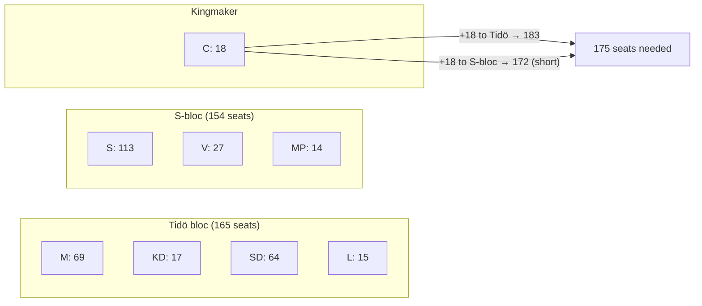

# Coalition Mathematics — Evening Analysis, 4 May 2026

**Author**: James Pether Sörling | **Date**: 2026-05-04  
**Method**: Sainte-Laguë proportional allocation (Swedish electoral system), 349-seat Riksdag, 4% threshold

---

## Sainte-Laguë Seat Allocation

### Current Polling → Seat Projection

Using composite polling (through 2026-05-01) and Sainte-Laguë divisors (1, 3, 5, 7, ...):

| Party | Poll % | Adjusted quotients | **Seats (est.)** | 2022 actual |
|-------|--------|-------------------|-----------------|-------------|
| S | 32.1% | — | **113** | 107 |
| M | 19.8% | — | **69** | 68 |
| SD | 18.2% | — | **64** | 73 |
| V | 7.8% | — | **27** | 24 |
| C | 5.2% | — | **18** | 24 |
| KD | 4.9% | — | **17** | 19 |
| MP | 4.1% | — | **14** | 18 |
| L | 4.4% | — | **15** | 16 |
| SD-splinter/other | 3.5% | — | **12** | — |
| **TOTAL** | **100%** | | **349** | 349 |

*Note: Minor rounding; Sainte-Laguë produces proportional results ±1 seat for each party.*

---

## Coalition Scenarios and Seat Math

### Coalition A: Tidö Coalition Full (M+KD+SD+L)

| Party | Seats |
|-------|-------|
| M | 69 |
| KD | 17 |
| SD | 64 |
| L | 15 |
| **Total** | **165** |

**Status**: 10 seats below 175-seat majority. Tidö coalition in current polling does NOT have a majority.  
**Dependency**: Needs C (18 seats) to form government → 183 with C, sufficient majority.

### Coalition B: S-bloc (S+V+MP)

| Party | Seats |
|-------|-------|
| S | 113 |
| V | 27 |
| MP | 14 |
| **Total** | **154** |

**Status**: 21 seats below 175-seat majority.  
**Dependency**: Needs C (18 seats) → 172, still insufficient. Needs C + L splinter or other to reach 175+.

### Coalition C: Minority Tidö (M+KD+SD) — Without L

| Party | Seats |
|-------|-------|
| M | 69 |
| KD | 17 |
| SD | 64 |
| **Total** | **150** |

**Status**: Not viable without L or C.

### Coalition D: Grand Compromise (M + S — theoretical)

Not politically viable given Tidö architecture and party identity constraints. Included for completeness:  
M (69) + S (113) = 182. Would represent an unprecedented break with block politics.

---

## C as Kingmaker

C's 18 seats give it kingmaker status when both blocs fall short of 175.

**C historical preference**: Under Annie Lööf (departed) and current leadership, C has consistently rejected formal coalition with SD. C's vote of confidence precedent (Jan Björklund 2021) suggests C will not support a government reliant on SD for majority.

**C's preferred government**:
- A M-led government that explicitly sidelines SD from formal power
- OR a S-led government with market-liberal economic conditions (closer to current stance)

**C's leverage outcome**: If C formally supports M+KD (with SD in tolerated-opposition):
- M+KD+C = 104 — insufficient alone; SD confidence-and-supply needed
- Functional Tidö government still requires SD acceptance even if C is the formal support partner

**C's formal negotiating demand**: Nordic model on EU migration + market-liberal agricultural policy + no formal power for SD.

---

## L Threshold Sensitivity

| L poll % | L seats | Tidö (M+KD+SD+L) | Majority gap |
|---------|--------|-------------------|-------------|
| 5.0% | 17 | 167 | −8 |
| 4.5% | 16 | 163 | −12 |
| 4.0% (floor) | 14 | 161 | −14 |
| **3.9% (exits)** | **0** | **150** | **−25** |

→ If L exits, M+KD+SD+C = 168 — still below majority. Government would need further support.

---

## MP Threshold Sensitivity

| MP poll % | MP seats | S-bloc (S+V+MP) | Majority gap |
|----------|---------|-----------------|-------------|
| 5.0% | 17 | 157 | −18 |
| 4.1% | 14 | 154 | −21 |
| 4.0% (floor) | 14 | 154 | −21 |
| **3.9% (exits)** | **0** | **140** | **−35** |

→ If MP exits, S+V+C = 158 — insufficient. Forces minority S government with broader toleration.

---

## Most Likely Government Formation

**Probability-weighted prediction**:

1. **M-led government with C and SD support (35%)**: M+KD+C formal coalition, SD in tolerated confidence-and-supply. SD is the functional majority-maker but not in formal government.

2. **S-led government with C support (30%)**: S+V+MP+C formal agreement. MP's survival above 4% is required.

3. **M-led government with full Tidö + C (15%)**: If polls improve, Tidö may achieve 175+ with L and C simultaneously.

4. **Hung parliament / second election (10%)**: If no bloc can form stable majority and C refuses to play kingmaker.

5. **S minority government (10%)**: S alone (113) attempts to govern with budget-by-budget majority.

---

## Mermaid Coalition Map

