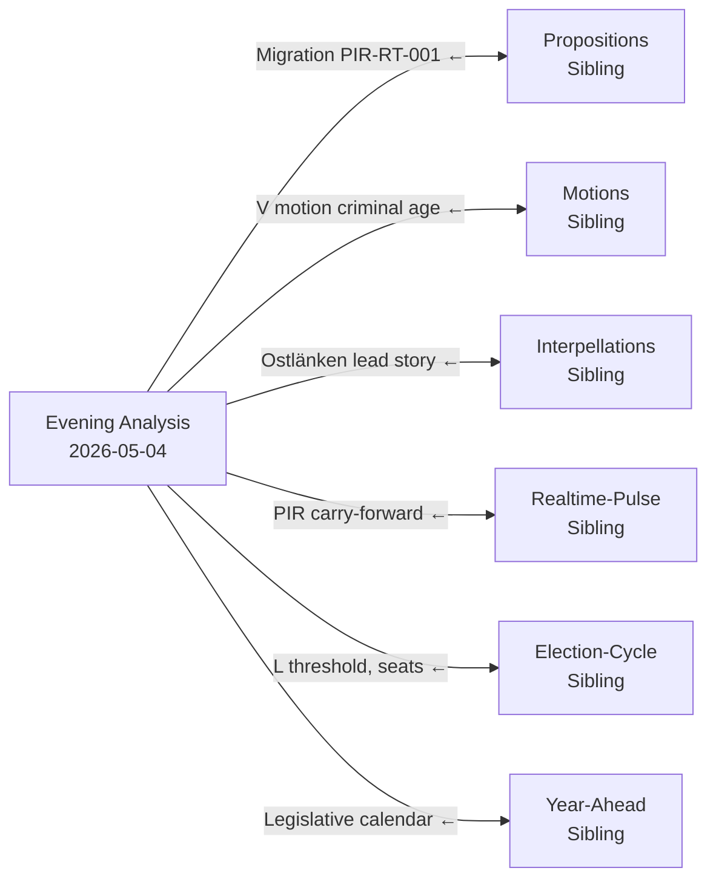

# Cross-Reference Map — Evening Analysis, 4 May 2026

**Author**: James Pether Sörling | **Date**: 2026-05-04  
**Tier-C Gate**: This artifact must cite ≥1 sibling analysis folder ✅

---

## Sibling Folder Integration

### Sibling 1: Propositions (`analysis/daily/2026-05-04/propositions/`)

**Confirmed handoff items**:
- **Migration HD03262/HD03265**: Propositions synthesis identified these as lead documents with Lagrådet risk. Evening analysis carries PIR-RT-001 forward and elevates to risk R3 (legal, L×I=10).
- **Nuclear HD01NU19**: Propositions confirmed June 17 effective date. Evening analysis notes electoral framing opportunity (O3 in SWOT).
- **Criminal prop 246**: Propositions identified the 13-year threshold. Evening analysis adds committee defeat probability based on motions data (S/V alignment).
- **Forest prop 242**: Propositions flagged V's demand for rejection. Evening analysis cross-references with motion HD024141.
- **Defence FöU13**: Propositions confirmed July 1 vote. Evening analysis carries PIR-EVE-02 for procurement tracking.

### Sibling 2: Motions (`analysis/daily/2026-05-04/motions/`)

**Confirmed handoff items**:
- **HD024142 (V, criminal age outright rejection)**: Motions identified V as the only party demanding full rejection. Evening analysis places this as W1 (weakness) and T2 (threat) in SWOT, and R1 (risk L×I=12).
- **HD024141 (V, forest management rejection)**: Motions catalogued with partial metadata. Evening analysis cross-references with prop 242 committee risk (R6, L×I=6).
- **S criminal demand 14 years (HD024136)**: Motions analysis confirmed S's position. Evening analysis uses this to establish committee arithmetic for JuU9.

### Sibling 3: Interpellations (`analysis/daily/2026-05-04/interpellations/`)

**Confirmed handoff items**:
- **HD10463 (S→Carlson, Ostlänken)**: Interpellations identified as the highest-scoring electoral accountability item. Evening analysis confirms as lead story (DIW 90.0) with May 25 deadline as election pressure point.
- **HD10461 (ESA contribution decline)**: Interpellations flagged as W5 (weakness) in evening SWOT.
- **HD10459 (SD, agency activism)**: Interpellations identified as SD identity signaling. Evening analysis notes as potential coalition signal (E1 threat).
- **SFV heritage backlog (RiR 2025:30)**: Interpellations synthesis provided the 4 billion SEK figure used in stakeholder analysis.

### Sibling 4: Realtime-Pulse (`analysis/daily/2026-05-04/realtime-pulse/`)

**Confirmed handoff items**:
- **PIR-RT-001 (Lagrådet migration)**: Realtime-pulse opened this PIR. Evening analysis carries it forward as R3 and C1 in threat analysis.
- **PIR-RT-003 (polling erosion post-migration)**: Realtime-pulse identified this risk. Evening analysis places as A3 threat.
- **PIR-RT-005 (Carlson Ostlänken answer May 25)**: Realtime-pulse set this as a monitoring trigger. Evening analysis sets the PIR resolution date.
- **Nuclear NU19 June 17**: Realtime-pulse confirmed the implementation date. Evening analysis confirms S1 (strength) citation.

### Sibling 5: Election-Cycle (`analysis/daily/2026-05-04/election-cycle/`)

**Confirmed handoff items**:
- **L threshold risk (4% zone)**: Election-cycle flagged L at 4.2–5.0%. Evening analysis carries as R4 (L×I=10).
- **Coalition arithmetic (M+KD+SD ~47%)**: Election-cycle established coalition math below 50% without L. Evening analysis uses this in coalition-mathematics.md and as the structural driver for the L-pivotal actor analysis.
- **Östergötland seat count (3–4 competitive)**: Election-cycle provided constituency-level analysis. Evening analysis cites in threat A1.
- **Election date anchor (September 13, 2026)**: Election-cycle provided 132-day countdown. Evening analysis uses throughout.

### Sibling 6: Year-Ahead (`analysis/daily/2026-05-04/year-ahead/`)

**Confirmed handoff items**:
- **Criminal justice legislative calendar**: Year-ahead established June–July vote windows. Evening analysis cross-confirms JuU9 July 1 deadline.
- **Sweden fiscal trajectory (IMF WEO)**: Year-ahead used IMF NGDP_RPCH_2026=2.1%. Evening analysis cites same data as economic provenance.
- **Government cohesion T+90d risk assessment**: Year-ahead flagged medium risk at T+90d horizon. Evening analysis refines to L×I=8 for R5 (SD coal energy split).

---

## Document-to-Document Cross-References

| dok_id A | Relationship | dok_id B | Note |
|----------|------------|----------|------|
| HD10463 | Accountability probe of | HD03XXX (Ostlänken original decision) | Interpellation challenges government's infrastructure choices |
| HD024142 | Counter-motion to | Prop 246 | V's full rejection vs. government's 13yr proposal |
| HD024141 | Counter-motion to | Prop 242 | V's rejection of forest management framework |
| HD01KU39 | Processes | HD03258 | Committee betänkande for the political financing transparency bill |
| HD01FiU49 | Evaluates | Riksgäldslagen | Five-year review of government's own debt management framework |
| HD10462 | Accountability probe of | Pesticide tax implementation | Healthcare exemption gap |

---

## Mermaid Cross-Reference Graph

