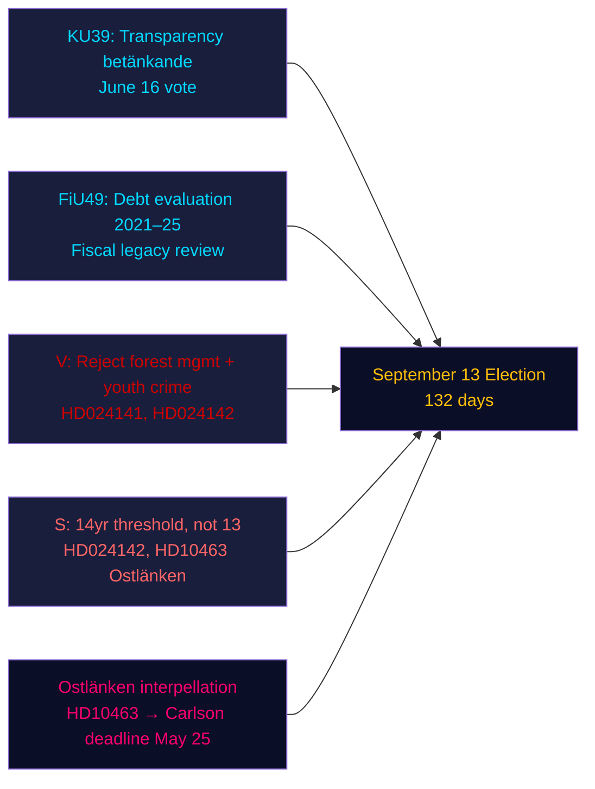

# Executive Brief — Evening Analysis, 4 May 2026

**Author**: James Pether Sörling | **Confidence**: HIGH [Admiralty B2] | **Days to Election**: 132  
**IMF Provenance**: WEO Apr-2026 | NGDP_RPCH_2026: 2.1% | GGXWDG_NGDP: ~34% | retrieved: 2026-05-04

---

## BLUF

Sweden's Riksdag on 4 May 2026 — 132 days before the September 13 election — entered an accelerated legislative closure phase: the constitutional committee (KU) registered betänkande KU39 on political process transparency for a June 16 vote, while the finance committee (FiU) registered FiU49 evaluating five years of Riksgälden debt management. Opposition parties filed nine new motions against government propositions on forest management and youth crime, and Social Democrat Eva Lindh sharpened the Ostlänken accountability attack on KD Infrastructure Minister Carlson. The dominant intelligence signal: the government is locking in its legislative legacy while the opposition is building a targeted pre-election attack portfolio — and both are operating on a compressed 132-day timeline.

---

## Three Decisions Supported by This Brief

1. **Legislative calendar assessment**: KU39 debate on June 16 confirms the government can pass the transparency bill HD03258 before the summer recess — a pre-election governance win for the coalition.
2. **Opposition coordination assessment**: The nine MJU/JuU motions filed today represent a coordinated party response — V with maximum rejection demands, S with conditional acceptance, other parties with targeted amendments — revealing the legislative arithmetic before committee hearings.
3. **Infrastructure vulnerability**: The Ostlänken interpellation (HD10463) has activated a regional accountability crisis in Östergötland — a high-density marginal-seat constituency — that will remain live through the May 25 ministerial deadline for Carlson's answer.

---

## 60-Second Read

- **KU39 transparency** (June 16 vote): Government's HD03258 political financing disclosure bill on track — implications for all parties' funding transparency before the election.
- **FiU49 debt evaluation**: Five-year Riksgälden performance review registered; Sweden's public debt (~34% of GDP, EU minimum) contextualises any fiscal policy debate.
- **Nine new motions**: Forest management (prop 242, five MJU motions) and youth crime (prop 246, three JuU motions) face coordinated opposition challenges. V demands rejection outright; S demands the 14-year criminal age threshold not 13.
- **Ostlänken interpellation (HD10463)**: S's Eva Lindh targets KD minister Carlson on the cancelled Linköping station — affecting a 500,000-person labour market and generating regional heat in four marginal seats.
- **Pesticide tax interpellation (HD10462)**: S's Monica Haider targets Finance Minister Svantesson on healthcare disinfectant taxation — low general salience but high relevance to healthcare unions.

---

## Top Forward Trigger

**KU39 committee hearing (May 26–June 4)**: The transparency bill KU39 enters committee deliberation on May 26. If any party attempts to amend HD03258 to cover digital political advertising (currently excluded from the proposal), a coalition conflict could emerge between L (pro-digital transparency) and SD (resistant to advertising disclosure rules). Watch for committee majority protocol.

---

## Confidence Assessment

| Domain | Confidence | Basis |
|--------|-----------|-------|
| Legislative calendar (KU39/FiU49) | HIGH [A2] | Direct betänkande metadata, committee calendar |
| Opposition motion content | HIGH [B2] | Full-text retrieval of HD024142; partial summaries of others |
| Electoral significance | MEDIUM [B3] | Coalition arithmetic from sibling analyses |
| Economic context | MEDIUM [A3] | IMF WEO Apr-2026 (cached from sibling analyses) |

---

## Mermaid Overview

