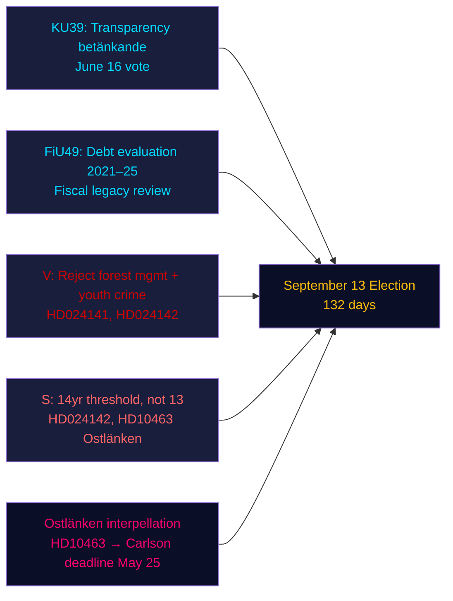

&#x200F;# ملخص تنفيذي — تحليل المساء، 4 مايو 2026

**المؤلف**: James Pether Sörling | **مستوى الثقة**: عالٍ [Admiralty B2] | **أيام حتى الانتخابات**: 132  
**مصدر بيانات صندوق النقد الدولي**: WEO أبريل 2026 | NGDP_RPCH_2026: 2.1% | GGXWDG_NGDP: ~34% | تاريخ الاسترداد: 2026-05-04

---

## الخلاصة التنفيذية

دخل البرلمان السويدي (الريكسداغ) في 4 مايو 2026 — قبل 132 يومًا من انتخابات 13 سبتمبر — مرحلة إغلاق تشريعية متسارعة: سجّلت لجنة الشؤون الدستورية (KU) التقرير KU39 حول شفافية العملية السياسية تمهيدًا لتصويت في 16 يونيو، فيما سجّلت لجنة المالية (FiU) تقرير FiU49 لتقييم خمس سنوات من إدارة الديون في مكتب إدارة الديون الوطني (Riksgälden). قدّمت أحزاب المعارضة تسعة اقتراحات جديدة ضد مشاريع قوانين الحكومة بشأن إدارة الغابات وجرائم الشباب، وشدّدت الاشتراكية الديمقراطية إيفا ليندح الهجوم على وزير البنية التحتية الكريستي ديموكراتي كارلسون بشأن خط أوستلانكن. الإشارة الاستخباراتية المهيمنة: الحكومة تُحكم إرثها التشريعي بينما تبني المعارضة محفظة هجمات مستهدفة لما قبل الانتخابات — وكلاهما يعمل في إطار زمني مكثّف يمتد 132 يومًا.

---

## ثلاثة قرارات يدعمها هذا الملخص

1. **تقييم الجدول الزمني التشريعي**: تؤكد مناقشة KU39 في 16 يونيو أن الحكومة قادرة على إقرار قانون الشفافية HD03258 قبل عطلة الصيف — انتصار حوكمة للائتلاف قبيل الانتخابات.
2. **تقييم تنسيق المعارضة**: تسعة اقتراحات MJU/JuU المقدمة اليوم تمثل استجابة حزبية منسقة — V مع مطالب الرفض الكامل، S مع القبول المشروط، أحزاب أخرى مع تعديلات مستهدفة — تكشف عن الحسابات التشريعية قبل جلسات اللجان.
3. **هشاشة البنية التحتية**: أطلقت استجواب أوستلانكن (HD10463) أزمة مساءلة إقليمية في أوستيريوتلاند — دائرة انتخابية ذات كثافة عالية من المقاعد الهامشية — ستبقى قائمة حتى الموعد النهائي لرد وزير KD كارلسون في 25 مايو.

---

## قراءة في 60 ثانية

- **شفافية KU39** (تصويت 16 يونيو): مشروع قانون HD03258 الحكومي لكشف التمويل السياسي على المسار الصحيح — آثار على شفافية تمويل جميع الأحزاب قبيل الانتخابات.
- **تقييم ديون FiU49**: تسجيل تقييم خماسي لأداء Riksgälden؛ الدين العام السويدي (~34% من الناتج المحلي الإجمالي، الحد الأدنى في الاتحاد الأوروبي) يُضع أي نقاش في السياسة المالية في سياقه.
- **تسعة اقتراحات جديدة**: إدارة الغابات (prop 242، خمسة اقتراحات MJU) وجرائم الشباب (prop 246، ثلاثة اقتراحات JuU) تواجه تحديات معارضة منسقة. V تطالب بالرفض الكامل؛ S تطالب بحد سن المسؤولية الجنائية 14 عامًا وليس 13.
- **استجواب أوستلانكن (HD10463)**: تستهدف إيفا ليندح من S الوزير KD كارلسون بشأن محطة لينشوبينغ الملغاة — تؤثر على سوق عمل يضم 500,000 شخص وتولّد حرارة إقليمية في أربعة مقاعد هامشية.
- **استجواب ضريبة المبيدات (HD10462)**: تستهدف مونيكا هايدر من S وزير المالية سفانتسون بشأن ضريبة مواد تعقيم الرعاية الصحية — أهمية عامة منخفضة لكن أهمية عالية لنقابات الرعاية الصحية.

---

## المحفز الأبرز على المدى المنظور

**سماع لجنة KU39 (26 مايو–4 يونيو)**: يدخل قانون الشفافية KU39 في مداولات اللجنة في 26 مايو. إذا حاول أي حزب تعديل HD03258 لتغطية الإعلان السياسي الرقمي (المستبعد حاليًا من المقترح)، قد ينشأ خلاف ائتلافي بين L (المؤيد للشفافية الرقمية) وSD (المعارض لقواعد الإفصاح الإعلاني). مراقبة بروتوكول أغلبية اللجنة.

---

## تحليل مستوى الثقة

| المجال | مستوى الثقة | الأساس |
|--------|-----------|-------|
| الجدول الزمني التشريعي (KU39/FiU49) | عالٍ [A2] | بيانات التقرير المباشرة، تقويم اللجنة |
| محتوى اقتراحات المعارضة | عالٍ [B2] | استرداد النص الكامل لـ HD024142؛ ملخصات جزئية للأخرى |
| الأهمية الانتخابية | متوسط [B3] | حسابات الائتلاف من التحليلات الشقيقة |
| السياق الاقتصادي | متوسط [A3] | IMF WEO أبريل 2026 (مخزّن من التحليلات الشقيقة) |

---

## نظرة عامة Mermaid

<!-- source-sha: 5d8da0c335b7b753c6fbbb72731875bcfd25910e -->
