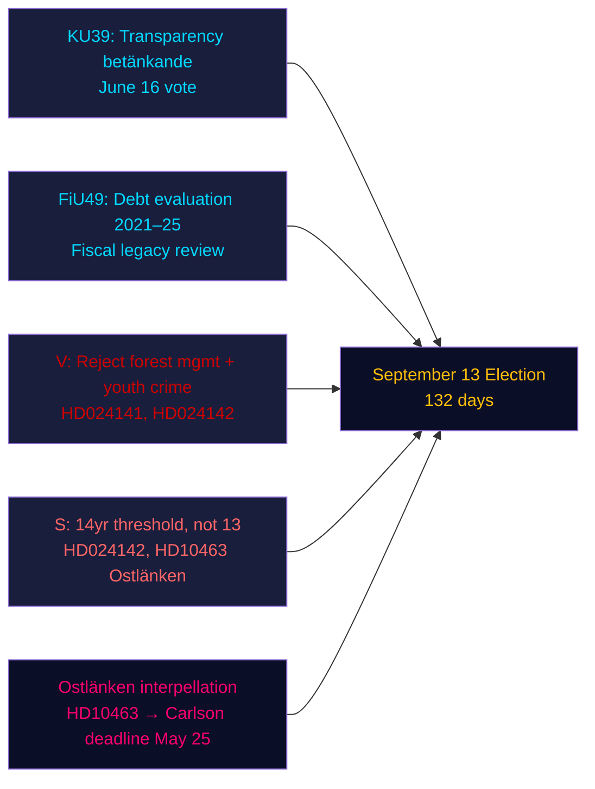

# Resumé — Aftenanalyse, 4. maj 2026

**Forfatter**: James Pether Sörling | **Konfidens**: HØJ [Admiralty B2] | **Dage til valget**: 132  
**IMF-provenienz**: WEO apr-2026 | NGDP_RPCH_2026: 2,1 % | GGXWDG_NGDP: ~34 % | hentet: 2026-05-04

---

## KONKLUSION

Sveriges Riksdag den 4. maj 2026 — 132 dage før valget den 13. september — gik ind i en accelereret lovgivningsafslutningsfase: det konstitutionelle udvalg (KU) registrerede betænkning KU39 om transparens i den politiske proces inden en afstemning den 16. juni, mens finansudvalget (FiU) registrerede FiU49 med evaluering af fem år af Riksgäldens gældsforvaltning. Oppositionspartier indgav ni nye forslag til oppositionsbeslutninger mod regeringspropositioner om skovforvaltning og ungdomskriminalitet, og socialdemokraten Eva Lindh skærpede Ostlänken-ansvarsangrebet på KD's infrastrukturminister Carlson. Det dominerende efterretningssignal: regeringen låser sit lovgivningsmæssige arvegods, mens oppositionen opbygger en målrettet valgkampsattackportefølje — og begge opererer inden for en komprimeret tidslinje på 132 dage.

---

## Tre beslutninger dette resumé støtter

1. **Vurdering af lovgivningskalender**: KU39-debatten den 16. juni bekræfter, at regeringen kan vedtage transparensloven HD03258 inden sommerpausen — en styringsmæssig sejr for koalitionen før valget.
2. **Vurdering af oppositionskoordinering**: De ni MJU/JuU-forslag indgivet i dag repræsenterer et koordineret partisvar — V med maksimale afvisningskrav, S med betinget accept, andre partier med målrettede ændringsforslag — som afslører den lovgivningsmæssige aritmetik inden udvalgets høringer.
3. **Infrastrukturel sårbarhed**: Ostlänken-interpellationen (HD10463) har aktiveret en regional ansvarslighedskrise i Østergötland — et tæt på marginalt valgdistrikt — som vil forblive aktiv frem til KD's infrastrukturminister Carlsons svarfrist den 25. maj.

---

## 60-sekunders læsning

- **KU39-transparens** (afstemning 16. juni): Regeringens HD03258-forslag om politisk finansieringstransparens er på rette spor — konsekvenser for alle partiers finansieringsgennemsigtighed inden valget.
- **FiU49-gældevaluering**: Femårsevaluering af Riksgäldens drift registreret; Sveriges offentlige gæld (~34 % af BNP, EU's minimum) kontekstualiserer enhver finanspolitisk debat.
- **Ni nye forslag**: Skovforvaltning (prop 242, fem MJU-forslag) og ungdomskriminalitet (prop 246, tre JuU-forslag) møder koordinerede oppositionsudfordringer. V kræver afvisning; S kræver 14-årsgrænsen, ikke 13.
- **Ostlänken-interpellation (HD10463)**: S's Eva Lindh retter sig mod KD-minister Carlson om den aflyste Linköping-station — berører et arbejdsmarked på 500.000 personer og skaber regional varme i fire marginale valgkredse.
- **Pesticidskat-interpellation (HD10462)**: S's Monica Haider retter sig mod finansminister Svantesson om beskatning af sundhedsdesinfektionsmidler — lav generel relevans men høj relevans for sundhedsfagforeninger.

---

## Vigtigste fremadrettede udløser

**KU39-udvalgets høring (26. maj–4. juni)**: Transparensloven KU39 indleder udvalgsbehandling den 26. maj. Hvis et parti forsøger at ændre HD03258 til at dække digital politisk reklame (i øjeblikket undtaget fra forslaget), kan en koalitionskonflikt opstå mellem L (pro digital transparens) og SD (modstand mod reklameoplysniskrav). Hold øje med udvalgets flertalprotokol.

---

## Konfidensanalyse

| Domæne | Konfidens | Grundlag |
|--------|-----------|-------|
| Lovgivningskalender (KU39/FiU49) | HØJ [A2] | Direkte betænkningsmetadata, udvalgskalender |
| Oppositionsforslagsindhold | HØJ [B2] | Fuldtekst-hentning af HD024142; delsammenfattninger af øvrige |
| Valgmæssig betydning | MIDDEL [B3] | Koalitionsaritmetik fra søsteranalyser |
| Økonomisk kontekst | MIDDEL [A3] | IMF WEO apr-2026 (cachet fra søsteranalyser) |

---

## Mermaid-oversigt

<!-- source-sha: 5d8da0c335b7b753c6fbbb72731875bcfd25910e -->
