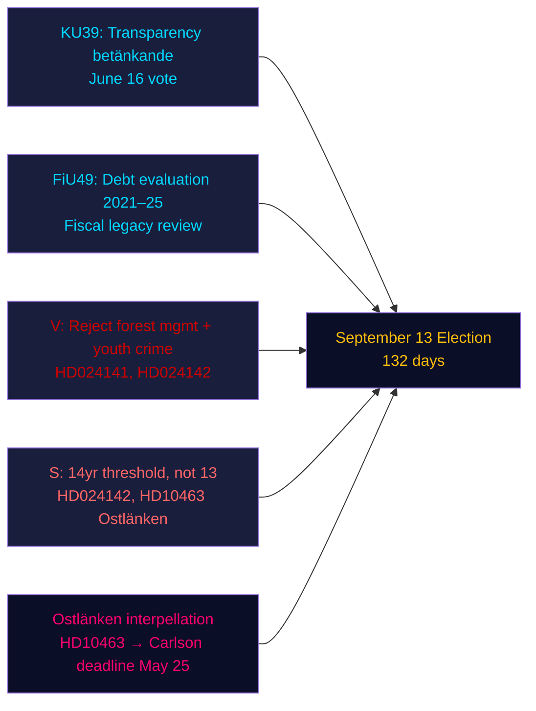

# Zusammenfassung — Abendanalyse, 4. Mai 2026

**Autor**: James Pether Sörling | **Konfidenz**: HOCH [Admiralty B2] | **Tage bis zur Wahl**: 132  
**IWF-Provenienz**: WEO Apr-2026 | NGDP_RPCH_2026: 2,1 % | GGXWDG_NGDP: ~34 % | abgerufen: 2026-05-04

---

## KERNAUSSAGE

Schwedens Riksdag am 4. Mai 2026 — 132 Tage vor der Wahl am 13. September — trat in eine beschleunigte Gesetzgebungsabschlussphase ein: Der Verfassungsausschuss (KU) registrierte das Gutachten KU39 zur Transparenz im politischen Prozess für eine Abstimmung am 16. Juni, während der Finanzausschuss (FiU) FiU49 registrierte, das fünf Jahre Riksgälden-Schuldenmanagement bewertet. Oppositionsparteien reichten neun neue Anträge gegen Regierungspropositionn zur Forstwirtschaft und Jugendkriminalität ein, und die Sozialdemokratin Eva Lindh verschärfte den Ostlänken-Verantwortlichkeitsangriff auf KD-Infrastrukturminister Carlson. Das dominierende Geheimdienstsignal: Die Regierung sichert ihr legislatives Erbe, während die Opposition ein gezieltes Vorwahlangriffs-Portfolio aufbaut — und beide agieren auf einer komprimierten 132-Tage-Zeitlinie.

---

## Drei durch diesen Bericht unterstützte Entscheidungen

1. **Bewertung des Gesetzgebungskalenders**: Die KU39-Debatte am 16. Juni bestätigt, dass die Regierung das Transparenzgesetz HD03258 vor der Sommerpause verabschieden kann — ein Regierungserfolg für die Koalition vor der Wahl.
2. **Bewertung der Oppositionskoordinierung**: Die heute eingereichten neun MJU/JuU-Anträge repräsentieren eine koordinierte Parteireaktion — V mit maximalen Ablehnungsforderungen, S mit bedingter Zustimmung, andere Parteien mit gezielten Änderungsanträgen — und enthüllen die legislarische Arithmetik vor den Ausschussanhörungen.
3. **Infrastrukturelle Verwundbarkeit**: Die Ostlänken-Interpellation (HD10463) hat eine regionale Verantwortlichkeitskrise in Östergötland ausgelöst — ein Wahlkreis mit hoher Marginalmandat-Dichte — die bis zum Antworttermin von KD-Minister Carlson am 25. Mai aktiv bleibt.

---

## 60-Sekunden-Lektüre

- **KU39-Transparenz** (Abstimmung 16. Juni): Regierungsvorschlag HD03258 zur Offenlegung der Parteienfinanzierung auf Kurs — Auswirkungen auf die Finanzierungstransparenz aller Parteien vor der Wahl.
- **FiU49-Schuldenauswertung**: Fünfjahresbewertung des Riksgälden-Betriebs registriert; Schwedens Staatsverschuldung (~34 % des BIP, EU-Minimum) kontextualisiert jede haushaltspolitische Debatte.
- **Neun neue Anträge**: Forstwirtschaft (Prop. 242, fünf MJU-Anträge) und Jugendkriminalität (Prop. 246, drei JuU-Anträge) stoßen auf koordinierte Oppositionsherausforderungen. V fordert vollständige Ablehnung; S fordert die 14-Jahres-Strafverfolgungsgrenze, nicht 13.
- **Ostlänken-Interpellation (HD10463)**: S's Eva Lindh zielt auf KD-Minister Carlson wegen der abgesagten Linköping-Station — betrifft einen Arbeitsmarkt mit 500.000 Einwohnern und erzeugt regionale Spannung in vier Randwahlkreisen.
- **Pestizid-Steuer-Interpellation (HD10462)**: S's Monica Haider zielt auf Finanzminister Svantesson wegen der Besteuerung von medizinischen Desinfektionsmitteln — geringe allgemeine Relevanz, aber hohe Relevanz für Gewerkschaften im Gesundheitswesen.

---

## Wichtigster vorausschauender Auslöser

**KU39-Ausschussanhörung (26. Mai–4. Juni)**: Das Transparenzgesetz KU39 tritt am 26. Mai in die Ausschussbehandlung ein. Wenn eine Partei versucht, HD03258 auf digitale politische Werbung auszuweiten (derzeit aus dem Vorschlag ausgeschlossen), könnte ein Koalitionskonflikt zwischen L (für digitale Transparenz) und SD (gegen Werbetransparenzanforderungen) entstehen. Ausschuss-Mehrheitsprotokoll beobachten.

---

## Konfidenzanalyse

| Bereich | Konfidenz | Grundlage |
|--------|-----------|-------|
| Gesetzgebungskalender (KU39/FiU49) | HOCH [A2] | Direkte Gutachtenmetadaten, Ausschusskalender |
| Oppositionsantragsinhalte | HOCH [B2] | Volltext-Abruf von HD024142; Teilzusammenfassungen der anderen |
| Wahlpolitische Bedeutung | MITTEL [B3] | Koalitionsarithmetik aus Schwesteranalysen |
| Wirtschaftlicher Kontext | MITTEL [A3] | IWF WEO Apr-2026 (aus Schwesteranalysen gecacht) |

---

## Mermaid-Übersicht

<!-- source-sha: 5d8da0c335b7b753c6fbbb72731875bcfd25910e -->
