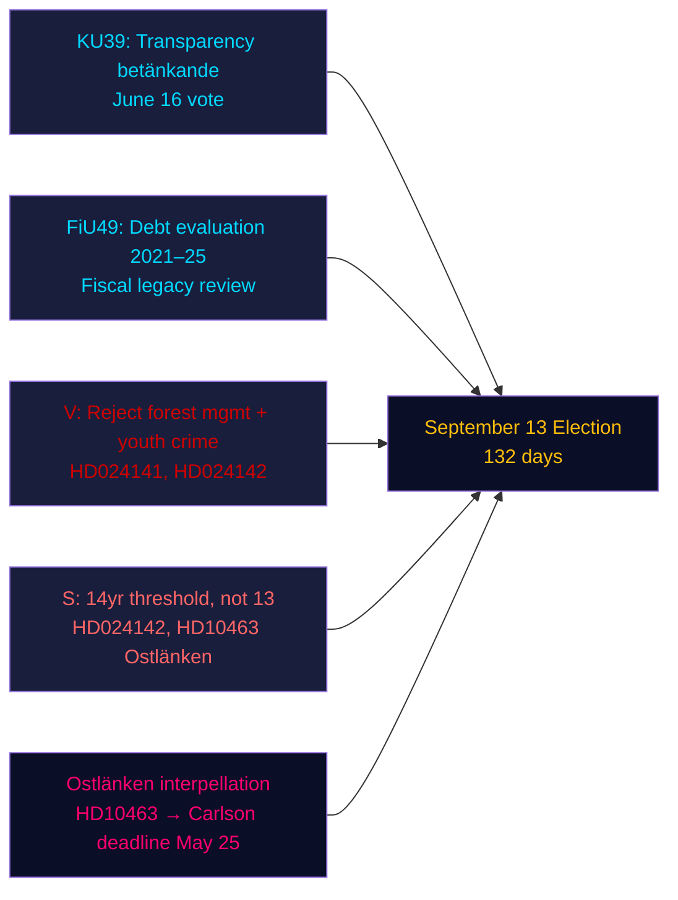

# Resumen Ejecutivo — Análisis de la Tarde, 4 de mayo de 2026

**Autor**: James Pether Sörling | **Confianza**: ALTA [Admiralty B2] | **Días para las elecciones**: 132  
**Proveniencia FMI**: WEO abr-2026 | NGDP_RPCH_2026: 2,1 % | GGXWDG_NGDP: ~34 % | obtenido: 2026-05-04

---

## CONCLUSIÓN CLAVE

El Riksdag sueco el 4 de mayo de 2026 — 132 días antes de las elecciones del 13 de septiembre — entró en una fase acelerada de cierre legislativo: la comisión constitucional (KU) registró el dictamen KU39 sobre transparencia del proceso político para una votación el 16 de junio, mientras que la comisión de finanzas (FiU) registró FiU49 que evalúa cinco años de gestión de la deuda del Riksgälden. Los partidos de oposición presentaron nueve nuevas mociones contra las proposiciones del gobierno sobre gestión forestal y delincuencia juvenil, y la socialdemócrata Eva Lindh intensificó el ataque de responsabilidad sobre Ostlänken contra el ministro de Infraestructuras del KD, Carlson. La señal de inteligencia dominante: el gobierno está consolidando su legado legislativo mientras la oposición construye un portafolio de ataques preelectorales dirigidos — y ambos operan en una línea temporal comprimida de 132 días.

---

## Tres decisiones que apoya este resumen

1. **Evaluación del calendario legislativo**: El debate sobre KU39 el 16 de junio confirma que el gobierno puede aprobar el proyecto de ley de transparencia HD03258 antes del receso veraniego — una victoria de gobernanza para la coalición antes de las elecciones.
2. **Evaluación de la coordinación de la oposición**: Las nueve mociones MJU/JuU presentadas hoy representan una respuesta partidaria coordinada — V con demandas de rechazo máximo, S con aceptación condicional, otros partidos con enmiendas específicas — revelando la aritmética legislativa antes de las audiencias de comisión.
3. **Vulnerabilidad de infraestructura**: La interpelación de Ostlänken (HD10463) ha activado una crisis de responsabilidad regional en Östergötland — una circunscripción con alta densidad de escaños marginales — que permanecerá vigente hasta el plazo de respuesta del ministro KD Carlson el 25 de mayo.

---

## Lectura de 60 segundos

- **Transparencia KU39** (votación 16 de junio): El proyecto de ley HD03258 del gobierno sobre divulgación de financiación política está en camino — implicaciones para la transparencia de financiación de todos los partidos antes de las elecciones.
- **Evaluación de deuda FiU49**: Evaluación quinquenal del funcionamiento del Riksgälden registrada; la deuda pública sueca (~34 % del PIB, mínimo de la UE) contextualiza cualquier debate de política fiscal.
- **Nueve nuevas mociones**: Gestión forestal (prop 242, cinco mociones MJU) y delincuencia juvenil (prop 246, tres mociones JuU) enfrentan desafíos coordinados de la oposición. V exige rechazo total; S exige el umbral de edad penal de 14 años, no 13.
- **Interpelación Ostlänken (HD10463)**: Eva Lindh del S apunta al ministro KD Carlson por la estación de Linköping cancelada — afecta un mercado laboral de 500.000 personas y genera calor regional en cuatro escaños marginales.
- **Interpelación sobre impuesto a pesticidas (HD10462)**: Monica Haider del S apunta al ministro de Finanzas Svantesson sobre la tributación de desinfectantes médicos — baja relevancia general pero alta relevancia para los sindicatos de salud.

---

## Principal desencadenante prospectivo

**Audiencia de la comisión KU39 (26 de mayo–4 de junio)**: El proyecto de ley de transparencia KU39 entra en deliberación en comisión el 26 de mayo. Si algún partido intenta enmendar HD03258 para cubrir la publicidad política digital (actualmente excluida de la propuesta), podría surgir un conflicto de coalición entre L (a favor de la transparencia digital) y SD (reticente a las reglas de divulgación publicitaria). Vigilar el protocolo de mayoría de la comisión.

---

## Análisis de confianza

| Dominio | Confianza | Base |
|--------|-----------|-------|
| Calendario legislativo (KU39/FiU49) | ALTA [A2] | Metadatos directos del dictamen, calendario de comisión |
| Contenido de mociones de oposición | ALTA [B2] | Recuperación del texto completo de HD024142; resúmenes parciales de los demás |
| Significado electoral | MEDIA [B3] | Aritmética de coalición de análisis hermanos |
| Contexto económico | MEDIA [A3] | FMI WEO abr-2026 (en caché de análisis hermanos) |

---

## Visión general Mermaid

<!-- source-sha: 5d8da0c335b7b753c6fbbb72731875bcfd25910e -->
