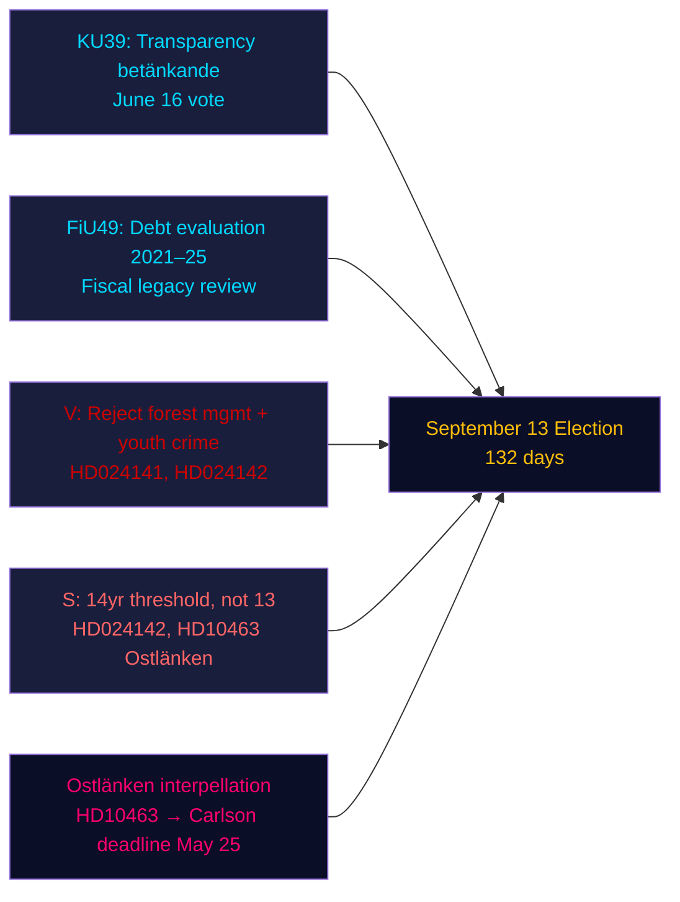

# Tiivistelmä — Iltaanalyysi, 4. toukokuuta 2026

**Tekijä**: James Pether Sörling | **Luotettavuus**: KORKEA [Admiralty B2] | **Päiviä vaaleihin**: 132  
**IMF-provenanssi**: WEO huhti-2026 | NGDP_RPCH_2026: 2,1 % | GGXWDG_NGDP: ~34 % | haettu: 2026-05-04

---

## TIIVISTELMÄ

Ruotsin riksdag 4. toukokuuta 2026 — 132 päivää ennen 13. syyskuuta pidettäviä vaaleja — siirtyi kiihdytettyyn lainsäädännön päätösvaiheeseen: perustuslakivaliokunta (KU) rekisteröi mietinnön KU39 poliittisen prosessin avoimuudesta 16. kesäkuuta pidettävää äänestystä varten, kun taas valtiovarainvaliokunta (FiU) rekisteröi FiU49:n, joka arvioi Riksgäldenin viiden vuoden velkahallintaa. Oppositiopuolueet jättivät yhdeksän uutta motioita hallituksen metsänhoito- ja nuorisorikollisuuspropositioita vastaan, ja sosiaalidemokraatti Eva Lindh terävöitti Ostlänken-vastuuhyökkäystä KD:n infrastruktuuriministeri Carlsonia vastaan. Hallitseva tiedustelusignaali: hallitus lukitsee lainsäädäntöperintönsä samalla kun oppositio rakentaa kohdennettua ennakkovaalikampanjahyökkäysportfoliota — molemmat toimivat tiivistetyn 132 päivän aikajanalla.

---

## Kolme päätöstä, joita tämä tietopaketti tukee

1. **Lainsäädäntökalenterin arviointi**: KU39-debatti 16. kesäkuuta vahvistaa, että hallitus voi saada läpi avoimuuslain HD03258 ennen kesälomaa — koalitioon ennakkovaalivaltiotaito.
2. **Opposition koordinoinnin arviointi**: Tänään jätetyt yhdeksän MJU/JuU-motiota edustavat koordinoitua puoluereaktiota — V maksimaalisia hylkäysvaatimuksia, S ehdollinen hyväksyntä, muut puolueet kohdennetut muutosehdotukset — paljastaa lainsäädäntöaritmetiikan ennen valiokuntakuulemisia.
3. **Infrastruktuurihaavoittuvuus**: Ostlänken-interpellaatio (HD10463) on aktivoinut alueellisen vastuukriisin Östergötlandissa — korkea marginaalipaikkavaalipiirimäärä — joka pysyy aktiivisena KD:n infrastruktuuriministeri Carlsonin vastauksen määräaikaan 25. toukokuuta asti.

---

## 60 sekunnin lukeminen

- **KU39-avoimuus** (äänestys 16. kesäkuuta): Hallituksen HD03258-ehdotus puoluerahoituksen avoimuudesta on oikealla tiellä — kaikkien puolueiden rahoituksen avoimuuteen vaikuttaminen ennen vaaleja.
- **FiU49-velka-arviointi**: Riksgäldenin viisivuotinen toiminnan arviointi rekisteröity; Ruotsin julkinen velka (~34 % BKT:sta, EU:n vähimmäismäärä) kontekstualisoi kaikki finanssipoliittiset väittelyt.
- **Yhdeksän uutta motiota**: Metsänhoito (prop 242, viisi MJU-motiota) ja nuorisorikollisuus (prop 246, kolme JuU-motiota) kohtaavat koordinoituja oppositiohaasteita. V vaatii hylkäämistä; S vaatii 14 vuoden ikärajaa, ei 13.
- **Ostlänken-interpellaatio (HD10463)**: S:n Eva Lindh kohdistuu KD:n ministeriin Carlsoniin peruutetusta Linköpingin asemasta — vaikuttaa 500 000 hengen työmarkkina-alueeseen ja synnyttää alueellista kuumuutta neljässä marginaalivaalipiirisessä.
- **Torjunta-ainesverotusinterpellaatio (HD10462)**: S:n Monica Haider kohdistuu valtiovarainministeri Svantessoniin terveydenhuollon desinfiointiaineverotuksesta — alhainen yleinen merkitys, mutta korkea relevanssi terveydenhuoltoliitoille.

---

## Tärkein ennakoiva laukaisin

**KU39-valiokunnan kuuleminen (26. toukokuuta–4. kesäkuuta)**: Avoimuuslaki KU39 siirtyy valiokuntakäsittelyyn 26. toukokuuta. Jos jokin puolue yrittää muuttaa HD03258:aa kattamaan digitaalinen poliittinen mainonta (tällä hetkellä ehdotuksen ulkopuolella), voi L (digitaalisen avoimuuden puolesta) ja SD (vastustavat mainontailmoitusvaatimuksia) välille syntyä koalitioristiriita. Seuraa valiokunnan enemmistöpöytäkirjaa.

---

## Luotettavuusanalyysi

| Alue | Luotettavuus | Perusta |
|--------|-----------|-------|
| Lainsäädäntökalenteri (KU39/FiU49) | KORKEA [A2] | Suora mietintömetadata, valiokuntakalenteri |
| Opposition motiosisältö | KORKEA [B2] | Kokotekstihaku HD024142; muiden osittaistiivistelmät |
| Vaalipoliittinen merkitys | KESKITASO [B3] | Koalitioaritmetiikka sisaranalyyseistä |
| Taloudellinen konteksti | KESKITASO [A3] | IMF WEO huhti-2026 (välimuistissa sisaranalyyseistä) |

---

## Mermaid-yleiskatsaus

<!-- source-sha: 5d8da0c335b7b753c6fbbb72731875bcfd25910e -->
