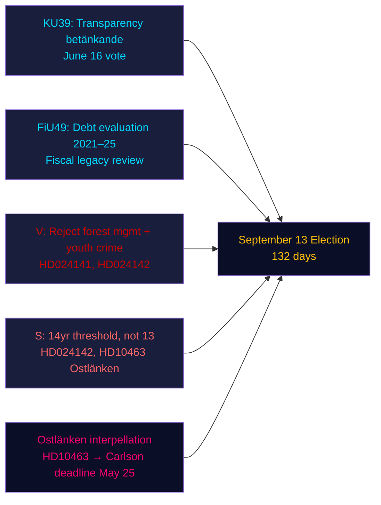

# Résumé — Analyse du soir, 4 mai 2026

**Auteur** : James Pether Sörling | **Confiance** : HAUTE [Admiralty B2] | **Jours avant les élections** : 132  
**Provenance FMI** : WEO avr-2026 | NGDP_RPCH_2026 : 2,1 % | GGXWDG_NGDP : ~34 % | récupéré : 2026-05-04

---

## SYNTHÈSE

Le Riksdag suédois le 4 mai 2026 — 132 jours avant les élections du 13 septembre — est entré dans une phase accélérée de clôture législative : la commission constitutionnelle (KU) a enregistré le rapport KU39 sur la transparence du processus politique pour un vote le 16 juin, tandis que la commission des finances (FiU) a enregistré FiU49 évaluant cinq ans de gestion de la dette par le Riksgälden. Les partis d'opposition ont déposé neuf nouvelles motions contre les propositions gouvernementales sur la gestion forestière et la délinquance juvénile, et la socialiste Eva Lindh a renforcé l'attaque de responsabilisation sur Ostlänken contre le ministre KD des Infrastructures Carlson. Le signal de renseignement dominant : le gouvernement consolide son héritage législatif tandis que l'opposition construit un portefeuille d'attaques pré-électorales ciblées — et les deux opèrent sur une chronologie compressée de 132 jours.

---

## Trois décisions soutenues par ce résumé

1. **Évaluation du calendrier législatif** : Le débat sur KU39 le 16 juin confirme que le gouvernement peut faire adopter le projet de loi sur la transparence HD03258 avant la pause estivale — une victoire de gouvernance pour la coalition avant les élections.
2. **Évaluation de la coordination de l'opposition** : Les neuf motions MJU/JuU déposées aujourd'hui représentent une réponse coordonnée des partis — V avec des demandes de rejet maximal, S avec acceptation conditionnelle, d'autres partis avec des amendements ciblés — révélant l'arithmétique législative avant les auditions en commission.
3. **Vulnérabilité infrastructurelle** : L'interpellation sur Ostlänken (HD10463) a activé une crise de responsabilité régionale en Östergötland — une circonscription à haute densité de sièges marginaux — qui restera active jusqu'à l'échéance de réponse du ministre KD Carlson le 25 mai.

---

## Lecture en 60 secondes

- **Transparence KU39** (vote le 16 juin) : Le projet de loi HD03258 du gouvernement sur la divulgation du financement politique est en bonne voie — implications pour la transparence du financement de tous les partis avant les élections.
- **Évaluation de la dette FiU49** : Évaluation quinquennale du fonctionnement du Riksgälden enregistrée ; la dette publique suédoise (~34 % du PIB, minimum de l'UE) contextualise tout débat de politique budgétaire.
- **Neuf nouvelles motions** : Gestion forestière (prop 242, cinq motions MJU) et délinquance juvénile (prop 246, trois motions JuU) font face à des oppositions coordonnées. V exige un rejet total ; S exige que le seuil d'âge pénal soit 14 ans et non 13.
- **Interpellation Ostlänken (HD10463)** : Eva Lindh du S cible le ministre KD Carlson sur la station de Linköping annulée — affectant un bassin d'emploi de 500 000 personnes et générant de la chaleur régionale dans quatre sièges marginaux.
- **Interpellation sur la taxe pesticides (HD10462)** : Monica Haider du S cible le ministre des Finances Svantesson sur la taxation des désinfectants médicaux — faible saillance générale mais haute pertinence pour les syndicats de santé.

---

## Principal déclencheur prospectif

**Audition de la commission KU39 (26 mai–4 juin)** : Le projet de loi sur la transparence KU39 entre en délibération en commission le 26 mai. Si un parti tente d'amender HD03258 pour couvrir la publicité politique numérique (actuellement exclue de la proposition), un conflit de coalition pourrait émerger entre L (pour la transparence numérique) et SD (réfractaire aux règles de divulgation publicitaire). Surveiller le protocole de majorité en commission.

---

## Analyse de confiance

| Domaine | Confiance | Base |
|--------|-----------|-------|
| Calendrier législatif (KU39/FiU49) | HAUTE [A2] | Métadonnées directes du rapport, calendrier de commission |
| Contenu des motions d'opposition | HAUTE [B2] | Récupération du texte intégral de HD024142 ; résumés partiels des autres |
| Signification électorale | MOYENNE [B3] | Arithmétique de coalition issues des analyses sœurs |
| Contexte économique | MOYENNE [A3] | FMI WEO avr-2026 (en cache des analyses sœurs) |

---

## Vue d'ensemble Mermaid

<!-- source-sha: 5d8da0c335b7b753c6fbbb72731875bcfd25910e -->
