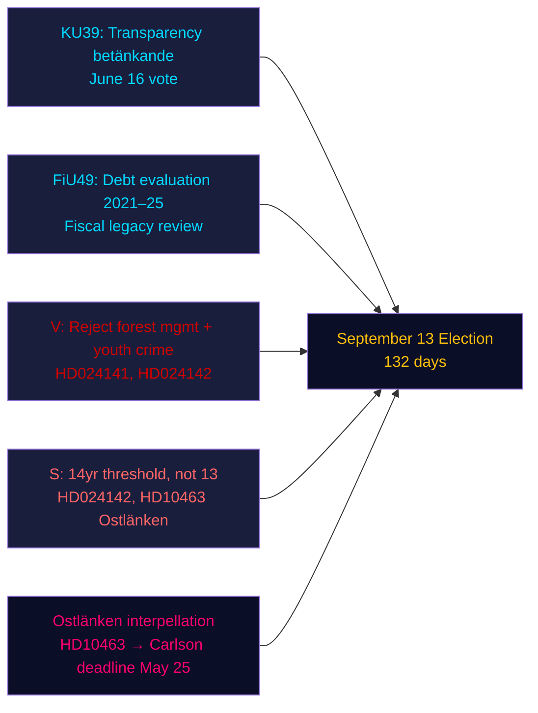

&#x200F;# סיכום מנהלים — ניתוח ערב, 4 במאי 2026

**מחבר**: James Pether Sörling | **רמת ביטחון**: גבוהה [Admiralty B2] | **ימים לבחירות**: 132  
**מקור נתוני קרן המטבע**: WEO אפריל 2026 | NGDP_RPCH_2026: 2.1% | GGXWDG_NGDP: ~34% | נשלף: 2026-05-04

---

## תמצית מנהלים

הריקסדאג השוודי ב-4 במאי 2026 — 132 ימים לפני הבחירות ב-13 בספטמבר — נכנס לשלב סיום חקיקה מואץ: ועדת החוקה (KU) רשמה את דו"ח KU39 על שקיפות התהליך הפוליטי לקראת הצבעה ב-16 ביוני, בעוד ועדת האוצר (FiU) רשמה את FiU49 המעריך חמש שנות ניהול חוב של Riksgälden. מפלגות האופוזיציה הגישו תשעה הצעות חוק חדשות נגד הצעות החוק הממשלתיות בנושאי ניהול יערות ופשיעת נוער, ואיבה לינד מהסוציאל-דמוקרטים החריפה את מתקפת האחריות על Ostlänken נגד שר התשתיות של KD, קרלסון. האות המודיעיני הדומיננטי: הממשלה מבצרת את מורשתה החקיקתית בעוד האופוזיציה בונה תיק תקיפה מכוון לפני הבחירות — ושניהם פועלים בציר זמן דחוס של 132 ימים.

---

## שלוש החלטות שתדרוך זה תומך בהן

1. **הערכת לוח הזמנים החקיקתי**: הדיון ב-KU39 ב-16 ביוני מאשר שהממשלה יכולה לאשר את חוק השקיפות HD03258 לפני פגרת הקיץ — ניצחון ממשלי לקואליציה לפני הבחירות.
2. **הערכת תיאום האופוזיציה**: תשע הצעות MJU/JuU שהוגשו היום מייצגות תגובה מתואמת של מפלגות — V עם דרישות דחייה מקסימליות, S עם הסכמה מותנית, מפלגות אחרות עם תיקונים ממוקדים — חושפות את האריתמטיקה החקיקתית לפני שימועי הוועדות.
3. **פגיעות תשתיתית**: בקשת ההסבר על Ostlänken (HD10463) הפעילה משבר אחריות אזורי בAustergötland — מחוז בחירות עם צפיפות גבוהה של מושבים שוליים — שיישאר פעיל עד לתאריך האחרון לתשובת שר KD קרלסון ב-25 במאי.

---

## קריאת 60 שניות

- **שקיפות KU39** (הצבעה 16 ביוני): הצעת החוק HD03258 של הממשלה לגילוי מימון פוליטי במסלול — השלכות על שקיפות המימון של כל המפלגות לפני הבחירות.
- **הערכת חוב FiU49**: נרשמה הערכה חמש-שנתית של פעילות Riksgälden; החוב הציבורי השוודי (~34% מהתמ"ג, מינימום האיחוד האירופי) מציב בהקשר כל דיון במדיניות פיסקלית.
- **תשע הצעות חדשות**: ניהול יערות (prop 242, חמש הצעות MJU) ופשיעת נוער (prop 246, שלוש הצעות JuU) מתמודדות עם אתגרים מתואמים של האופוזיציה. V דורשת דחייה מוחלטת; S דורשת סף גיל פלילי של 14 ולא 13.
- **בקשת הסבר Ostlänken (HD10463)**: איבה לינד מ-S מכוונת נגד שר KD קרלסון על תחנת לינשופינג שבוטלה — משפיעה על שוק עבודה של 500,000 איש ויוצרת חום אזורי בארבעה מושבים שוליים.
- **בקשת הסבר מס חומרי הדברה (HD10462)**: מוניקה היידר מ-S מכוונת נגד שר האוצר סוואנטסון על מיסוי חומרי חיטוי רפואיים — רלוונטיות כללית נמוכה אך רלוונטיות גבוהה לאיגודי הבריאות.

---

## הגורם המעורר העיקרי לקראת

**שימוע ועדת KU39 (26 במאי–4 ביוני)**: חוק השקיפות KU39 נכנס לדיוני ועדה ב-26 במאי. אם מפלגה כלשהי תנסה לתקן את HD03258 כדי לכסות פרסום פוליטי דיגיטלי (שכיום מוחרג מהצעה), עלול להתפתח קונפליקט קואליציוני בין L (בעד שקיפות דיגיטלית) ל-SD (מתנגד לכללי גילוי פרסומי). לעקוב אחר פרוטוקול רוב הוועדה.

---

## ניתוח רמת ביטחון

| תחום | רמת ביטחון | בסיס |
|--------|-----------|-------|
| לוח הזמנים החקיקתי (KU39/FiU49) | גבוהה [A2] | מטא-נתוני דו"ח ישירים, לוח ועדה |
| תוכן הצעות האופוזיציה | גבוהה [B2] | אחזור טקסט מלא של HD024142; תקצירים חלקיים של האחרים |
| משמעות בחירותית | בינונית [B3] | אריתמטיקת קואליציה מניתוחים אחים |
| הקשר כלכלי | בינונית [A3] | IMF WEO אפריל 2026 (שמור ממטמון מניתוחים אחים) |

---

## סקירה כללית Mermaid

<!-- source-sha: 5d8da0c335b7b753c6fbbb72731875bcfd25910e -->
