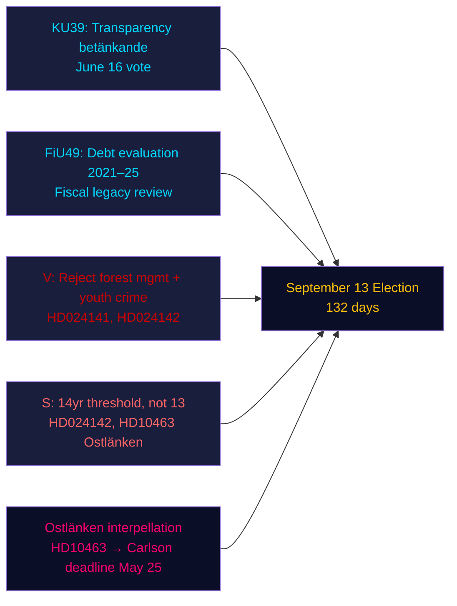

# エグゼクティブブリーフ — 夕刻分析、2026年5月4日

**著者**: James Pether Sörling | **信頼度**: 高 [Admiralty B2] | **選挙まで**: 132日  
**IMF出典**: WEO 2026年4月 | NGDP_RPCH_2026: 2.1% | GGXWDG_NGDP: ~34% | 取得日: 2026-05-04

---

## 要旨

2026年5月4日のスウェーデン国会（リクスダーグ）は——9月13日の選挙まで132日——立法の加速的終了フェーズに入った：憲法委員会（KU）は政治的プロセスの透明性に関する報告書KU39を6月16日の採決に向けて登録し、財務委員会（FiU）はリクスガルデンの5年間の債務管理を評価するFiU49を登録した。野党は森林管理および青少年犯罪に関する政府提案に対して9件の新しい動議を提出し、社会民主党のエーヴァ・リンドがKD党インフラ担当大臣カールソンへのオストレンケン説明責任攻撃を強化した。支配的な情報シグナル：政府は立法的遺産を固めており、野党は選挙前の標的を絞った攻撃ポートフォリオを構築している——両者とも132日という圧縮されたタイムラインで動いている。

---

## このブリーフが支援する3つの意思決定

1. **立法カレンダー評価**：6月16日のKU39討議により、政府は夏季休会前に透明性法案HD03258を通過させられることが確認される——連立政権にとっての選挙前ガバナンスの勝利。
2. **野党調整評価**：本日提出された9件のMJU/JuU動議は協調的な政党対応を示す——Vは最大限の否決要求、Sは条件付き受容、他党は標的を絞った修正案——委員会聴聞前に立法的算術を明らかにする。
3. **インフラの脆弱性**：Ostlänken質問状（HD10463）が東ウェーテルゴータランドで地域的説明責任危機を活性化した——限界議席密度が高い選挙区——KD大臣カールソンの5月25日期限まで継続。

---

## 60秒読み

- **KU39透明性**（6月16日採決）：政府のHD03258政治資金開示法案が軌道通り——選挙前の全政党の資金透明性への影響。
- **FiU49債務評価**：リクスガルデン運営の5年間評価が登録；スウェーデンの公的債務（GDP比約34%、EU最低）がすべての財政政策議論を文脈化する。
- **9件の新動議**：森林管理（prop 242、MJU動議5件）と青少年犯罪（prop 246、JuU動議3件）が協調野党の挑戦に直面。Vは完全否決を要求；Sは刑事責任年齢14歳（13ではなく）を要求。
- **Ostlänken質問状（HD10463）**：SのエーヴァリンドがKD大臣カールソンに対し中止されたリンシェーピング駅をめぐって標的——50万人規模の労働市場に影響し、4つの限界議席で地域的緊張を生む。
- **殺虫剤税質問状（HD10462）**：SのモニカハイダーがSvantesson財務大臣に対し医療用消毒液課税をめぐって標的——一般的な顕著性は低いが医療労組への関連性は高い。

---

## 主要な先行シグナル

**KU39委員会聴聞（5月26日–6月4日）**：透明性法案KU39が5月26日に委員会審議に入る。L（デジタル透明性を支持）とSD（広告開示規則に反対）との間でHD03258をデジタル政治広告をカバーするよう修正しようとする試みがあれば、連立の対立が生じる可能性がある。委員会の多数派プロトコルを監視。

---

## 信頼度評価

| 領域 | 信頼度 | 根拠 |
|--------|-----------|-------|
| 立法カレンダー（KU39/FiU49） | 高 [A2] | 報告書メタデータの直接確認、委員会カレンダー |
| 野党動議の内容 | 高 [B2] | HD024142の全文取得；他のものの部分的要約 |
| 選挙的重要性 | 中 [B3] | 姉妹分析からの連立算術 |
| 経済的文脈 | 中 [A3] | IMF WEO 2026年4月（姉妹分析からキャッシュ済み） |

---

## Mermaid概要

<!-- source-sha: 5d8da0c335b7b753c6fbbb72731875bcfd25910e -->
