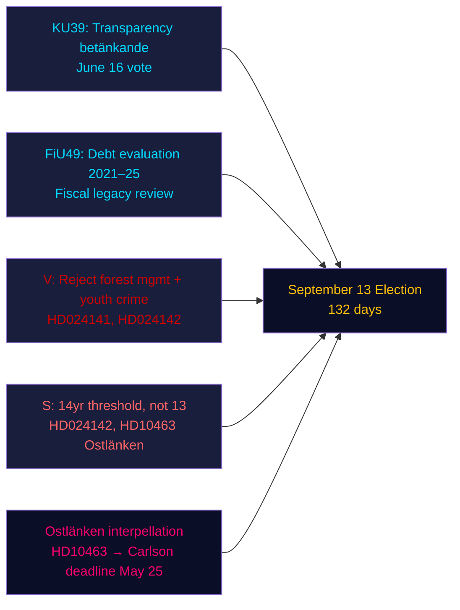

# 집행 브리핑 — 저녁 분석, 2026년 5월 4일

**저자**: James Pether Sörling | **신뢰도**: 높음 [Admiralty B2] | **선거까지**: 132일  
**IMF 출처**: WEO 2026년 4월 | NGDP_RPCH_2026: 2.1% | GGXWDG_NGDP: ~34% | 수집일: 2026-05-04

---

## 핵심 요약

2026년 5월 4일 스웨덴 의회(릭스다그)——9월 13일 선거 132일 전——는 가속화된 입법 마무리 단계에 진입했다: 헌법위원회(KU)가 정치 과정 투명성에 관한 보고서 KU39를 6월 16일 투표를 위해 등록한 반면, 재정위원회(FiU)는 릭스갈덴의 5년간 부채 관리를 평가하는 FiU49를 등록했다. 야당들은 산림 관리와 청소년 범죄에 관한 정부 제안에 반대하는 9개의 새로운 동의를 제출했고, 사회민주당의 에바 린드가 KD 인프라장관 칼슨에 대한 Ostlänken 책임 공격을 강화했다. 지배적인 정보 신호: 정부는 입법적 유산을 굳히고 있으며 야당은 선거 전 표적화된 공격 포트폴리오를 구축하고 있다——양측 모두 132일이라는 압축된 타임라인에서 작동한다.

---

## 이 보고서가 지원하는 세 가지 결정

1. **입법 일정 평가**: 6월 16일 KU39 토론은 정부가 여름 휴회 전에 투명성 법안 HD03258을 통과시킬 수 있음을 확인——선거 전 연립의 거버넌스 승리.
2. **야당 조정 평가**: 오늘 제출된 9개의 MJU/JuU 동의는 조율된 정당 대응을 나타낸다——V는 최대 거부 요구, S는 조건부 수용, 다른 정당은 표적화된 수정안——위원회 청문 전 입법 산술을 드러낸다.
3. **인프라 취약성**: Ostlänken 질문(HD10463)이 Östergötland에서 지역 책임 위기를 활성화했다——한계 의석 밀도가 높은 선거구——5월 25일 KD 장관 칼슨의 답변 마감까지 지속된다.

---

## 60초 요약

- **KU39 투명성** (6월 16일 투표): 정부의 HD03258 정치 자금 공개 법안이 순조롭게 진행 중——선거 전 모든 정당의 자금 투명성에 대한 영향.
- **FiU49 부채 평가**: 릭스갈덴 운영 5년 평가 등록; 스웨덴의 공공 부채(~GDP의 34%, EU 최저)가 모든 재정 정책 토론을 맥락화.
- **9개의 새로운 동의**: 산림 관리 (prop 242, 5개 MJU 동의)와 청소년 범죄 (prop 246, 3개 JuU 동의)가 야당의 조율된 도전에 직면. V는 완전 거부 요구; S는 14세 기준 요구(13세 아닌).
- **Ostlänken 질문 (HD10463)**: S의 에바 린드가 취소된 린셰핑 역을 놓고 KD 장관 칼슨을 표적——50만 명 노동 시장 영향, 4개 한계 의석에서 지역 갈등 촉발.
- **살충제 세금 질문 (HD10462)**: S의 모니카 하이더가 의료 소독제 과세를 놓고 스반테손 재무장관을 표적——일반적 현저성은 낮지만 의료 노조와의 관련성은 높음.

---

## 주요 선행 트리거

**KU39 위원회 청문 (5월 26일–6월 4일)**: 투명성 법안 KU39가 5월 26일 위원회 심의에 들어간다. 어떤 정당이 디지털 정치 광고를 포함하도록 HD03258을 수정하려 할 경우(현재 제안에서 제외), L(디지털 투명성 지지)과 SD(광고 공개 규칙에 반대) 사이에 연립 갈등이 발생할 수 있다. 위원회 다수결 의정서 모니터링.

---

## 신뢰도 평가

| 영역 | 신뢰도 | 근거 |
|--------|-----------|-------|
| 입법 일정 (KU39/FiU49) | 높음 [A2] | 보고서 메타데이터 직접 확인, 위원회 일정 |
| 야당 동의 내용 | 높음 [B2] | HD024142 전문 수집; 다른 것들의 부분 요약 |
| 선거적 중요성 | 중간 [B3] | 자매 분석의 연립 산술 |
| 경제적 맥락 | 중간 [A3] | IMF WEO 2026년 4월 (자매 분석에서 캐시됨) |

---

## Mermaid 개요

<!-- source-sha: 5d8da0c335b7b753c6fbbb72731875bcfd25910e -->
