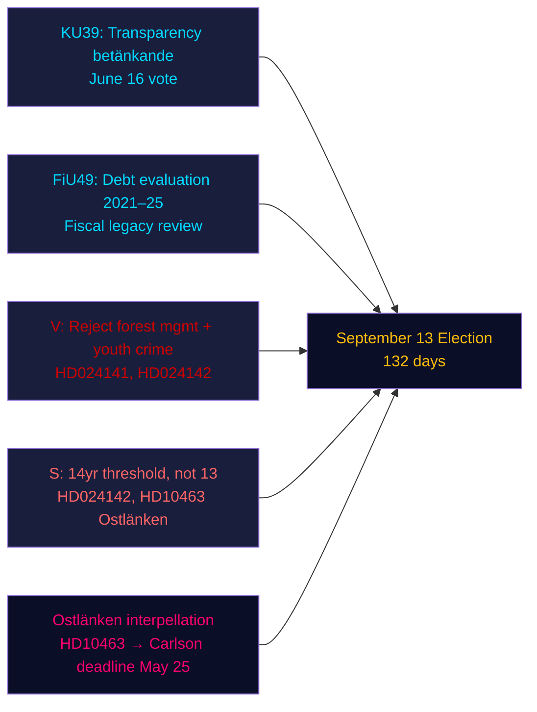

# Samenvatting — Avondanalyse, 4 mei 2026

**Auteur**: James Pether Sörling | **Betrouwbaarheid**: HOOG [Admiralty B2] | **Dagen tot de verkiezingen**: 132  
**IMF-proveniëntie**: WEO apr-2026 | NGDP_RPCH_2026: 2,1 % | GGXWDG_NGDP: ~34 % | opgehaald: 2026-05-04

---

## KERNBOODSCHAP

De Zweedse Riksdag op 4 mei 2026 — 132 dagen voor de verkiezingen van 13 september — trad in een versnelde wetgevingsafrondingsfase: de constitutionele commissie (KU) registreerde rapport KU39 over transparantie van het politieke proces voor een stemming op 16 juni, terwijl de financiële commissie (FiU) FiU49 registreerde ter evaluatie van vijf jaar schuldbeheer door het Riksgälden. Oppositiepartijen dienden negen nieuwe moties in tegen regeringsproposities over bosbeheer en jeugdcriminaliteit, en sociaaldemocrate Eva Lindh verscherpte de Ostlänken-verantwoordelijkheidsaanval op KD-infrastructuurminister Carlson. Het dominante inlichtingensignaal: de regering legt haar wetgevend erfgoed vast terwijl de oppositie een gericht voorverkiezingsaanvalsportfolio opbouwt — en beide opereren op een gecomprimeerde tijdlijn van 132 dagen.

---

## Drie beslissingen die dit rapport ondersteunt

1. **Beoordeling van de wetgevingsagenda**: Het debat over KU39 op 16 juni bevestigt dat de regering de transparantiewet HD03258 vóór de zomerpauze kan aannemen — een bestuurssucces voor de coalitie vóór de verkiezingen.
2. **Beoordeling van oppositiecoördinatie**: De negen MJU/JuU-moties die vandaag zijn ingediend vertegenwoordigen een gecoördineerde partijreactie — V met maximale afwijzingseisen, S met voorwaardelijke instemming, andere partijen met gerichte amendementen — en onthullen de wetgevingsaritmetiek vóór de commissiehearings.
3. **Infrastructurele kwetsbaarheid**: De Ostlänken-interpellatie (HD10463) heeft een regionale verantwoordelijkheidscrisis in Östergötland geactiveerd — een kiesdistrict met een hoge dichtheid aan marginale zetels — die actief blijft tot de antwoordtermijn van KD-minister Carlson op 25 mei.

---

## 60-seconden lezing

- **KU39-transparantie** (stemming 16 juni): Regeringsvoorstel HD03258 voor openbaarmaking van partijfinanciering ligt op koers — gevolgen voor de financieringstransparantie van alle partijen vóór de verkiezingen.
- **FiU49-schuldevaluatie**: Vijfjarige evaluatie van de Riksgälden-werking geregistreerd; Zweden's staatsschuld (~34% van het BBP, EU-minimum) contextualiseert elk begrotingsbeleidsdebat.
- **Negen nieuwe moties**: Bosbeheer (prop 242, vijf MJU-moties) en jeugdcriminaliteit (prop 246, drie JuU-moties) staan voor gecoördineerde oppositie-uitdagingen. V eist volledige afwijzing; S eist een strafrechtelijke leeftijdsgrens van 14, niet 13.
- **Ostlänken-interpellatie (HD10463)**: Eva Lindh van S richt zich op KD-minister Carlson over het geannuleerde Linköping-station — treft een arbeidsmarkt van 500.000 mensen en veroorzaakt regionale spanning in vier marginale zetels.
- **Pesticide-belasting-interpellatie (HD10462)**: Monica Haider van S richt zich op minister van Financiën Svantesson over de belasting van medische desinfectiemiddelen — lage algemene relevantie maar hoge relevantie voor gezondheidsvakbonden.

---

## Belangrijkste vooruitblikkende trigger

**KU39-commissiehearing (26 mei–4 juni)**: Het transparantiewet KU39 treedt op 26 mei in commissiedeliberatie. Als een partij probeert HD03258 te amenderen om digitale politieke reclame te bestrijken (momenteel uitgesloten van het voorstel), kan er een coalitieconflict ontstaan tussen L (voor digitale transparantie) en SD (weerstands tegen reclamedivulgatieregels). Commissiemeerderheidsprotocol volgen.

---

## Betrouwbaarheidsanalyse

| Domein | Betrouwbaarheid | Basis |
|--------|-----------|-------|
| Wetgevingskalender (KU39/FiU49) | HOOG [A2] | Directe rapportmetadata, commissiekalender |
| Inhoud oppositiemoties | HOOG [B2] | Volledige tekst-ophaling van HD024142; gedeeltelijke samenvattingen van andere |
| Electorale betekenis | GEMIDDELD [B3] | Coalitiearitmetiek uit zusteranalyses |
| Economische context | GEMIDDELD [A3] | IMF WEO apr-2026 (uit zusteranalyses gecacht) |

---

## Mermaid-overzicht

<!-- source-sha: 5d8da0c335b7b753c6fbbb72731875bcfd25910e -->
