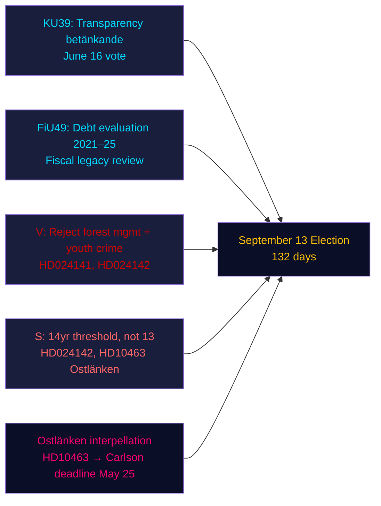

# Sammendrag — Kveldsanalyse, 4. mai 2026

**Forfatter**: James Pether Sörling | **Konfidens**: HØY [Admiralty B2] | **Dager til valget**: 132  
**IMF-proveniens**: WEO apr-2026 | NGDP_RPCH_2026: 2,1 % | GGXWDG_NGDP: ~34 % | hentet: 2026-05-04

---

## KONKLUSJON

Sveriges Riksdag 4. mai 2026 — 132 dager før valget 13. september — gikk inn i en akselerert lovgivningsavslutningsfase: den konstitusjonelle komiteen (KU) registrerte betenkningsinnstillingen KU39 om transparens i den politiske prosessen for en 16. juni-avstemning, mens finanskomiteen (FiU) registrerte FiU49 som evaluerer fem år med Riksgäldens gjeldsforvaltning. Opposisjonspartier leverte inn ni nye motioner mot regjeringens proposisjoner om skogforvaltning og ungdomskriminalitet, og Sosialdemokraten Eva Lindh skjerpet Ostlänken-ansvarsangrepet mot KD-infrastrukturminister Carlson. Det dominerende etterretningssignalet: regjeringen låser inn sin lovgivningsarv mens opposisjonen bygger en målrettet forhåndsvalgangrepmappe — og begge opererer på en komprimert 132-dagers tidslinje.

---

## Tre beslutninger dette sammendraget støtter

1. **Vurdering av lovgivningskalender**: KU39-debatten 16. juni bekrefter at regjeringen kan vedta transparensloven HD03258 før sommerferien — en forvaltningsgevinst for koalisjonen før valget.
2. **Vurdering av opposisjonskoordinering**: De ni MJU/JuU-motionene levert inn i dag representerer et koordinert partisvar — V med maksimale avvisningskrav, S med betinget aksept, andre partier med målrettede endringsforslag — som avslører lovgivningsaritmetikken før komitéhøringene.
3. **Infrastrukturell sårbarhet**: Ostlänken-interpellasjonen (HD10463) har aktivert en regional ansvarslighetskrise i Östergötland — et valgdistrikt med høy andel marginalseter — som vil forbli aktiv frem til KD-minister Carlsons svarfrist 25. mai.

---

## 60-sekunders lesning

- **KU39-transparens** (avstemning 16. juni): Regjeringens HD03258-forslag om partifinansieringens åpenhet er på rett spor — konsekvenser for alle partiers finansieringstransparens før valget.
- **FiU49-gjeldsevaluering**: Femårsevaluering av Riksgäldens drift registrert; Sveriges offentlige gjeld (~34 % av BNP, EUs minimum) kontekstualiserer enhver finanspolitisk debatt.
- **Ni nye motioner**: Skogsskjøtsel (prop 242, fem MJU-motioner) og ungdomskriminalitet (prop 246, tre JuU-motioner) møter koordinerte opposisjonsutfordringer. V krever avvisning; S krever 14-årsgrensen, ikke 13.
- **Ostlänken-interpellasjonen (HD10463)**: S' Eva Lindh retter seg mot KD-minister Carlson om den avlyste Linköping-stasjonen — påvirker et arbeidsmarked med 500 000 innbyggere og skaper regional varme i fire marginalseter.
- **Pesticisskatt-interpellasjonen (HD10462)**: S' Monica Haider retter seg mot finansminister Svantesson om beskatning av helsemessige desinfeksjonsmidler — lav generell relevans men høy relevans for helsearbeiderfagforeningene.

---

## Viktigste fremtidige utløser

**KU39-komitéhøringen (26. mai–4. juni)**: Transparensloven KU39 går inn i komitébehandling 26. mai. Hvis et parti forsøker å endre HD03258 til å dekke digital politisk reklame (for øyeblikket unntatt fra forslaget), kan en koalisjonskonflikt oppstå mellom L (for digital transparens) og SD (motstand mot krav om reklameopplysning). Følg med på komiteens flertallsprotokoll.

---

## Konfidensanalyse

| Domene | Konfidens | Grunnlag |
|--------|-----------|-------|
| Lovgivningskalender (KU39/FiU49) | HØY [A2] | Direkte betenkningsmetadata, komitékalender |
| Opposisjonsmosjonsinnhold | HØY [B2] | Fulltext-henting av HD024142; delsammendrag av øvrige |
| Valgmessig betydning | MIDDELS [B3] | Koalisjonsaritmetikk fra søsteranalyser |
| Økonomisk kontekst | MIDDELS [A3] | IMF WEO apr-2026 (cachet fra søsteranalyser) |

---

## Mermaid-oversikt

<!-- source-sha: 5d8da0c335b7b753c6fbbb72731875bcfd25910e -->
