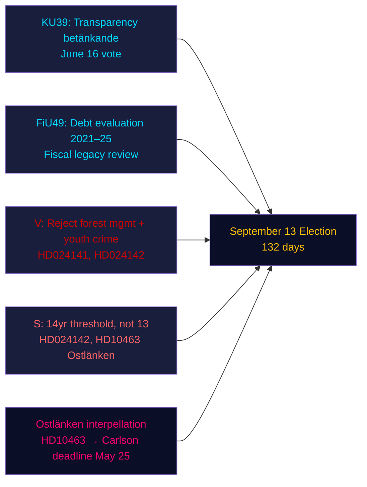

# Sammanfattning — Kvällsanalys, 4 maj 2026

**Författare**: James Pether Sörling | **Konfidens**: HÖG [Admiralty B2] | **Dagar till valet**: 132  
**IMF-proveniens**: WEO apr-2026 | NGDP_RPCH_2026: 2,1 % | GGXWDG_NGDP: ~34 % | hämtad: 2026-05-04

---

## SLUTSATS I KORTHET

Sveriges riksdag den 4 maj 2026 — 132 dagar före valet den 13 september — gick in i en accelererad lagstiftningsavslutningsfas: konstitutionsutskottet (KU) registrerade betänkande KU39 om transparens i den politiska processen inför en omröstning den 16 juni, medan finansutskottet (FiU) registrerade FiU49 som utvärderar fem år av Riksgäldens skuldförvaltning. Oppositionspartier lämnade in nio nya motioner mot regeringspropositioner om skogsskötsel och ungdomsbrottslighet, och socialdemokraten Eva Lindh skärpte Ostlänken-ansvarskravet mot KD:s infrastrukturminister Carlson. Den dominerande underrättelsesignalen: regeringen låser in sitt lagstiftningsarv medan oppositionen bygger upp en riktad valkampanjsattackportfölj — och båda agerar inom en komprimerad tidslinje på 132 dagar.

---

## Tre beslut som detta underlag stöder

1. **Bedömning av lagstiftningskalender**: KU39-debatten den 16 juni bekräftar att regeringen kan driva igenom transparenslagen HD03258 före sommaruppehållet — en förvaltningsseger för koalitionen inför valet.
2. **Bedömning av oppositionssamordning**: De nio MJU/JuU-motioner som lämnades in i dag representerar ett samordnat partirespons — V med maximala avslagskrav, S med villkorligt godkännande, övriga partier med riktade ändringsförslag — vilket avslöjar den lagstiftningsaritmetiska bilden inför utskottshearingarna.
3. **Infrastrukturell sårbarhet**: Ostlänken-interpellationen (HD10463) har aktiverat en regional ansvarskris i Östergötland — ett valkrets med hög marginalmandat-densitet — som förblir levande till KD:s infrastrukturminister Carlsons svarsfrist den 25 maj.

---

## 60-sekundersinformation

- **KU39-transparens** (omröstning 16 juni): Regeringens HD03258-förslag om redovisning av partifinansiering är på rätt spår — konsekvenser för alla partiers finansieringstransparens inför valet.
- **FiU49-skuldutvärdering**: Femårsutvärdering av Riksgäldens verksamhet registrerad; Sveriges statsskuld (~34 % av BNP, EU:s lägsta) kontextualiserar alla fiskalpolitiska debatter.
- **Nio nya motioner**: Skogsbruk (prop 242, fem MJU-motioner) och ungdomsbrottslighet (prop 246, tre JuU-motioner) möter samordnat oppositionsutmaningar. V kräver avslag; S kräver 14-årsgränsen, inte 13.
- **Ostlänken-interpellation (HD10463)**: S:s Eva Lindh riktar in sig på KD:s minister Carlson om det inställda Linköpings-stoppet — påverkar en arbetsmarknadsregion med 500 000 invånare och skapar regional värme i fyra marginalvalkretsar.
- **Bekämpningsmedels-skatteinterpellation (HD10462)**: S:s Monica Haider riktar in sig på finansminister Svantesson om skatteregler för sjukvårdsdesinfektionsmedel — låg allmän saliens men hög relevans för sjukvårdsfacken.

---

## Viktigaste framåtblickande utlösare

**KU39-utskottshearing (26 maj–4 juni)**: Transparenslagen KU39 inleder utskottsbehandling den 26 maj. Om något parti försöker ändra HD03258 för att täcka digital politisk reklam (för närvarande undantagen från förslaget), kan en koalitionskonflikt uppstå mellan L (för digital transparens) och SD (motståndare till krav på reklamredovisning). Bevaka utskottets majoritetsprotokoll.

---

## Konfidensanalys

| Domän | Konfidens | Grund |
|--------|-----------|-------|
| Lagstiftningskalender (KU39/FiU49) | HÖG [A2] | Direkt betänkandemetadata, utskottskalender |
| Oppositionsmotionernas innehåll | HÖG [B2] | Fulltext-hämtning av HD024142; delsammanfattningar av övriga |
| Valmässig betydelse | MEDEL [B3] | Koalitionsaritmetik från systerstudier |
| Ekonomisk kontext | MEDEL [A3] | IMF WEO apr-2026 (cachad från systerstudier) |

---

## Mermaid-översikt

<!-- source-sha: 5d8da0c335b7b753c6fbbb72731875bcfd25910e -->
