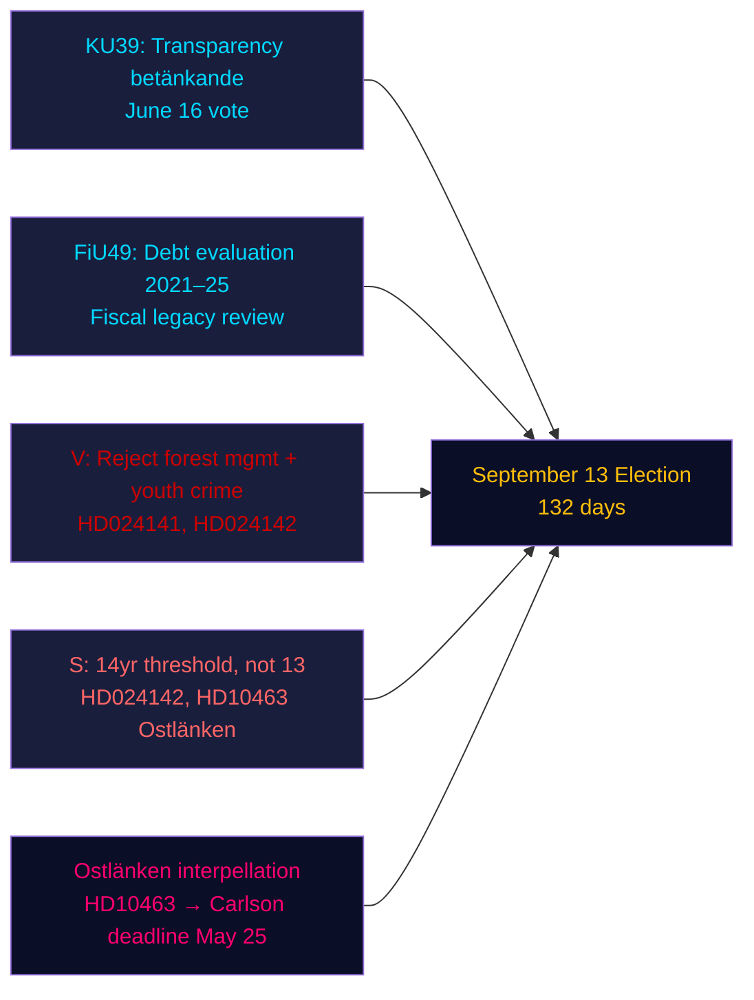

# 执行简报 — 晚间分析，2026年5月4日

**作者**：James Pether Sörling | **置信度**：高 [Admiralty B2] | **距离选举**：132天  
**IMF数据来源**：WEO 2026年4月 | NGDP_RPCH_2026: 2.1% | GGXWDG_NGDP: ~34% | 获取日期：2026-05-04

---

## 核心结论

2026年5月4日，瑞典议会（议会）——距9月13日选举132天——进入立法加速收尾阶段：宪法委员会（KU）为6月16日的投票登记了关于政治过程透明度的报告KU39，而财务委员会（FiU）登记了FiU49，评估Riksgälden五年的债务管理工作。反对党提交了九项反对政府关于森林管理和青少年犯罪提案的新动议，社民党的伊娃·林德加强了对KD基础设施部长卡尔松在奥斯特兰肯铁路问题上的问责攻势。主要情报信号：政府正在巩固其立法遗产，而反对党正在构建精准的选前攻击组合——双方都在132天的紧张时间表下运作。

---

## 本简报支持的三项决策

1. **立法日程评估**：6月16日的KU39辩论确认政府可在夏季休会前通过透明度法案HD03258——联合政府选前治理的胜利。
2. **反对党协调评估**：今日提交的九项MJU/JuU动议代表协调一致的政党回应——V提出最大限度否决要求，S附条件接受，其他政党提出针对性修正案——在委员会听证前揭示立法格局。
3. **基础设施脆弱性**：Ostlänken质询（HD10463）在Östergötland激活了地区问责危机——边缘席位密集的选区——将持续到KD部长卡尔松5月25日的答复截止日期。

---

## 60秒速览

- **KU39透明度**（6月16日投票）：政府的HD03258政治资金披露法案进展顺利——对选前所有政党资金透明度的影响。
- **FiU49债务评估**：Riksgälden五年运营评估已登记；瑞典公共债务（约占GDP的34%，欧盟最低）为任何财政政策辩论提供背景。
- **九项新动议**：森林管理（prop 242，五项MJU动议）和青少年犯罪（prop 246，三项JuU动议）面临反对党的协调挑战。V要求彻底否决；S要求刑事责任年龄为14岁而非13岁。
- **Ostlänken质询（HD10463）**：S党的伊娃·林德就取消的林雪平车站质询KD部长卡尔松——影响50万人的就业市场，在四个边缘席位产生地区热度。
- **杀虫剂税质询（HD10462）**：S党的莫妮卡·海德尔就医疗消毒剂税收问题质询财政部长斯万特松——总体显著性低，但对卫生工会的关联性高。

---

## 最重要的前瞻性触发因素

**KU39委员会听证（5月26日–6月4日）**：透明度法案KU39于5月26日进入委员会审议。如果某党试图修改HD03258以覆盖数字政治广告（目前被排除在提案之外），L（支持数字透明度）与SD（抵制广告披露规定）之间可能出现联合政府冲突。关注委员会多数派议事录。

---

## 置信度评估

| 领域 | 置信度 | 依据 |
|--------|-----------|-------|
| 立法日程（KU39/FiU49） | 高 [A2] | 直接报告元数据、委员会日历 |
| 反对党动议内容 | 高 [B2] | HD024142全文获取；其他文件的部分摘要 |
| 选举意义 | 中 [B3] | 来自同类分析的联合算术 |
| 经济背景 | 中 [A3] | IMF WEO 2026年4月（从同类分析缓存） |

---

## Mermaid概览

<!-- source-sha: 5d8da0c335b7b753c6fbbb72731875bcfd25910e -->
