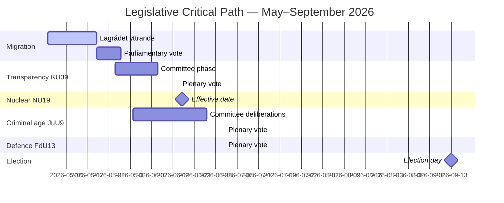

# Implementation Feasibility — Evening Analysis, 4 May 2026

**Author**: James Pether Sörling | **Date**: 2026-05-04

---

## Feasibility Assessment by Legislative Item

### 1. Nuclear NU19 (New Rules for Building Nuclear Power Plants)

**Vote date**: June 17, 2026 (effective date)  
**Feasibility**: VERY HIGH (90%)

| Dimension | Assessment |
|-----------|----------|
| Parliamentary support | M+KD+SD+L = 165; C likely to support (market energy position); cross-bloc support expected |
| Implementation readiness | SKB (nuclear waste) and SSM (regulator) have prepared implementation guidance; site licensing process defined |
| Timeline risk | June 17 is an effective date, not a construction start — no physical implementation risk in 2026 |
| Budget requirements | No direct appropriations required for the enabling legislation itself; downstream reactor construction is private-sector led |
| Legal risks | Minor — EU State Aid rules for nuclear have been clarified post-Finland OL3; no EU challenge expected |

**Delivery-risk**: VERY LOW

---

### 2. Criminal Age Prop 246 (13-Year Threshold)

**Vote date**: ~July 1, 2026 (JuU9)  
**Feasibility**: MEDIUM (50% as-proposed; 75% with amendment to 14 years)

| Dimension | Assessment |
|-----------|----------|
| Parliamentary support | 165 coalition votes; L position uncertain; S+V may form blocking committee majority |
| Implementation readiness | Judiciary prepared; prosecutors trained; youth detention capacity is the binding constraint |
| Timeline risk | July 1 vote is realistic; implementation by September feasible if bill passes |
| Budget requirements | ~650M SEK annually for youth detention capacity expansion (from comparative analysis) |
| Legal risks | HIGH — UNCRC Article 40 compatibility; potential complaint to UN Committee on Rights of Child |

**Delivery-risk**: MEDIUM-HIGH on legal challenge; LOW on physical implementation if passes

---

### 3. Transparency Bill KU39 (HD03258)

**Vote date**: June 16, 2026  
**Feasibility**: VERY HIGH (95%)

| Dimension | Assessment |
|-----------|----------|
| Parliamentary support | Near-unanimous expected; all parties support transparency in principle |
| Implementation readiness | Swedish Election Authority (Valmyndigheten) has prepared reporting framework |
| Timeline risk | Minimal — administrative systems already designed |
| Budget requirements | ~50M SEK for Valmyndigheten system upgrades (one-time) |
| Legal risks | LOW — builds on existing EU political party regulation framework |

**Delivery-risk**: VERY LOW

---

### 4. Forest Management Prop 242

**Vote date**: MJU12, ~June  
**Feasibility**: MEDIUM (55%)

| Dimension | Assessment |
|-----------|----------|
| Parliamentary support | Uncertain — V demands rejection (HD024141); S position unclear |
| Implementation readiness | Skogstyrelsen (Swedish Forest Agency) has prepared implementation guidance |
| Timeline risk | If fails committee, government cannot resubmit before election |
| Budget requirements | Primarily regulatory, not financial |
| Legal risks | EU Natura 2000 compatibility requires careful implementation |

**Delivery-risk**: MEDIUM on passage; LOW on implementation if passes

---

### 5. Migration Capstone HD03262/265

**Vote date**: Late May 2026  
**Feasibility**: HIGH (80%)

| Dimension | Assessment |
|-----------|----------|
| Parliamentary support | Coalition (165) + potentially C on elements = sufficient majority |
| Implementation readiness | Migrationsverket prepared; return agreement framework with EU |
| Timeline risk | Lagrådet yttrande (PIR-RT-001) could trigger delay of 2–4 weeks; still finishable before summer |
| Budget requirements | ~200M SEK in implementation and enforcement costs |
| Legal risks | Lagrådet adverse opinion risk; ECHR Article 8 (family unity) challenges possible |

**Delivery-risk**: LOW-MEDIUM depending on Lagrådet outcome

---

### 6. Ostlänken — NOT a Current Bill, But Implementation Context

**Context**: There is no current vote on Ostlänken. HD10463 is an interpellation. The government's decision to cancel the Linköping station expansion was administrative (Trafikverket decision). Reversal would require a new government decision + supplementary budget.

**Feasibility of reversal**: LOW in current term (requires new budget commitment)  
**Feasibility of compensation package**: MEDIUM — a connectivity package (bus, regional rail improvements) is feasible within existing Trafikverket authority without new legislation

---

## Critical Path Chart

