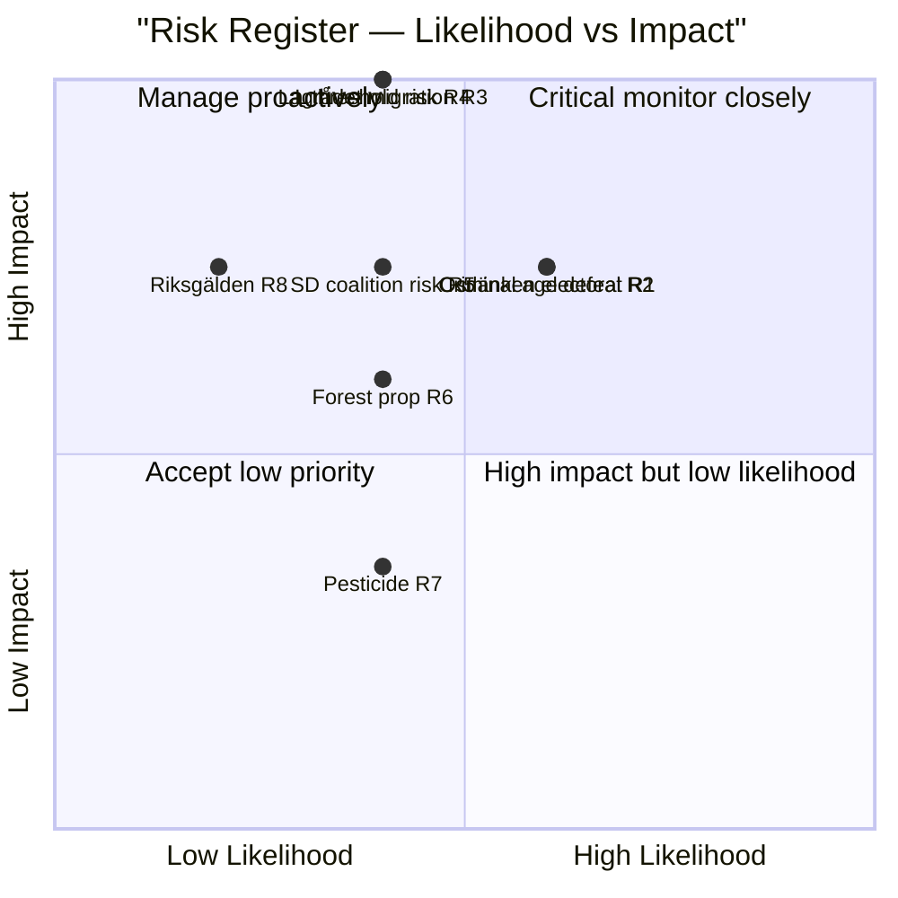

# Risk Assessment — Evening Analysis, 4 May 2026

**Author**: James Pether Sörling | **Date**: 2026-05-04  
**Methodology**: 5-dimension register with Likelihood × Impact scores (1–5 each)

---

## Risk Register

| # | Risk | Dimension | L | I | L×I | Priority |
|---|------|-----------|---|---|-----|----------|
| R1 | Criminal age committee defeat (13yr threshold) | Legislative | 3 | 4 | 12 | HIGH |
| R2 | Ostlänken accountability escalation — electoral loss in Östergötland marginal seats | Electoral | 3 | 4 | 12 | HIGH |
| R3 | Lagrådet adverse opinion on HD03262 — migration delay | Legal/Constitutional | 2 | 5 | 10 | HIGH |
| R4 | L falls below 4% threshold (parliamentary exit) | Electoral/Coalition | 2 | 5 | 10 | HIGH |
| R5 | SD energy policy (gas bridge) splits coalition before election | Coalition | 2 | 4 | 8 | MEDIUM |
| R6 | Forest management prop 242 fails MJU committee (V + S + MP majority) | Legislative | 2 | 3 | 6 | MEDIUM |
| R7 | Pesticide tax compensation delayed → healthcare sector opposition | Fiscal/Operational | 2 | 2 | 4 | LOW |
| R8 | Riksgälden evaluation reveals unexpected fiscal risk | Fiscal | 1 | 4 | 4 | LOW |
| R9 | KU39 transparency bill triggers party financing disclosure crisis | Political | 1 | 3 | 3 | LOW |

---

## Risk Dimension Analysis

### 1. Legislative Risk

**R1 — Criminal age threshold (prop 246, 13 years)**  
Likelihood: 3/5 — S and V alignment against 13-year threshold (S: 14-year demand, HD024136; V: outright rejection, HD024142) creates a potential committee majority against. L is uncertain. The government could lose JuU committee unless it concedes to 14 years.  
Impact: 4/5 — A committee defeat on flagship crime legislation 132 days before election is a significant governance failure signal.  
Cascading risk: If government concedes to 14 years, SD may oppose the concession, creating an intra-coalition dispute.

**R6 — Forest management prop 242**  
Likelihood: 2/5 — V's demand for outright rejection (HD024141) would require S or C support in committee to defeat the government. S's exact position is unclear from partial metadata.  
Impact: 3/5 — Failure of forest management legislation is a secondary loss; easier to manage than the criminal age issue.

### 2. Electoral Risk

**R2 — Ostlänken/Östergötland**  
Likelihood: 3/5 — Interpellation is filed; ministerial answer (May 25) will generate regional media coverage. Whether this translates into seat losses depends on Carlson's answer quality and S's ability to amplify locally.  
Impact: 4/5 — Östergötland had 3–4 competitive mandates in 2022. If S can lock in a "KD abandoned Linköping" narrative, even one seat change could affect coalition arithmetic.

**R4 — L threshold risk**  
Likelihood: 2/5 — Polls show L at 4.2–5.0% range (from election-cycle analysis). Threshold risk is real but manageable.  
Impact: 5/5 — If L exits parliament, the Tidö coalition loses its majority in the new parliament (M+KD+SD = ~47% in current polling; below 50%).

### 3. Legal/Constitutional Risk

**R3 — Lagrådet on HD03262 migration**  
Likelihood: 2/5 — Lagrådet has previously issued adverse opinions on migration legislation but not blocked it. PIR-RT-001 remains open. If Lagrådet issues an unfavorable yttrande, it creates a political cost (opposition can cite constitutional concerns) even if not legally blocking.  
Impact: 5/5 — A formal Lagrådet adverse opinion on the migration capstone would be the most significant legal risk in this parliamentary term.

### 4. Coalition Risk

**R5 — SD gas bridge demand**  
Likelihood: 2/5 — SD's interpellation HD10459 on agency activism and prior interventions on energy show SD using parliamentary tools for pre-election identity messaging. A formal coalition rupture over gas bridge is unlikely pre-election.  
Impact: 4/5 — Any coalition rupture in the 132-day window would be catastrophic for the government's "stable government" narrative.

---

## Posterior Probability Update

| Risk | Prior (base rate) | New evidence (May 4) | Posterior |
|------|------------------|---------------------|-----------|
| R1 (criminal age defeat) | 0.25 | S+V both filed opposing motions (HD024142+HD024136) | 0.35 |
| R2 (Ostlänken electoral loss) | 0.20 | Interpellation filed, ministerial deadline set | 0.30 |
| R3 (Lagrådet adverse) | 0.20 | No yttrande yet; timing pressure | 0.22 |
| R4 (L threshold) | 0.15 | No new poll data today | 0.15 |

---

## Mermaid Risk Map

