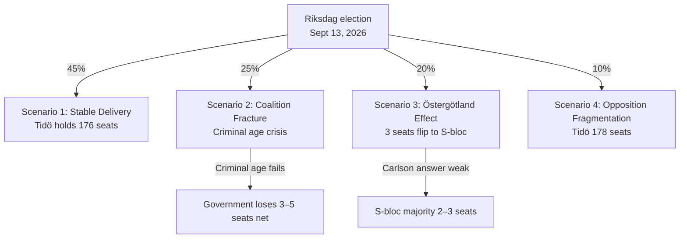

# Scenario Analysis — Evening Analysis, 4 May 2026

**Author**: James Pether Sörling | **Date**: 2026-05-04  
**Gate requirement**: ≥3 scenarios summing to 100%

---

## Scenario Architecture (132 days to election)

### Structural Assumptions

- Election date: September 13, 2026
- Current polling: Tidö coalition 48–49%, S-bloc 49–50%
- Key bifurcations: (1) criminal age threshold outcome, (2) Ostlänken narrative, (3) migration normalization effect, (4) L threshold

---

## Scenario 1: Stable Delivery (45%)

**Label**: "Tidö Delivers"  
**Probability**: 45%  
**Trigger conditions**: Criminal age passes (with or without concession to 14yr); Ostlänken managed locally; migration normalisation fails to materially boost S; L holds above 4.5%.

**Narrative**: The government completes its legislative agenda — nuclear (June 17), transparency (June 16), criminal age (July 1), defence (July 1) — and enters the election campaign as a proven delivery machine. The "no infrastructure crisis" framing holds in Östergötland because Carlson announces a compensatory connectivity package on May 25. L survives above 4.5%.

**Policy outcomes**:
- Prop 246 criminal age: passes at 13yr OR amended to 14yr with coalition support
- KU39 transparency: passes June 16 unanimously
- Nuclear NU19: effective June 17 with positive media coverage
- Lagrådet: issues routine yttrande on migration (no adverse opinion)
- L polls: 4.5–5.2% → retains 17–18 seats

**Electoral outcome**: Tight race; government retains majority by 2–4 seats. Tidö coalition ~176 seats.

---

## Scenario 2: Criminal Age Crisis (25%)

**Label**: "Coalition Fracture Signal"  
**Probability**: 25%  
**Trigger conditions**: L refuses concession; S+V form committee majority against 13yr threshold; government either loses committee vote or concedes to 14yr; SD publicly opposes concession.

**Narrative**: JuU9 committee deliberations reveal that L cannot support the 13-year threshold. The government either suffers a formal committee defeat (worst case) or makes a visible concession to 14 years that enrages SD. This creates a "coalition in disarray" media narrative 60–80 days before the election.

**Policy outcomes**:
- Prop 246: fails at committee or passes at 14yr
- SD: publicly distances itself from concession
- L: temporarily lifts polling to 5.5% on "independence" narrative
- Carlson: Ostlänken answer fails to contain damage; Östergötland seats at risk

**Electoral outcome**: Government loses 3–5 seats net; potential minority government in new term. Bloc gap narrows to 0–2 seats against government.

---

## Scenario 3: Regional Accountability Cascade (20%)

**Label**: "Östergötland Effect"  
**Probability**: 20%  
**Trigger conditions**: Carlson delivers weak or evasive May 25 answer; S successfully localizes the Linköping station cancellation as a betrayal narrative; regional media coverage persists June–August.

**Narrative**: The Ostlänken interpellation answer fails to reassure Linköping residents. S, with regional infrastructure as its core campaign theme in Östergötland, mobilizes 35,000 swing voters. Three Riksdag seats change hands in Östergötland, Jönköping, and southern Stockholm commuter belt.

**Policy outcomes**:
- Prop 246: passes (criminal age resolved separately)
- Regional swing: 3 seats lost in commuter and Östergötland districts
- Government loses its working majority

**Electoral outcome**: New parliament results in S-bloc majority of 2–3 seats; Andersson appointed PM. Tidö coalition loses power despite high aggregate vote share (individual seat distribution unfavorable).

---

## Scenario 4: Opposition Fragmentation / Government Holds (10%)

**Label**: "S-bloc Collapse"  
**Probability**: 10%  
**Trigger conditions**: MP falls below 4% threshold AND C drops further; S-bloc loses sufficient seats to give Tidö a working majority.

**Narrative**: Despite government difficulties on criminal age and Ostlänken, the opposition is more fragmented. MP's climate-vs-agriculture split causes sub-4% polling. C fails to recover from rural protest votes going to SD. S-bloc ends up at 171 seats; government retains 178.

**Policy outcomes**:
- All government bills pass
- Second Tidö term (potentially without L if L exits)
- SD becomes kingmaker in a near-majority M+KD+SD configuration

**Electoral outcome**: Tidö coalition second term, ~178 seats.

---

## Probability Summary

| Scenario | Probability | Direction |
|----------|------------|---------|
| 1: Stable Delivery | 45% | Government holds majority |
| 2: Criminal Age Crisis | 25% | Government weakened; possible loss |
| 3: Regional Accountability Cascade | 20% | Government loses majority |
| 4: Opposition Fragmentation | 10% | Government larger majority |
| **Total** | **100%** | |

---

## Mermaid Scenario Probability Tree

