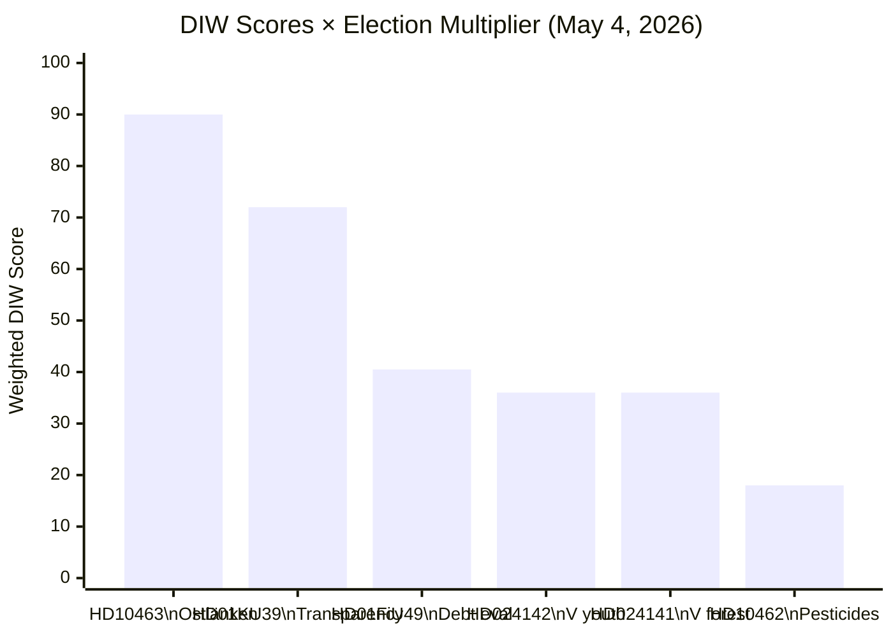

# Significance Scoring — Evening Analysis, 4 May 2026

**Author**: James Pether Sörling | **Date**: 2026-05-04  
**Methodology**: DIW (Document depth × Political Impact × Wider significance) × 1.5 election proximity multiplier

---

## DIW Scores Per Document

| dok_id | Title | D (1–5) | I (1–5) | W (1–5) | Raw DIW | ×1.5 Election | Tier |
|--------|-------|---------|---------|---------|---------|--------------|------|
| HD10463 | Ostlänken interpellation (S→KD Carlson) | 3 | 4 | 5 | 60 | 90.0 | L3 Intelligence |
| HD01FiU49 | Debt management evaluation 2021–25 | 3 | 3 | 3 | 27 | 40.5 | L2+ Priority |
| HD01KU39 | Transparency betänkande | 3 | 4 | 4 | 48 | 72.0 | L2+ Priority |
| HD024142 | V motion youth crime (reject 13-yr) | 2 | 3 | 4 | 24 | 36.0 | L2 Strategic |
| HD024141 | V motion forest management (reject) | 2 | 3 | 4 | 24 | 36.0 | L2 Strategic |
| HD10462 | Pesticide tax interpellation (S→M) | 2 | 2 | 3 | 12 | 18.0 | L1 Surface |
| HD11780 | S question biofuel investments | 1 | 2 | 2 | 4 | 6.0 | L1 Surface |
| HD11779 | C question education/unemployment | 1 | 2 | 2 | 4 | 6.0 | L1 Surface |
| HD024143–147 cluster | Forest management motions (cluster) | 1 | 2 | 2 | 4 | 6.0 | L1 cluster |
| HD024146, HD024148 cluster | Youth crime motions (cluster) | 1 | 2 | 3 | 6 | 9.0 | L1 cluster |

---

## Scoring Rationale

**HD10463 (90.0)**: Highest today. Regional infrastructure accountability interpellation with direct electoral implications for Östergötland marginal seats. KD minister's response (due May 25) will become campaign material. W=5 because Ostlänken affects regional development policy for 500,000 people and is connected to Sweden's NATO-integration industrial base (Saab-Linköping).

**HD01KU39 (72.0)**: Constitutional committee betänkande on political transparency. Processes HD03258, which requires all political parties to disclose financing sources. High political sensitivity — directly affects all parties' fundraising practices before the election. D=3 because the document is not yet published (only committee calendar available).

**HD01FiU49 (40.5)**: Finance committee evaluation of Riksgälden 2021–2025. D=3 reflects that this is a formal committee evaluation with IMF economic context. I=3 because fiscal stewardship is a key campaign theme; W=3 because debt management affects macroeconomic risk perception. Sweden's ~34% GDP debt ratio (IMF WEO Apr-2026) will be cited as a government achievement.

**HD024142 (36.0)**: V's motion against youth crime proposition targeting the 13-year criminal age. Full text confirmed: V demands outright rejection of core elements. Combined with S's HD024136 (14-year threshold), the opposition is aligned against the most controversial element. Electoral: crime policy is a top voter priority.

**HD024141 (36.0)**: V's motion against forest management proposition. Outright rejection of prop 242 except appeal route reform signals environmental protection as a core V campaign message.

---

## Sensitivity Analysis

| Variable | Change | Impact on Rankings |
|----------|--------|-------------------|
| Election proximity multiplier | Remove (1.0×) | HD10463 drops from rank 1 to rank 3; KU39 rises |
| If Ostlänken resolved pre-election | Remove W=5 → W=2 | HD10463 drops to tier L2; FiU49 or KU39 becomes lead story |
| If V/S criminal age demand succeeds in committee | I: 3→5 for HD024142 | Youth crime motions cluster becomes L3 Intelligence |
| IMF growth revision downward | NGDP_RPCH <1.5% | FiU49 I: 3→4; fiscal management becomes higher stakes |

---

## Mermaid Rank Diagram

