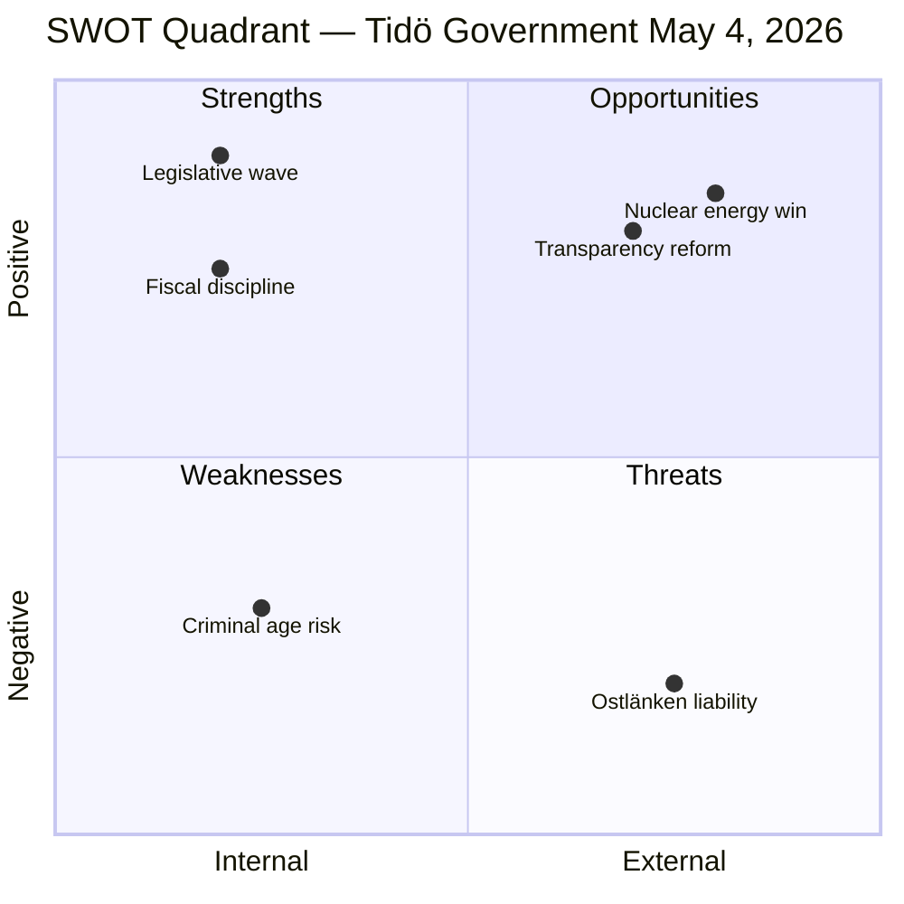

# SWOT Analysis — Evening Analysis, 4 May 2026

**Author**: James Pether Sörling | **Date**: 2026-05-04  
**Framework**: Political SWOT for May 4 legislative intelligence; 132 days to election

---

## SWOT Matrix

### STRENGTHS (Tidö Government + Legislative Agenda)

| # | Strength | Evidence | dok_id / Source |
|---|----------|----------|----------------|
| S1 | Coordinated June legislative wave | KU39 (June 16), NU19 (June 17), JuU9 (July 1), FöU13 (July 1) — four major bills synchronized | HD01KU39, realtime-pulse synthesis |
| S2 | Fiscal discipline narrative | Sweden's ~34% GDP debt ratio (EU minimum); FiU49 five-year evaluation of Riksgälden underway | HD01FiU49, IMF WEO Apr-2026 |
| S3 | Transparency agenda locked in | HD03258 political financing bill scheduled for June 16 vote — pre-election pro-accountability messaging | HD01KU39 |
| S4 | Migration capstone nearly complete | HD03262–265 on parliamentary calendar; government has delivered on its core Tidö mandate | Propositions sibling synthesis |
| S5 | Nuclear energy breakthrough | HD01NU19 (effective June 17) — largest structural energy policy shift in 20 years; delivered pre-election | Realtime-pulse synthesis |

### WEAKNESSES (Tidö Government)

| # | Weakness | Evidence | dok_id / Source |
|---|----------|----------|----------------|
| W1 | Criminal age threshold vulnerability | S (14 yr) and V (rejection) both oppose 13-year threshold; L is uncertain; possible committee defeat or forced concession | HD024142, HD024136 (from motions sibling) |
| W2 | Regional infrastructure credibility gap | Ostlänken Linköping station cancellation affecting 500,000-person labour market in marginal-seat territory | HD10463 |
| W3 | Healthcare tax anomaly unresolved | Disinfectant pesticide tax hitting healthcare providers — Svantesson facing S accountability question | HD10462 |
| W4 | SFV heritage maintenance backlog | Riksrevisionen RiR 2025:30: 4 billion SEK maintenance deficit at Statens Fastighetsverk | Interpellations sibling synthesis |
| W5 | ESA contribution ranking fall | Sweden dropped from ~rank 11–12 to rank 17 in ESA contributions 2022–2025; knowledge economy narrative undermined | HD10461 (interpellations sibling) |

### OPPORTUNITIES (Government)

| # | Opportunity | Evidence |
|---|------------|---------|
| O1 | Fiscal stewardship positioning | FiU49's positive Riksgälden evaluation can be framed as "responsible economic management" ahead of election |
| O2 | Transparency bill as governance reform | KU39 passage gives government a pre-election claim to "restoring trust in democracy" |
| O3 | Nuclear as innovation platform | NU19's June 17 implementation creates a clean energy / energy security narrative for the election campaign |
| O4 | Forest management opposition split | V/S/MP/C have different demands on prop 242 — a divided opposition is easier to manage in committee |

### THREATS (to Government)

| # | Threat | Evidence | dok_id |
|---|--------|---------|--------|
| T1 | Ostlänken regional campaign liability | Carlson's May 25 answer becomes S campaign material in Östergötland — potentially 4 marginal seats affected | HD10463 |
| T2 | Criminal age committee defeat | If L or KD internal members waver, the 13-year threshold fails committee → coalition embarrassment | HD024142 |
| T3 | Lagrådet migration delay risk | PIR-RT-001 open: Lagrådet yttrande on HD03262/265 could trigger legal challenge requiring amendment | Realtime-pulse PIRs |
| T4 | Post-migration polling erosion | PIR-RT-003: if polls show S gaining on migration normalisation, government narrative weakens | Realtime-pulse PIRs |

---

## TOWS Matrix

| | Opportunities | Threats |
|--|--------------|--------|
| **Strengths** | **S1+O3**: Use nuclear NU19 as evidence that the government delivers on long-term energy promises — contrast with Ostlänken delay | **S3+T1**: Transparency bill KU39 passage can be framed as contrast to opposition's accountability attacks — "we legislate, they complain" |
| **Weaknesses** | **W1+O4**: Forest management opposition split creates space to pass a modified prop 242 with targeted amendments, reducing V's total-rejection narrative | **W1+T2**: If criminal age threshold becomes a coalition crisis, amend to 14 years before committee vote — concession is better than defeat |

---

## Cross-SWOT from Sibling Analyses

- **Propositions SWOT**: Migration capstone (S1) confirmed; legal challenge risk (T3) carried forward
- **Motions SWOT**: Criminal age alignment between S/V (W1/T2) confirmed as primary opposition leverage
- **Interpellations SWOT**: Regional accountability (W2/T1) identified as most electorally dangerous opposition vector
- **Realtime-pulse SWOT**: Nuclear delivery (O3) and Lagrådet risk (T3) cross-confirmed

---

## Mermaid SWOT Visualization

