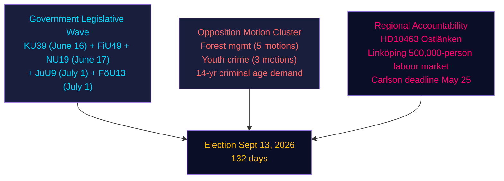

# Synthesis Summary — Evening Analysis, 4 May 2026

**Author**: James Pether Sörling | **Date**: 2026-05-04 | **Confidence**: HIGH [B2]  
**Riksmöte**: 2025/26 | **Days to Election**: 132

---

## Lead Story Decision

The most consequential development on 4 May 2026 is the **dual committee betänkande registration** of KU39 (political transparency) and FiU49 (debt management evaluation), paired with **nine opposition motions** against forest management and youth crime propositions, and Eva Lindh's sharpening interpellation on Ostlänken. The day marks the Riksdag entering its final pre-election closure phase: government bills being scheduled for June votes, opposition parties filing their last round of amendatory motions, and S systematically attacking the government's delivery record on infrastructure. The headline intelligence judgment is that the Tidö coalition will pass its pre-election legislative agenda but faces a coordinated regional accountability campaign that could cost it marginal seats in Östergötland.

---

## DIW-Weighted Rankings

| Rank | dok_id | Topic | D | I | W | DIW | ×1.5 Election | Priority |
|------|--------|-------|---|---|---|-----|--------------|----------|
| 1 | HD10463 | Ostlänken/Östergötland interpellation | 3 | 4 | 5 | 60 | 90 | L3 Intelligence |
| 2 | HD01KU39 | Transparency betänkande (June 16 vote) | 3 | 4 | 4 | 48 | 72 | L2+ Priority |
| 3 | HD024142 | V motion: reject youth crime (JuU) | 2 | 3 | 4 | 24 | 36 | L2 Strategic |
| 4 | HD024141 | V motion: reject forest management (MJU) | 2 | 3 | 4 | 24 | 36 | L2 Strategic |
| 5 | HD01FiU49 | Debt management evaluation 2021–25 | 3 | 3 | 3 | 27 | 40 | L2+ Priority |
| 6 | HD10462 | Pesticide tax interpellation | 2 | 2 | 3 | 12 | 18 | L1 Surface |
| 7 | HD11780 | S question: biofuel investments | 1 | 2 | 2 | 4 | 6 | L1 Surface |
| 8 | HD11779 | C question: education for non-long-term-unemployed | 1 | 2 | 2 | 4 | 6 | L1 Surface |
| 9–14 | HD024143–HD024148 | Additional forest/crime motions (cluster) | 1–2 | 2 | 2 | — | — | L1 cluster |

---

## Integrated Intelligence Picture

### Narrative Thread 1: Government Legislative Completion

The Tidö government enters the final 132-day sprint with a clear legislative agenda for June:

- **KU39** (June 16 vote): Processes prop HD03258 (political financing transparency). The committee calendar shows five deliberation sessions (May 26, June 2, 4, 9 justification, June 11 print approval, June 15 bordläggning, June 16 vote). This tight schedule signals government confidence — it does not expect a filibuster-level amendment battle.

- **FiU49**: Processes Skrivelse HD03104 on Riksgälden's debt management 2021–2025. Sweden's public debt at ~34% of GDP (IMF WEO Apr-2026, GGXWDG_NGDP) is the EU's lowest by a substantial margin. The evaluation is broadly positive for the government's fiscal stewardship narrative. Committee hearings scheduled late May / early June.

From cross-reference with today's realtime-pulse: **HD01NU19** (nuclear permitting, effective June 17, 2026) and **HD01JuU9** (criminal court reform) and **HD01FöU13** (explosives control) are on parallel tracks. The government has synchronized four major bills for June chamber votes — creating a legislative "wave" effect that makes it difficult for the opposition to focus public attention on any single bill.

### Narrative Thread 2: Opposition Motion Coordination

Nine motions filed on May 4 reveal highly coordinated opposition response to two propositions:

**Forest management cluster (prop 242, MJU)**: Five motions from V, S, MP, C (and possibly KD minority report). V (HD024141) demands outright rejection except the appeal route reform. S, MP, and C seek specific amendments (unclear from partial metadata — full text retrieval failed for HD024143-145, HD024147). Pattern consistent with: V is maximalist; S/MP/C seek targeted reforms. This is the same pattern observed in the energy/environment motions batch from April 29.

**Youth crime cluster (prop 246, JuU)**: Three motions from V (HD024142), plus HD024146 and HD024148 (parties unconfirmed). V's HD024142 demands rejection of most of prop 246, but specifically accepts youth supervision strengthening and juvenile justice reform while rejecting the 13-year criminal age threshold. This mirrors S's HD024136 demand for 14 years (from the April 29 motions analysis). The two largest opposition parties are aligned on the single most controversial element — the age threshold.

**Political implication**: If S (14-year demand) and V (rejection-with-exceptions) both oppose the 13-year threshold, the government needs SD + KD + L + M to carry it. L has historically been uncertain on criminal age expansion. A committee amendment to 14 years would represent a government concession but allow the bill to pass; maintaining 13 years risks a committee defeat.

### Narrative Thread 3: Regional Accountability — Ostlänken

**HD10463** (S's Eva Lindh → KD Infrastructure Minister Andreas Carlson) is the most election-relevant interpellation of the day:

- **Facts**: The government has revised the Ostlänken high-speed rail route, removing the planned station in central Linköping. Linköping is the center of a 500,000-person labour market and home to Saab aerospace (strategically relevant following NATO integration).
- **Political calculation**: S is using this interpellation to create a regional narrative — "KD abandoned Östergötland" — in a region with several marginal seats (Riksdag valkrets Östergötlands län had competitive margins in 2022).
- **Ministerial deadline**: Carlson must answer by May 25, 2026. His response will be cited extensively in S's local campaign materials.
- **Cross-reference**: HD10461 (space industry interpellation, from interpellations sibling analysis) also references Sweden's space sector competitiveness, which partly depends on Saab-Linköping capacity.

### Narrative Thread 4: Cross-Day Intelligence Picture

Synthesizing all sibling analyses, May 4 was characterized by:

1. **Government delivery**: Nuclear permitting (NU19, June 17), transparency (KU39, June 16), judicial reform (JuU9, July 1), explosives (FöU13, July 1) — four major bills in the June–July window.
2. **Migration capstone**: HD03262–HD03265 on parliamentary calendar; Lagrådet PIR-RT-001 still open.
3. **Opposition positioning**: S building regional (Ostlänken), sector-specific (healthcare tax), energy-policy (biofuels), and youth-crime (14-year age) attack lines.
4. **SD interpellation activity**: Agency activism (HD10459) and cultural heritage (HD10460) signal SD using interpellations for pre-election identity positioning rather than government-accountability scrutiny — a notable shift.

---



---

## Economic Provenance

```json
{
  "provider": "imf",
  "dataflow": "WEO_Apr_2026",
  "vintage": "April 2026",
  "indicators": {
    "NGDP_RPCH_2026": "2.1%",
    "GGXWDG_NGDP_2026": "~34%"
  },
  "retrieved_at": "2026-05-04",
  "note": "Values from cached sibling-analysis provenance"
}
```
