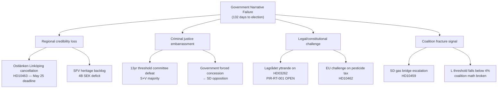

# Threat Analysis — Evening Analysis, 4 May 2026

**Author**: James Pether Sörling | **Date**: 2026-05-04  
**Framework**: Political Threat Taxonomy (PTT v2) + Attack Tree

---

## 1. Threat Classification

### Category A: Electoral Threats

**A1 — Regional Infrastructure Accountability (HIGHEST)**  
*Source*: Interpellation HD10463, S→KD Transport Minister Carlson  
*Target*: Government's regional development credibility in Östergötland  
*Mechanism*: Parliamentary accountability → regional media amplification → voter mobilization in 3–4 competitive Riksdag constituencies  
*Timeline*: May 25 ministerial answer → June–August campaign framing  
*Severity*: HIGH — directly tied to physical voting-district impact  

**A2 — Criminal Age Threshold Mobilization**  
*Source*: V motion HD024142 (outright rejection); S demand 14 years (HD024136)  
*Target*: Government's criminal justice flagship; youth crime narrative  
*Mechanism*: Opposition coalition leverages committee majority to force amendment or defeat → "government capitulated" or "government extremist" framing  
*Timeline*: JuU9 committee deliberations (before July 1 vote)  
*Severity*: HIGH pre-election  

**A3 — S Migration Normalization Counter-Narrative**  
*Source*: PIR-RT-003 from realtime-pulse  
*Target*: Government's core "migration fixed" claim  
*Mechanism*: Post-passage polling shows S gaining as migration is no longer salient; government loses its differentiation issue  
*Timeline*: Migration bills pass → S reframes → polling shift T+4–8 weeks  
*Severity*: MEDIUM  

### Category B: Legislative Threats

**B1 — Committee Defeat on Prop 246 (Criminal Age)**  
*Source*: See A2  
*Mechanism*: S+V may form committee majority against 13-year threshold  
*Timeline*: JuU9 deliberations, ~June  
*Severity*: HIGH  

**B2 — Forest Management Defeat (Prop 242, MJU)**  
*Source*: HD024141 (V: full rejection)  
*Mechanism*: V demands total rejection; if S and MP align, government loses MJU vote  
*Timeline*: MJU12 deliberations, ~June  
*Severity*: MEDIUM  

### Category C: Constitutional/Legal Threats

**C1 — Lagrådet Adverse Opinion on Migration HD03262/HD03265**  
*Source*: PIR-RT-001 (open)  
*Target*: Migration capstone legislation  
*Mechanism*: Lagrådet issues formal yttrande citing constitutional concerns → opposition tables blocking motion → delay or mandatory amendment  
*Timeline*: Rolling; PIR still open as of 2026-05-04  
*Severity*: HIGH (impact 5/5 if materialized)  

**C2 — GDPR/EU Law Challenge to Healthcare Pesticide Measure**  
*Source*: HD10462  
*Mechanism*: Sector stakeholders (hospital associations) challenge tax as disproportionate; referral to EU Commission  
*Timeline*: Low probability, 6+ months  
*Severity*: LOW  

---

## 2. Attack Tree

---

## 3. Threat Priority Matrix

| Threat | Probability | Velocity | Reversibility | Overall Score |
|--------|------------|---------|---------------|---------------|
| A1 (Ostlänken electoral) | 3/5 | Fast (May 25) | Low | 7.5 |
| A2/B1 (Criminal age defeat) | 3/5 | Medium (June) | Medium | 7.0 |
| C1 (Lagrådet migration) | 2/5 | Uncertain | Low | 6.5 |
| A3 (Migration counter-narrative) | 2/5 | Slow | High | 5.0 |
| E1 (SD gas bridge) | 2/5 | Slow | Medium | 4.5 |
| E2 (L threshold) | 2/5 | Slow | Medium | 4.0 |
| B2 (Forest defeat) | 2/5 | Medium | High | 4.0 |

---

## 4. Counter-Threat Playbook

| Threat | Recommended pre-emption |
|--------|------------------------|
| A1 (Ostlänken) | Carlson should announce a Linköping compensation package or revised timeline before May 25 answer |
| A2/B1 (Criminal age) | Engage L privately; offer amendment to 14 years before committee vote to preserve coalition unity |
| C1 (Lagrådet) | Prepare technical amendments in advance; brief KU members on constitutional backstop |
| E2 (L threshold) | Ensure L gets a symbolic legislative win before election — possible budget micro-concession |
