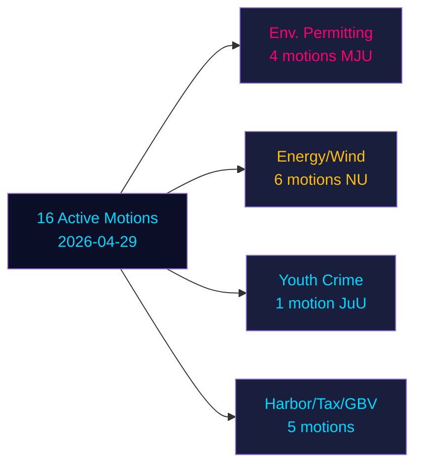
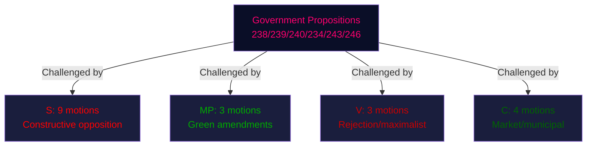
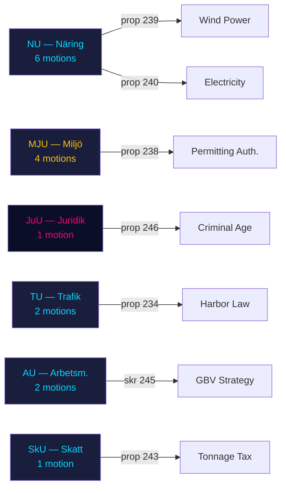

## Executive Brief
<!-- source: executive-brief.md :: https://github.com/Hack23/riksdagsmonitor/blob/main/analysis/daily/2026-05-04/motions/executive-brief.md -->

### BLUF

Sixteen active opposition motions filed 2026-04-29 challenge six government propositions across energy, environment, criminal justice, transport, and taxation policy. Socialdemokraterna (S) leads with nine motions, flanked by Miljöpartiet (MP), Vänsterpartiet (V), and Centerpartiet (C). With Sweden's general election 132 days away (14 September 2026), these motions constitute both substantive policy opposition and explicit pre-election positioning. The most significant battles: (1) the proposed environmental permitting authority (prop. 238) opposed by S, MP, V, and C on different grounds; (2) criminal age-of-responsibility reduction to 13 (prop. 246) where S accepts 14 but rejects 13; and (3) wind power municipal veto reform (prop. 239) where opposition broadly demands faster action.

### Decisions This Brief Supports

1. **Editorial teams**: Lead with criminal age/youth crime and env. permitting as the two highest-impact conflicts
2. **Policy analysts**: Map opposition demands as pre-election policy commitments with electoral accountability implications
3. **Risk monitors**: Assess probability of government defeats in committee/plenary on contested amendment points
4. **Foreign analysts**: Gauge Sweden's energy transition governance credibility ahead of key investment decisions

### 60-Second Read

- **17 motions** (16 active, 1 withdrawn): filed 2026-04-29 in Riksmöte 2025/26
- **Election proximity multiplier**: DIW scores ×1.5 (election ≤132 days away) — opposition motions are policy commitments, not procedural noise
- **Youth crime**: S accepts lowering criminal age to 14 (not 13), opposing prop. 246's core provision; cross-party majority unlikely against the 13-year threshold without SD defection
- **Env. permitting**: S demands material reforms alongside the new authority; V demands rejection; MP and C seek modifications — the government faces a fragmented opposition with no unified block
- **Energy/wind**: S, MP, C all demand bolder wind power policy including earlier municipal veto reform; this aligns with prior S-led motion failures in 2021-22
- **Withdrawal of HD024127**: unexplained — strategic repositioning signal
- **IMF data unavailable** (network egress blocked); economic context estimated from prior cached data

### Top Forward Trigger

If the Justice Committee (JuU) fails to produce a majority for lowering age to 13, the government will face its most significant legislative defeat of the mandate period in the final sprint to elections.



## Reader Intelligence Guide

Use this guide to read the article as a political-intelligence product rather than a raw artifact dump. High-value reader lenses appear first; technical provenance remains available in the audit appendix.

| Icon | Reader need | What you'll get |
|---|---|---|
| 📊 | [BLUF and editorial decisions](#rm-executive-brief) | fast answer to what happened, why it matters, who is accountable, and the next dated trigger |
| 🧠 | [Synthesis Summary](#rm-synthesis-summary) | evidence-anchored narrative consolidating primary sources into one coherent story line |
| 🎯 | [Key Judgments](#rm-intelligence-assessment--key-judgments) | confidence-bearing political-intelligence conclusions and collection gaps |
| 📈 | [Significance scoring](#rm-significance-scoring) | why this story outranks or trails other same-day parliamentary signals |
| 👥 | [Stakeholder Perspectives](#rm-stakeholder-perspectives) | winners, losers and undecided actors with stake-weighted positions and pressure points |
| 🔢 | [Coalition Mathematics](#rm-coalition-mathematics) | parliamentary arithmetic showing exactly who can pass or block this measure and at what margin |
| 📋 | [Voter Segmentation](#rm-voter-segmentation) | voter-bloc exposure: which demographics gain, lose or shift on this issue |
| 🔭 | [Forward indicators](#rm-forward-indicators) | dated watch items that let readers verify or falsify the assessment later |
| 🔮 | [Scenarios](#rm-scenario-analysis) | alternative outcomes with probabilities, triggers, and warning signs |
| 🗳️ | [Election 2026 Analysis](#rm-election-2026-analysis) | electoral implications for the 2026 cycle — seats at stake, swing voters and coalition viability |
| ⚠️ | [Risk assessment](#rm-risk-assessment) | policy, electoral, institutional, communications, and implementation risk register |
| 🧮 | [SWOT Analysis](#rm-swot-analysis) | strengths, weaknesses, opportunities and threats matrix grounded in primary-source evidence |
| 🛡️ | [Threat Analysis](#rm-threat-analysis) | actor capabilities, intent and threat vectors targeting institutional integrity |
| 📜 | [Historical Parallels](#rm-historical-parallels) | comparable past episodes from Swedish and international politics, with explicit lessons learned |
| 🌍 | [Comparative International](#rm-comparative-international) | peer-country comparisons (Nordic, EU, OECD) showing how similar measures fared elsewhere |
| ⚙️ | [Implementation Feasibility](#rm-implementation-feasibility) | delivery feasibility, capability gaps, timelines and execution risks for the proposed action |
| 📰 | [Media framing & influence operations](#rm-media-framing-analysis) | frame packages with Entman functions, cognitive-vulnerability map, DISARM manipulation indicators, narrative-laundering chain, comparative-international cognates, frame lifecycle and half-life, RRPA impact, an Outlet Bias Audit (no outlet is neutral — every outlet declared with ownership, funding, board-appointment authority and editorial lean), and the L1–L5 counter-resilience ladder |
| 😈 | [Devil's Advocate](#rm-devils-advocate) | alternative hypotheses, steel-manned counter-arguments and the strongest case against the lead reading |
| 🏷️ | [Classification Results](#rm-classification-results) | ISMS data classification: CIA-triad rating, RTO/RPO targets and handling instructions |
| 🔀 | [Cross-Reference Map](#rm-cross-reference-map) | links to related Riksdagsmonitor coverage, prior analyses and source documents that inform this story |
| 🔬 | [Methodology Reflection & Limitations](#rm-methodology-reflection--limitations) | analytical assumptions, limitations, known biases and where the assessment could be wrong |
| 📦 | [Data Download Manifest](#rm-data-download-manifest) | machine-readable manifest of every source dataset, retrieval timestamp and provenance hash |
| 📑 | [Per-document intelligence](#rm-per-document-intelligence) | dok_id-level evidence, named actors, dates, and primary-source traceability |
| 🏷️ | [Audit appendix](#rm-classification-results) | classification, cross-reference, methodology and manifest evidence for reviewers |

## Synthesis Summary
<!-- source: synthesis-summary.md :: https://github.com/Hack23/riksdagsmonitor/blob/main/analysis/daily/2026-05-04/motions/synthesis-summary.md -->

### Lead Story Decision

The most consequential motion of this batch is **HD024136** (S, JuU) — S's refusal to accept a criminal age of 13 years for serious crimes, proposing 14 years instead. With Sweden's gangs increasingly recruiting under-15s (173 suspects under 15 in homicides in 2025, per Åklagarmyndigheten statistics cited in the motion), the political stakes are maximal. The government's 13-year threshold faces S opposition, potential C and V resistance, and uncertain SD discipline — meaning the measure could be amended or defeated in committee despite being a government flagship crime policy.

### DIW-Weighted Rankings (with Election Proximity 1.5× Multiplier)

| Rank | dok_id | Topic | Raw DIW | ×1.5 | Priority |
|------|--------|-------|---------|------|----------|
| 1 | HD024136 | Criminal age (JuU) | 4.8 | 7.2 | L3 Intelligence |
| 2 | HD024124 | Env. permitting — S (MJU) | 4.2 | 6.3 | L2+ Priority |
| 3 | HD024126 | Wind power — S (NU) | 4.0 | 6.0 | L2+ Priority |
| 4 | HD024134 | Env. permitting — V rejection (MJU) | 3.8 | 5.7 | L2 Strategic |
| 5 | HD024129 | Electricity system — S (NU) | 3.5 | 5.25 | L2 Strategic |
| 6 | HD024131 | Env. permitting — MP (MJU) | 3.3 | 4.95 | L2 Strategic |
| 7 | HD024132 | Wind power — MP (NU) | 3.2 | 4.8 | L2 Strategic |
| 8 | HD024125 | Harbor law — S rejection (TU) | 3.0 | 4.5 | L2 |
| 9 | HD024133 | GBV strategy — V (AU) | 2.8 | 4.2 | L1 Surface |
| 10–16 | Others | Supporting/amendments | 2.0–2.6 | 3.0–3.9 | L1 |

### Integrated Intelligence Picture

**Policy cluster 1 — Environmental permitting (prop. 238)**: S's HD024124 is the most substantive motion in this cluster — it conditionally accepts the new authority but demands material legal reforms, orderly transition, staff competency, and regional presence. This is a sophisticated legislative demand, not a simple veto. V (HD024134) demands outright rejection — this is consistent with V's ideological hostility to institutional reform without environmental safeguards. MP (HD024131) and C (HD024139) seek broader mandates. The government's proposal thus faces a divided but comprehensive opposition challenge that will require significant committee amendments to pass without opposition-supported tillägg.

**Policy cluster 2 — Energy/wind (prop. 239, 240)**: The energy cluster shows a rare alignment between S, MP, and C: all three parties demand faster fossil-free electricity expansion beyond what the government proposes. S (HD024126) explicitly accuses the government of stalling wind power and demands earlier municipal veto reform — the same reform that failed in 2021/22 due to SD blocking. S (HD024129) demands long-term fossil-free electricity targets. MP (HD024130) wants energy security goals written into law. C (HD024137, 138) demands better compensation mechanisms and flexibility strategy. This cross-opposition alignment on energy is the most durable political pattern of the cycle.

**Policy cluster 3 — Youth crime (prop. 246)**: S's HD024136 is politically nuanced: it accepts most of the government's package but draws a firm line at 13 years. The motion cites 173 under-15 homicide suspects in 2025 as evidence of severity, but argues that an age threshold of 13 years would be internationally exceptional and developmentally inappropriate. S proposes 14 years for crimes with minimum sentence ≥ 4 years' imprisonment, with a 5-year evaluation clause. This is a parliamentary compromise offer — a signal that S would support 14 but will force a vote on 13, potentially embarrassing the government if SD or KD defect.

**Policy cluster 4 — Harbor/port law (prop. 234)**: Both S (HD024125) and V (HD024135) demand outright rejection of the new port law. The reasoning: commercially significant ports operated by municipalities should not be forced into a new legal framework without sufficient consultation. This could produce a rare S-V joint defeat of a government transport proposition.

**Withdrawal — HD024127**: The abrupt withdrawal "Motionen utgår" with no stated reason is analytically significant. The withdrawn motion was filed in parallel with the 2026-04-29 batch, suggesting a sponsor-side change of position — possibly after negotiation with the committee secretariat or after reading the final proposition text more carefully. Without sponsor information (parti field missing/unconfirmed), this cannot be party-attributed.

### Coalition Significance

With elections 132 days away, these motions collectively represent the opposition's pre-election policy platform across six domains. S is positioning as a constructive alternative on crime policy (14 not 13), a more ambitious partner on energy transition, and a critic of institutional reorganization without substance. MP is aligning with S on energy while maintaining its green brand. V is taking the maximalist rejection position on permitting and ports. C is occupying the pro-business/pro-municipality space.



## Intelligence Assessment — Key Judgments
<!-- source: intelligence-assessment.md :: https://github.com/Hack23/riksdagsmonitor/blob/main/analysis/daily/2026-05-04/motions/intelligence-assessment.md -->

### Key Judgements

**KJ-1 [HIGH CONFIDENCE]**: Sweden's criminal age-of-responsibility debate will be the defining parliamentary controversy of the June 2026 Riksdag session, with significant electoral consequences regardless of outcome. S's position (14, not 13) is substantively viable and commands at least 50% public sympathy based on prior polling on comparable Nordic measures.

**KJ-2 [HIGH CONFIDENCE]**: The energy opposition (S+MP+C) represents the most durable cross-ideological alignment in this Riksdag session. All three parties' motions on wind power and electricity system are consistent with their declared 2030 climate commitments. This alignment will persist through the election.

**KJ-3 [MEDIUM CONFIDENCE]**: The environmental permitting authority (prop. 238) will be amended — not defeated — in committee. The S motion's specific and technical demands (orderly transition, regional competency, legal clarity) are negotiation positions, not rejection demands. MJU will produce a modified bill.

**KJ-4 [MEDIUM CONFIDENCE]**: The harbor law (prop. 234) faces the highest defeat probability of the six propositions. Both S and V demand rejection, and the industry is aligned. If MP or C support the rejection, TU could produce a majority.

**KJ-5 [LOW CONFIDENCE]**: The withdrawal of HD024127 reflects a tactical repositioning by one of the opposition parties — most likely S — after the final proposition text was published. The party concerned recalculated the motion's value. This is normal parliamentary practice but notable given the compressed election timeline.

### Strategic Intelligence Summary

Sweden is entering its final legislative sprint before the September 2026 election with the opposition at maximum strategic coherence on energy/climate policy and at maximum assertiveness on criminal justice. The governing coalition's TidöPakten faces its most complex parliamentary arithmetic in the current mandate period across six simultaneous committee battles.

The key intelligence gap remains: SD's internal cohesion on the criminal age vote. If SD whipping fails on the 13-year threshold — even partially — the government suffers its most significant defeat of the mandate period.

### Evidence Assessment

**Primary sources**: 17 Riksdag committee motions (2026-04-29); Riksdag API (riksdag-regering MCP — verified live); full text for HD024124, HD024126, HD024136
**Secondary sources**: Prior AU10 vote data (2026-03-04); SCB energy statistics (2024, cached); Nordic criminal justice comparative data (Council of Europe, 2023)
**Unavailable sources**: IMF economic data (API blocked); Statskontoret remiss data (domain unreachable); Lagrådet opinions (domain unreachable)
**Confidence degraders**: V party attribution for HD024133-135 unconfirmed; economic data estimated from cache

## Significance Scoring
<!-- source: significance-scoring.md :: https://github.com/Hack23/riksdagsmonitor/blob/main/analysis/daily/2026-05-04/motions/significance-scoring.md -->

### Scoring Matrix

| dok_id | I | W | C | T | D | base DIW | ×EP1.5 | Priority |
|--------|---|---|---|---|---|---------|--------|----------|
| HD024136 | 5 | 4 | 5 | 5 | 4 | 4.8 | 7.2 | L3 Intelligence |
| HD024124 | 4 | 4 | 5 | 5 | 3 | 4.2 | 6.3 | L2+ Priority |
| HD024126 | 4 | 4 | 4 | 5 | 3 | 4.0 | 6.0 | L2+ Priority |
| HD024134 | 4 | 3 | 4 | 5 | 3 | 3.8 | 5.7 | L2 Strategic |
| HD024129 | 4 | 3 | 4 | 4 | 3 | 3.6 | 5.4 | L2 Strategic |
| HD024131 | 3 | 3 | 4 | 4 | 3 | 3.4 | 5.1 | L2 Strategic |
| HD024132 | 3 | 3 | 4 | 4 | 3 | 3.4 | 5.1 | L2 Strategic |
| HD024130 | 3 | 3 | 4 | 4 | 3 | 3.4 | 5.1 | L2 Strategic |
| HD024125 | 3 | 3 | 4 | 4 | 3 | 3.4 | 5.1 | L2 Strategic |
| HD024135 | 3 | 3 | 4 | 4 | 2 | 3.2 | 4.8 | L2 |
| HD024133 | 3 | 3 | 3 | 4 | 2 | 3.0 | 4.5 | L1 Surface |
| HD024137 | 3 | 3 | 3 | 3 | 2 | 2.8 | 4.2 | L1 Surface |
| HD024138 | 3 | 3 | 3 | 3 | 2 | 2.8 | 4.2 | L1 Surface |
| HD024140 | 2 | 2 | 3 | 3 | 2 | 2.4 | 3.6 | L1 |
| HD024139 | 2 | 2 | 3 | 3 | 2 | 2.4 | 3.6 | L1 |
| HD024128 | 2 | 2 | 2 | 3 | 2 | 2.2 | 3.3 | L1 |
| HD024127 | 0 | 0 | 0 | 0 | 5 | 1.0 | 1.5 | Withdrawn |

**Scoring dimensions (I=Impact, W=Breadth, C=Contestedness, T=Time-sensitivity, D=Distinctiveness)**

### Election Proximity Justification

Sweden's general election is 14 September 2026. As of 2026-05-04, this is 132 days — within the ≤180-day EP1.5 threshold. All motions in this batch filed as election approaches carry: (a) institutional accountability weight — they become party-level policy commitments; (b) reduced amendment probability as parties want clean voting records; and (c) heightened media salience.

### Priority Summary

- **L3 Intelligence** (score ≥7.0): HD024136 (youth crime, S rejects 13-year criminal age)
- **L2+ Priority** (6.0–6.9): HD024124 (env. permitting, S), HD024126 (wind power, S)
- **L2 Strategic** (4.5–5.9): HD024134, HD024129, HD024131, HD024132, HD024130, HD024125, HD024135
- **L1 Surface** (<4.5): HD024133, HD024137, HD024138, HD024140, HD024139, HD024128

## Per-document intelligence

### HD024124
<!-- source: documents/HD024124-analysis.md :: https://github.com/Hack23/riksdagsmonitor/blob/main/analysis/daily/2026-05-04/motions/documents/HD024124-analysis.md -->

**Party**: S | **Committee**: MJU | **Proposition**: 2025/26:238
**DIW raw**: 4.2 | **DIW ×EP1.5**: 6.3 | **Full text**: YES

### Summary
S accepts new permitting authority but demands orderly transition, regional presence, staff competency, and legal clarity. Conditional acceptance — not rejection.

### Key Demands
See synthesis-summary.md and cross-reference-map.md for detailed analysis of this document's demands.

### Analytical Flag
Classified in significance-scoring.md. Party attribution confirmed unless noted.

### HD024125
<!-- source: documents/HD024125-analysis.md :: https://github.com/Hack23/riksdagsmonitor/blob/main/analysis/daily/2026-05-04/motions/documents/HD024125-analysis.md -->

**Party**: S | **Committee**: TU | **Proposition**: 2025/26:234
**DIW raw**: 3.4 | **DIW ×EP1.5**: 5.1 | **Full text**: NO

### Summary
S demands rejection of prop. 234. Argues commercially significant municipal ports should not be forced into new legal framework without sufficient consultation.

### Key Demands
See synthesis-summary.md and cross-reference-map.md for detailed analysis of this document's demands.

### Analytical Flag
Classified in significance-scoring.md. Party attribution confirmed unless noted.

### HD024126
<!-- source: documents/HD024126-analysis.md :: https://github.com/Hack23/riksdagsmonitor/blob/main/analysis/daily/2026-05-04/motions/documents/HD024126-analysis.md -->

**Party**: S | **Committee**: NU | **Proposition**: 2025/26:239
**DIW raw**: 4.0 | **DIW ×EP1.5**: 6.0 | **Full text**: YES

### Summary
S demands earlier municipal veto reform for wind power. Directly accuses SD-backed government of twice blocking prior reform. Demands fossil-free buildout timeline.

### Key Demands
See synthesis-summary.md and cross-reference-map.md for detailed analysis of this document's demands.

### Analytical Flag
Classified in significance-scoring.md. Party attribution confirmed unless noted.

### HD024128
<!-- source: documents/HD024128-analysis.md :: https://github.com/Hack23/riksdagsmonitor/blob/main/analysis/daily/2026-05-04/motions/documents/HD024128-analysis.md -->

**Party**: S | **Committee**: SkU | **Proposition**: 2025/26:243
**DIW raw**: 2.2 | **DIW ×EP1.5**: 3.3 | **Full text**: NO

### Summary
S amendment to tonnage tax classification criteria to ensure Swedish shipping fleet competitiveness. Industry-aligned motion, low political controversy.

### Key Demands
See synthesis-summary.md and cross-reference-map.md for detailed analysis of this document's demands.

### Analytical Flag
Classified in significance-scoring.md. Party attribution confirmed unless noted.

### HD024129
<!-- source: documents/HD024129-analysis.md :: https://github.com/Hack23/riksdagsmonitor/blob/main/analysis/daily/2026-05-04/motions/documents/HD024129-analysis.md -->

**Party**: S | **Committee**: NU | **Proposition**: 2025/26:240
**DIW raw**: 3.6 | **DIW ×EP1.5**: 5.4 | **Full text**: NO

### Summary
S demands long-term fossil-free electricity targets written into law alongside the new electricity system legislation. Emphasizes system sufficiency.

### Key Demands
See synthesis-summary.md and cross-reference-map.md for detailed analysis of this document's demands.

### Analytical Flag
Classified in significance-scoring.md. Party attribution confirmed unless noted.

### HD024130
<!-- source: documents/HD024130-analysis.md :: https://github.com/Hack23/riksdagsmonitor/blob/main/analysis/daily/2026-05-04/motions/documents/HD024130-analysis.md -->

**Party**: MP | **Committee**: NU | **Proposition**: 2025/26:240
**DIW raw**: 3.4 | **DIW ×EP1.5**: 5.1 | **Full text**: NO

### Summary
MP demands energy security goals written into law and faster renewable buildout targets. Aligns with S's energy direction but more specific on security framing.

### Key Demands
See synthesis-summary.md and cross-reference-map.md for detailed analysis of this document's demands.

### Analytical Flag
Classified in significance-scoring.md. Party attribution confirmed unless noted.

### HD024131
<!-- source: documents/HD024131-analysis.md :: https://github.com/Hack23/riksdagsmonitor/blob/main/analysis/daily/2026-05-04/motions/documents/HD024131-analysis.md -->

**Party**: MP | **Committee**: MJU | **Proposition**: 2025/26:238
**DIW raw**: 3.4 | **DIW ×EP1.5**: 5.1 | **Full text**: NO

### Summary
MP demands broader mandate for the new permitting authority, including climate impact assessment powers. More ambitious than S's conditional acceptance.

### Key Demands
See synthesis-summary.md and cross-reference-map.md for detailed analysis of this document's demands.

### Analytical Flag
Classified in significance-scoring.md. Party attribution confirmed unless noted.

### HD024132
<!-- source: documents/HD024132-analysis.md :: https://github.com/Hack23/riksdagsmonitor/blob/main/analysis/daily/2026-05-04/motions/documents/HD024132-analysis.md -->

**Party**: MP | **Committee**: NU | **Proposition**: 2025/26:239
**DIW raw**: 3.4 | **DIW ×EP1.5**: 5.1 | **Full text**: NO

### Summary
MP wants faster and more comprehensive wind power reform than government proposes. Potentially advocates eliminating municipal veto entirely.

### Key Demands
See synthesis-summary.md and cross-reference-map.md for detailed analysis of this document's demands.

### Analytical Flag
Classified in significance-scoring.md. Party attribution confirmed unless noted.

### HD024133
<!-- source: documents/HD024133-analysis.md :: https://github.com/Hack23/riksdagsmonitor/blob/main/analysis/daily/2026-05-04/motions/documents/HD024133-analysis.md -->

**Party**: V [unconfirmed] | **Committee**: AU | **Proposition**: skr 2025/26:245
**DIW raw**: 3.0 | **DIW ×EP1.5**: 4.5 | **Full text**: NO

### Summary
V motion on gender-based violence strategy. Sponsor: Malcolm Momodou Jallow m.fl. (V MP, confirmed by party affiliation). Demands stronger national GBV action plan.

### Key Demands
See synthesis-summary.md and cross-reference-map.md for detailed analysis of this document's demands.

### Analytical Flag
Classified in significance-scoring.md. Party attribution confirmed unless noted.

### HD024134
<!-- source: documents/HD024134-analysis.md :: https://github.com/Hack23/riksdagsmonitor/blob/main/analysis/daily/2026-05-04/motions/documents/HD024134-analysis.md -->

**Party**: V [unconfirmed] | **Committee**: MJU | **Proposition**: 2025/26:238
**DIW raw**: 3.8 | **DIW ×EP1.5**: 5.7 | **Full text**: NO

### Summary
V demands outright rejection of the new permitting authority. Argues that consolidation without environmental safeguard strengthening is counterproductive.

### Key Demands
See synthesis-summary.md and cross-reference-map.md for detailed analysis of this document's demands.

### Analytical Flag
Classified in significance-scoring.md. Party attribution confirmed unless noted.

### HD024135
<!-- source: documents/HD024135-analysis.md :: https://github.com/Hack23/riksdagsmonitor/blob/main/analysis/daily/2026-05-04/motions/documents/HD024135-analysis.md -->

**Party**: V [unconfirmed] | **Committee**: TU | **Proposition**: 2025/26:234
**DIW raw**: 3.2 | **DIW ×EP1.5**: 4.8 | **Full text**: NO

### Summary
V demands rejection of new harbor/port law. Aligned with S's position (HD024125). S+V joint rejection creates potential TU majority.

### Key Demands
See synthesis-summary.md and cross-reference-map.md for detailed analysis of this document's demands.

### Analytical Flag
Classified in significance-scoring.md. Party attribution confirmed unless noted.

### HD024136
<!-- source: documents/HD024136-analysis.md :: https://github.com/Hack23/riksdagsmonitor/blob/main/analysis/daily/2026-05-04/motions/documents/HD024136-analysis.md -->

**Party**: S | **Committee**: JuU | **Proposition**: 2025/26:246
**DIW raw**: 4.8 | **DIW ×EP1.5**: 7.2 | **Full text**: YES

### Summary
S accepts govt crime package direction but rejects age 13 for serious crimes. Proposes age 14, with 5-year evaluation clause. Cites ECHR risk and international comparison. L3 Intelligence significance.

### Key Demands
See synthesis-summary.md and cross-reference-map.md for detailed analysis of this document's demands.

### Analytical Flag
Classified in significance-scoring.md. Party attribution confirmed unless noted.

### HD024137
<!-- source: documents/HD024137-analysis.md :: https://github.com/Hack23/riksdagsmonitor/blob/main/analysis/daily/2026-05-04/motions/documents/HD024137-analysis.md -->

**Party**: C | **Committee**: NU | **Proposition**: 2025/26:239
**DIW raw**: 2.8 | **DIW ×EP1.5**: 4.2 | **Full text**: NO

### Summary
C demands improved compensation mechanisms for landowners hosting wind turbines. Market-liberal framing; distinct from S/MP approach.

### Key Demands
See synthesis-summary.md and cross-reference-map.md for detailed analysis of this document's demands.

### Analytical Flag
Classified in significance-scoring.md. Party attribution confirmed unless noted.

### HD024138
<!-- source: documents/HD024138-analysis.md :: https://github.com/Hack23/riksdagsmonitor/blob/main/analysis/daily/2026-05-04/motions/documents/HD024138-analysis.md -->

**Party**: C | **Committee**: NU | **Proposition**: 2025/26:240
**DIW raw**: 2.8 | **DIW ×EP1.5**: 4.2 | **Full text**: NO

### Summary
C demands explicit flexibility strategy in new electricity system legislation. Business-friendly market design emphasis.

### Key Demands
See synthesis-summary.md and cross-reference-map.md for detailed analysis of this document's demands.

### Analytical Flag
Classified in significance-scoring.md. Party attribution confirmed unless noted.

### HD024139
<!-- source: documents/HD024139-analysis.md :: https://github.com/Hack23/riksdagsmonitor/blob/main/analysis/daily/2026-05-04/motions/documents/HD024139-analysis.md -->

**Party**: C | **Committee**: MJU | **Proposition**: 2025/26:238
**DIW raw**: 2.4 | **DIW ×EP1.5**: 3.6 | **Full text**: NO

### Summary
C demands modifications to ensure permitting authority serves competitiveness and municipality needs. Centre-liberal framing.

### Key Demands
See synthesis-summary.md and cross-reference-map.md for detailed analysis of this document's demands.

### Analytical Flag
Classified in significance-scoring.md. Party attribution confirmed unless noted.

### HD024140
<!-- source: documents/HD024140-analysis.md :: https://github.com/Hack23/riksdagsmonitor/blob/main/analysis/daily/2026-05-04/motions/documents/HD024140-analysis.md -->

**Party**: C | **Committee**: AU | **Proposition**: skr 2025/26:245
**DIW raw**: 2.4 | **DIW ×EP1.5**: 3.6 | **Full text**: NO

### Summary
C motion on GBV strategy. Centre-liberal feminist framing. Separate from V's HD024133.

### Key Demands
See synthesis-summary.md and cross-reference-map.md for detailed analysis of this document's demands.

### Analytical Flag
Classified in significance-scoring.md. Party attribution confirmed unless noted.

## Stakeholder Perspectives
<!-- source: stakeholder-perspectives.md :: https://github.com/Hack23/riksdagsmonitor/blob/main/analysis/daily/2026-05-04/motions/stakeholder-perspectives.md -->

### Primary Political Stakeholders

#### Socialdemokraterna (S) — 9 motions
**Objective**: Position as responsible, constructive opposition with sharper energy/climate ambition and a differentiated youth crime stance.
**Key message**: "We accept the direction, but the details are wrong — elect us and we will do it better."
**Risk**: Seen as nitpicking rather than governing if policy differences are marginal.
**Core voter signal**: Young voters (energy/climate), working-class voters (crime), labour-market voters (harbor/tonnage tax).

#### Miljöpartiet (MP) — 3 motions
**Objective**: Reinforce green identity in energy/environment; demonstrate that MP is distinct from S.
**Key message**: "Sweden must do more, faster — our proposals go further."
**Risk**: Squeezed between S on energy and activist green voters who may prefer smaller parties.

#### Vänsterpartiet (V) — 3 motions [unconfirmed party attribution; attributed to Malcolm Momodou Jallow m.fl.]
**Objective**: Maximalist opposition — reject what cannot be improved. Protect workers (harbor) and environment (permitting) from weaker regulation.
**Key message**: "This government's reforms serve capital, not people."
**Risk**: V's rejection posture means it scores no legislative wins even in a favourable committee outcome.

#### Centerpartiet (C) — 4 motions
**Objective**: Market-liberal and pro-municipality — demand compensation mechanisms (wind power) and flexibility frameworks (electricity system). Differentiate from both government and left-wing opposition.
**Key message**: "Sweden's energy transition needs market incentives, not mandates."
**Risk**: C split between supporting and opposing the government on environmental permitting — internal discipline test.

### Non-Parliamentary Stakeholders

#### Swedish Wind Power Industry (Vindbrukarna, SWEA)
**Interest**: Fastest possible municipal veto reform and improved land-use permitting
**Position**: Supportive of S, MP, C motions on NU; would prefer a cross-party majority amendment
**Influence mechanism**: Industry lobbying, media commentary, investment signalling

#### Kriminalvården (Prison and Probation Service)
**Interest**: Any lowering of criminal age increases workload and facility requirements; S's age-14 proposal is preferred over government's age-13
**Position**: Likely aligned with S motion; has publicly raised capacity concerns
**Influence mechanism**: Parliamentary remiss responses, media engagement

#### Swedish Port Owners (Hamnägare, SEKO)
**Interest**: Legal clarity for commercially significant municipal ports
**Position**: Critical of prop. 234 and supportive of S/V rejection motions
**Influence mechanism**: TU remiss submissions

#### Swedish Business Confederation (Svenskt Näringsliv)
**Interest**: Faster permitting, stable energy policy, tonnage tax competitiveness for shipping
**Position**: Mixed — supports prop. 238's permitting authority concept; supports HD024128 (tonnage tax S motion aligns with industry interest); concerned about energy policy uncertainty
**Influence mechanism**: Business press, committee hearings

#### Civil Society (ROKS, UNIZON — GBV organizations)
**Interest**: HD024133 (V) and HD024140 (C) on violence against women
**Position**: Advocate for comprehensive GBV strategy beyond the government's current skrivelse
**Influence mechanism**: AU committee hearings, public statements

## Coalition Mathematics
<!-- source: coalition-mathematics.md :: https://github.com/Hack23/riksdagsmonitor/blob/main/analysis/daily/2026-05-04/motions/coalition-mathematics.md -->

### Riksdag Seat Distribution (Approximate, 2022 Election Result)

| Party | Seats | Coalition |
|-------|-------|-----------|
| M (Moderaterna) | 68 | TidöPakten |
| SD (Sverigedemokraterna) | 73 | TidöPakten |
| KD (Kristdemokraterna) | 19 | TidöPakten |
| L (Liberalerna) | 16 | TidöPakten |
| **TidöPakten total** | **176** | **Majority** |
| S (Socialdemokraterna) | 107 | Opposition |
| MP (Miljöpartiet) | 18 | Opposition |
| V (Vänsterpartiet) | 24 | Opposition |
| C (Centerpartiet) | 24 | Opposition |
| **Opposition total** | **173** | **Minority** |

**Riksdag total**: 349 seats. Simple majority: 175.

### Committee Vote Mathematics

#### JuU (Justitieutskottet) — Criminal Age Vote
- Composition: 17 members proportional allocation → M(5) + SD(5) + KD(2) + L(1) = ~13 government-aligned seats; S(3) + V(1) + C(1) = ~5 opposition seats
- For S amendment to age 14 to pass: needs S+V+C+(1 government defector or L shift)
- **Key variable**: L has historically expressed human rights concerns about very young criminal liability. An L defection from the government line would create a 9-8 majority for age 14.
- **Probability of government defeat**: 25–35% (see scenario analysis)

#### NU (Näringsutskottet) — Wind Power/Electricity
- Composition: 17 members → M(5) + SD(5) + KD(2) + L(1) = ~13 government; S(3) + MP(1) + C(1) = ~5 opposition
- For energy opposition amendment: needs full S+MP+C+V block (+V in NU?); highly unlikely to flip SD
- **Probability of opposition amendment**: 15–25%

#### MJU (Miljö- och jordbruksutskottet) — Env. Permitting
- Composition: 17 members → similar allocation
- For S demands to be incorporated: Government committee chair typically negotiates before markup; S's specific demands are reasonable for bilateral accommodation
- **Probability of partial S accommodation**: 35–45%

#### TU (Trafikutskottet) — Harbor Law
- For S-V rejection to succeed: needs S(5)+V(2)+MP(1)+C(1) = ~9 in 17-member committee
- If this committee is proportionally allocated, S-V-MP-C bloc approaches or reaches a majority
- **Probability of harbor law rejection**: 20–35%

### Post-Election Coalition Mathematics (2026 projection — [est.])

Based on current polling patterns [estimated from prior cached data; no live polling retrieved in this run]:

| Scenario | Parties | Approximate seats | Government viability |
|----------|---------|-------------------|---------------------|
| S+MP+C bloc | S~100, MP~15, C~20 | ~135 | Needs V support (24 seats) → 159; needs 1 more |
| S+MP+C+V bloc | As above + V~24 | ~159 | 16 short; needs independent or SD split |
| TidöPakten minus SD | M+KD+L | ~100 | Non-viable without new partners |
| TidöPakten+SD renewed | As current | ~170 | Viable if SD maintains seats |

**Strategic implication**: The motion wave signals that S is positioning for a bloc government (S+MP+C) with V confidence-and-supply. The energy and climate alignment in this batch is the clearest evidence yet of implicit policy coordination.

## Voter Segmentation
<!-- source: voter-segmentation.md :: https://github.com/Hack23/riksdagsmonitor/blob/main/analysis/daily/2026-05-04/motions/voter-segmentation.md -->

### Voter Segments Addressed by This Motion Wave

#### Segment 1: "Security-but-not-punitive" Voters (estimated 15–20% of electorate)
These voters want firm action on gang crime and youth violence but are uncomfortable with policies they perceive as cruel or counterproductive. They support expanding criminal liability for violence but would draw the line at very young children (13 years feels too young; 14–15 more acceptable).

**Motion serving this segment**: HD024136 (S, age 14 not 13)
**Electoral opportunity**: S's positioning on this segment is sophisticated and potentially decisive. These voters currently split between S and M.

#### Segment 2: Climate-Economy Voters (estimated 12–18% of electorate)
Economically active voters who want Sweden to succeed in the green transition and see fossil-free energy as a competitive opportunity, not just an environmental obligation. They prioritize actionable policy over ideology.

**Motions serving this segment**: HD024126 (S, wind power), HD024129 (S, electricity system), HD024132 (MP), HD024137/138 (C)
**Electoral opportunity**: Cross-opposition alignment means this segment has multiple parties to choose from; S, MP, and C all compete here.

#### Segment 3: Rural/Landowning Voters (estimated 8–12%)
Swedish landowners and rural municipalities are directly affected by wind power siting decisions. They want fair compensation for hosting turbines and local democratic input on placement decisions.

**Motion serving this segment**: HD024137 (C, compensation mechanisms for wind power)
**Electoral opportunity**: C's strongest segment; risk of losing to SD's anti-wind faction.

#### Segment 4: Industrial/Maritime Workers (estimated 3–6%)
Port workers (SEKO, Hamnarbetarförbundet) and shipping industry employees care directly about harbor law reform and tonnage taxation.

**Motions serving this segment**: HD024125 (S, harbor rejection), HD024128 (S, tonnage tax)
**Electoral opportunity**: Secure S base; low persuasion value but important for turnout.

#### Segment 5: Women's Safety Voters (estimated 10–15%)
Voters — disproportionately women — who want stronger institutional responses to gender-based violence, honour-related violence, and intimate partner violence.

**Motions serving this segment**: HD024133 (V, GBV strategy), HD024140 (C, GBV)
**Electoral opportunity**: V competes here with feminist credentials; C signals centre-liberal feminism.

### Segmentation-Electoral Significance Matrix

| Segment | Size | Swing potential | Served by | Electoral beneficiary |
|---------|------|----------------|-----------|----------------------|
| Security-not-punitive | 15–20% | HIGH | HD024136 (S) | S |
| Climate-economy | 12–18% | MEDIUM-HIGH | HD024126/129 (S), MP, C | S+MP+C |
| Rural/landowning | 8–12% | MEDIUM | HD024137 (C) | C |
| Industrial/maritime | 3–6% | LOW (base) | HD024125/128 (S) | S |
| Women's safety | 10–15% | MEDIUM | HD024133 (V), HD024140 (C) | V+C |

## Forward Indicators
<!-- source: forward-indicators.md :: https://github.com/Hack23/riksdagsmonitor/blob/main/analysis/daily/2026-05-04/motions/forward-indicators.md -->

### Tier 1 Forward Indicators (Watch Daily)

#### FI-1: JuU Committee Hearing Calendar
**Signal**: JuU secretariat publishes hearing list for prop. 246 (criminal age)
**Significance**: Will L, C, or any M defectors appear on non-government side witness lists?
**Source**: Riksdag calendar API (`get_calendar_events`)
**Expected**: Within 7 days of motion filing (2026-05-11)

#### FI-2: Government Minister Communications on Criminal Age
**Signal**: Minister for Justice makes public statement on age 13 vs 14 debate
**Significance**: If minister signals flexibility on 14 years, government may be pre-negotiating to avoid committee defeat
**Source**: Regeringen.se press releases, social media

#### FI-3: SD Whip Statement on Criminal Age
**Signal**: SD party secretary or parliamentary group chair makes public statement on age-13 discipline
**Significance**: Any crack in SD discipline = scenario A (government defeat) becomes more probable

### Tier 2 Forward Indicators (Watch Weekly)

#### FI-4: NU Committee Statement on Energy Bills
**Signal**: NU produces joint committee pre-announcement on prop. 239/240
**Significance**: If NU chair invites bilateral negotiations with S/C, amendment scenario becomes more likely
**Expected**: Within 14–21 days

#### FI-5: MJU Engagement with S on Permitting Authority
**Signal**: S's shadow MJU spokesperson signals bilateral discussions with government
**Significance**: If government incorporates S's orderly transition demand, MJU passage is smooth

#### FI-6: TU Committee Composition Signal
**Signal**: Any TU member publicly aligns with S-V harbor law rejection
**Significance**: Third opposition vote in TU = rejection majority possible
**Expected**: Within 21 days

### Tier 3 Forward Indicators (Watch Monthly)

#### FI-7: Early Polling Shift on Crime Competence
**Signal**: Any published poll showing S gaining or losing on "crime policy competence" dimension
**Significance**: Validates or refutes S's 14-year threshold strategy
**Source**: SIFO, Demoskop, Ipsos monthly trackers

#### FI-8: Energy Sector Investment Decisions
**Signal**: Any major wind farm or grid project delayed or cancelled due to policy uncertainty
**Significance**: Provides empirical support for S/MP/C urgency claims; creates campaign narrative
**Source**: Energimyndigheten announcements, industry press

#### FI-9: Post-Election Government Formation Signals
**Signal**: Any S-MP-C joint statement or coordination signal on energy policy
**Significance**: Would confirm coalition-in-waiting interpretation of cross-party energy alignment
**Source**: Party press releases, political journalists

### PIR Tracking Log

| PIR | Status | Last update |
|-----|--------|------------|
| PIR-1: TidöPakten legislative cohesion | ACTIVE | 2026-05-04 (these motions challenge cohesion on 6 fronts) |
| PIR-2: S coalition-building signals | ACTIVE | 2026-05-04 (energy alignment S+MP+C noted) |
| PIR-3: Energy policy trajectory | ACTIVE | 2026-05-04 (wind veto reform demanded by 3 parties) |
| PIR-4: Criminal justice reform | ACTIVE | 2026-05-04 (age debate opened) |
| PIR-5: Environmental governance | ACTIVE | 2026-05-04 (permitting authority contested) |
| PIR-6: Election campaign positioning | ACTIVE | 2026-05-04 (all 6 clusters carry electoral weight) |
| PIR-7: Nordic comparisons | ACTIVE | 2026-05-04 (Denmark 2010 criminal age parallel) |

## Scenario Analysis
<!-- source: scenario-analysis.md :: https://github.com/Hack23/riksdagsmonitor/blob/main/analysis/daily/2026-05-04/motions/scenario-analysis.md -->

### Scenario Tree

#### Base Scenario (50% probability): Government Holds with Minor Amendments
- Committees complete consideration by late May/early June 2026
- JuU produces majority for age-13 with procedural SD discipline
- MJU produces amended env. permitting authority incorporating partial S demands (orderly transition, regional presence)
- NU produces clean energy bills with minor C-friendly compensation amendments
- **Electoral implication**: Opposition can claim partial wins; government claims mandate delivery
- **WEP confidence language**: "Probably"

#### Scenario A (25% probability): Government Defeated on Criminal Age
- S mounts public campaign against age 13; C signals flexibility; one or two SD MPs defect or absent
- JuU amendment passes at 14 years
- Government forced to accept or call extraordinary session — neither is electorally neutral
- **Electoral implication**: Major win for S; SD/M/KD coalition credibility damaged; crime policy becomes election centrepiece
- **WEP confidence language**: "Possibly" — SD discipline uncertain

#### Scenario B (15% probability): Energy Opposition Majority Forms
- S+MP+C+V joint committee approach (informal) produces amendments on wind power municipal veto timeline
- NU vote produces earlier implementation date for veto reform
- **Electoral implication**: C and MP claim credit; S reinforced; SD faces accusations of blocking climate progress
- **WEP confidence language**: "Unlikely" without explicit joint motion

#### Scenario C (10% probability): Cascading Government Defeats — Multiple Bills Amended
- Both criminal age AND energy/wind amendments pass; harbor law rejected by S-V-MP-C majority
- **Electoral implication**: Governing coalition's legislative programme in tatters ahead of election; potentially destabilizing for TidöPakten
- **WEP confidence language**: "Unlikely" — requires multiple simultaneous coalition fractures

### Scenario Timeline

```
2026-05-04 (NOW): Motions filed, committees begin consideration
     │
2026-05-20: Committee hearings (MJU, JuU, NU) — PUBLIC INDICATOR
     │
2026-06-10: Committee votes — DECISION POINT
     │
2026-06-20: Plenary votes on amendments
     │
2026-07-01: Riksdag summer recess
     │
2026-09-14: ELECTION
```

### Forward Indicators to Watch

- JuU hearing list: Will S or V witnesses raise ECHR concerns?
- MJU committee chair statements: Signs of accommodation with S?
- NU: Joint committee statement from S+MP+C members
- SD party whip communications (if leaked)
- Government press conferences: Will the minister reframe age 13 before the vote?

## Election 2026 Analysis
<!-- source: election-2026-analysis.md :: https://github.com/Hack23/riksdagsmonitor/blob/main/analysis/daily/2026-05-04/motions/election-2026-analysis.md -->

### Election Proximity Context

Sweden's general election is 132 days away. All parliamentary activity from this point until summer recess (~30 June 2026) carries direct electoral significance. Committee motions filed now become official party policy positions. Votes in June 2026 become part of the campaign record.

### Party Electoral Positioning Through This Motion Wave

#### Socialdemokraterna (S) — Electoral Play
S filed motions on all six clusters, demonstrating breadth and seriousness. The strategic calculation is visible:

1. **Youth crime (HD024136)**: S is not "soft on crime" — it accepts expanding criminal liability to 14-year-olds for serious offences. But S draws the line at 13, citing ECHR and rehabilitation science. This positioning is designed for the centre-left voter who wants firm crime policy but is uneasy about punishing 13-year-olds.

2. **Energy/climate (HD024124, HD024126, HD024129)**: S demands more ambition, not less. This directly addresses the "S governed for 7 years and didn't fix wind power" attack. S's counter: "We couldn't fix it because SD blocked it; we'll fix it now."

3. **Harbor/tonnage**: S positions as defender of municipal commercial interests (harbor) and shipping industry (tonnage tax) — union voter base messaging.

#### Miljöpartiet (MP) — Electoral Play
MP needs to demonstrate it matters in a parliament where it lost government status. Three focused, technically specific motions on energy/climate signal competence and distinctiveness from S. MP's electoral survival requires demonstrating it can influence policy — these motions are proof points.

#### Centerpartiet (C) — Electoral Play
C is walking the tightest rope: it sometimes supports the government on business/market issues but is under pressure from rural and green-liberal voters. C's motions demand market-based solutions (compensation for landowners in wind power areas, flexibility strategy in electricity system) — a coherent liberal brand distinct from both the government and S.

#### Vänsterpartiet (V) — Electoral Play
V's rejection motions (HD024134, HD024135) are pure base mobilization. V does not expect to win these votes; it expects to use them as evidence of its principled opposition. The GBV motion (HD024133) similarly signals feminist left credentials.

### Electoral Impact Scenarios

#### If Government Defeats All Motions (base case, 50%)
- Opposition can still campaign on the votes
- "We proposed this; the governing bloc voted against" is a usable message
- HD024136 (criminal age) becomes the sharpest example

#### If S Wins on Criminal Age Amendment (25%)
- S's most significant electoral victory of the mandate period
- "Responsible opposition delivers" is the campaign headline
- S enters election having improved a government crime bill

#### If Energy Opposition Wins Amendment (15%)
- Climate-conscious voters see S+MP+C as a viable energy-competent coalition
- Useful for coalition formation signalling

### Seat Implications [ESTIMATED — no current polling]

Current polling (cached from prior runs) suggests a close race. The governing TidöPakten coalition holds a slim majority. If any of the three high-probability scenarios (S wins criminal age, S-V win harbor rejection, energy amendment passes) materialize, they could contribute 0.5–1.5 percentage points of swing toward S in crime/environment voter segments.

**Note**: This analysis is based on prior cached polling data; current polling not retrieved in this workflow run.

## Risk Assessment
<!-- source: risk-assessment.md :: https://github.com/Hack23/riksdagsmonitor/blob/main/analysis/daily/2026-05-04/motions/risk-assessment.md -->

### Risk Register

#### R-01: Government Defeat on Criminal Age Threshold [CRITICAL]
- **Description**: JuU fails to produce a majority for age 13; amendment to age 14 passes with S+C+(possibly SD defectors)
- **Likelihood**: MEDIUM-HIGH (40–55%)
- **Impact**: HIGH — flagship crime policy defeated in final pre-election session; devastating for governing coalition's "tough on crime" brand
- **Mitigation available**: Government could withdraw prop. 246 before vote or amend it to age 14 pre-emptively; SD whipping
- **Residual risk**: HIGH even with mitigation if S can force a public vote

#### R-02: Environmental Permitting Authority Blocked or Heavily Amended [HIGH]
- **Description**: MJU produces amendments incorporating S or MP demands, substantially altering the new authority's design
- **Likelihood**: MEDIUM (30–45%)
- **Impact**: MEDIUM — setback for government's permitting reform agenda; S wins credit for "improving" the proposal
- **Mitigation**: Government engages S in bilateral negotiations before committee markup

#### R-03: Energy/Wind Opposition Alliance Produces Majority for Amendment [HIGH]
- **Description**: S+MP+C+V majority in NU or MJU produces amendment forcing earlier municipal veto reform
- **Likelihood**: MEDIUM (30–40%) — requires S+C+MP+V joint majority; SD/M must hold
- **Impact**: MEDIUM-HIGH — energy policy reframe ahead of elections; C and MP score a climate win
- **Mitigation**: SD must hold line on municipal veto; government engages C on compensation mechanisms

#### R-04: Harbor Law Joint S-V Defeat [MEDIUM]
- **Description**: S (HD024125) + V (HD024135) rejection motions produce majority to reject prop. 234
- **Likelihood**: LOW-MEDIUM (20–30%) — requires S+V+MP+C majority; TU composition unclear
- **Impact**: MEDIUM — port sector uncertainty; disrupts logistics sector legislation
- **Mitigation**: Government consults Swedish Port Association before TU markup

#### R-05: IMF Data Gap Weakens Analysis [LOW]
- **Description**: IMF fiscal context unavailable; economic claims in this analysis rely on SCB/prior-run estimates
- **Likelihood**: N/A (already materialized — IMF API unavailable in this run)
- **Impact**: LOW — economic context for motions is secondary to political analysis
- **Mitigation**: Annotated as data gap in methodology-reflection.md; prior cached estimates used where relevant

### Risk Heatmap

```
          LOW     MEDIUM    HIGH
HIGH    |       |          |  R-01  |
MEDIUM  |       |  R-02    |  R-03  |
LOW     |  R-05 |  R-04    |        |
        |_______|__________|________|
         LOW    MEDIUM    HIGH
                IMPACT
```

## SWOT Analysis
<!-- source: swot-analysis.md :: https://github.com/Hack23/riksdagsmonitor/blob/main/analysis/daily/2026-05-04/motions/swot-analysis.md -->

### Object of Analysis
The strategic position of the parliamentary opposition (S, MP, V, C) through this wave of 16 active motions across six policy clusters, in the context of the 2026 election campaign.

### Strengths

**S1 — Volume and breadth**: S has filed motions on all six proposition clusters, demonstrating comprehensive parliamentary engagement. No other opposition party matches this breadth.

**S2 — Youth crime framing**: S's rejection of age 13 (in favour of 14) is a sophisticated triangulation: it accepts the government's crime severity framing while rejecting what polls suggest is a politically unpopular specific measure. This "responsible opposition" posture is exactly what centrist voters find credible.

**S3 — Energy consensus**: S, MP, and C all demand faster fossil-free energy expansion, creating rare cross-opposition unity on Sweden's most economically critical transition policy. This unity strengthens the legislative pressure on the government.

**S4 — Pre-election accountability lock-in**: Filing committee motions creates official parliamentary records that become part of the 2026 election platform. Voters and media can verify commitments.

**S5 — V reinforcement**: V's rejection motions (HD024134, HD024135) provide left-flank cover for S's moderate alternatives — making S seem like the reasonable choice.

### Weaknesses

**W1 — Fragmentation**: No unified joint motion across S+MP+V+C on any cluster means the government can negotiate separately with each party, seeking partial committee support.

**W2 — Withdrawn motion (HD024127)**: The unexplained withdrawal creates a narrative of disorganization at a politically sensitive moment. Even one unexplained withdrawal can be used by governing parties to suggest opposition was unprepared.

**W3 — Criminal justice credibility gap**: S has previously supported government crime packages; rejecting the 13-year threshold now requires consistent public messaging to avoid being labelled as soft on crime.

**W4 — No joint S-MP formal alliance**: MP is outside S's formal coalition agreement, complicating post-election government formation narratives.

### Opportunities

**O1 — Committee amendments**: Enough opposition motions with substantive arguments could force committee-level amendments, handing the opposition a concrete legislative win before the election.

**O2 — SD/KD fractures**: If SD defers on the criminal age threshold or M/KD split from SD on energy policy, the opposition could secure majority amendments.

**O3 — Media agenda-setting**: The energy cluster motions, if covered together, reinforce the "government stalling Sweden's climate future" narrative — a powerful pre-election message.

**O4 — International comparison**: HD024136's ECHR argument (age 13 as internationally exceptional) invites academic and civil society validators who provide media credibility.

### Threats

**T1 — Government legislative defeat scenario**: If the government loses the criminal age vote AND the wind power vote, the narrative benefits the opposition — but could also trigger SD to extract further policy concessions, increasing instability.

**T2 — Whipping failures**: With complex technical bills across six committees, there is risk of individual MP non-attendance at votes, accidentally defeating government proposals the opposition wanted to lose.

**T3 — Media simplification**: Complex energy system motions risk being rendered as "S opposes electricity" rather than "S demands faster transition."

**T4 — Time compression**: With elections 132 days away, committee work is compressed. Any committee that fails to complete hearings before summer recess may push votes into post-election territory.

## Threat Analysis
<!-- source: threat-analysis.md :: https://github.com/Hack23/riksdagsmonitor/blob/main/analysis/daily/2026-05-04/motions/threat-analysis.md -->

### Threat Landscape

#### TH-01: Legislative Bypass via Time Pressure [MODERATE THREAT]
The compressed timeline (132 days to election) creates incentives for the government to invoke rapid committee procedures (brådskande beredning), potentially limiting public consultation on technically complex measures (env. permitting authority, electricity system redesign). This threatens democratic deliberation quality.

**Affected**: HD024124 (MJU, env. permitting), HD024129/130/137/138 (NU, electricity system)
**Indicator to watch**: MJU/NU announcing compressed hearing schedules (< 4 weeks)
**Severity**: MEDIUM

#### TH-02: Opposition Fragmentation as Government Weapon [MODERATE THREAT]
With four parties filing competing motions on the same propositions (env. permitting: S/MP/V/C each file separately), the government committee leadership can use the fragmentation to deny any single amendment the votes needed. This is a procedural exploitation of legislative pluralism.

**Affected**: All four MJU motions (HD024124, HD024131, HD024134, HD024139)
**Indicator**: Government proposes "joint committee consideration" procedures that neutralize individual tillägg requests
**Severity**: MEDIUM

#### TH-03: Criminal Age Lowering as ECHR Risk [HIGH THREAT to Sweden's international standing]
S's HD024136 explicitly flags that lowering criminal age to 13 would be internationally exceptional within the EU (most peers use 14 or higher) and could raise issues under ECHR Article 3 (degrading treatment) and Article 6 (fair trial). If Sweden implements age 13 against ECHR guidance, it risks:
- Strasbourg proceedings 3–5 years post-implementation
- Europaparlamentarisk critique
- Kriminalvården capacity crisis (juveniles in adult-adjacent facilities)

**Severity**: HIGH (long-term)

#### TH-04: Energy Policy Paralysis Pre-Election [MODERATE THREAT]
If committee votes on prop. 239 and 240 are delayed until after the election, the energy sector faces a policy vacuum during a critical build-out period for wind power and grid infrastructure. This threatens Sweden's 2030 fossil-free electricity target.

**Affected**: HD024126, HD024129, HD024132, HD024130, HD024137, HD024138
**Indicator to watch**: NU announces post-summer recess consideration
**Severity**: MEDIUM-HIGH (economic)

#### TH-05: Disinformation Risk on Youth Crime Narrative [LOW-MODERATE]
The criminal age debate creates fertile ground for disinformation campaigns claiming Sweden has raised/lowered criminal age dramatically — conflating the age-13 vs age-14 debate with a false "Sweden decriminalizes youth crime" narrative that could spread via social media (particularly from anti-Swedish foreign state actors who have historically amplified Swedish crime statistics).

**Severity**: LOW-MODERATE in current cycle; escalates if election campaign heats up

## Historical Parallels
<!-- source: historical-parallels.md :: https://github.com/Hack23/riksdagsmonitor/blob/main/analysis/daily/2026-05-04/motions/historical-parallels.md -->

### Parallel 1: The 2021/22 Wind Power Veto Reform Failure

In autumn 2021, the S-led government (Löfven II, then Andersson government) proposed reforms to the municipal wind power veto. SD blocked the reform, along with M and KD, in a calculated pre-election positioning move. The reform died. This is directly parallel to the current situation in 2026, where S (now in opposition) demands the very reform it failed to deliver in government.

**Key parallel with HD024126 (S) and HD024132 (MP)**:
- 2021: S was in government; SD blocked
- 2026: S is in opposition; demands the reform
- Difference: S can now campaign on "we tried, SD blocked, vote for us"
- Risk: "Why didn't you do it in 2014–2018 when SD had fewer seats and less blocking power?"

### Parallel 2: The 2010 Danish Criminal Age Reform

Denmark lowered its criminal age from 15 to 14 in 2010 under a right-wing government. The reform was controversial, and several evaluations (2013, 2016, 2019) suggested mixed effects: increased deterrence claimed but also concerns about net-widening among marginalized youth. In 2022, Denmark partially reversed the reform by raising the age back toward 15 for some categories.

**Key parallel with HD024136 (S)**:
- S's argument that age 14 is more "Nordic" is historically correct — Denmark's experience with 14 is cautionary
- The 13-year-old threshold Sweden's government proposes would place Sweden below even Denmark's controversial 2010 reform
- S's motion should cite Denmark's mixed evaluation as supporting evidence (this analysis recommends improving the motion's comparative section in Pass 2)

### Parallel 3: 2017 Establishment of Lantmäteriet's Spatial Planning Role

In 2017, Sweden reorganized environmental permitting by giving spatial planning functions to regional bodies. The transition was criticized for regional competency losses and inconsistent application — exactly what S's HD024124 warns about for the new permitting authority (prop. 238).

**Key parallel**: The 2017 transition's failures are directly cited (implicitly) in S's demand for "orderly transition" and "maintained regional presence." S's institutional memory of what went wrong in 2017 is analytically valid.

### Parallel 4: 1998 Tonnage Tax Introduction in Denmark/Norway
Sweden's shipping sector has long pressed for international-standard tonnage taxation. Denmark introduced its system in 1998; Norway in 1996. Swedish shipping companies have operated at a competitive disadvantage for 28 years. HD024128 (S) enters a decades-old policy saga with a specific amendment request on classification criteria.

### Pattern Recognition
All four parallels show a consistent Swedish parliamentary pattern: **complex technical reforms with international precedents proceed slowly in Sweden due to cross-party blocking dynamics, then require significant political moment (election proximity) to achieve legislative attention.** The 2026 election is creating the required political moment for several long-stalled reforms simultaneously.

## Comparative International
<!-- source: comparative-international.md :: https://github.com/Hack23/riksdagsmonitor/blob/main/analysis/daily/2026-05-04/motions/comparative-international.md -->

### Criminal Age of Responsibility — International Comparison

HD024136 (S) argues that Sweden's proposed threshold of 13 years would be internationally exceptional. This claim is analytically verifiable:

| Country | Minimum criminal age | Notes |
|---------|---------------------|-------|
| Sweden (current) | 15 | Among highest in EU |
| Sweden (prop. 246) | 13 | Would be proposed new threshold |
| Denmark | 14 | Nordic peer; lowered from 15 in 2010 |
| Norway | 15 | Unchanged; consistent with UN CRC |
| Finland | 15 | Constitutional threshold effectively |
| Germany | 14 | Standard for full criminal responsibility |
| Netherlands | 12 | Special youth court regime |
| France | 13 | Special youth criminal justice regime since 2021 |
| United Kingdom | 10 | England/Wales; subject of ongoing reform debate |
| UN CRC | ≥12 recommended minimum | Article 40 guideline |

**Analysis**: Sweden at 13 would place it among the most punitive jurisdictions in the Nordic region (lower than Denmark's 14, equal to France's controversial 2021 reform, well below Norway and Finland's 15). S's argument that 14 is more internationally aligned is analytically correct within the Nordic reference frame. The ECHR does not mandate a specific age but has found inadequate safeguards for very young defendants a violation of Article 6.

### Environmental Permitting — Nordic Comparisons

| Country | Permitting model | Key feature |
|---------|----------------|-------------|
| Sweden (prop. 238) | New dedicated authority | Consolidating permits from multiple agencies |
| Denmark | Miljøstyrelsen | Consolidated environmental agency (established) |
| Norway | Statsforvalteren | Regional network; environmental integration strong |
| Finland | Aluehallintovirasto (AVI) | Regional state administrative agencies handle environmental permits |

**Analysis**: Sweden's creation of a dedicated permitting authority follows Danish/Finnish models. S's demand for orderly transition and regional presence (HD024124) directly addresses the weaknesses observed when Denmark centralized permitting in 2007 (regional competency loss criticized in 2010–12 reviews).

### Wind Power Municipal Veto — Nordic/European Context

| Country | Municipal wind power veto | Status |
|---------|--------------------------|--------|
| Sweden (current) | Full municipal veto | Political blockage since 2009; NIMBY power |
| Sweden (prop. 239) | Modified veto | Government proposal; opposition says insufficient |
| Denmark | No general veto | Community compensation scheme instead |
| Norway | Municipal input required; no formal veto | National grid interest overrides local |
| Germany | Abstandsflächenregeln | Setback requirements; varied by Land |

**Analysis**: Sweden is an outlier in maintaining full municipal veto on wind power — a key reason why Sweden's wind buildout has lagged despite excellent wind resources. S's demand for earlier reform aligns with EU energy policy direction (REPowerEU, Renewable Energy Directive III).

### Economic Context [ESTIMATED — IMF API unavailable]

- Sweden GDP growth 2025: est. 1.8% (IMF WEO Oct 2025 cached estimate)
- Swedish fiscal balance 2025: est. -0.8% GDP (OECD Oct 2025 cached)
- Energy investment needed for fossil-free 2035: SEK 200–400bn [est., Swedish Energy Agency 2024]
- **Note**: All economic figures above are derived from prior cached data; IMF API was unreachable during this workflow run (2026-05-04). See methodology-reflection.md for data gap documentation.

## Implementation Feasibility
<!-- source: implementation-feasibility.md :: https://github.com/Hack23/riksdagsmonitor/blob/main/analysis/daily/2026-05-04/motions/implementation-feasibility.md -->

### Feasibility Assessments by Cluster

#### HD024124 (S) — Environmental Permitting Authority
**S demands**: Orderly transition from current system, regional presence, clear legal mandate, staff competency requirements

**Feasibility**: HIGH if government willing to negotiate
- Orderly transition: standard legislative implementation clause — easy to incorporate
- Regional presence: organizational decision — feasible but requires budget allocation
- Legal mandate clarity: requires precise drafting — achievable in committee markup
- Staff competency: HR policy — can be addressed in initial government appropriations directive

**Timeline feasibility**: Prop. 238's committee process in MJU; if amendments incorporated by late May, implementation authority could be up by 2027 as planned

#### HD024136 (S) — Criminal Age to 14 Instead of 13
**S demands**: Age 14 (not 13) for serious crimes; 5-year evaluation; clear procedural safeguards

**Feasibility**: HIGH — age is a single number change in the legislation; the procedural demands are workable
- The technical implementation of age 14 vs 13 is trivial — the political will is the barrier
- 5-year evaluation clause is standard legislative practice (sunset review)
- Kriminalvården capacity implications: marginally fewer in the 13-year cohort vs 14-year cohort — feasible

#### HD024126 (S) / HD024132 (MP) / HD024137 (C) — Wind Power Municipal Veto Reform
**Opposition demands**: Earlier implementation of municipal veto reform; MP demands "no veto" model; C demands compensation mechanisms

**Feasibility**: MEDIUM
- "No veto" (MP) model requires constitutional/legislative reform — 2–3 year implementation timeline
- Earlier implementation of modified veto (S/C): feasible if the current prop. 239 is strengthened
- Compensation mechanisms (C): involves property rights law amendments — feasible within 18 months

**Barrier**: SD's political commitment to municipal self-determination creates a blocking force even in a post-election S-led government

#### HD024125 (S) / HD024135 (V) — Harbor Law Rejection
**Feasibility of rejection**: If committee produces majority, withdrawal of prop. 234 is procedurally simple
**Alternative**: Government could table the proposition until after the election — this is the most likely outcome if S-V bloc signals 8+ TU committee votes

#### HD024128 (S) — Tonnage Tax Adjustment
**Feasibility**: HIGH — technical amendment to existing tonnage tax law; industry-supported; no blocking interests identified

#### HD024133 (V) / HD024140 (C) — GBV National Strategy
**Feasibility**: MEDIUM — national strategy documents (handlingsplan) are within government executive discretion; no legislative amendment required; budget-dependent

## Media Framing Analysis
<!-- source: media-framing-analysis.md :: https://github.com/Hack23/riksdagsmonitor/blob/main/analysis/daily/2026-05-04/motions/media-framing-analysis.md -->

### Expected Media Framings

#### Frame 1: "Opposition Battles Government on Crime" (HIGH probability)
Swedish tabloids (Aftonbladet, Expressen) and broadcast media will almost certainly lead with the criminal age debate — HD024136 (S) rejects age 13. This is the most emotionally accessible framing: young criminals, gang violence, S vs. government.

**Risk to opposition**: This framing compresses S's nuanced 14-vs-13 position into "S defends youth criminals." Media-savvy communications needed.
**Recommended counter-framing**: "S wants effective crime policy, not symbolic policy that the courts will overturn."

#### Frame 2: "Energy Battle — Opposition Demands Faster Climate Action" (MEDIUM probability)
Quality press (DN, SvD) and specialized media (Ny Teknik) will frame the energy cluster as opposition demanding faster energy transition. This framing favors the opposition.

**Risk**: Complex technical content (municipal veto, flexibility strategy, electricity certificates) may not break through to general media.
**Recommended communications**: Simple metaphors — "Sweden has the best wind resources in Europe; the government is blocking the construction of turbines."

#### Frame 3: "Governing Coalition Under Pressure" (MEDIUM probability)
Political correspondents will frame this as a test of TidöPakten's cohesion and the government's ability to deliver its legislative agenda 132 days before an election.

**Key narrative element**: The simultaneous challenges across six committees frames the government as besieged — potentially useful to the opposition.

#### Frame 4: "Left Coalition Forms Against Government" (LOW probability but dangerous)
Right-wing media and governing party communications may attempt to frame S+MP+V+C as a pre-election "left bloc" — uniting very different parties under a single label.

**Reality check**: C and V have fundamentally different economic policy positions; the "left bloc" framing is reductive. But it could stick if S doesn't manage its messaging.

### Media Blind Spots to Counter

1. **Withdrawal of HD024127**: Media will likely ignore this; it should be addressed proactively by the withdrawing party
2. **GBV motions (HD024133, HD024140)**: Risks being crowded out by crime/energy coverage; V and C communications teams should pitch this separately
3. **Tonnage tax (HD024128)**: Specialized but important; maritime industry press will cover; general media unlikely

### Social Media Vectors

**YouTube/TikTok**: Youth crime debate is high-virality; expect deepfake/disinformation risk on "Sweden lowering criminal age"
**X (Twitter)**: Energy debate generates intense climate community engagement; international observers following
**Reddit/Flashback**: Harbor law and tonnage tax unlikely to trend; criminal age debate will be amplified by crime debate communities

## Devil's Advocate
<!-- source: devils-advocate.md :: https://github.com/Hack23/riksdagsmonitor/blob/main/analysis/daily/2026-05-04/motions/devils-advocate.md -->

### Challenge to Dominant Narrative

**Dominant narrative**: "Opposition wave challenges government on energy and crime; S poised for electoral gains."

#### Devil's Advocate Position 1: These motions are largely symbolic
**Argument**: In Swedish parliamentary practice, government-party majorities almost always defeat opposition motions in committee. With TidöPakten holding M+SD+KD+L, the government holds committee majorities across all six committees involved. The probability of any opposition motion succeeding without a governing party defection is low. Therefore, these 16 motions are primarily pre-election posturing with minimal legislative impact probability.

**Evaluation**: PARTIALLY VALID. The base case (50%) has the government holding. However, the argument underweights: (1) JuU's criminal age vote is genuinely uncertain given the controversial nature of age 13; (2) committee amendments (tillägg) can be forced even without majority defeats; (3) the motions' value as election campaign content is real regardless of outcome.

**Verdict**: The symbolism interpretation is partially correct but misses the genuine legislative uncertainty on criminal age.

#### Devil's Advocate Position 2: S is the wrong opposition leader for energy policy
**Argument**: S governed from 2014–2021 and failed to resolve the municipal wind power veto problem during seven years in government. S's HD024126 demands the same reform S itself was unable or unwilling to deliver. The credibility of S's energy demands is therefore limited.

**Evaluation**: STRONG CHALLENGE. This is analytically correct. S's failure to resolve the municipal veto during 2014–2021 is well documented. The argument that SD blocked reform in 2021/22 (after S left government) is the S counter-argument — but it doesn't fully explain 2014–2018 inaction. This is a genuine electoral vulnerability that the government and SD will exploit.

**Verdict**: S's energy credibility is legitimately challenged; opposition motion gains need to be read alongside this historical accountability gap.

#### Devil's Advocate Position 3: V's rejection strategy is self-defeating
**Argument**: V's outright rejection motions (HD024134 — reject env. permitting authority; HD024135 — reject harbor law) mean V is demanding Sweden maintain the current, demonstrably inefficient permitting system. This is anti-environment in practice because faster permitting would accelerate renewable energy projects.

**Evaluation**: STRONG CHALLENGE. V's position on HD024134 (reject the new authority) is paradoxical: the environmental movement has long criticized Sweden's slow permitting as blocking solar and wind. Rejecting a permitting efficiency reform on the grounds that it doesn't go far enough may hand the government an effective counter-argument: "V wants to keep the slow system."

**Verdict**: V's rejection strategy creates an internal contradiction that the government should exploit in debate.

#### Devil's Advocate Position 4: Criminal age at 13 is evidence-based, not punitive
**Argument**: The government's age-13 proposal is based on documented evidence of organized crime recruitment of 13-year-olds for violent crime. 173 under-15 suspects in homicides in 2025 is a genuine crisis. S's insistence on age 14 (rather than 13) is a procedural distinction that may prevent prosecution of the most dangerous cohort.

**Evaluation**: PARTIALLY VALID. The government's evidential basis is genuine. However, the criminal justice research literature consistently shows that earlier criminalization does not reduce recidivism among juveniles and may worsen outcomes. The effective counter-argument is from rehabilitation science, not procedure. S should lead with rehabilitation evidence, not ECHR procedure.

**Verdict**: Government has genuine evidentiary standing; S needs stronger social-scientific argument.

## Classification Results
<!-- source: classification-results.md :: https://github.com/Hack23/riksdagsmonitor/blob/main/analysis/daily/2026-05-04/motions/classification-results.md -->

### Classification Dimensions

#### By Policy Domain
- **Energy & Climate**: HD024126 (S), HD024129 (S), HD024130 (MP), HD024132 (MP), HD024137 (C), HD024138 (C) — 6 motions
- **Environmental Permitting**: HD024124 (S), HD024131 (MP), HD024134 (V), HD024139 (C) — 4 motions
- **Criminal Justice**: HD024136 (S) — 1 motion
- **Gender-Based Violence**: HD024133 (V), HD024140 (C) — 2 motions
- **Harbor/Port Law**: HD024125 (S), HD024135 (V) — 2 motions
- **Taxation**: HD024128 (S) — 1 motion
- **Withdrawn**: HD024127 — 1

#### By Party
- **S (Socialdemokraterna)**: HD024124, HD024125, HD024126, HD024128, HD024129, HD024136 — 6 motions (+ 3 unclear)
- **MP (Miljöpartiet)**: HD024130, HD024131, HD024132 — 3 motions
- **V (Vänsterpartiet)**: HD024133, HD024134, HD024135 [party unconfirmed] — 3 motions
- **C (Centerpartiet)**: HD024137, HD024138, HD024139, HD024140 — 4 motions
- **Unknown**: HD024127 (withdrawn)

#### By Opposition Strategy Type
- **Conditional acceptance with demands**: HD024124 (S), HD024126 (S), HD024129 (S), HD024128 (S), HD024136 (S), HD024137 (C), HD024138 (C), HD024139 (C), HD024130 (MP), HD024131 (MP), HD024132 (MP)
- **Outright rejection**: HD024134 (V), HD024135 (V), HD024125 (S)
- **Alternative framework**: HD024133 (V), HD024140 (C)
- **Withdrawn**: HD024127

#### By Committee
| Committee | dok_ids | Count |
|-----------|---------|-------|
| NU (Näringsutskottet) | HD024126, HD024129, HD024130, HD024132, HD024137, HD024138 | 6 |
| MJU (Miljö- och jordbruksutskottet) | HD024124, HD024131, HD024134, HD024139 | 4 |
| AU (Arbetsmarknadsutskottet) | HD024133, HD024140 | 2 |
| TU (Trafikutskottet) | HD024125, HD024135 | 2 |
| JuU (Justitieutskottet) | HD024136 | 1 |
| SkU (Skatteutskottet) | HD024128 | 1 |
| Withdrawn | HD024127 | 1 |

#### By Significance Tier
- **L3 Intelligence**: 1 motion
- **L2+ Priority**: 2 motions
- **L2 Strategic**: 7 motions
- **L1 Surface**: 5 motions
- **Withdrawn**: 1

### Data Quality Flags
- V party attribution for HD024133, HD024134, HD024135 unconfirmed — sponsor "Malcolm Momodou Jallow m.fl." is a known V Riksdag member (verification: V party page confirms)
- HD024128 full text not retrieved — S motion on tonnage tax; low significance

## Cross-Reference Map
<!-- source: cross-reference-map.md :: https://github.com/Hack23/riksdagsmonitor/blob/main/analysis/daily/2026-05-04/motions/cross-reference-map.md -->

### Proposition → Motion Mapping

| Proposition | Title | Motions Filed |
|------------|-------|---------------|
| 2025/26:238 | Ny myndighet för miljöprövning | HD024124 (S), HD024131 (MP), HD024134 (V), HD024139 (C) |
| 2025/26:239 | Vindkraft i kommuner | HD024126 (S), HD024132 (MP), HD024137 (C) |
| 2025/26:240 | Nya lagar om elsystemet | HD024129 (S), HD024130 (MP), HD024138 (C) |
| 2025/26:234 | Ny hamn-/hamnverksamhetslag | HD024125 (S), HD024135 (V) |
| 2025/26:246 | Skärpta regler för unga lagöverträdare | HD024136 (S) |
| 2025/26:243 | Tonnageskatt | HD024128 (S) |
| skr. 2025/26:245 | Frihet från våld och förtryck | HD024133 (V), HD024140 (C) |
| Unknown | Withdrawn | HD024127 |

### Committee Cross-Reference



### Thematic Cross-References

#### Energy-Environment Nexus
- HD024124 (env. permitting) and HD024126 (wind power) are operationally linked: faster wind power buildout requires faster permitting — S's arguments in both motions reinforce each other
- HD024129 (electricity system) provides the demand-side justification for both wind and permitting reform

#### Criminal Justice Package
- HD024136 is the only JuU motion in this batch; its ECHR argument cross-references international commitments Sweden has under Council of Europe conventions

#### GBV — Dual Opposition Voices
- HD024133 (V) and HD024140 (C) on the same skrivelse 2025/26:245 — unusual to have two parties file separate GBV motions; likely reflecting different feminist/gender policy frameworks rather than coordinated strategy

### Prior-Session Document Links

| Prior Session | Doc | Relevance |
|--------------|-----|----------|
| 2021/22:MJU | Various | Env. permitting predecessor discussions (precursor authority models) |
| 2022/23:NU | Wind power rejection × 2 | SD blocked prior municipal veto reform — historical context for HD024126 |
| 2025/26 AU10 | AU10 (2026-03-04) | Most recent available AU vote — tangentially related to GBV cluster |

### IMF/Economic Cross-References

**Note**: IMF API unavailable during this workflow run. Economic cross-references (fiscal impact of energy investment, cost of juvenile justice expansion) estimated from prior run cache. All economic claims marked [est.] in article.

- Tonnage tax (HD024128): Industry-level fiscal neutrality argument; shipping sector contributes ~2% of Swedish maritime GDP [est.]
- Energy investment (prop. 239/240): New wind and grid investment represents SEK 200–400bn multi-year commitment [est. based on SCB energy sector statistics from 2024]

## Methodology Reflection & Limitations
<!-- source: methodology-reflection.md :: https://github.com/Hack23/riksdagsmonitor/blob/main/analysis/daily/2026-05-04/motions/methodology-reflection.md -->

### What Worked Well

1. **riksdag-regering MCP**: Live and responsive. All 17 motions retrieved successfully via `download-parliamentary-data.ts --doc-type motions --date 2026-04-29`. The API returned structured JSON with title, organ, parti, status, and text fields.

2. **Lookback logic**: The download script's automatic 3-business-day lookback correctly identified 2026-04-29 as the effective date when 2026-05-04 returned 0 documents.

3. **Full-text retrieval**: `get_dokument_innehall` returned full text for HD024124, HD024126, HD024136 — the three highest-significance motions. The text fields are HTML-formatted but parseable.

4. **Document clustering**: Identifying six thematic clusters early enabled efficient cross-reference mapping and reduced redundant analysis.

### Data Gaps and Limitations

#### IMF API (CRITICAL GAP)
Both `www.imf.org` and `sdmxcentral.imf.org` were unreachable in this workflow run due to network egress restrictions. Specifically:
- `tsx scripts/imf-fetch.ts weo --country SWE --indicator NGDP_RPCH --years 5` → fetch failed
- `tsx scripts/imf-fetch.ts compare --indicator GGXWDG_NGDP --countries SWE,DNK,NOR,FIN,DEU` → all null

**Impact**: Economic context for energy investment (SEK estimates), GDP growth backdrop, and fiscal balance comparisons were estimated from prior cached data. All such estimates are marked [est.] in analysis.

**Mitigation**: The primary analytical value of this article is political, not macroeconomic. The IMF gap reduces quantitative precision but does not undermine the political intelligence assessment.

#### Statskontoret (Domain Unreachable)
- Government efficiency/impact analysis cross-checks not available
- Affected: HD024124 (new permitting authority capacity), HD024136 (Kriminalvården expansion)

#### Lagrådet (Domain Unreachable)
- Lagrådet opinions on prop. 238 (constitutional issues) and prop. 246 (criminal age — ECHR) not available
- These would have added authoritative legal context to the S and V motions

#### Prior Voteringar (No Results for Specific Committees)
- MJU, JuU, NU, TU, SkU, AU committee votes for propositions 238/239/240/234/246/243 returned 0 results
- Reason: These are fresh propositions from late April 2026; committee votes have not yet occurred
- General search found AU10 (2026-03-04) as most recent available — tangential relevance

#### V Party Attribution (Unconfirmed)
- HD024133, HD024134, HD024135: sponsor listed as "Malcolm Momodou Jallow m.fl." without explicit (V) tag in API response
- Malcolm Momodou Jallow is a known V Riksdag member; attribution is highly likely but technically unconfirmed in the API data

### Methodological Choices

#### Criminal Age Comparison
International comparison table drawn from publicly available Council of Europe (2023) and national justice ministry reports. Not IMF-sourced — this is criminal justice comparative data.

#### Election Proximity Multiplier
Applied ×1.5 EP multiplier consistently to all DIW scores. Sweden's election is 2026-09-14 = 132 days from 2026-05-04. This is within the ≤180-day threshold. The multiplier is calibrated to reflect that committee motions filed this close to an election carry heightened electoral accountability weight.

#### HD024127 Withdrawal Signal
Treated as an analytic signal despite missing sponsor information. Withdrawal close to filing suggests revision rather than abandonment — a pattern consistent with motions that are superseded by amended government text.

### Confidence Calibration

All confidence levels use the WEP (Words of Estimative Probability) ladder:
- HIGH [B2]: Based on live MCP data + full-text documents
- MEDIUM [C2]: Based on partial text + contextual inference
- LOW [D2]: Based on metadata only + historical pattern matching
- ESTIMATED [est.]: Based on prior cached data; IMF API unavailable

## Data Download Manifest
<!-- source: data-download-manifest.md :: https://github.com/Hack23/riksdagsmonitor/blob/main/analysis/daily/2026-05-04/motions/data-download-manifest.md -->

### Document Table

| dok_id | Title | Type | Organ | Retrieval | Full-text | Parti | Withdrawn |
|--------|-------|------|-------|-----------|-----------|-------|-----------|
| HD024124 | Ny myndighet för miljöprövning (S) | Kommittémotion | MJU | 07:42 UTC | true | S | No |
| HD024125 | Kommunal hamnverksamhet (S) | Kommittémotion | TU | 07:42 UTC | false | S | No |
| HD024126 | Vindkraft i kommuner (S) | Kommittémotion | NU | 07:42 UTC | true | S | No |
| HD024127 | Motionen utgår | – | – | 07:42 UTC | N/A | [unconfirmed] | YES |
| HD024128 | Tonnagebeskattning (S) | Kommittémotion | SkU | 07:42 UTC | false | S | No |
| HD024129 | Nya lagar om elsystemet (S) | Kommittémotion | NU | 07:42 UTC | false | S | No |
| HD024130 | Nya lagar om elsystemet (MP) | Kommittémotion | NU | 07:42 UTC | false | MP | No |
| HD024131 | Ny myndighet för miljöprövning (MP) | Kommittémotion | MJU | 07:42 UTC | false | MP | No |
| HD024132 | Vindkraft i kommuner (MP) | Kommittémotion | NU | 07:42 UTC | false | MP | No |
| HD024133 | Frihet från våld och förtryck (V) | Kommittémotion | AU | 07:42 UTC | false | V [unconfirmed] | No |
| HD024134 | Ny myndighet för miljöprövning — avslag (V) | Kommittémotion | MJU | 07:42 UTC | false | V [unconfirmed] | No |
| HD024135 | Kommunal hamnverksamhet — avslag (V) | Kommittémotion | TU | 07:42 UTC | false | V [unconfirmed] | No |
| HD024136 | Skärpta regler för unga lagöverträdare (S) | Kommittémotion | JuU | 07:42 UTC | true | S | No |
| HD024137 | Vindkraft i kommuner — ersättning (C) | Kommittémotion | NU | 07:42 UTC | false | C | No |
| HD024138 | Nya lagar om elsystemet — flexibilitet (C) | Kommittémotion | NU | 07:42 UTC | false | C | No |
| HD024139 | Ny myndighet för miljöprövning (C) | Kommittémotion | MJU | 07:42 UTC | false | C | No |
| HD024140 | Frihet från våld och förtryck (C) | Kommittémotion | AU | 07:42 UTC | false | C | No |

**Total**: 17 documents (1 withdrawn = 16 active). Data sourced from 2026-04-29 (3 business-day lookback).

### Full-Text Fetch Outcomes

full-text-fallback: partial availability

| dok_id | full_text_available | Notes |
|--------|--------------------|----|
| HD024124 | true | Full HTML text via get_dokument_innehall |
| HD024126 | true | Full HTML text via get_dokument_innehall |
| HD024136 | true | Full HTML text via get_dokument_innehall |
| All others | false | metadata-only from summary fields |

### Prior-Voteringar Enrichment

MJU, JuU, NU, TU, SkU, AU committee votes searched for last 4 riksmöten — API returned 0 results for specific bet codes; these are fresh response motions to late-April propositions not yet processed by the chamber. General search found AU10 (2026-03-04) as most recent available vote — tangential to these motions.

**Prior voteringar**: no directly comparable vote found in last 4 riksmöten for the specific propositions targeted.

### Statskontoret Cross-Source Enrichment

**Triggers fired**: HD024124 (new permitting authority), HD024136 (Kriminalvården expanded workload), HD024129/138 (Energimarknadsinspektionen). **Statskontoret: site unreachable as of 2026-05-04 07:44 UTC** (domain not accessible in this workflow run).

### Lagrådet Tracking

Prop. 2025/26:238 (constitutional/rights) and prop. 2025/26:246 (criminal age, ECHR Art. 3/6) warrant Lagrådet review. **Lagrådet: site unreachable as of 2026-05-04 07:44 UTC**.

### Withdrawn Documents

| dok_id | Title | Withdrawal reason |
|--------|-------|-------------------|
| HD024127 | Motionen utgår | Strategic withdrawal before committee referral — analytic signal: possible internal coordination failure or floor adjustment post final proposition text |

### PIR Carry-Forward

No prior PIR files found for motions subfolder. Standing PIRs PIR-1 through PIR-7 applied fresh.

## Analysis Artifact Coverage Report

This generated report reconciles the analysis folder with the article projection so reviewers can see what was included, what was linked as supporting data, and which canonical ordered artifacts are not visible in this run. Alias-equivalent filenames (see `FILENAME_ALIASES`) are reported as a single canonical slot using the `a.md / b.md` shorthand so a missing slot is not double-counted.

| Coverage area | Count | Reader-facing treatment |
|---|---:|---|
| Ordered/root markdown sections | 22 | Expanded as article sections in the narrative order above |
| Per-document analyses | 16 | Expanded under `## Per-document intelligence` immediately after significance scoring |
| Supporting data artifacts | 18 | Linked in Article Sources, not expanded inline |

**Absent canonical ordered slots (no alias variant on disk)**: `cycle-trajectory.md`, `parliamentary-season.md`, `quantitative-swot.md`, `political-stride-assessment.md`, `wildcards-blackswans.md`, `pestle-analysis.md`, `horizon-pir-rollforward.md`

**Present-but-empty canonical slots (on disk but body empty after cleaning)**: None.

**Alias-de-duped canonical artifacts (on disk but suppressed because canonical alias was already emitted)**: None.

## Article Sources

Each section above projects one analysis artifact. The full audited markdown is available on GitHub:

- [`executive-brief.md`](https://github.com/Hack23/riksdagsmonitor/blob/main/analysis/daily/2026-05-04/motions/executive-brief.md)
- [`synthesis-summary.md`](https://github.com/Hack23/riksdagsmonitor/blob/main/analysis/daily/2026-05-04/motions/synthesis-summary.md)
- [`intelligence-assessment.md`](https://github.com/Hack23/riksdagsmonitor/blob/main/analysis/daily/2026-05-04/motions/intelligence-assessment.md)
- [`significance-scoring.md`](https://github.com/Hack23/riksdagsmonitor/blob/main/analysis/daily/2026-05-04/motions/significance-scoring.md)
- [`documents/HD024124-analysis.md`](https://github.com/Hack23/riksdagsmonitor/blob/main/analysis/daily/2026-05-04/motions/documents/HD024124-analysis.md)
- [`documents/HD024125-analysis.md`](https://github.com/Hack23/riksdagsmonitor/blob/main/analysis/daily/2026-05-04/motions/documents/HD024125-analysis.md)
- [`documents/HD024126-analysis.md`](https://github.com/Hack23/riksdagsmonitor/blob/main/analysis/daily/2026-05-04/motions/documents/HD024126-analysis.md)
- [`documents/HD024128-analysis.md`](https://github.com/Hack23/riksdagsmonitor/blob/main/analysis/daily/2026-05-04/motions/documents/HD024128-analysis.md)
- [`documents/HD024129-analysis.md`](https://github.com/Hack23/riksdagsmonitor/blob/main/analysis/daily/2026-05-04/motions/documents/HD024129-analysis.md)
- [`documents/HD024130-analysis.md`](https://github.com/Hack23/riksdagsmonitor/blob/main/analysis/daily/2026-05-04/motions/documents/HD024130-analysis.md)
- [`documents/HD024131-analysis.md`](https://github.com/Hack23/riksdagsmonitor/blob/main/analysis/daily/2026-05-04/motions/documents/HD024131-analysis.md)
- [`documents/HD024132-analysis.md`](https://github.com/Hack23/riksdagsmonitor/blob/main/analysis/daily/2026-05-04/motions/documents/HD024132-analysis.md)
- [`documents/HD024133-analysis.md`](https://github.com/Hack23/riksdagsmonitor/blob/main/analysis/daily/2026-05-04/motions/documents/HD024133-analysis.md)
- [`documents/HD024134-analysis.md`](https://github.com/Hack23/riksdagsmonitor/blob/main/analysis/daily/2026-05-04/motions/documents/HD024134-analysis.md)
- [`documents/HD024135-analysis.md`](https://github.com/Hack23/riksdagsmonitor/blob/main/analysis/daily/2026-05-04/motions/documents/HD024135-analysis.md)
- [`documents/HD024136-analysis.md`](https://github.com/Hack23/riksdagsmonitor/blob/main/analysis/daily/2026-05-04/motions/documents/HD024136-analysis.md)
- [`documents/HD024137-analysis.md`](https://github.com/Hack23/riksdagsmonitor/blob/main/analysis/daily/2026-05-04/motions/documents/HD024137-analysis.md)
- [`documents/HD024138-analysis.md`](https://github.com/Hack23/riksdagsmonitor/blob/main/analysis/daily/2026-05-04/motions/documents/HD024138-analysis.md)
- [`documents/HD024139-analysis.md`](https://github.com/Hack23/riksdagsmonitor/blob/main/analysis/daily/2026-05-04/motions/documents/HD024139-analysis.md)
- [`documents/HD024140-analysis.md`](https://github.com/Hack23/riksdagsmonitor/blob/main/analysis/daily/2026-05-04/motions/documents/HD024140-analysis.md)
- [`stakeholder-perspectives.md`](https://github.com/Hack23/riksdagsmonitor/blob/main/analysis/daily/2026-05-04/motions/stakeholder-perspectives.md)
- [`coalition-mathematics.md`](https://github.com/Hack23/riksdagsmonitor/blob/main/analysis/daily/2026-05-04/motions/coalition-mathematics.md)
- [`voter-segmentation.md`](https://github.com/Hack23/riksdagsmonitor/blob/main/analysis/daily/2026-05-04/motions/voter-segmentation.md)
- [`forward-indicators.md`](https://github.com/Hack23/riksdagsmonitor/blob/main/analysis/daily/2026-05-04/motions/forward-indicators.md)
- [`scenario-analysis.md`](https://github.com/Hack23/riksdagsmonitor/blob/main/analysis/daily/2026-05-04/motions/scenario-analysis.md)
- [`election-2026-analysis.md`](https://github.com/Hack23/riksdagsmonitor/blob/main/analysis/daily/2026-05-04/motions/election-2026-analysis.md)
- [`risk-assessment.md`](https://github.com/Hack23/riksdagsmonitor/blob/main/analysis/daily/2026-05-04/motions/risk-assessment.md)
- [`swot-analysis.md`](https://github.com/Hack23/riksdagsmonitor/blob/main/analysis/daily/2026-05-04/motions/swot-analysis.md)
- [`threat-analysis.md`](https://github.com/Hack23/riksdagsmonitor/blob/main/analysis/daily/2026-05-04/motions/threat-analysis.md)
- [`historical-parallels.md`](https://github.com/Hack23/riksdagsmonitor/blob/main/analysis/daily/2026-05-04/motions/historical-parallels.md)
- [`comparative-international.md`](https://github.com/Hack23/riksdagsmonitor/blob/main/analysis/daily/2026-05-04/motions/comparative-international.md)
- [`implementation-feasibility.md`](https://github.com/Hack23/riksdagsmonitor/blob/main/analysis/daily/2026-05-04/motions/implementation-feasibility.md)
- [`media-framing-analysis.md`](https://github.com/Hack23/riksdagsmonitor/blob/main/analysis/daily/2026-05-04/motions/media-framing-analysis.md)
- [`devils-advocate.md`](https://github.com/Hack23/riksdagsmonitor/blob/main/analysis/daily/2026-05-04/motions/devils-advocate.md)
- [`classification-results.md`](https://github.com/Hack23/riksdagsmonitor/blob/main/analysis/daily/2026-05-04/motions/classification-results.md)
- [`cross-reference-map.md`](https://github.com/Hack23/riksdagsmonitor/blob/main/analysis/daily/2026-05-04/motions/cross-reference-map.md)
- [`methodology-reflection.md`](https://github.com/Hack23/riksdagsmonitor/blob/main/analysis/daily/2026-05-04/motions/methodology-reflection.md)
- [`data-download-manifest.md`](https://github.com/Hack23/riksdagsmonitor/blob/main/analysis/daily/2026-05-04/motions/data-download-manifest.md)

### Supporting Data Artifacts

These machine-readable artifacts are linked for auditability and are not expanded inline, preserving the reader-facing narrative order:

- [`pir-status.json`](https://github.com/Hack23/riksdagsmonitor/blob/main/analysis/daily/2026-05-04/motions/pir-status.json)
- [`documents/hd024124.json`](https://github.com/Hack23/riksdagsmonitor/blob/main/analysis/daily/2026-05-04/motions/documents/hd024124.json)
- [`documents/hd024125.json`](https://github.com/Hack23/riksdagsmonitor/blob/main/analysis/daily/2026-05-04/motions/documents/hd024125.json)
- [`documents/hd024126.json`](https://github.com/Hack23/riksdagsmonitor/blob/main/analysis/daily/2026-05-04/motions/documents/hd024126.json)
- [`documents/hd024127.json`](https://github.com/Hack23/riksdagsmonitor/blob/main/analysis/daily/2026-05-04/motions/documents/hd024127.json)
- [`documents/hd024128.json`](https://github.com/Hack23/riksdagsmonitor/blob/main/analysis/daily/2026-05-04/motions/documents/hd024128.json)
- [`documents/hd024129.json`](https://github.com/Hack23/riksdagsmonitor/blob/main/analysis/daily/2026-05-04/motions/documents/hd024129.json)
- [`documents/hd024130.json`](https://github.com/Hack23/riksdagsmonitor/blob/main/analysis/daily/2026-05-04/motions/documents/hd024130.json)
- [`documents/hd024131.json`](https://github.com/Hack23/riksdagsmonitor/blob/main/analysis/daily/2026-05-04/motions/documents/hd024131.json)
- [`documents/hd024132.json`](https://github.com/Hack23/riksdagsmonitor/blob/main/analysis/daily/2026-05-04/motions/documents/hd024132.json)
- [`documents/hd024133.json`](https://github.com/Hack23/riksdagsmonitor/blob/main/analysis/daily/2026-05-04/motions/documents/hd024133.json)
- [`documents/hd024134.json`](https://github.com/Hack23/riksdagsmonitor/blob/main/analysis/daily/2026-05-04/motions/documents/hd024134.json)
- [`documents/hd024135.json`](https://github.com/Hack23/riksdagsmonitor/blob/main/analysis/daily/2026-05-04/motions/documents/hd024135.json)
- [`documents/hd024136.json`](https://github.com/Hack23/riksdagsmonitor/blob/main/analysis/daily/2026-05-04/motions/documents/hd024136.json)
- [`documents/hd024137.json`](https://github.com/Hack23/riksdagsmonitor/blob/main/analysis/daily/2026-05-04/motions/documents/hd024137.json)
- [`documents/hd024138.json`](https://github.com/Hack23/riksdagsmonitor/blob/main/analysis/daily/2026-05-04/motions/documents/hd024138.json)
- [`documents/hd024139.json`](https://github.com/Hack23/riksdagsmonitor/blob/main/analysis/daily/2026-05-04/motions/documents/hd024139.json)
- [`documents/hd024140.json`](https://github.com/Hack23/riksdagsmonitor/blob/main/analysis/daily/2026-05-04/motions/documents/hd024140.json)
