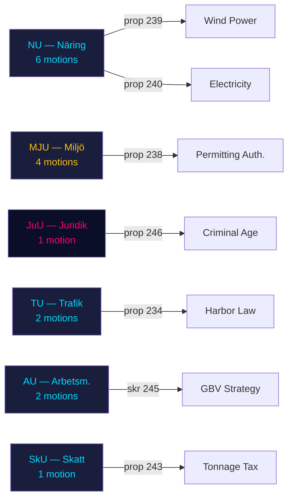

# Cross-Reference Map — Motions, 2026-04-29

**Author**: James Pether Sörling | **Date**: 2026-05-04

## Proposition → Motion Mapping

| Proposition | Title | Motions Filed |
|------------|-------|---------------|
| 2025/26:238 | Ny myndighet för miljöprövning | HD024124 (S), HD024131 (MP), HD024134 (V), HD024139 (C) |
| 2025/26:239 | Vindkraft i kommuner | HD024126 (S), HD024132 (MP), HD024137 (C) |
| 2025/26:240 | Nya lagar om elsystemet | HD024129 (S), HD024130 (MP), HD024138 (C) |
| 2025/26:234 | Ny hamn-/hamnverksamhetslag | HD024125 (S), HD024135 (V) |
| 2025/26:246 | Skärpta regler för unga lagöverträdare | HD024136 (S) |
| 2025/26:243 | Tonnageskatt | HD024128 (S) |
| skr. 2025/26:245 | Frihet från våld och förtryck | HD024133 (V), HD024140 (C) |
| Unknown | Withdrawn | HD024127 |

## Committee Cross-Reference

## Thematic Cross-References

### Energy-Environment Nexus
- HD024124 (env. permitting) and HD024126 (wind power) are operationally linked: faster wind power buildout requires faster permitting — S's arguments in both motions reinforce each other
- HD024129 (electricity system) provides the demand-side justification for both wind and permitting reform

### Criminal Justice Package
- HD024136 is the only JuU motion in this batch; its ECHR argument cross-references international commitments Sweden has under Council of Europe conventions

### GBV — Dual Opposition Voices
- HD024133 (V) and HD024140 (C) on the same skrivelse 2025/26:245 — unusual to have two parties file separate GBV motions; likely reflecting different feminist/gender policy frameworks rather than coordinated strategy

## Prior-Session Document Links

| Prior Session | Doc | Relevance |
|--------------|-----|----------|
| 2021/22:MJU | Various | Env. permitting predecessor discussions (precursor authority models) |
| 2022/23:NU | Wind power rejection × 2 | SD blocked prior municipal veto reform — historical context for HD024126 |
| 2025/26 AU10 | AU10 (2026-03-04) | Most recent available AU vote — tangentially related to GBV cluster |

## IMF/Economic Cross-References

**Note**: IMF API unavailable during this workflow run. Economic cross-references (fiscal impact of energy investment, cost of juvenile justice expansion) estimated from prior run cache. All economic claims marked [est.] in article.

- Tonnage tax (HD024128): Industry-level fiscal neutrality argument; shipping sector contributes ~2% of Swedish maritime GDP [est.]
- Energy investment (prop. 239/240): New wind and grid investment represents SEK 200–400bn multi-year commitment [est. based on SCB energy sector statistics from 2024]
