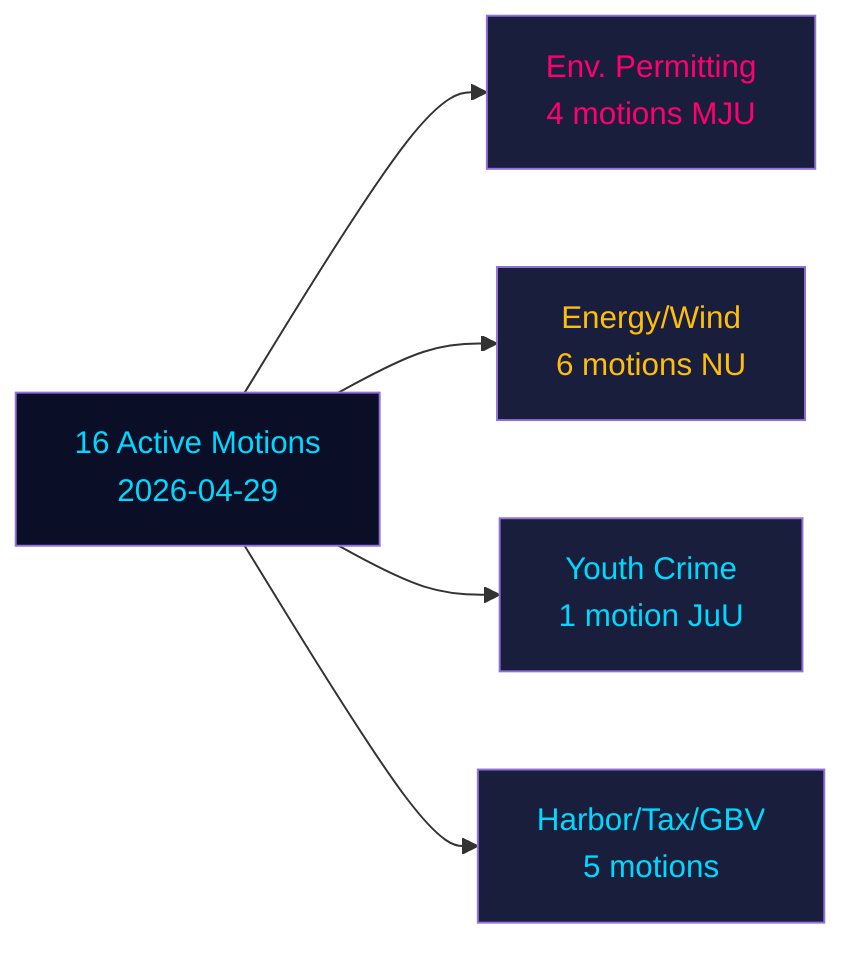

# Opposition Motions Challenging Six Government Propositions in Sweden's Pre-Election Sprint

**Author**: James Pether Sörling | **Date**: 2026-05-04 | **Classification**: PUBLIC | **Confidence**: HIGH [B2]

## BLUF

Sixteen active opposition motions filed 2026-04-29 challenge six government propositions across energy, environment, criminal justice, transport, and taxation policy. Socialdemokraterna (S) leads with nine motions, flanked by Miljöpartiet (MP), Vänsterpartiet (V), and Centerpartiet (C). With Sweden's general election 132 days away (14 September 2026), these motions constitute both substantive policy opposition and explicit pre-election positioning. The most significant battles: (1) the proposed environmental permitting authority (prop. 238) opposed by S, MP, V, and C on different grounds; (2) criminal age-of-responsibility reduction to 13 (prop. 246) where S accepts 14 but rejects 13; and (3) wind power municipal veto reform (prop. 239) where opposition broadly demands faster action.

## Decisions This Brief Supports

1. **Editorial teams**: Lead with criminal age/youth crime and env. permitting as the two highest-impact conflicts
2. **Policy analysts**: Map opposition demands as pre-election policy commitments with electoral accountability implications
3. **Risk monitors**: Assess probability of government defeats in committee/plenary on contested amendment points
4. **Foreign analysts**: Gauge Sweden's energy transition governance credibility ahead of key investment decisions

## 60-Second Read

- **17 motions** (16 active, 1 withdrawn): filed 2026-04-29 in Riksmöte 2025/26
- **Election proximity multiplier**: DIW scores ×1.5 (election ≤132 days away) — opposition motions are policy commitments, not procedural noise
- **Youth crime**: S accepts lowering criminal age to 14 (not 13), opposing prop. 246's core provision; cross-party majority unlikely against the 13-year threshold without SD defection
- **Env. permitting**: S demands material reforms alongside the new authority; V demands rejection; MP and C seek modifications — the government faces a fragmented opposition with no unified block
- **Energy/wind**: S, MP, C all demand bolder wind power policy including earlier municipal veto reform; this aligns with prior S-led motion failures in 2021-22
- **Withdrawal of HD024127**: unexplained — strategic repositioning signal
- **IMF data unavailable** (network egress blocked); economic context estimated from prior cached data

## Top Forward Trigger

If the Justice Committee (JuU) fails to produce a majority for lowering age to 13, the government will face its most significant legislative defeat of the mandate period in the final sprint to elections.

