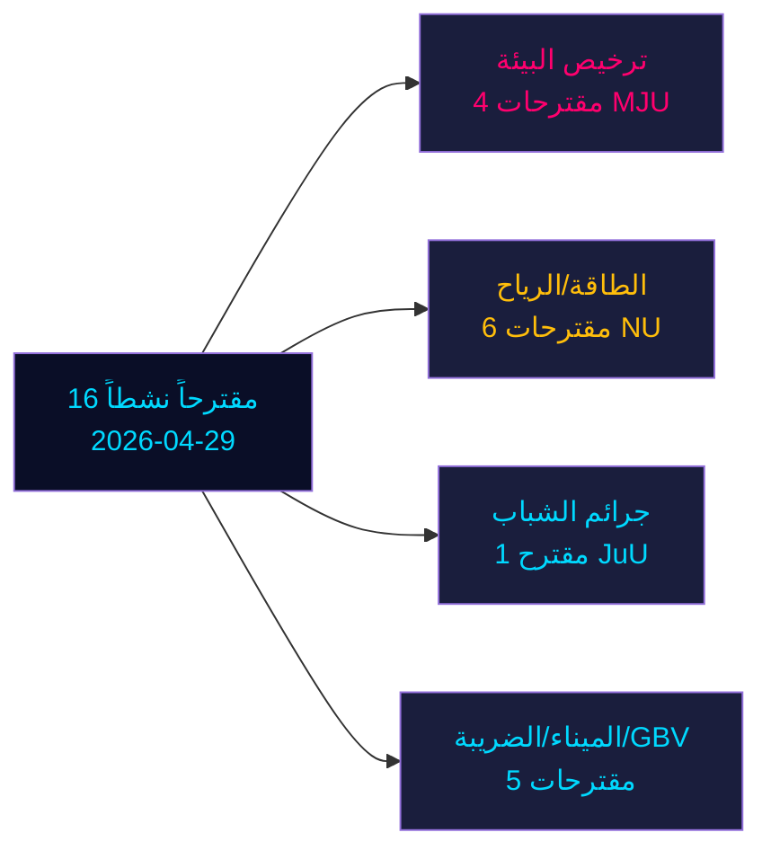

&#x200F;# مقترحات المعارضة تتحدى ستة مقترحات حكومية في سباق السويد قبيل الانتخابات

**المؤلف**: جيمس بيثر سورلينغ | **التاريخ**: 2026-05-04 | **التصنيف**: عام | **مستوى الثقة**: عالٍ [B2]

## BLUF

ستة عشر مقترح معارضة نشطاً مقدمة في 2026-04-29 تتحدى ستة مقترحات حكومية في سياسة الطاقة والبيئة والعدالة الجنائية والنقل والضرائب. يقود حزب الديمقراطيين الاجتماعيين (S) بتسعة مقترحات، مدعوماً من حزب البيئة (MP) وحزب اليسار (V) وحزب الوسط (C). مع بُعد الانتخابات العامة السويدية 132 يوماً (14 سبتمبر 2026)، تشكّل هذه المقترحات معارضة سياسية جوهرية وتموضعاً صريحاً قبيل الانتخابات. أبرز المعارك: (1) هيئة تراخيص البيئة المقترحة (الاقتراح 238) التي تعارضها S وMP وV وC لأسباب مختلفة؛ (2) خفض سن المسؤولية الجنائية إلى 13 (الاقتراح 246) حيث تقبل S بـ14 لكن ترفض 13؛ و(3) إصلاح حق النقض البلدي في طاقة الرياح (الاقتراح 239) حيث تطالب المعارضة على نطاق واسع باتخاذ إجراءات أسرع.

## القرارات التي يدعمها هذا الموجز

1. **الفرق التحريرية**: الصدارة بقضية سن الجرائم/الجريمة في صفوف الشباب وتراخيص البيئة بوصفهما النزاعين الأعلى تأثيراً
2. **محللو السياسات**: رسم خريطة مطالب المعارضة كالتزامات سياسية ما قبل الانتخابات ذات تداعيات على المساءلة الانتخابية
3. **رصد المخاطر**: تقييم احتمالية هزائم الحكومة في اللجان/الجلسة العامة على نقاط التعديل المتنازع عليها
4. **المحللون الأجانب**: تقييم مصداقية حوكمة التحول الطاقوي في السويد قبيل قرارات الاستثمار الرئيسية

## قراءة 60 ثانية

- **17 مقترحاً** (16 نشطاً، 1 مسحوب): مقدمة في 2026-04-29 في جلسة الريكسداغ 2025/26
- **مضاعف القرب من الانتخابات**: درجات DIW ×1.5 (الانتخابات ≤132 يوماً) — مقترحات المعارضة التزامات سياسية وليست ضجيجاً إجرائياً
- **الجريمة في صفوف الشباب**: تقبل S بخفض سن الجرائم إلى 14 (لا 13)، معارضةً الحكم الجوهري للاقتراح 246؛ أغلبية متعددة الأحزاب ضد عتبة 13 عاماً غير محتملة دون انشقاق SD
- **ترخيص البيئة**: تطالب S بإصلاحات جوهرية إلى جانب السلطة الجديدة؛ تطالب V بالرفض؛ يسعى MP وC إلى تعديلات — تواجه الحكومة معارضة متشظية دون كتلة موحدة
- **الطاقة/الرياح**: تطالب S وMP وC جميعاً بسياسة رياح أكثر جرأة بما يشمل إصلاح حق النقض البلدي في وقت أبكر؛ هذا ينسجم مع هزائم مقترحات سابقة بقيادة S في 2021-22
- **سحب HD024127**: غير مُفسَّر — إشارة إعادة تموضع استراتيجي
- **بيانات صندوق النقد الدولي غير متاحة** (تدفق الشبكة محجوب)؛ السياق الاقتصادي مقدَّر من بيانات مخزنة سابقة

## أبرز المحفزات المستقبلية

إذا فشلت لجنة العدل (JuU) في إنتاج أغلبية لخفض السن إلى 13، ستواجه الحكومة هزيمتها التشريعية الأكثر أهمية في الفترة الانتخابية في السباق الأخير نحو الانتخابات.

<!-- source-sha: 857e6ce8cee827920506c3007d3eb16dde3ed1ec -->
