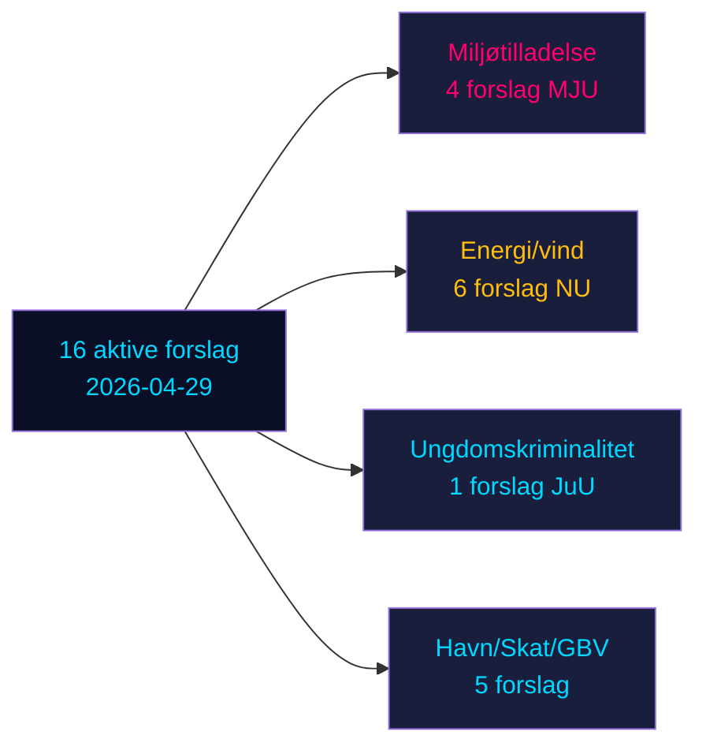

# Oppositionsforslag udfordrer seks regeringsforslag i Sveriges præ-valgssprint

**Forfatter**: James Pether Sörling | **Dato**: 2026-05-04 | **Klassificering**: OFFENTLIG | **Konfidens**: HØJ [B2]

## BLUF

Seksten aktive oppositionsforslag indgivet 2026-04-29 udfordrer seks regeringsforslag inden for energi, miljø, kriminaljustis, transport og skattepolitik. Socialdemokraterna (S) leder med ni forslag, flanket af Miljøpartiet (MP), Venstre (V) og Centerpartiet (C). Med Sveriges valg 132 dage væk (14. september 2026) udgør disse forslag både substantiel politisk opposition og eksplicit præ-valgpositionering. De vigtigste kampe: (1) det foreslåede miljøtilladelsesorgan (prop. 238) som S, MP, V og C modsætter sig af forskellige grunde; (2) kriminel aldersansvarssænkning til 13 (prop. 246), hvor S accepterer 14 men afviser 13; og (3) reform af kommunalt vindenergiveto (prop. 239), hvor oppositionen bredt kræver hurtigere handling.

## Beslutninger dette brief støtter

1. **Redaktionsteam**: Fremhæv kriminel alder/ungdomskriminalitet og miljøtilladelse som de to højest-impact-konflikter
2. **Politikanalytikere**: Kortlæg oppositionskrav som præ-valgspolitiske forpligtelser med valgansvarligheds-implikationer
3. **Risikomonitorer**: Vurder sandsynligheden for regeringsnederlag i udvalg/plenum på omstridte ændringspunkter
4. **Udenlandske analytikere**: Bedøm Danmarks energiomstillingsgovernance-troværdighed forud for vigtige investeringsbeslutninger

## 60-sekunders læsning

- **17 forslag** (16 aktive, 1 trukket tilbage): indgivet 2026-04-29 i Riksmöte 2025/26
- **Valgærhedsmultiplikator**: DIW-scorer ×1,5 (valg ≤132 dage væk) — oppositionsforslag er politiske forpligtelser, ikke proceduremæssig støj
- **Ungdomskriminalitet**: S accepterer sænkning af kriminel alder til 14 (ikke 13), imod prop. 246's kernebestemmelse; tværpartiflertal mod 13-årsgrænsen usandsynlig uden SD-frafald
- **Miljøtilladelse**: S kræver materielle reformer parallelt med det nye organ; V kræver afvisning; MP og C søger modifikationer — regeringen møder en fragmenteret opposition uden samlet blok
- **Energi/vind**: S, MP, C kræver alle mere ambitiøs vindkraftpolitik herunder tidligere kommunal vetoreform; dette er i overensstemmelse med tidligere S-ledede forslagsnederlag 2021-22
- **Tilbagetrækning af HD024127**: uforklaret — signal om strategisk ompositionering
- **IMF-data utilgængelig** (netværksegress blokeret); økonomisk kontekst estimeret fra tidligere cachedata

## Top fremtidig trigger

Hvis Retsudvalget (JuU) ikke formår at producere et flertal for at sænke alderen til 13, vil regeringen stå over for sit mest betydelige lovgivningsnederlag i mandatperioden i det finale sprint til valgene.

<!-- source-sha: 857e6ce8cee827920506c3007d3eb16dde3ed1ec -->
