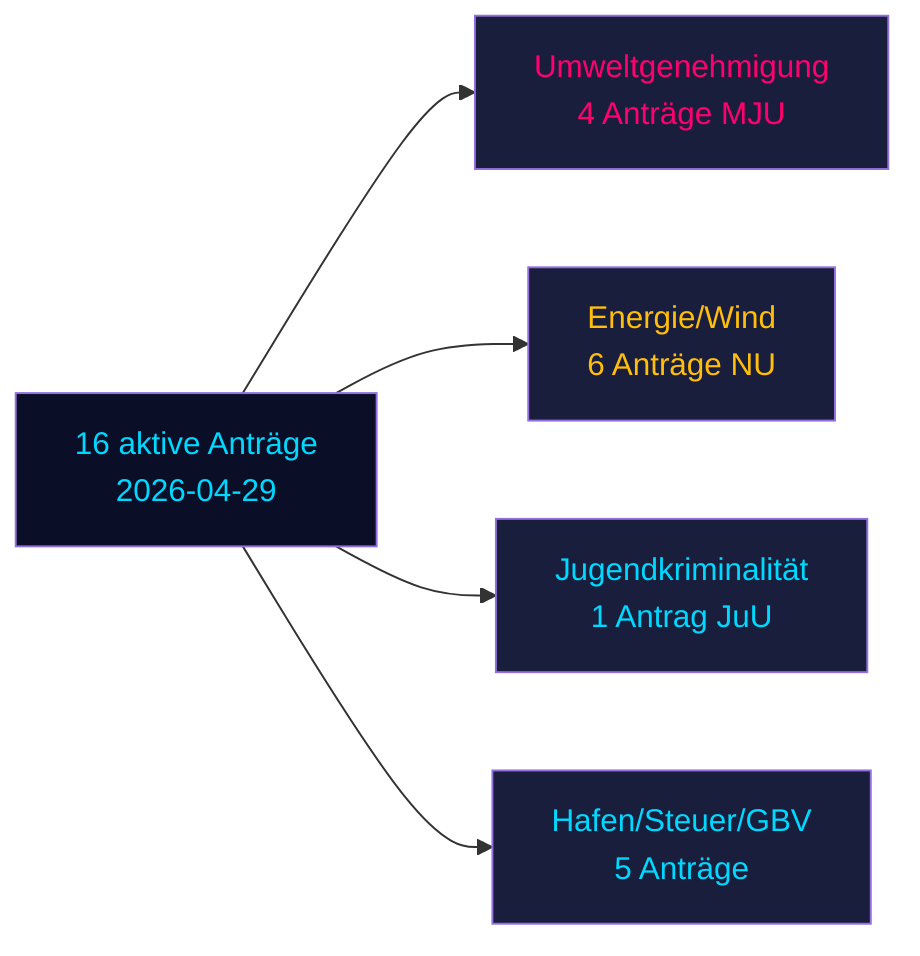

# Oppositionsanträge fordern sechs Regierungsvorlagen in Schwedens Vorwahlspurt heraus

**Autor**: James Pether Sörling | **Datum**: 2026-05-04 | **Einstufung**: ÖFFENTLICH | **Konfidenz**: HOCH [B2]

## BLUF

Sechzehn aktive Oppositionsanträge, eingereicht am 2026-04-29, fordern sechs Regierungsvorlagen in den Bereichen Energie, Umwelt, Strafjustiz, Verkehr und Steuerpolitik heraus. Socialdemokraterna (S) führt mit neun Anträgen, flankiert von Miljöpartiet (MP), Vänsterpartiet (V) und Centerpartiet (C). Mit Schwedens Parlamentswahl 132 Tage entfernt (14. September 2026) stellen diese Anträge sowohl substantielle politische Opposition als auch explizite Vorwahlpositionierung dar. Die wichtigsten Auseinandersetzungen: (1) die vorgeschlagene Umweltgenehmigungsbehörde (Prop. 238), die von S, MP, V und C aus verschiedenen Gründen abgelehnt wird; (2) Absenkung des Strafmündigkeitsalters auf 13 (Prop. 246), wobei S 14 akzeptiert, aber 13 ablehnt; und (3) Reform des kommunalen Windkraftvetos (Prop. 239), wo die Opposition weitgehend schnelleres Handeln fordert.

## Entscheidungen, die dieses Briefing unterstützt

1. **Redaktionsteams**: Führen Sie mit kriminellem Alter/Jugendkriminalität und Umweltgenehmigung als den zwei Konflikten mit dem höchsten Impact
2. **Politikanalysten**: Kartieren Sie Oppositionsforderungen als Vorwahlpolitische Verpflichtungen mit wahlmäßigen Verantwortlichkeitsimplikationen
3. **Risikomonitore**: Beurteilen Sie die Wahrscheinlichkeit von Regierungsniederlage im Ausschuss/Plenum bei umstrittenen Änderungspunkten
4. **Ausländische Analysten**: Beurteilen Sie die Glaubwürdigkeit der schwedischen Energiewende-Governance vor wichtigen Investitionsentscheidungen

## 60-Sekunden-Lektüre

- **17 Anträge** (16 aktiv, 1 zurückgezogen): eingereicht am 2026-04-29 in Riksmöte 2025/26
- **Wahlnähe-Multiplikator**: DIW-Punkte ×1,5 (Wahl ≤132 Tage entfernt) — Oppositionsanträge sind politische Verpflichtungen, kein Verfahrenslärm
- **Jugendkriminalität**: S akzeptiert Absenkung des Strafmündigkeitsalters auf 14 (nicht 13), gegen die Kernbestimmung von Prop. 246; parteiübergreifende Mehrheit gegen die 13-Jahres-Grenze ohne SD-Abfall unwahrscheinlich
- **Umweltgenehmigung**: S fordert materielle Reformen neben der neuen Behörde; V fordert Ablehnung; MP und C suchen Modifikationen — die Regierung steht einer fragmentierten Opposition ohne einheitlichen Block gegenüber
- **Energie/Wind**: S, MP, C fordern alle mutigere Windkraftpolitik einschließlich früherer kommunaler Vetoreform; dies entspricht früheren S-geführten Antragsniederlagen 2021-22
- **Rücknahme von HD024127**: unerklärlich — Signal für strategische Neupositionierung
- **IMF-Daten nicht verfügbar** (Netzwerkegress blockiert); wirtschaftlicher Kontext aus früher gecachten Daten geschätzt

## Wichtigster Zukunftstrigger

Wenn der Rechtsausschuss (JuU) keine Mehrheit für die Altersabsenkung auf 13 produzieren kann, wird die Regierung im Endspurt vor den Wahlen ihre bedeutendste Gesetzgebungsniederlage der Amtszeit erleiden.

<!-- source-sha: 857e6ce8cee827920506c3007d3eb16dde3ed1ec -->
