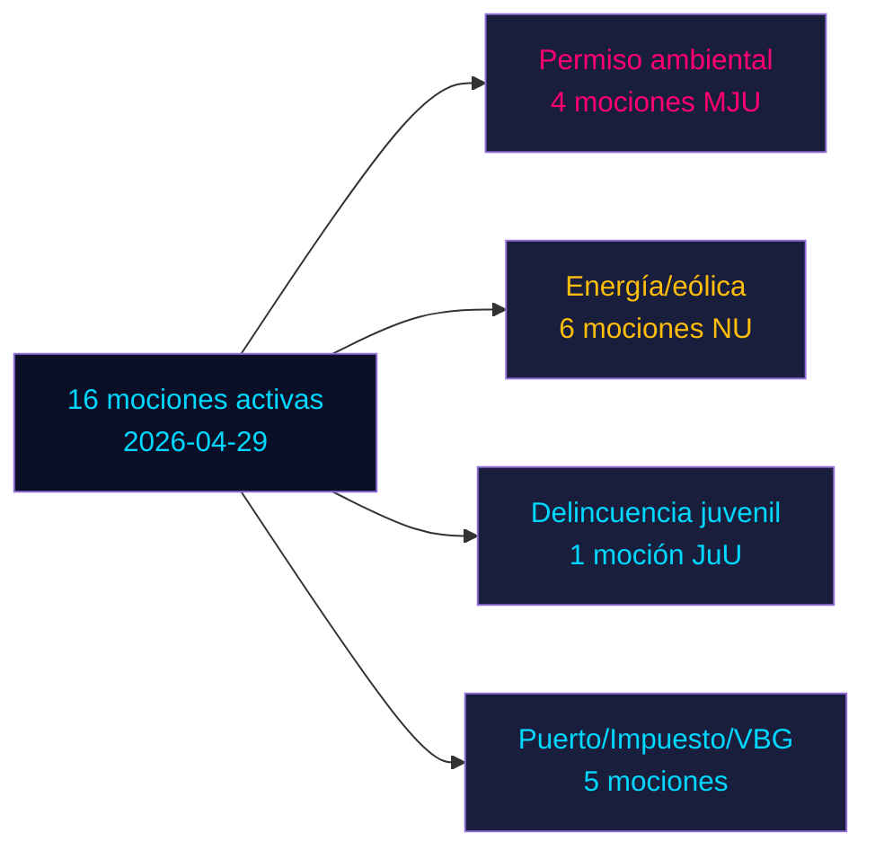

# Mociones de oposición desafían seis propuestas gubernamentales en el sprint preelectoral de Suecia

**Autor**: James Pether Sörling | **Fecha**: 2026-05-04 | **Clasificación**: PÚBLICO | **Confianza**: ALTA [B2]

## BLUF

Dieciséis mociones de oposición activas presentadas el 2026-04-29 desafían seis propuestas gubernamentales en política energética, medioambiental, de justicia penal, transporte y fiscal. Socialdemokraterna (S) lidera con nueve mociones, flanqueado por Miljöpartiet (MP), Vänsterpartiet (V) y Centerpartiet (C). Con las elecciones generales de Suecia 132 días (14 de septiembre de 2026), estas mociones constituyen tanto oposición política sustantiva como posicionamiento preelectoral explícito. Las batallas más significativas: (1) la propuesta autoridad de permisos medioambientales (prop. 238) a la que S, MP, V y C se oponen por diferentes razones; (2) reducción de la edad de responsabilidad penal a 13 años (prop. 246) donde S acepta 14 pero rechaza 13; y (3) reforma del veto municipal en energía eólica (prop. 239) donde la oposición ampliamente exige acción más rápida.

## Decisiones que apoya este informe

1. **Equipos editoriales**: Liderar con edad penal/delincuencia juvenil y permisos medioambientales como los dos conflictos de mayor impacto
2. **Analistas de políticas**: Mapear las demandas de la oposición como compromisos políticos preelectorales con implicaciones de responsabilidad electoral
3. **Monitores de riesgo**: Evaluar la probabilidad de derrotas gubernamentales en comité/pleno en puntos de enmienda controvertidos
4. **Analistas extranjeros**: Evaluar la credibilidad de la gobernanza de transición energética de Suecia antes de decisiones de inversión clave

## Lectura de 60 segundos

- **17 mociones** (16 activas, 1 retirada): presentadas el 2026-04-29 en Riksmöte 2025/26
- **Multiplicador de proximidad electoral**: puntuaciones DIW ×1,5 (elección ≤132 días) — las mociones de oposición son compromisos políticos, no ruido procesal
- **Delincuencia juvenil**: S acepta bajar la edad penal a 14 (no 13), oponiéndose a la disposición central de la prop. 246; mayoría multipartidista contra el umbral de 13 años improbable sin deserción de SD
- **Permiso medioambiental**: S exige reformas sustanciales junto con la nueva autoridad; V exige rechazo; MP y C buscan modificaciones — el gobierno enfrenta una oposición fragmentada sin bloque unido
- **Energía/eólica**: S, MP, C todos exigen una política eólica más audaz incluyendo reforma más temprana del veto municipal; esto se alinea con derrotas previas de mociones lideradas por S en 2021-22
- **Retirada de HD024127**: sin explicación — señal de reposicionamiento estratégico
- **Datos del FMI no disponibles** (salida de red bloqueada); contexto económico estimado a partir de datos en caché anteriores

## Principal desencadenante futuro

Si el Comité de Justicia (JuU) no logra producir una mayoría para bajar la edad a 13 años, el gobierno enfrentará su derrota legislativa más significativa del período de mandato en el sprint final hacia las elecciones.

<!-- source-sha: 857e6ce8cee827920506c3007d3eb16dde3ed1ec -->
