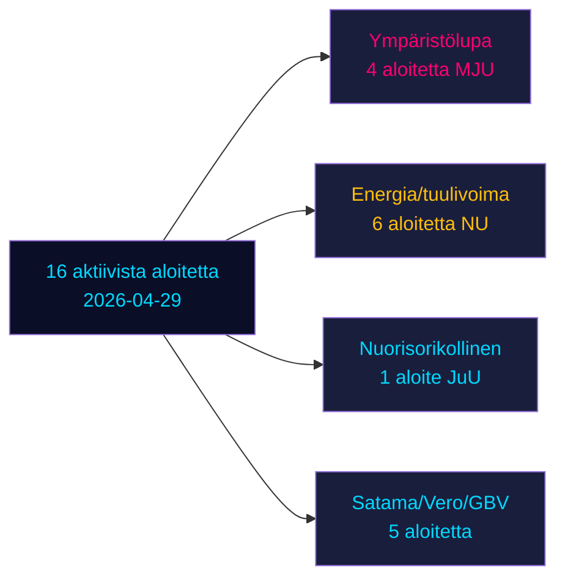

# Oppositioaloitteet haastavat kuusi hallituksen esitystä Ruotsin vaalien alla

**Tekijä**: James Pether Sörling | **Päivämäärä**: 2026-05-04 | **Luokitus**: JULKINEN | **Luottamustaso**: KORKEA [B2]

## BLUF

Kuusitoista aktiivista 2026-04-29 jätettyjä oppositioaloitetta haastaa kuusi hallituksen esitystä energia-, ympäristö-, rikoslainsäädäntö-, liikenne- ja veropolitiikassa. Socialdemokraterna (S) johtaa yhdeksällä aloitteella, flankeerattuna Miljöpartietillä (MP), Vänsterpartietillä (V) ja Centerpartietillä (C). Ruotsin eduskuntavaalit ovat 132 päivän päässä (14. syyskuuta 2026), ja nämä aloitteet muodostavat sekä asiasisällöllisen opposition että eksplisiittisen vaaliasemoinnin. Tärkeimmät taistelut: (1) ehdotettu ympäristölupaviranomainen (prop. 238), jota S, MP, V ja C vastustavat eri syistä; (2) rikosoikeudellisen vastuuiän alentaminen 13 vuoteen (prop. 246), jossa S hyväksyy 14 mutta hylkää 13; ja (3) kunnallisen tuulivoimaveto-oikeuden uudistus (prop. 239), jossa oppositio laajasti vaatii nopeampia toimia.

## Päätökset joita tämä katsaus tukee

1. **Toimitustiimit**: Johda rikosoikeusikä/nuorisorikollinen ja ympäristölupa kahden suurimman vaikutuksen konfliktina
2. **Politiikkaanalyytikot**: Kartoita oppositiovaatimukset vaalipoliittisina sitoumuksina, joilla on vaalivastuumerkitys
3. **Riskimonitorit**: Arvioi hallituksen tappion todennäköisyys valiokunnassa/täysistunnossa riidanalaisissa muutosehdotuksissa
4. **Ulkomaiset analyytikot**: Arvioi Ruotsin energiasiirtymähallinnon uskottavuus tärkeiden investointipäätösten edellä

## 60-sekunnin lukeminen

- **17 aloitetta** (16 aktiivista, 1 peruttu): jätetty 2026-04-29 riksmöte 2025/26:ssa
- **Vaalien läheisyyskertoja**: DIW-pisteet ×1,5 (vaalit ≤132 päivän päässä) — oppositioaloitteet ovat poliittisia sitoumuksia, eivät menettelyllistä melua
- **Nuorisorikollinen**: S hyväksyy rikosoikeudellisen vastuuiän alentamisen 14:ään (ei 13:een), vastustaa prop. 246:n ydinkohtaa; monipuolueiden enemmistö 13 vuoden ikärajaa vastaan epätodennäköinen ilman SD:n hajaannusta
- **Ympäristölupa**: S vaatii aineellisia uudistuksia uuden viranomaisen rinnalle; V vaatii hylkäämistä; MP ja C hakevat muutoksia — hallitus kohtaa hajanaisen opposition ilman yhtenäistä blokkia
- **Energia/tuulivoima**: S, MP, C kaikki vaativat kunnianhimoisempaa tuulivoimapolitiikkaa mukaan lukien aikaisempi kunnallisen veto-oikeuden uudistus; tämä vastaa aiempia S-johtamisia aloitetappioita 2021-22
- **HD024127:n peruuttaminen**: selittämätön — strategisen uudelleenasemoinnin signaali
- **IMF-tiedot saatavissa**: (verkkoegress estetty); taloudellinen konteksti arvioitu aiemmista välimuistitiedoista

## Tärkein ennakkotriggeri

Jos oikeusvaliokunta (JuU) ei saa aikaan enemmistöä iän alentamiseksi 13 vuoteen, hallitus kohtaa mandaattikauden merkittävimmän lainsäädäntötappionsa viimeisessä vaalisprintissä.

<!-- source-sha: 857e6ce8cee827920506c3007d3eb16dde3ed1ec -->
