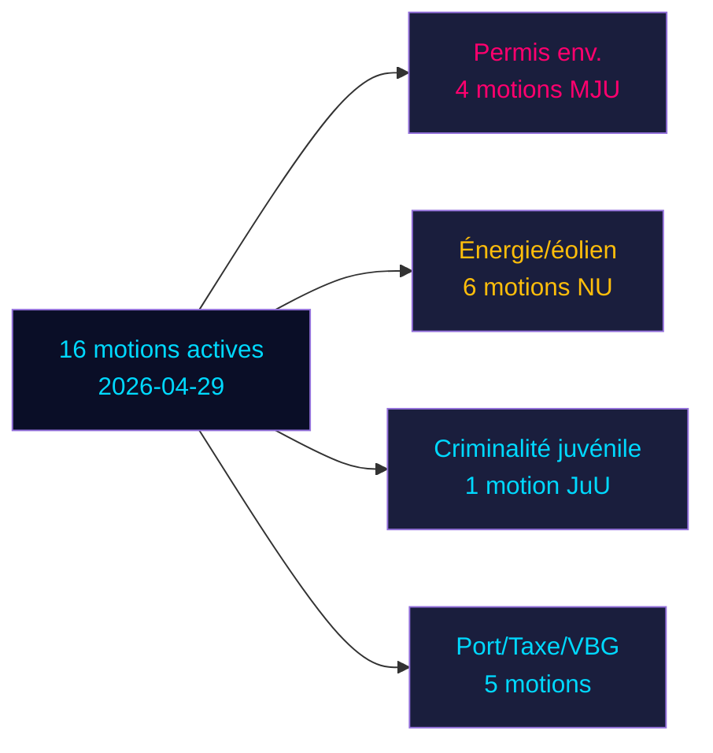

# Les motions de l'opposition défient six propositions gouvernementales dans le sprint pré-électoral de la Suède

**Auteur**: James Pether Sörling | **Date**: 2026-05-04 | **Classification**: PUBLIC | **Confiance**: ÉLEVÉE [B2]

## BLUF

Seize motions d'opposition actives déposées le 2026-04-29 défient six propositions gouvernementales dans les domaines de l'énergie, de l'environnement, de la justice pénale, des transports et de la fiscalité. Socialdemokraterna (S) mène avec neuf motions, flanqué de Miljöpartiet (MP), Vänsterpartiet (V) et Centerpartiet (C). Avec les élections générales de la Suède 132 jours à venir (14 septembre 2026), ces motions constituent à la fois une opposition politique substantielle et un positionnement pré-électoral explicite. Les batailles les plus significatives : (1) l'autorité de permis environnementaux proposée (prop. 238) à laquelle S, MP, V et C s'opposent pour différentes raisons ; (2) la réduction de l'âge de responsabilité pénale à 13 ans (prop. 246) où S accepte 14 mais rejette 13 ; et (3) la réforme du veto municipal en éolien (prop. 239) où l'opposition réclame généralement une action plus rapide.

## Décisions soutenues par ce briefing

1. **Équipes éditoriales**: Mener avec l'âge pénal/délinquance juvénile et les permis environnementaux comme les deux conflits à impact le plus élevé
2. **Analystes politiques**: Cartographier les demandes de l'opposition comme des engagements politiques pré-électoraux avec des implications de responsabilité électorale
3. **Moniteurs de risques**: Évaluer la probabilité de défaites gouvernementales en commission/plénière sur les points d'amendement contestés
4. **Analystes étrangers**: Évaluer la crédibilité de la gouvernance de la transition énergétique de la Suède avant les décisions d'investissement clés

## Lecture de 60 secondes

- **17 motions** (16 actives, 1 retirée) : déposées le 2026-04-29 dans le Riksmöte 2025/26
- **Multiplicateur de proximité électorale**: scores DIW ×1,5 (élection ≤132 jours) — les motions d'opposition sont des engagements politiques, pas du bruit procédural
- **Criminalité juvénile**: S accepte d'abaisser l'âge pénal à 14 (pas 13), s'opposant à la disposition centrale de la prop. 246 ; majorité interpartis contre le seuil de 13 ans improbable sans défection SD
- **Permis environnemental**: S exige des réformes matérielles aux côtés de la nouvelle autorité ; V exige le rejet ; MP et C recherchent des modifications — le gouvernement fait face à une opposition fragmentée sans bloc uni
- **Énergie/éolien**: S, MP, C réclament tous une politique éolienne plus audacieuse incluant la réforme plus rapide du veto municipal ; cela s'aligne sur les défaites de motions antérieures menées par S en 2021-22
- **Retrait de HD024127**: inexpliqué — signal de repositionnement stratégique
- **Données FMI indisponibles** (sortie réseau bloquée) ; contexte économique estimé à partir de données en cache antérieures

## Principal déclencheur futur

Si la Commission judiciaire (JuU) ne parvient pas à produire une majorité pour abaisser l'âge à 13 ans, le gouvernement fera face à sa défaite législative la plus significative du mandat dans le sprint final vers les élections.

<!-- source-sha: 857e6ce8cee827920506c3007d3eb16dde3ed1ec -->
