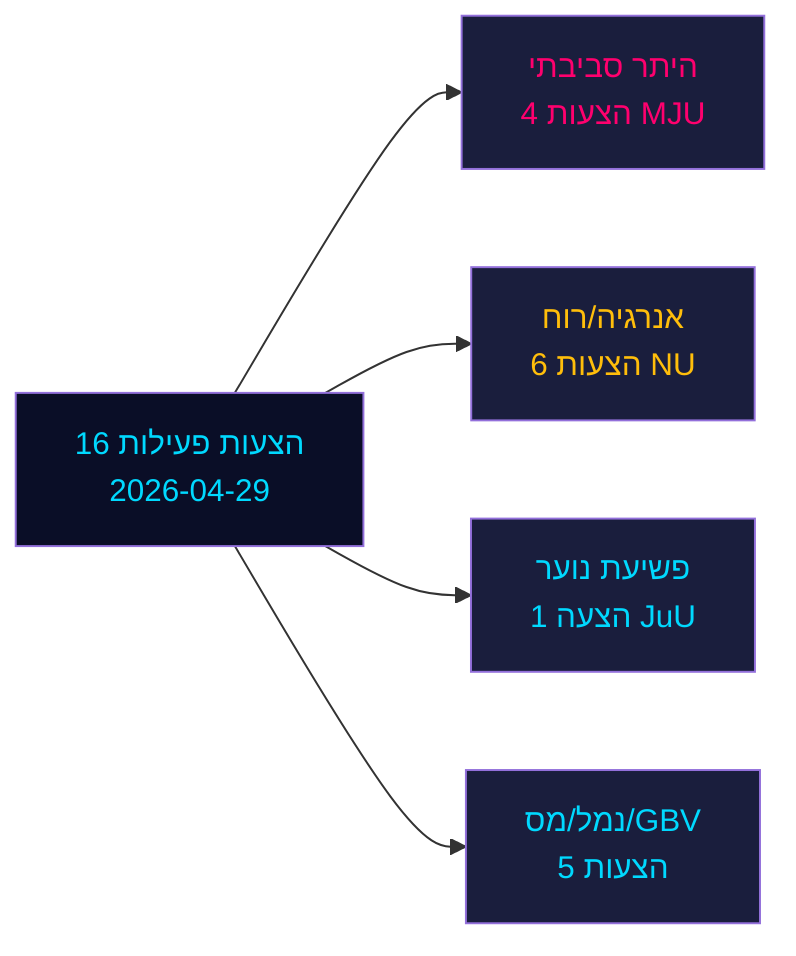

&#x200F;# הצעות האופוזיציה מאתגרות שישה הצעות ממשלתיות בספרינט הטרום-בחירות של שוודיה

**מחבר**: ג'יימס פת'ר סורלינג | **תאריך**: 2026-05-04 | **סיווג**: ציבורי | **אמינות**: גבוהה [B2]

## BLUF

שש עשרה הצעות אופוזיציה פעילות שהוגשו ב-2026-04-29 מאתגרות שש הצעות ממשלתיות במדיניות האנרגיה, הסביבה, המשפט הפלילי, התחבורה והמיסוי. Socialdemokraterna (S) מוביל עם תשע הצעות, מלווה ב-Miljöpartiet (MP), Vänsterpartiet (V) ו-Centerpartiet (C). כשבחירות הכלליות של שוודיה 132 יום (14 בספטמבר 2026), הצעות אלה מהוות הן אופוזיציה פוליטית מהותית והן מיצוב ברור לפני הבחירות. הקרבות המשמעותיים ביותר: (1) רשות ההיתרים הסביבתיים המוצעת (הצעה 238) שאותה מתנגדים S, MP, V ו-C מסיבות שונות; (2) הורדת גיל האחריות הפלילית ל-13 (הצעה 246) שבה S מקבלת 14 אך דוחה 13; ו-(3) רפורמת הווטו העירוני לאנרגיית רוח (הצעה 239) שבה האופוזיציה דורשת באופן רחב פעולה מהירה יותר.

## החלטות שתדריך זה תומך בהן

1. **צוותי עריכה**: הובל עם גיל פלילי/פשיעת נוער והיתרים סביבתיים כשני הקונפליקטים בעלי ההשפעה הגבוהה ביותר
2. **אנליסטי מדיניות**: מפה את דרישות האופוזיציה כהתחייבויות פוליטיות טרום-בחירות עם השלכות אחריות בחירות
3. **מוניטורי סיכון**: הערכת סבירות תבוסות ממשלה בוועדה/מליאה על נקודות תיקון שנויות במחלוקת
4. **אנליסטים זרים**: הערכת אמינות ממשל מעבר האנרגיה של שוודיה לפני החלטות השקעה מרכזיות

## קריאה של 60 שניות

- **17 הצעות** (16 פעילות, 1 נסוגה): הוגשו ב-2026-04-29 ב-Riksmöte 2025/26
- **מכפיל קרבה לבחירות**: ניקוד DIW ×1.5 (בחירות ≤132 יום) — הצעות אופוזיציה הן התחייבויות פוליטיות, לא רעש פרוצדורלי
- **פשיעת נוער**: S מקבלת הורדת גיל פלילי ל-14 (לא 13), מתנגדת להוראה המרכזית של הצעה 246; רוב רב-מפלגתי נגד ספי 13 השנים לא סביר ללא ריחוק SD
- **היתר סביבתי**: S דורשת רפורמות מהותיות לצד הרשות החדשה; V דורשת דחייה; MP ו-C מבקשים שינויים — הממשלה מתמודדת עם אופוזיציה מפוצלת ללא בלוק מאוחד
- **אנרגיה/רוח**: S, MP, C כולם דורשים מדיניות אנרגיית רוח נועזת יותר כולל רפורמת הווטו העירוני מוקדם יותר; זה מתואם עם תבוסות הצעות קודמות בהובלת S ב-2021-22
- **נסיגת HD024127**: ללא הסבר — אות למיצוב אסטרטגי מחדש
- **נתוני קרן המטבע הבינלאומית לא זמינים** (יציאת רשת חסומה); הקשר כלכלי מוערך מנתונים מאוחסנים קודמים

## הטריגר העתידי הראשי

אם ועדת המשפטים (JuU) לא תצליח לייצר רוב להורדת הגיל ל-13, תתמודד הממשלה עם תבוסתה החקיקתית המשמעותית ביותר של תקופת הכהונה בספרינט הסופי לבחירות.

<!-- source-sha: 857e6ce8cee827920506c3007d3eb16dde3ed1ec -->
