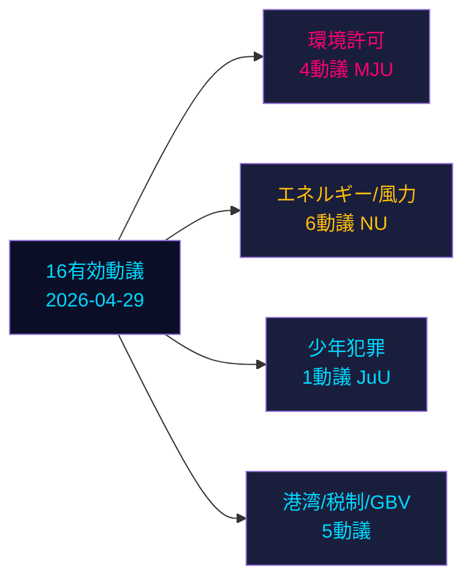

# 野党動議、スウェーデン選挙前スプリントで6つの政府提案に挑戦

**著者**: ジェームズ・ペシャー・セーリング | **日付**: 2026-05-04 | **分類**: 公開 | **信頼度**: 高 [B2]

## BLUF

2026年4月29日に提出された16の有効な野党動議が、エネルギー、環境、刑事司法、交通、税制政策において6つの政府提案に挑戦している。Socialdemokraterna（S）が9動議でリードし、Miljöpartiet（MP）、Vänsterpartiet（V）、Centerpartiet（C）が続く。スウェーデン総選挙まで132日（2026年9月14日）と迫るなか、これらの動議は実質的な政治的反対意見と明確な選挙前ポジショニングの両方を構成する。最も重要な争点：（1）提案238の環境許可当局（S、MP、V、Cがそれぞれ異なる理由で反対）；（2）刑事責任年齢を13歳に引き下げ（提案246、Sは14歳を受け入れるが13歳は拒否）；（3）風力エネルギーの市町村拒否権改革（提案239、野党が広く一段と迅速な行動を要求）。

## このブリーフが支援する決定

1. **編集チーム**: 刑事年齢・少年犯罪と環境許可を最も影響度の高い2つの対立点として前面に出す
2. **政策アナリスト**: 野党の要求を選挙前の政策コミットメントとしてマッピングし、選挙責任の含意を検討
3. **リスク監視**: 争点となっている修正点に関する委員会・本会議での政府敗北の可能性を評価
4. **海外アナリスト**: 主要投資決定前のスウェーデンのエネルギー転換ガバナンスの信頼性を評価

## 60秒リード

- **17動議**（16有効、1撤回）：2025/26年議会会期に2026年4月29日提出
- **選挙近接乗数**: DIWスコア×1.5（選挙まで≤132日）—野党動議は手続き的ノイズではなく政策コミットメント
- **少年犯罪**: Sは刑事年齢を14歳に引き下げることを受け入れる（13歳ではない）、提案246の中核的命令に反対；SDの離脱なしに13歳閾値に反対する多党多数は見込み薄
- **環境許可**: Sは新当局に加えて実質的な改革を要求；Vは拒否を要求；MPとCは修正を求める—政府は統一ブロックなしに断片化した反対に直面
- **エネルギー/風力**: S、MP、Cはすべて市町村拒否権改革を含む一段と大胆な風力エネルギー政策を要求；これは2021-22年のS主導の先行動議の敗北と合致
- **HD024127撤回**: 説明なし—戦略的再ポジショニングのシグナル
- **IMFデータ利用不可**（ネットワーク出口ブロック）；経済コンテキストは以前のキャッシュデータから推定

## 主要フォワードトリガー

司法委員会（JuU）が13歳への引き下げに関して多数を生成できない場合、政府は選挙最終スプリントで任期中最も重大な立法上の敗北に直面する。

<!-- source-sha: 857e6ce8cee827920506c3007d3eb16dde3ed1ec -->
