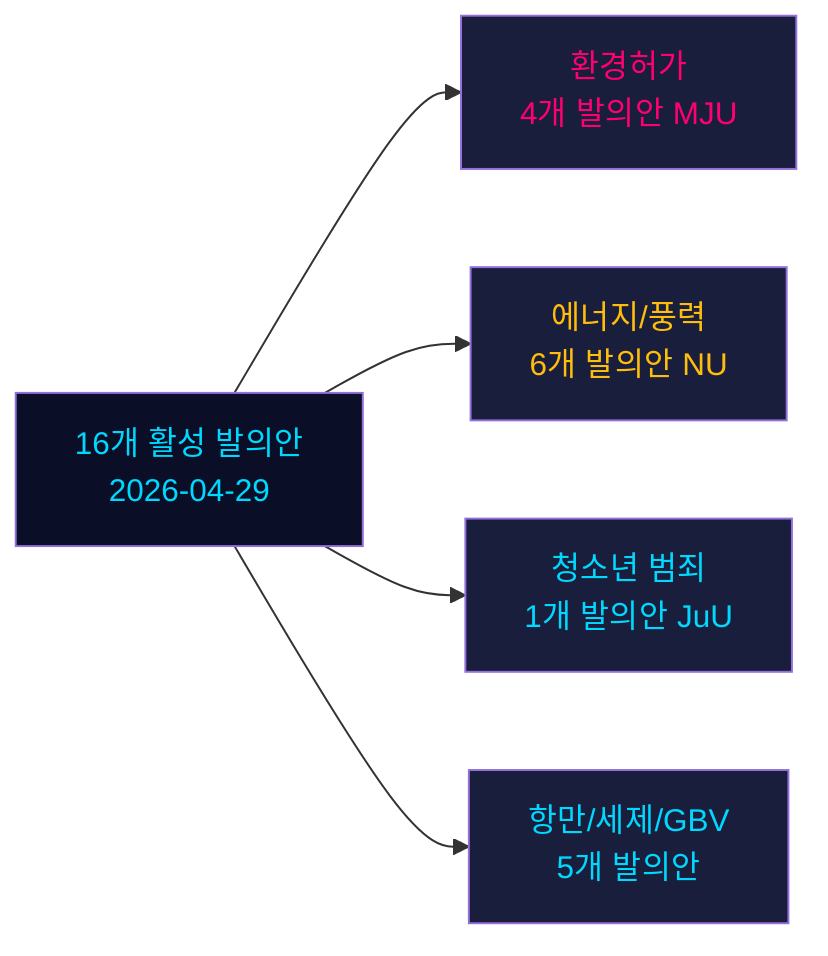

# 야당 발의안, 스웨덴 선거 전 스프린트에서 6개 정부 제안에 도전

**저자**: 제임스 페서 쇠를링 | **날짜**: 2026-05-04 | **분류**: 공개 | **신뢰도**: 높음 [B2]

## BLUF

2026년 4월 29일에 제출된 16개의 활성 야당 발의안이 에너지, 환경, 형사 사법, 교통, 세제 정책에서 6개의 정부 제안에 도전하고 있다. Socialdemokraterna(S)가 9개 발의안으로 선두를 달리며 Miljöpartiet(MP), Vänsterpartiet(V), Centerpartiet(C)가 뒤를 잇는다. 스웨덴 총선까지 132일(2026년 9월 14일)을 앞두고 이 발의안들은 실질적인 정치적 반대와 명확한 선거 전 포지셔닝 모두를 구성한다. 가장 중요한 전선: (1) 제안 238의 환경허가청(S, MP, V, C가 각기 다른 이유로 반대); (2) 형사책임 연령을 13세로 인하(제안 246, S는 14세 수용 但 13세 거부); (3) 풍력 에너지에 대한 지방자치단체 거부권 개혁(제안 239, 야당이 광범위하게 더 신속한 조치 요구).

## 이 브리프가 지원하는 결정

1. **편집팀**: 형사 연령/청소년 범죄와 환경허가를 가장 영향력 높은 두 갈등으로 선두에 내세우기
2. **정책 분석가**: 야당 요구를 선거책임 함의를 지닌 선거 전 정책 공약으로 매핑
3. **위험 모니터링**: 쟁점이 되는 수정 포인트에 대한 위원회/본회의 정부 패배 가능성 평가
4. **해외 분석가**: 주요 투자 결정 전 스웨덴 에너지 전환 거버넌스 신뢰성 평가

## 60초 리드

- **17개 발의안** (16개 활성, 1개 철회): 2025/26 국회 회기에 2026년 4월 29일 제출
- **선거 근접 승수**: DIW 점수 ×1.5 (선거 ≤132일) — 야당 발의안은 절차적 소음이 아닌 정책 공약
- **청소년 범죄**: S는 형사 연령을 14세로 인하 수용(13세 아님), 제안 246의 핵심 명령에 반대; SD 이탈 없이 13세 기준에 반대하는 다당 다수 형성 어려울 것
- **환경허가**: S는 새 청과 함께 실질적 개혁 요구; V는 거부 요구; MP와 C는 수정 추구 — 정부는 통일된 블록 없이 분열된 반대에 직면
- **에너지/풍력**: S, MP, C 모두 지방자치단체 거부권 개혁을 포함한 보다 과감한 풍력 에너지 정책 요구; 이는 2021-22년 S 주도의 이전 발의안 패배와 일치
- **HD024127 철회**: 미설명 — 전략적 재포지셔닝 신호
- **IMF 데이터 이용 불가** (네트워크 출구 차단); 경제 맥락은 이전 캐시 데이터에서 추정

## 주요 미래 트리거

사법위원회(JuU)가 13세로의 인하에 대한 다수를 만들어내지 못한다면, 정부는 선거 최종 스프린트에서 임기 중 가장 중요한 입법적 패배에 직면하게 된다.

<!-- source-sha: 857e6ce8cee827920506c3007d3eb16dde3ed1ec -->
