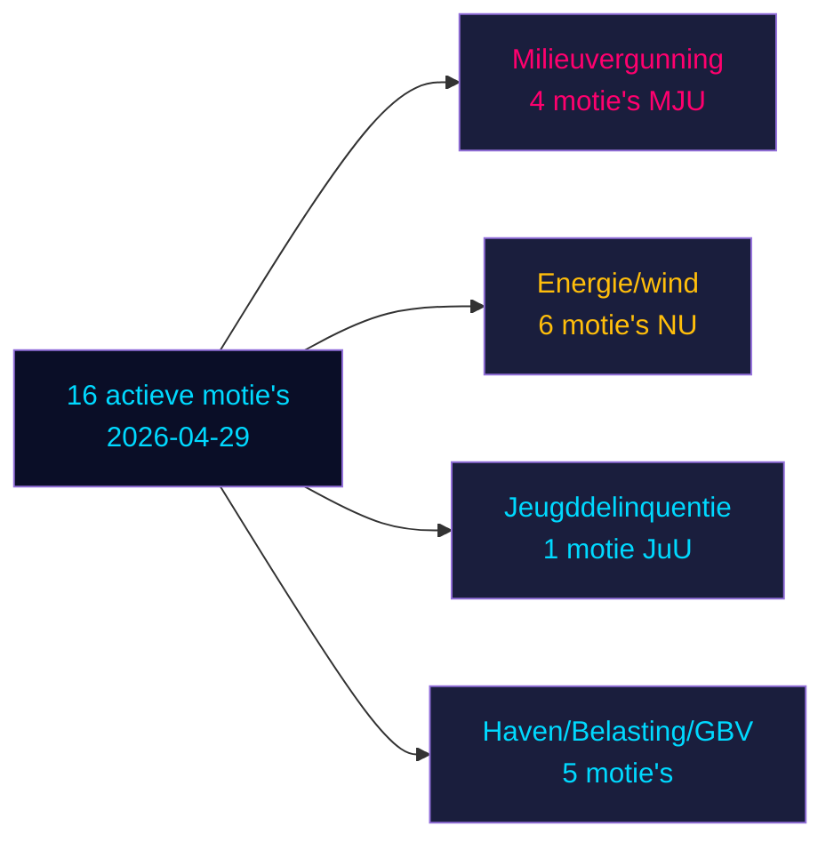

# Oppositiemotie's dagen zes regeringsvoorstellen uit in Zweden's pre-verkiezingssprint

**Auteur**: James Pether Sörling | **Datum**: 2026-05-04 | **Classificatie**: OPENBAAR | **Betrouwbaarheid**: HOOG [B2]

## BLUF

Zestien actieve oppositiemotie's ingediend op 2026-04-29 dagen zes regeringsvoorstellen uit op het gebied van energie, milieu, strafjustitie, vervoer en belastingbeleid. Socialdemokraterna (S) leidt met negen motie's, geflankeerd door Miljöpartiet (MP), Vänsterpartiet (V) en Centerpartiet (C). Met de Zweedse algemene verkiezingen 132 dagen weg (14 september 2026) vormen deze motie's zowel substantiële politieke oppositie als expliciete pre-verkiezingspositionering. De meest significante strijd: (1) de voorgestelde milieuvergunninsautoriteit (prop. 238) waartegen S, MP, V en C zich om verschillende redenen verzetten; (2) verlaging van de strafrechtelijke aansprakelijkheidsleeftijd naar 13 (prop. 246) waarbij S 14 accepteert maar 13 verwerpt; en (3) hervorming van het gemeentelijk windenergiveto (prop. 239) waarbij de oppositie generaal snellere actie eist.

## Beslissingen die dit briefing ondersteunt

1. **Redactiezaam**: Leid met criminele leeftijd/jeugddelinquentie en milieuvergunnin als de twee hoogste-impact-conflicten
2. **Beleidsanalisten**: Breng oppositie-eisen in kaart als pre-verkiezingspolitieke verplichtingen met electorale aansprakelijkheidsimplicaties
3. **Risicomonitoren**: Beoordeel de kans op regeringsnederlagen in commissie/plenaire vergadering op betwiste wijzigingspunten
4. **Buitenlandse analisten**: Beoordeel de geloofwaardigheid van Zweden's energietransitiegovernance vóór belangrijke investeringsbeslissingen

## 60-seconden lezing

- **17 motie's** (16 actief, 1 ingetrokken): ingediend op 2026-04-29 in Riksmöte 2025/26
- **Verkiezingsnabijheidsmultiplikator**: DIW-scores ×1,5 (verkiezingen ≤132 dagen weg) — oppositiemotie's zijn politieke verplichtingen, geen procedureruis
- **Jeugddelinquentie**: S accepteert verlaging van de strafrechtelijke leeftijd naar 14 (niet 13), in strijd met de kernbepaling van prop. 246; meerpartijenmeerderheid tegen de 13-jaarsdrempel onwaarschijnlijk zonder SD-defectie
- **Milieuvergunning**: S eist materiële hervormingen naast de nieuwe autoriteit; V eist verwerping; MP en C zoeken modificaties — de regering staat tegenover een gefragmenteerde oppositie zonder eensgezind blok
- **Energie/wind**: S, MP, C eisen allen een ambitieuzer windkrachtbeleid inclusief eerdere gemeentelijke vetohervorrning; dit sluit aan bij eerder S-geleide motienederlagen in 2021-22
- **Intrekking van HD024127**: onverklaard — signaal voor strategische herpositionering
- **IMF-gegevens niet beschikbaar** (netwerkegressie geblokkeerd); economische context geschat uit eerder gecachte gegevens

## Belangrijkste toekomstige trigger

Als de Commissie Justitie (JuU) er niet in slaagt een meerderheid te produceren voor verlaging van de leeftijd naar 13, zal de regering in de laatste sprint naar de verkiezingen haar meest significante wetgevingsnederlaag van de ambtstermijn ondervinden.

<!-- source-sha: 857e6ce8cee827920506c3007d3eb16dde3ed1ec -->
