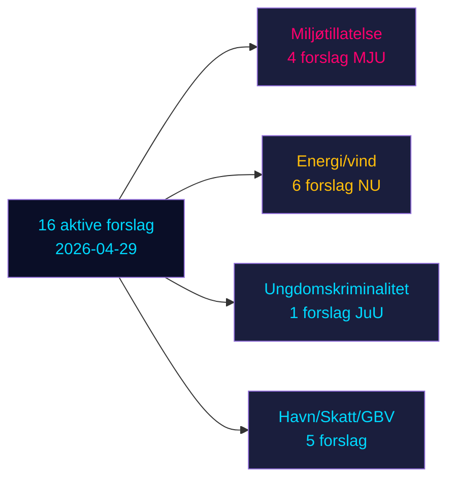

# Opposisjonsforslag utfordrer seks regjeringsforslag i Sveriges pre-valgssprint

**Forfatter**: James Pether Sörling | **Dato**: 2026-05-04 | **Klassifisering**: OFFENTLIG | **Konfidensgrad**: HØY [B2]

## BLUF

Seksten aktive opposisjonsforslag innlevert 2026-04-29 utfordrer seks regjeringsforslag innen energi, miljø, strafferett, transport og skattepolitikk. Socialdemokraterna (S) leder med ni forslag, flankert av Miljøpartiet (MP), Venstresiden (V) og Centerpartiet (C). Med Sveriges stortingsvalg 132 dager unna (14. september 2026) utgjør disse forslagene både substansiell politisk opposisjon og eksplisitt pre-valgsposisjonering. De viktigste kampene: (1) det foreslåtte miljøtillatelseorganet (prop. 238) som S, MP, V og C motsetter seg av ulike grunner; (2) senking av den strafferettslige lavalderen til 13 (prop. 246) der S aksepterer 14 men avviser 13; og (3) reform av kommunalt vindkraftsveto (prop. 239) der opposisjonen bredt krever raskere handling.

## Beslutninger dette briefet støtter

1. **Redaksjonsteam**: Innled med kriminell alder/ungdomskriminalitet og miljøtillatelse som de to høyest-impact-konfliktene
2. **Politikkanalytikere**: Kartlegg opposisjonskrav som pre-valgspolitiske forpliktelser med valgansvarsmessige implikasjoner
3. **Risikomonitorer**: Vurder sannsynligheten for regjeringsnederlag i komité/plenum på omstridte endringsforslag
4. **Utenlandske analytikere**: Vurder Sveriges energiomstillingsstyringskredibilitet før viktige investeringsbeslutninger

## 60-sekunders lesning

- **17 forslag** (16 aktive, 1 trukket tilbake): innlevert 2026-04-29 i Riksmöte 2025/26
- **Valgærhetsmultiplikator**: DIW-skårer ×1,5 (valg ≤132 dager unna) — opposisjonsforslag er politiske forpliktelser, ikke prosedyremessig støy
- **Ungdomskriminalitet**: S aksepterer senking av kriminalitetsalderen til 14 (ikke 13), mot prop. 246's kjerneparagraf; tverr-parti-flertall mot 13-årsgrensen usannsynlig uten SD-frafall
- **Miljøtillatelse**: S krever materielle reformer parallelt med det nye organet; V krever avvisning; MP og C søker modifikasjoner — regjeringen møter en fragmentert opposisjon uten samlet blokk
- **Energi/vind**: S, MP, C krever alle mer ambisiøs vindkraftpolitikk inkludert tidligere kommunalt vetoreform; dette sammenfaller med tidligere S-ledede forslagnederlag 2021-22
- **Tilbaketrekning av HD024127**: uforklart — signal om strategisk omposisjonering
- **IMF-data utilgjengelig** (nettverksegress blokkert); økonomisk kontekst estimert fra tidligere bufrede data

## Topp fremtidig trigger

Hvis Justiskomiteen (JuU) mislykkes med å produsere et flertall for senking av alderen til 13, vil regjeringen stå overfor sitt mest signifikante lovgivningsnederlag i mandatperioden i det siste spurten til valgene.

<!-- source-sha: 857e6ce8cee827920506c3007d3eb16dde3ed1ec -->
