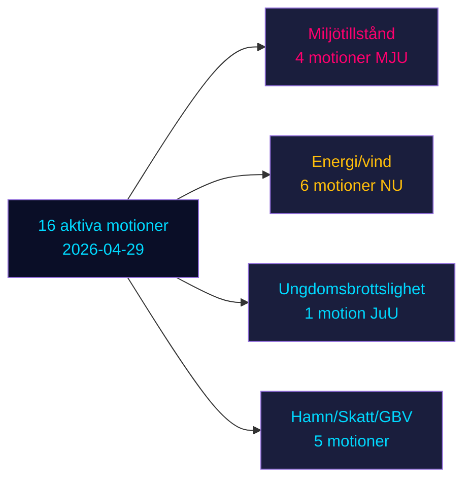

# Oppositionsmotioner utmanar sex regeringspropositioner i Sveriges förval

**Författare**: James Pether Sörling | **Datum**: 2026-05-04 | **Klassificering**: OFFENTLIG | **Konfidensgrad**: HÖG [B2]

## BLUF

Sexton aktiva oppositionsmotioner inlämnade 2026-04-29 utmanar sex regeringspropositioner inom energi, miljö, kriminaljustis, transport och skattepolitik. Socialdemokraterna (S) leder med nio motioner, flankerade av Miljöpartiet (MP), Vänsterpartiet (V) och Centerpartiet (C). Med Sveriges riksdagsval 132 dagar bort (14 september 2026) utgör dessa motioner både sakpolitisk opposition och tydlig förvalpositionering. De viktigaste striderna: (1) förslaget om ny tillståndsmyndighet för miljö (prop. 238) som S, MP, V och C motsätter sig av olika skäl; (2) sänkning av straffmyndighetsåldern till 13 år (prop. 246) där S accepterar 14 men avvisar 13; och (3) reform av kommunalt vindkraftsveto (prop. 239) där oppositionen brett kräver snabbare åtgärder.

## Beslut som detta underlag stöder

1. **Redaktionsteam**: Led med brottslighet mot unga/kriminalålder och miljötillstånd som de två mest impactfulla konflikterna
2. **Policyanalytiker**: Kartlägg oppositionskrav som förvalspolitiska åtaganden med valansvarsmässiga implikationer
3. **Riskmonitorer**: Bedöm sannolikheten för regeringsnederlag i utskott/plenum på omtvistade ändringsförslag
4. **Utländska analytiker**: Bedöm Sveriges trovärdighet inom energiomställningsförvaltning inför viktiga investeringsbeslut

## 60-sekundersläsning

- **17 motioner** (16 aktiva, 1 återdragen): inlämnade 2026-04-29 i riksmöte 2025/26
- **Valnärhetsmultiplikator**: DIW-poäng ×1,5 (val ≤132 dagar borta) — oppositionsmotioner är politiska åtaganden, inte procedurell brus
- **Ungdomsbrottslighet**: S accepterar sänkning av straffmyndighetsåldern till 14 (inte 13), och motsätter sig prop. 246:s kärnbestämmelse; tvärblockmajoritet mot 13-årsgränsen osannolik utan SD-avfall
- **Miljötillstånd**: S kräver materiella reformer parallellt med den nya myndigheten; V kräver avslag; MP och C söker modifieringar — regeringen möter en fragmenterad opposition utan enat block
- **Energi/vind**: S, MP, C kräver alla modigare vindkraftspolitik inklusive tidigare kommunalt vetoreform; detta stämmer med tidigare S-ledda motionsnederlag 2021-22
- **Återdragande av HD024127**: oförklarat — signal om strategisk ompositionering
- **IMF-data otillgänglig** (nätverksegress blockerad); ekonomisk kontext uppskattad från tidigare cachade data

## Viktigaste framtidssignal

Om Justitieutskottet (JuU) misslyckas med att producera en majoritet för att sänka åldern till 13, kommer regeringen att möta sitt mest signifikanta lagstiftningsnederlag under mandatperioden i det sista skörden inför valet.

<!-- source-sha: 857e6ce8cee827920506c3007d3eb16dde3ed1ec -->
