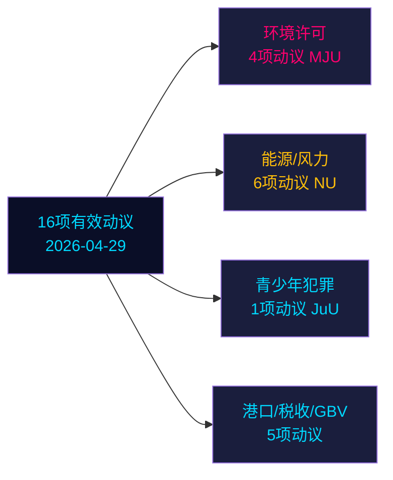

# 反对党动议在瑞典选前冲刺阶段挑战六项政府提案

**作者**: 詹姆斯·佩瑟·索林 | **日期**: 2026-05-04 | **分类**: 公开 | **可信度**: 高 [B2]

## BLUF

2026年4月29日提交的16项有效反对党动议在能源、环境、刑事司法、交通和税收政策领域挑战6项政府提案。Socialdemokraterna（S）以9项动议领先，Miljöpartiet（MP）、Vänsterpartiet（V）和Centerpartiet（C）紧随其后。距离瑞典大选132天（2026年9月14日），这些动议既是实质性政治反对，也是明确的选前定位。最重要的争论焦点：（1）提案238的环境许可当局（S、MP、V、C出于不同原因反对）；（2）将刑事责任年龄降至13岁（提案246，S接受14岁但拒绝13岁）；（3）风能市政否决权改革（提案239，反对党普遍要求采取更迅速的行动）。

## 本简报支持的决策

1. **编辑团队**: 将刑事年龄/青少年犯罪与环境许可作为影响最高的两大冲突置于报道前沿
2. **政策分析师**: 将反对党诉求映射为具有选举问责意义的选前政策承诺
3. **风险监测**: 评估委员会/全体会议在争议修正点上政府失败的可能性
4. **海外分析师**: 在重大投资决策前评估瑞典能源转型治理可信度

## 60秒摘要

- **17项动议**（16项有效，1项撤回）：于2025/26议会届期的2026年4月29日提交
- **选举临近乘数**: DIW得分×1.5（距选举≤132天）—反对党动议是政策承诺，而非程序性噪音
- **青少年犯罪**: S接受将刑事年龄降至14岁（非13岁），反对提案246的核心命令；没有SD分裂，反对13岁门槛的多党多数难以形成
- **环境许可**: S要求新当局之外的实质性改革；V要求否决；MP和C寻求修改——政府面临无统一阵营的分散反对
- **能源/风力**: S、MP、C均要求更大胆的风能政策，包括更早进行市政否决权改革；这与2021-22年S主导的早期动议失败一致
- **HD024127撤回**: 无说明——战略重新定位信号
- **IMF数据不可用**（网络出口受阻）；经济背景从此前缓存数据估算

## 主要前瞻触发因素

若司法委员会（JuU）未能就降至13岁形成多数，政府将在选举最后冲刺阶段面临任期内最重大的立法失败。

<!-- source-sha: 857e6ce8cee827920506c3007d3eb16dde3ed1ec -->
