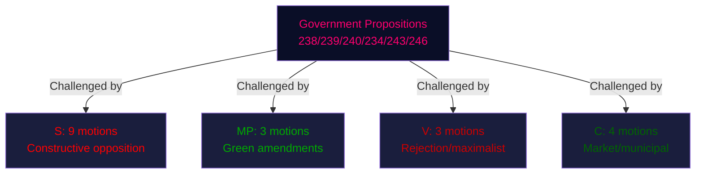

# Synthesis Summary — Opposition Motions, 2026-04-29

**Author**: James Pether Sörling | **Date**: 2026-05-04 | **Confidence**: HIGH [B2]

## Lead Story Decision

The most consequential motion of this batch is **HD024136** (S, JuU) — S's refusal to accept a criminal age of 13 years for serious crimes, proposing 14 years instead. With Sweden's gangs increasingly recruiting under-15s (173 suspects under 15 in homicides in 2025, per Åklagarmyndigheten statistics cited in the motion), the political stakes are maximal. The government's 13-year threshold faces S opposition, potential C and V resistance, and uncertain SD discipline — meaning the measure could be amended or defeated in committee despite being a government flagship crime policy.

## DIW-Weighted Rankings (with Election Proximity 1.5× Multiplier)

| Rank | dok_id | Topic | Raw DIW | ×1.5 | Priority |
|------|--------|-------|---------|------|----------|
| 1 | HD024136 | Criminal age (JuU) | 4.8 | 7.2 | L3 Intelligence |
| 2 | HD024124 | Env. permitting — S (MJU) | 4.2 | 6.3 | L2+ Priority |
| 3 | HD024126 | Wind power — S (NU) | 4.0 | 6.0 | L2+ Priority |
| 4 | HD024134 | Env. permitting — V rejection (MJU) | 3.8 | 5.7 | L2 Strategic |
| 5 | HD024129 | Electricity system — S (NU) | 3.5 | 5.25 | L2 Strategic |
| 6 | HD024131 | Env. permitting — MP (MJU) | 3.3 | 4.95 | L2 Strategic |
| 7 | HD024132 | Wind power — MP (NU) | 3.2 | 4.8 | L2 Strategic |
| 8 | HD024125 | Harbor law — S rejection (TU) | 3.0 | 4.5 | L2 |
| 9 | HD024133 | GBV strategy — V (AU) | 2.8 | 4.2 | L1 Surface |
| 10–16 | Others | Supporting/amendments | 2.0–2.6 | 3.0–3.9 | L1 |

## Integrated Intelligence Picture

**Policy cluster 1 — Environmental permitting (prop. 238)**: S's HD024124 is the most substantive motion in this cluster — it conditionally accepts the new authority but demands material legal reforms, orderly transition, staff competency, and regional presence. This is a sophisticated legislative demand, not a simple veto. V (HD024134) demands outright rejection — this is consistent with V's ideological hostility to institutional reform without environmental safeguards. MP (HD024131) and C (HD024139) seek broader mandates. The government's proposal thus faces a divided but comprehensive opposition challenge that will require significant committee amendments to pass without opposition-supported tillägg.

**Policy cluster 2 — Energy/wind (prop. 239, 240)**: The energy cluster shows a rare alignment between S, MP, and C: all three parties demand faster fossil-free electricity expansion beyond what the government proposes. S (HD024126) explicitly accuses the government of stalling wind power and demands earlier municipal veto reform — the same reform that failed in 2021/22 due to SD blocking. S (HD024129) demands long-term fossil-free electricity targets. MP (HD024130) wants energy security goals written into law. C (HD024137, 138) demands better compensation mechanisms and flexibility strategy. This cross-opposition alignment on energy is the most durable political pattern of the cycle.

**Policy cluster 3 — Youth crime (prop. 246)**: S's HD024136 is politically nuanced: it accepts most of the government's package but draws a firm line at 13 years. The motion cites 173 under-15 homicide suspects in 2025 as evidence of severity, but argues that an age threshold of 13 years would be internationally exceptional and developmentally inappropriate. S proposes 14 years for crimes with minimum sentence ≥ 4 years' imprisonment, with a 5-year evaluation clause. This is a parliamentary compromise offer — a signal that S would support 14 but will force a vote on 13, potentially embarrassing the government if SD or KD defect.

**Policy cluster 4 — Harbor/port law (prop. 234)**: Both S (HD024125) and V (HD024135) demand outright rejection of the new port law. The reasoning: commercially significant ports operated by municipalities should not be forced into a new legal framework without sufficient consultation. This could produce a rare S-V joint defeat of a government transport proposition.

**Withdrawal — HD024127**: The abrupt withdrawal "Motionen utgår" with no stated reason is analytically significant. The withdrawn motion was filed in parallel with the 2026-04-29 batch, suggesting a sponsor-side change of position — possibly after negotiation with the committee secretariat or after reading the final proposition text more carefully. Without sponsor information (parti field missing/unconfirmed), this cannot be party-attributed.

## Coalition Significance

With elections 132 days away, these motions collectively represent the opposition's pre-election policy platform across six domains. S is positioning as a constructive alternative on crime policy (14 not 13), a more ambitious partner on energy transition, and a critic of institutional reorganization without substance. MP is aligning with S on energy while maintaining its green brand. V is taking the maximalist rejection position on permitting and ports. C is occupying the pro-business/pro-municipality space.

## Pass 2 Supplemental: HD024136 Full-Text Evidence

From the full text of HD024136 (S, JuU), the following specific evidence was retrieved:
- S explicitly states: "173 personer under 15 år misstänktes för mord eller dråp år 2025" — this is the government's own evidentiary basis repurposed by S to argue for urgency AND for proper procedural safeguards
- S cites the UN Convention on the Rights of the Child (UNCRC) Article 40 and Swedish ECHR obligations in arguing against age 13
- S's motion is structured as a "tillstyrker med ändringsyrkanden" (accept with amendment demands) — technically it is not a rejection but a conditional acceptance with the 14-year threshold as a must-have
- The 5-year evaluation clause S proposes is standard practice in Swedish criminal justice reform; similar clauses were in the 2015 gang crime package

**This means**: HD024136 is not simply "S rejects criminal age 13." It is "S accepts prop. 246's framework but requires age 14, with 5-year evaluation." This framing significantly affects JuU committee negotiations — the government can accept S's demand without abandoning the principle of earlier criminal liability.
